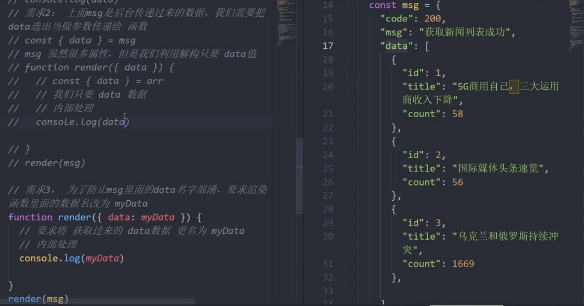

title: ES6入门基础
author: PanXiaoKang
cover: https://www.devpoint.cn/data/upload/site_15/article/2021/02/11/6025410238204.jpg
tags:

  - ES6
  - 入门基础
categories:
  - 前端技术
date: 2021-03-04 21:46:00

---

## ECMAScript 6 简介

ECMAScript 6.0（简称 ES6）是 JavaScript 语言的下一代标准，已经在 2015 年 6 月正式发布了。它的目标，是使得 JavaScript 语言可以用来编写复杂的大型应用程序，成为企业级开发语言。

### Babel 转码器

[Babel](https://babeljs.io/) 是一个广泛使用的 ES6 转码器，可以将 ES6 代码转为 ES5 代码，从而在老版本的浏览器执行。这意味着，你可以用 ES6 的方式编写程序，又不用担心现有环境是否支持。下面是一个例子。

```javascript
// 转码前
input.map(item => item + 1);

// 转码后
input.map(function (item) {
  return item + 1;
});
```

上面的原始代码用了箭头函数，Babel 将其转为普通函数，就能在不支持箭头函数的 JavaScript 环境执行了。

### 浏览器环境

Babel 也可以用于浏览器环境，使用[@babel/standalone](https://babeljs.io/docs/en/next/babel-standalone.html)模块提供的浏览器版本，将其插入网页。

```html
<script src="https://unpkg.com/@babel/standalone/babel.min.js"></script>
<script type="text/babel">
// Your ES6 code
</script>
```

注意，网页实时将 ES6 代码转为 ES5，对性能会有影响。生产环境需要加载已经转码完成的脚本。

Babel 提供一个[REPL 在线编译器](https://babeljs.io/repl/)，可以在线将 ES6 代码转为 ES5 代码。转换后的代码，可以直接作为 ES5 代码插入网页运行。

## 作用域和作用域链

### 作用域

目标：了解作用域对程序执行的影响及作用域链的查找机制，使用闭包函数创建隔离作用域避免全局变量污染。

* 作用域（scope)规定了变量能够被访问的“范围”，离开了这个“范围”，变量便不能被访问。
* 作用域分为：局部作用域和全局作用域。

#### 局部作用域

局部作用域分为函数作用域和块作用域。

函数作用域：在函数内部声明的变量只能在函数内部被访问，外部无法直接访问。

#### 块作用域

在JavaScript中使用{}包裹的代码称为代码块，代码块内部声明的变量外部将[有可能]无法被访问。

* let声明的变量会产生块作用域，var不会产生块作用域
* const声明的常量也会产生块作用域
* 不同代码块之间的变量无法互相访问
* 推荐使用let或const

#### 全局作用域

`< script>标签和.js文件的[最外层]就是所谓的全局作用域，在此声明的变量在函数内部也可以被访问。`

全局作用域中声明的变量，任何其它作用域都可以被访问。

### 作用域链

作用域链的本质上是底层的变量查找机制。

* 在函数被执行时，会优先查找当前函数作用域中查找变量
* 查找不到则会依次逐级查找父级作用域直到全局作用域。

#### 总结

* 嵌套关系的作用域串联起来形成了作用域链
* 相同作用域链中按着从小到大的规则查找变量
* 子作用域能够访问父作用域，父级作用域无法访问子级作用域

## JS闭包

## let和const命令

### let 命令

#### 基本用法

ES6 新增了 `let`命令，用来声明变量。它的用法类似于 `var`，但是所声明的变量，只在 `let`命令所在的代码块内有效。

**let 取代 var，以及他们使用场景的区分，最主要的是实质区分。** ES6新增加了两个新的变量声明关键字 **let 和 **const，而其中的 let完全可以取代 var，两者语义相同且 **let 更适合****作为块级作用域关键字。**

### const 命令

#### 基本用法

`const`声明一个只读的常量。一旦声明，常量的值就不能改变。

全局常量。在定义全局常量时，应优先使用 const关键字，而不是在模块的最顶部采用let或var 声明变量充做全局常量。尤其是在全局环境中，只应设置常量，而不应声明变量以充常量。

```
// const 优于 let、var有以下几个原因：
// 一、const可以提醒代码阅读者，该参数是一个常量，不能随意修改，修改该参数存在一定的风险；
// 二、const比较符合函数式编程思想，运算不改变值，只是新建值，而且有利于将来的分布式运算；
// 三、JS编译器会对 const进行优化，有利于提高代码的执行效率，所以可以多用 const。而且 let和 const的本质区别就是编译器内部的处理不同。
    const a = 1, b = 2, c = 3,d = 4;

// 所有的函数都应该设置为常量
const TempFunc = function () {
    console.log('所有的函数都应该设置为常量!');
};


```

### ES6 声明变量的六种方法

ES5 只有两种声明变量的方法：`var`命令和 `function`命令。ES6 除了添加 `let`和 `const`命令，后面章节还会提到，另外两种声明变量的方法：`import`命令和 `class`命令。所以，ES6 一共有 6 种声明变量的方法。

## 解构赋值

### 数组解构

作用：是将数组的单元值快速批量赋值给一系列变量的简洁语法。

JS中必须要加分号的情况：

* 立即执行函数
* 数组解构

示例代码：

```javascript
const arr =[100,60,80]
//数组解构赋值
const [max,min,avg]=arr
console.log(max) //100

//交换两个变量
let a=1
let b=2; //这里分号必须加上
[b,a]=[a,b]
console.log(a,b) //2 1

```

### 对象解构

作用：对象解构是将对象属性和方法快速批量赋值给一系列变量的简洁语法。

注意：对象解构时要求变量名和属性名保持一致才可以。

对象解构的变量名 可以重新改名 旧变量名：新变量名

示例代码：

```Javascript
const obj={
	uname:'pink老师',
	age:19
}
//obj.uname
//obj.age

const uname ='red老师'
//解构的语法
const {uname,age}={uname:'pink老师',age:19}
//等价于const uname =obj.uname
//解构时一般要求变量名和属性名必须一致才可以
console.log(uname)
//1.对象解构的变量名 可以通过重新改名，避免已经有了相同命名情况
const {uname:username,age}={uname:'pink老师',age:19}
console.log(username)

//2.解构数组对象
const pig=[
	{
	  uname:'佩奇',
	  age:18
	}
]
const [{uname,age}]=pig
console.log(uname,age)

```

示例代码：

```
//多级对象解构
const pig={
	name:'佩奇',
	family:{
		mother:'猪妈妈',
		father:'猪爸爸',
		sister:'乔治'
	},
	age:6
}
const {name,family:{mother,father,sister},age}=pig
console.log(name,mother,father,sister)
```

示例图片：



## forEach遍历数组

forEach:加强版的for循环 适合于遍历数组对象。map可以return返回对象，而forEach没有返回。

语法：

> 被遍历的数组.forEach(function(当前数组元素，当前元素索引号)){//函数体}

### 筛选数组filter方法

* filter()方法创建一个新的数组，新数组中的元素是通过检查指定数组中符合条件的所有元素。
* 主要使用场景：筛选数组符合条件的元素，并返回筛选之后元素的新数组。

示例代码：

```
//简单的数组可用可不用，但若是数组对象使用forEach则体现出来它的方便
const arr =['red','blue','green']
arr.forEach(function(item,index){
console.log(`当前数组元素是：${item}`) //依次打印数组每一个元素
console.log(`当前数组元素的索引是：${index}`) //依次打印数组每一个元素索引
})
```

## ES6模块化

ES6 的模块化分为导出（export） @与导入（import）两个模块。

### as 的用法

export 命令导出的接口名称，须和模块内部的变量有一一对应关系。

导入的变量名，须和导出的接口名称相同，即顺序可以不一致。

不同模块导出接口名称命名重复， 使用 as 重新定义变量名。

### import 命令的特点

 **只读属性** ：不允许在加载模块的脚本里面，改写接口的引用指向，即可以改写 import 变量类型为对象的属性值，不能改写 import 变量类型为基本类型的值。

**单例模式** ：多次重复执行同一句 import 语句，那么只会执行一次，而不会执行多次。import 同一模块，声明不同接口引用，会声明对应变量，但只执行一次 import 。

静态执行特性：import 是静态执行，所以不能使用表达式和变量。

### export default 命令

* 在一个文件或模块中，export、import 可以有多个，export default 仅有一个。
* export default 中的 default 是对应的导出接口变量。
* 通过 export 方式导出，在导入时要加{ }，export default 则不需要。
* export default 向外暴露的成员，可以使用任意变量来接收。

## 模板字符串

ES6引入新的声明字符串的方式：`` '' ""

1.声明

let str =\`我也是一个字符串！`;

2.内容中可以直接出现换行符

3.变量拼接

let lovest ='小宝';

let out =\`${lovest}是我心目中最好笑的演员！！`;

## 箭头函数

ES6允许使用箭头=>定义函数。

1.this是静态的，this始终指向函数声明时所在作用域下的this的值。使用call方法调用时，普通函数会改变，而箭头函数始终是指向window下的this值。

2.不能作为构造函数去实例化对象

3.不能使用arguments变量

4.箭头函数的简写

* 省略小括号，当形参有且只有一个的时候
* 省略花括号，当代码体只有一条语句的时候，此时return必须省略，而且语句的执行结果就是函数的返回值。let pow = n => n*n;

小结：

* 箭头函数适合与this无关的回调，如定时器、数组的方法回调
* 箭头函数不适合与this有关的回调，如事件回调，对象的方法

## 改变this指向

JavaScript中还允许指定函数中this的指向，有3个方法可以动态指定普通函数中this的指向

* call()
* apply()
* bind()

### call()-了解

使用call方法调用函数，同时指定被调用函数中this的值

**语法：**

> fun.call(thisArg,arg1,arg2,...)

* thisArg:在fun函数运行时指定的this值
* arg1,arg2:传递的其他参数
* 返回值就是函数的返回值，因为它就是调用函数

### apply()-理解

使用apply方法调用函数，同时指定被调用函数中this的值

**语法：**

> fun.apply(thisArg,[argsArray])

* thisArg:在fun函数运行时指定的this值
* argsArray:传递的值，必须包含在数组里面
* 返回值就是函数的返回值，因为它就是调用函数
* 因此apply主要跟数组有关系，比如使用Math.max()求数组的最大值

**使用场景：**

```
//求参数中的最大值
//const max = Math.max(1,2,3)
//console.log(max)

//通过apply求数组中最大值/最小值
const arr =[100,33,55]
const max =Math.max.apply(Math,arr)
const min =Math.min.apply(null,arr)
console.log(max,min)

//通过扩展运算符求最大值
const max = Math.max(...arr)
```

### bind()-重点

bind()方法不会调用函数。但是能改变函数内部this指向

**语法：**

> fun.bind(thisArg,arg1,arg2,...)

* thisArg:在fun函数运行时指定的this值
* arg1，arg2:传递的其他参数
* 返回由指定的this值和初始化参数改造的原函数拷贝（新函数）
* 因此当我们只是想改变this指向，并且不想调用这个函数的时候，可以使用bind，比如改变定时器内部的this指向

代码示例：

```html
<button>发送短信</buttion>
```

```javascript
const obj={
	age:18
}
function fn(){
	console.log(this)
}

//1.bind 不会调用函数
//2.能改变this指向
//3.返回值是个函数，但是这个函数里面的this是更改过的obj
const fun = fn.bind(obj)
//console.log(fun)
fun()

//需求：有个发送短信按钮，点击里面就禁用，2秒后开启
const btn =document.querySelector('button')
btn.addEventListener('click',function(){
	//禁用按钮
	this.disabled =true
	window.setTimeout(function(){
	//在这个普通函数里面，我们要this由原来的window改为btn
	this.disabled=false
	}.bind(this),2000)
})
```

### 总结

#### 相同点

* 都可以改变函数内部的this指向

#### 区别点

* call和apply会调用函数，并且改变函数内部this指向
* call和apply传递的处所不一样，call传递参数arg1,arg2,...形式，apply必须数组形式[arg]
* bind不会调用函数，可以改变函数内部this指向

#### 主要应用场景

* call调用函数并且可以传递参数
* apply经常跟数组有关系，比如借助于数学对象实现数组最大值，最小值
* bind不调用函数，但是还想改变this指向，比如改变定时器内部的this指向

## 数参数默认值

1.形参初始值 具有默认值的参数，一般位置要靠后（潜规则）

> function add(a,b,c=10){
>
> return a+b+c;
>
> }
>
> let result =add(1,2);
>
> console.log(result);//13

2.与解构赋值结合

## rset参数

ES6引入rest参数，用于获取函数的实参，用来代替arguments

//ES5获取实参的方式：

> function date(){
>
> console.log(arguments);//输出是对象
>
> }
>
> date('白芷','阿娇','思思');

//rest参数

> function date(...args){
>
> console.log(args);//输出是数组，可以用数组中的方法：filter some every map
>
> }
>
> date('白芷','阿娇','思思');

//rest参数必须放到参数最后

> functions fn(a,b,...args){
>
> console.log(a);
>
> console.log(b);
>
> console.log(args);
>
> }
>
> fn(1,2,3,4,5,6);

## 扩展运算符

... 扩展运算符能将数组转换为逗号分隔的参数序列。

应用：

* 数组的合并
* 数组的克隆
* 将伪数组转为真正的的数组

## Symbol类型

### Symbol的基本使用

> //原始数据类型Symbol，它表示是独一无二的值
>
> //最大的用途：用来定义对象的私有变量
>
> const name =Symbol('name');
>
> const name2 =Symbol('name');
>
> console.log(name === name2);//false
>
> let s1 = Symbol('s1');
>
> console.log(s1);
>
> let obj ={
>
> };
>
> //obj[s1][s1]='小马哥';
>
> //如果用Symbol定义的对象中的变量，取值时一定要用[变量名]
>
> console.log(obj[s1][s1]);
>
> //Symbol.for 创建
>
> let s4 = Symbol.for('尚硅谷');
>
> let s5 = Symbol.for('尚硅谷');
>
> //不能与其他数据进行运算
>
> let result =s+100;//报错
>
> let result =s>100;//报错
>
> let result =s+s;//报错
>
> //USONB you are so niubility
>
> u undefined
>
> s string symbol
>
> o object
>
> n null number
>
> b boolean

### Symbol内置值

除了定义自己使用的Symbol值以外，还提供了11个内置的Symbol值，指向语言内部使用的方法。

| 方法                      | 描述                                                                                                             |
| ------------------------- | ---------------------------------------------------------------------------------------------------------------- |
| Symbol.hasInstance        | 当其他对象使用Instanceof运算符，判断是否为该对象的实例时，会调用这个方法。                                       |
| Symbol.isConcatSpreadable | 对象的Symbol.isConcatSpreadable属性等于的是一个布尔值，表示该对象用于Array.prototype.concat()时，是否可以展开。) |
| Symbol.unscopables        | 该对象指定了使用with关键字时，哪些属性会被with环境排除                                                           |
| Symbol.match              | 当执行str.match(Object)时，如果该属性存在，会调用它，返回该方法的返回值。                                        |
| Symbol.replace            | 当对象被str.replace(myObject)方法调用时，会返回该方法的返回值                                                    |
| Symbol.search             | 当该对象被str.search(myObject)方法调用时，会返回该方法的返回值                                                   |
| Symbol.split              | 当该对象被str.split(myObject)方法调用时，会返回该方法的返回值Symbol.split                                        |
| Symbol.iterator           | 对象进行for...of循环时，会调用Symbol.iterator方法，返回该对象默认遍历器                                          |
| Symbol.toPrimitive        | 该对象被转为原始类型的值时，会调用这个方法，返回该对象对应的原始类型值                                           |
| Symbol.toStringTag        | 在该对象上面调用toString方法时，返回该方法的返回值                                                               |
| Symbol.species            | 创建衍生对象时，会使用该属性                                                                                     |

## 迭代器

### 定义

在ES6中，迭代器（Iterator）是一种对象，它提供了一种访问集合中元素的方式。迭代器对象实现了一个 `next()`方法，该方法返回一个包含两个属性的对象：`value`和 `done`。

* `value`：表示当前迭代位置的值。
* `done`：表示迭代是否已经结束，如果迭代结束则为 `true`，否则为 `false`。

### 作用

是提供一种统一的遍历集合的方式，无论集合的内部结构是什么样的，都可以通过迭代器来访问其中的元素。迭代器可以用于遍历数组、字符串、Set、Map等可迭代对象。

### 使用场景

1. 遍历集合：通过使用 `for...of`循环或者手动调用迭代器的 `next()`方法，可以逐个访问集合中的元素。
2. 自定义迭代逻辑：通过实现自定义的迭代器对象，可以定义自己的迭代逻辑，例如按照特定顺序遍历集合或者过滤集合中的元素。
3. 惰性计算：迭代器可以实现惰性计算，只在需要时才计算下一个元素，可以节省内存和计算资源。

### 示例代码

> //Iterator
>
> //是一种新的遍历机制，两个核心
>
> //1.迭代器是一个接口，能快捷的访问数据，通过Symbol.iterator来创建迭代器，通过迭代器的next()获取迭代之后的结果
>
> //2.迭代器是用于遍历数据结构的指针（数据库的游标）
>
> //使用迭代
>
> const items =['one','two','three'];
>
> //1.创建新的迭代器
>
> const ite = items\[Symbol.iterator\]();
>
> console.log(ite.next());//{value:"one",done:false} done如果为false，表示遍历继续，如果为true，表示遍历完成。
>
> console.log(ite.next());
>
> console.log(ite.next());
>
> console.log(ite.next());

## 生成器

### 定义

在ES6中，生成器（Generator）是一种特殊的函数，它可以通过 `function*`关键字定义。生成器函数可以暂停执行，并且可以在每次暂停时通过 `yield`关键字产生一个值。生成器函数返回一个迭代器对象，可以通过调用其 `next()`方法来逐步执行生成器函数的代码。

### 作用

简化异步编程和迭代器的使用。它可以让我们以一种更直观、更易读的方式编写异步代码，避免了回调地狱和使用Promise的复杂性。生成器函数可以在需要等待异步操作完成时暂停执行，并在异步操作完成后继续执行，从而实现了同步的写法。

### 使用场景

1. 异步编程：生成器函数可以与 `yield`关键字结合使用，实现异步操作的顺序执行。通过使用生成器函数，可以以同步的方式编写异步代码，提高代码的可读性和可维护性。
2. 迭代器：生成器函数返回的迭代器对象可以用于遍历集合。通过在生成器函数中使用 `yield`关键字，可以逐步产生集合中的元素，从而实现了一种简洁、可控的遍历方式。
3. 无限序列：生成器函数可以用于生成无限序列，例如斐波那契数列、无限自然数序列等。由于生成器函数的惰性求值特性，可以在需要时逐步生成序列的元素，而不需要一次性生成全部元素。
4. 部署Ajax操作，让异步代码同步化，解决回调地狱问题。

### 实例代码

> //generator函数 可以通过yield关键字，将函数挂起，为了改变执行流提供了可能，同时为了做异步编程提供了方案。
>
> //它和普通函数的区别
>
> //1.function后面 函数名之前有个*
>
> //2.只能在函数内部使用yield表达式，让函数挂起
>
> function* func(){
>
> yield 2;
>
> yield 3;
>
> }
>
> //返回一个遍历器对象，可以调用next()
>
> let fn=func();
>
> console.log(fn.next());
>
> console.log(fn.next());
>
> console.log(fn.next());
>
> //总结：generator函数式分段执行的，yield语句是暂停执行 而next()方法时恢复执行
>
> function* add(){
>
> console.log('start');
>
> //x 可真的不是yield '2'的返回值，它是next()调用 恢复当前yield()执行传入的实参
>
> let x=yield '2';
>
> console.log('one:'+x);
>
> let y=yield '3';
>
> console.log('two:',+y);
>
> return x+y;
>
> }
>
> const fn=add();
>
> console.log(fn.next());//{value:'2',done:false}
>
> console.log(fn.next(20));//{value:'3',done:false} 注意：传入20实际是给x进行赋值
>
> console.log(fn.next(30));//{value:'50',done:true}
>
> //使用场景：为不具备Interator接口的对象提供了遍历操作
>
> function* objectEntries(obj){
>
> //获取对象的所有key保存到数组[name,age]
>
> const propKeys =Object.keys(obj);
>
> for(const propkeys of propKeys){
>
> yield[propkey,obj[propkey]]
>
> }
>
> }
>
> const obj={
>
> name:'小马哥',
>
> age:20
>
> }
>
> obj[Symbol.iterator]=objectEntries;
>
> console.log(obj);
>
> for(let [key,value] of objectEntries(obj)){
>
> console.log(\`${key}:${value}\`);
>
> }

## 构造函数

作用：构造函数是来快速创建多个类似的对象。

写法：大写字母开头的函数，通过new关键字调用，这个行为被称为实例化。

实例化执行过程：

* 创建新空对象
* 构造函数this指向新对象
* 执行构造函数代码，修改this,添加新的属性
* 返回新对象

## 原型对象prototype

* 公共的属性写到构造函数里面
* 公共的方法写到原型对象身上

### 总结

1.原型是什么？

一个对象，我们也称为prototype为原型对象。

2.原型的作用是什么？

* 共享方法
* 可以把那些不变的方法，直接定义在prototype对象上

3.构造函数和原型里面的this指向谁？

实例化的对象

## constructor属性

每个原型对象里面都有个constructor属性（constructor 构造函数）

作用：指向该原型对象的构造函数；简单理解，就是指向我的爸爸，我是有爸爸的孩子。

使用场景：如果有多个对象的方法，我们可以给原型对象采取对象形式赋值。但这样就会覆盖构造函数原型对象原来的内容，这样修改后的原型对象constructor就不再指向当前构造函数了，此时，我们可以在修改后的原型对象中，添加一个constructor指向原来的构造函数。

```javascript
function Star(name){
	this.name = name
}
Star.prototype={
	//收到利用constructor 指向 Star构造函数
	sing:function(){console.log('唱歌')},
	dance:function(){console.log('跳舞')}
}
console.log(Star.prototype.constructor) //指向Star
```

### 总结

1.prototype是什么？哪里来的？

* 原型（原型对象）
* 构造函数都自动有原型

2.constructor属性在哪？作用是啥？

* prototype原型和对象原型__proto__里面都有
* 都指向创建实例对象/原型的构造函数

3.__proto\_属性在哪里？指向谁？_

* 在实例对象里
* 指向原型prototype

## 原型继承

继承是面向对象编程的另一个特征，通过继承进一步提升代码封装的程度，JavaScript中大多数是借助原型对象实现继承的特征。

## 原型链

原型链是指从一个对象到其原型对象的链。当我们访问一个对象的属性或方法时，JavaScript 会首先在该对象中查找属性或方法。如果找不到，它将会在该对象的原型对象中查找，依此类推。

基于原型对象的继承使得不同构造函数的原型对象关联在一起，并且这种关系是一种链状的结构，我们将原型对象的链状结构关系称为原型链。

## 实例成员和静态成员

### 实例成员

* 实例对象的属性和方法即为实例成员
* 实例对象相互独立，实例成员仅当前实例对象使用

### 静态成员

* 构造函数的属性和方法被称为静态成员
* 静态成员只能构造函数访问

## 内置构造函数

在JS中最主要的数据类型有6种：

基本数据类型：字符串、数值、布尔、null、undefined

引用数据类型：对象

其实字符串、数值、布尔等基本数据类型也都有专门的构造函数，这些我们称为包装类型。

JS中几乎所有的数据都可以基于构造函数创建。

### 引用类型

Object、Array、RegExp、Date等

#### Object

* Object.keys(o):获取对象o的所有属性名
* Object.values(o):获取对象o的所有属性值
* Object.assign(oo,o):将对象o拷贝给对象oo

#### Array

| 方法    | 作用     | 说明                                                         |
| ------- | -------- | ------------------------------------------------------------ |
| forEach | 遍历数组 | 不返回数组，经常用于查找遍历数组元素                         |
| filter  | 过滤数组 | 返回新数组，返回的是筛选满足条件的数组元素                   |
| map     | 迭代数组 | 返回新数组，返回的是处理之后的数组元素，想要使用返回的新数组 |
| reduce  | 累计器   | 返回累计处理的结果，经常用于求和等                           |

### 数组常见的方法

* join：数组元素拼接为字符串，返回字符串
* find:查找元素，返回符合测试条件的第一个数组元素值，如果没有符合条件的则返回undefined
* every:检测数组所有元素是否都符合指定条件，如果是则返回true,否则返回false
* some:检测数组中的元素是否满足指定条件，如果有满足条件则返回true，否则返回false

Array.from():将伪数组转为数组

### 包装类型

String、Number、Boolean等

### 字符串常见方法

* split：把字符串转为数组，和join()相反
* substring:字符串截取
* startsWith:检测字符串是否以某字符开头,返回布尔值
* endsWith:检测是否以某字符结尾,返回布尔值
* includes:判断某个字符是否包含在一个字符串里面,返回布尔值
* replace：用于替换字符串，支持正则表达式匹配
* repeat：返回一个新字符串，表示将原字符串重复 n次
* 

#### Number常用方法

* `toString()`：将数字转换为字符串类型。
* `toFixed(n)`：将数字保留 n 位小数，并返回字符串类型。如果小数位数不足 n 位，则用 0 补齐。

## Promise对象

Promise 是异步编程的一种解决方案，其实是一个构造函数，自己身上有all、reject、resolve这几个方法，原型上有then、catch等方法。用来封装异步操作并可以获取其成功或失败的结果。

Promise对象有三种状态，他们分别是：

1.pending: 等待中，或者进行中，表示还没有得到结果
2.resolved(Fulfilled): 已经完成，表示得到了我们想要的结果，可以继续往下执行
3.rejected: 也表示得到结果，但是由于结果并非我们所愿，因此拒绝执行
这三种状态不受外界影响，而且状态只能从pending改变为resolved或者rejected，并且不可逆

### 示例代码

> //Promise 承诺
>
> //相当于一个容器，保存着未来才会结束的事件（异步操作）的一个结果
>
> //各种异步操作都可以用同样的方法进行处理 axios
>
> //特点：
>
> //1.对象的状态不受外界影响 处理异步操作 三个状态 Pending（进行） Resolved(成功) Rejected(失败)
>
> //2.一旦状态改变，就不会再变，任何时候都可以得到这个结果
>
> let pro = new Promise(function(resolved,rejected)){
>
> //执行异步操作
>
> let res ={
>
> code:200,
>
> data:{
>
> name:'小马哥'
>
> },
>
> error:'失败了'
>
> }
>
> setTimeout(()=>{
>
> if(res.code === 200){
>
> resolved(res.data);
>
> }else{
>
> rejected(res.error);
>
> }
>
> },1000);
>
> })
>
> cosole.log(pro);
>
> pro.then((val)=>{
>
> console.log(val);
>
> },(err)=>{
>
> console.log(err);
>
> });
>
> //重新封装一下,动态传参设置ms
>
> function timeOut（ms){
>
> return new Promose((resolved,rejected)=>{
>
> setTimeout(()=>{
>
> resolved('hello promise success!!')
>
> },ms)
>
> })
>
> }
>
> timeOut(2000).then((val)=>{
>
> console.log(val);
>
> })
>
> //then()方法
>
> //then() 第一个参数是relove回调函数，第二个参数是可选的 是reject状态的回调函数
>
> //then()返回一个新的promise实例，可以采用链式编程
>
> //resolve()、reject() 能将现有的任何对象转换成promise对象
>
> //let p =Promise.resolve('foo');//等价于下一行代码
>
> let p =new Promise(resolve=>resolve('foo'));
>
> p.then((data)=>{
>
> console.log(data);//foo
>
> })
>
> //应用场景：一些游戏类的素材比较多，等待图片、flash、静态资源文件 都加载完成 才进行页面初始化
>
> let promise1=new Promise((resolve,reject)=>{});
>
> let promise2=new Promise((resolve,reject)=>{});
>
> let promise3=new Promise((resolve,reject)=>{});
>
> let p4 =Premise.all([promise1,promise2,promise3])
>
> p4.then(()=>{
>
> //三个都成功 才成功
>
> }).catch((err)=>{
>
> //如果有一个失败 则失败
>
> })
>
> //race() 某个异步请求设置超时时间，并且在超时后执行相应的操作
>
> //1 请求图片资源
>
> function requsetImg(imgSrc){
>
> return new Promise((resolve,reject)=>{
>
> const img =new Image();
>
> img.onload =function(){
>
> resolve(img);
>
> }
>
> img.src=imgSrc;
>
> });
>
> }
>
> function timeout(){
>
> return new Promise((resolve,reject)=>{
>
> setTimeout(()=>{
>
> reject(new Error('图片请求超时'));
>
> },3000)
>
> })
>
> }
>
> Promise.race([requestImg('https://www.xxxx.jpg'),timeout()]).then(data=>{
>
> console.log(data);
>
> document.body.appendChild(data);
>
> }).catch(err=>{
>
> console.log(err);
>
> })

## async的用法

```javascript
//Generator Promise async 1.解决回调地狱问题 2.使得异步操作显得更加方便
//作用：使得异步操作更加方便
//基本操作 async它会返回一个Promise对象 then catch
//async是Generator的一个语法糖
async function f(){
	//return await 'hello async';
	let s = await 'hello world';
	let data = await s.split('');
	return data;
}
//如果async函数中有多个await 那么then函数会等待所有的await指令运行完的结果才去执行
f().then(v=>{console.log(v)}).catch(e=>console.log(e));

async function f2(){
	//throw new Error('出错了');
	try{
		await Promise.reject('出错了');
	} catch (error){
	}
	return await Promise.resolve('hello');
}
f2().then(v=>console.log(v)).catch(e=>console.log(e));
```

## class类的用法

```javascript
//es5造类
function Person(name,age){
	this.name=name;
	this.age=age;
}
Person.prototype.sayName=function(){
	return this.name;
}
let p1 =new Person('小马哥',28);
console.log(p1);

//es6
class Person{
	//实例化的时候会立即被调用
	constructor(name,age){
		this.name=name;
		this.age=age;
	}

}
//通过Object.assign()方法一次性向类中添加多个方法
Object.assign(Person.prototype,{
	sayName(){
		return this.name
	},
	sayAge(){
		return this.age
	}
})

let p1 =new Person('小马哥',28);
console.log(p1);

```

## 类的继承

```javascript
//使用关键字 extends
class Animal{
	constructor(name,age){
		this.name=name;
		this.age=age;
	}
	sayName(){
		return this.name;
	}
	sayAge(){
		return this.age;
	}
}

class Dog extends Animal{
	constructor(name,age,color){
		super(name,age);//相当于call()方法的使用
		//Animal.call(this,name,age);
		this.color=color;
	}
	sayColor(){
		return `${this.name}是${this.age}岁了，它的颜色是${this.color}`
	}
	//重写父类的方法
	sayName(){
		return this.name+super.sayAge()+this.color;
	}
}
let d1=new Dog('小黄',28,'red');
console.log(d1.sayName());
console.log(d1.sayName());

//思考：如何让多个类 混入到一个类中？
```

## ES6的模块化实现

ES6模块功能主要有两个命令构成：export和import

export用于规定模块的对外接口 import用于输入其它模块提供的对外接口

一个模块就是独立的文件。

## Map和Set集合

> //set集合：表示无重复值的有序列表
>
> let set =new Set();
>
> console.log(set);
>
> //添加元素
>
> set.add(2);
>
> set.add('4');
>
> set.add('4');
>
> set.add(['hello','world',3]);
>
> //删除元素
>
> set.delete(2);
>
> //校验某个值是否在set中
>
> console.log(set.has('4'));
>
> console.log(set.size);
>
> set.forEach((val,key)=>{
>
> console.log(val);
>
> console.log(key);
>
> })
>
> //将set转换为数组
>
> let set2 = new Set([1,2,3,3,3,4]);
>
> //通过扩展运算符实现转换
>
> let arr = [...set2];
>
> console.log(arr);
>
> //1.set中对象的引用无法被释放
>
> let set3=new Set(),obj={};
>
> set3.add(obj);
>
> //释放当前资源
>
> obj=null;
>
> console.log(set3);
>
> let set4=new WeakSet(),obj={};
>
> set4.add(obj);
>
> //释放当前资源
>
> obj=null;
>
> console.log(set4);
>
> //WeakSet
>
> 1.不能传入非对象类型的参数
>
> 2.不可迭代
>
> 3.没有forEach()
>
> 4.没有size属性
>
> //Map类型是键值对的有序列表，键和值是任意类型
>
> let map =new Map();
>
> map.set('name','张三');
>
> map.set('age',20);
>
> console.log(map.get('name'));
>
> console.log(map);
>
> map.has('name');//true
>
> map.delete('name');
>
> map.clear();
>
> map.set(['a',[1,2,3]],'hello');
>
> console.log(map);
>
> let m=new Map([
>
> ['a',1],
>
> ['c',2]
>
> ])
>
> console.log(m);

## 数组的扩展

示例代码：

```
//数组的方法 from() of()

//1.from() 将伪数组转换成真正的数组

function add(){

console.log(arguments);

//ES5转换

let arr = [].slice.call(arguments);

//console.log(arr);

//ES6写法

let arr = Array.from(arguments);

console.log(arr);

}

add(1,2,3);

let lis = document.querySelectorAll('li')

//方法一：

console.log(Array.from(lis));

//方法二：扩展运算符 将伪数组转成真正的数组

console.log([...lis]);

//from()还可以接受第二个参数，用来对每个元素进行处理

let liContents = Array.from(lis,ele=>ele.textContent);

console.log(liContents);

//2.of() 将任意的数据类型，转换成数组

console.log(Array.of(3,11,20,[1,2,3],{id:1}));

//3.copywithin() 数组内部将指定位置的元素复制到其它的位置，返回当前数组。

//从3位置往后的所有数值，替换从0位置往后的三个数值

console.log([1,2,3,8,9,10].copyWithin(0,3));//[8,9,10,8,9,10]

//4.find() findIndex()

//find()找出第一个符合条件的数组成员，findIndex()找出第一个符合条件的数组成员的索引

let num = [1,2,-10,-20,9,2].find(n=>n<0)

console.log(num);//-10

//5.entries() keys() values()返回一个遍历器 可以使用for ...of循环进行遍历

//keys() 对键名遍历

//values() 对值遍历

//entries() 对键值对遍历

//取键

for(let index of ['a','b'].keys()){

console.log(index);

}

//取值

for(let ele of ['a','b'].values()){

console.log(ele);

}

//取键值对

for(let [index,ele] of ['a','b'].entries()){

console.log(index,ele);

}

//6.includes() 返回一个布尔值，表示某个数组是否包含给定的值

console.log([1,2,3].includes(2));//true

console.log([1,2,3].includes('4'));//false

//之前 indexOf()

console.log([1,2,3].indexOf('2'));//包含返回元素索引下标，不包含则返回-1
```

## 对象的操作

### Object.assign()

**基本用法**

Object.assign是ES6新添加的接口，主要的用途是用来合并多个JavaScript的对象。

`Object.assign()`方法用于对象的合并，将源对象（source）的所有可枚举属性，复制到目标对象（target）。

```javascript
const target = { a: 1 };

const source1 = { b: 2 };
const source2 = { c: 3 };

Object.assign(target, source1, source2);
target // {a:1, b:2, c:3}
```

`Object.assign()`方法的第一个参数是目标对象，后面的参数都是源对象。

注意，如果目标对象与源对象有同名属性，或多个源对象有同名属性，则后面的属性会覆盖前面的属性。

```javascript
const target = { a: 1, b: 1 };

const source1 = { b: 2, c: 2 };
const source2 = { c: 3 };

Object.assign(target, source1, source2);
target // {a:1, b:2, c:3}
```

### 对象的增删改

```
const obj = {};

// 添加属性和值
obj.name = "张三";
obj.age = 18;

// 修改属性和值
obj.name = "李四";
obj.age = 20;

// 删除属性
delete obj.name;

console.log(obj); // { age: 20 }

// 定义一个person对象
const person = {
  name: "Bard",
  age: 10,
  occupation: "Software Engineer",
};

// 判断对象是否存在属性 name
const hasName = person.hasOwnProperty('name') // ES6新增的写法
'name' in person // ES5写法

```

## dispatch与commit使用

dispatch：含有异步操作，例如向后台提交数据，写法： this.$store.dispatch('action方法名',值)
commit：同步操作，写法：this.$store.commit('mutations方法名',值)

## setInterval与setTimeout的区别

### 表格总结

| 区别     | setTimeout()         | setInterval()          |
| -------- | -------------------- | ---------------------- |
| 执行次数 | 只执行一次           | 重复执行               |
| 执行频率 | 固定时间间隔执行     | 固定时间间隔执行       |
| 实际应用 | 延迟执行某方法或功能 | 定时刷新表单、轮播图等 |

具体来说，setTimeout() 方法只执行一次，也就是说当达到设定的时间后就开始运行指定的代码，运行完后就结束了，次数是一次。
setInterval() 是循环执行的，即每达到指定的时间间隔就执行相应的函数或者表达式，只要窗口不关闭或clearInterval() 调用就会无限循环下去。
一般情况下setTimeout() 用于延迟执行某方法或功能；setInterval() 则一般用于刷新表单，对于一些表单的假实时指定时间刷新同步。

### **setInterval(定时器)**

setInterval()方法可按照指定的周期来调用函数或者计算表达式（以毫秒为单位）

**语法：**

setInterval(函数表达式，毫秒数)；

setInterval()会不停的调用函数，直到clearInterval()被调用或者窗口被关闭，由 setInterval()返回的ID值可用作clearInterval()方法的参数。

### **setTimeout(延迟器)**

setTimeout()方法用于在指定毫秒数后再调用函数或者计算表达式（以毫秒为单位）

**语法：**

setTimeout(函数表达式，毫秒数)；

setTimeout()只执行函数一次，如果需要多次调用可以使用setInterval(),或者在函数体内再次调用setTimeout()

通过以上分析可以看出，setTimeout与setInterval的主要区别是:

setTimeout()方法只运行一次，也就是说当达到设定的时间后就出发运行指定的代码，运行完后就结束了，如果还想再次执行同样的函数，可以在函数体内再次调用setTimeout()，可以达到循环调用的效果。

setInterval()是循环执行的，即每达到指定的时间间隔就执行相应的函数或者表达式，是真正的定时器。

## 循环语句的差异

JavaScript中，`for`、`while`、`do...while` 是 JavaScript 的基本循环结构，可追溯到 ES5。

而 `for...in` 和 `for...of` 循环是 ES6 新增的语法，用于更方便地遍历对象和可迭代对象。

### 表格总结

| 循环语法            | 适用场景                                                                                 | 优点                             | 缺点                         |
| ------------------- | ---------------------------------------------------------------------------------------- | -------------------------------- | ---------------------------- |
| `for` 循环        | 遍历数组或其他可迭代对象                                                                 | 语法简洁，易于理解               | 不支持中断循环               |
| `while` 循环      | 只要条件为真，就一直循环执行一段代码                                                     | 可以根据条件控制循环次数         | 语法相对复杂                 |
| `do...while` 循环 | 先执行一段代码，然后再检查条件是否为真。<br /><br />如果条件为真，则继续循环执行这段代码 | 至少会执行一次循环               | 语法相对复杂                 |
| `for...in` 循环   | 可遍历所有对象的所有属性，包括属性名和方法。                                             | 可以遍历对象的不可枚举属性       | for in 循环的性能比 for of低 |
| `for...of` 循环   | 只会遍历可迭代对象的元素                                                                 | 语法简洁，易于理解，支持中断循环 | 不支持遍历对象的不可枚举属性 |
| `forEach` 循环    | 遍历数组或其他可迭代对象，<br />并对每个元素执行指定的回调函数                           | 语法简洁，易于理解               | 不支持中断循环               |

### 内置方法

数组中内置的遍历方法也有好几个。ES5 中新增了 forEach 方法，ES6 中新增了 some、every、filter、map、reduce、find、findIndex 等方法。

以下是这些遍历方法的简要介绍：

forEach：遍历数组中的每个元素，并对每个元素执行指定的回调函数。
some：测试数组中是否至少有一个元素满足指定的条件。
every：测试数组中是否所有元素都满足指定的条件。
filter：过滤数组中的元素，返回所有满足指定条件的元素。
map：对数组中的每个元素进行转换，返回一个新的数组。
reduce：将数组中的元素归并为一个值。
find：查找数组中第一个满足指定条件的元素。
findIndex：查找数组中第一个满足指定条件的元素的索引。

这些遍历方法不仅可以用于数组，还可以用于其他可迭代对象，例如 Set、Map、String 等。

对于对象结构，可以使用以下方法进行遍历：

* **`for...in` 循环** ：遍历对象的属性，并对每个属性进行操作。
* **`Object.keys`** ：返回一个包含对象所有可枚举属性名称的数组。
* **`Object.values`** ：返回一个包含对象所有可枚举属性值的数组。
* **`Object.entries`** ：返回一个包含对象所有可枚举属性键值对的数组。
* **`for...of` 循环** ：遍历对象的键值对。
