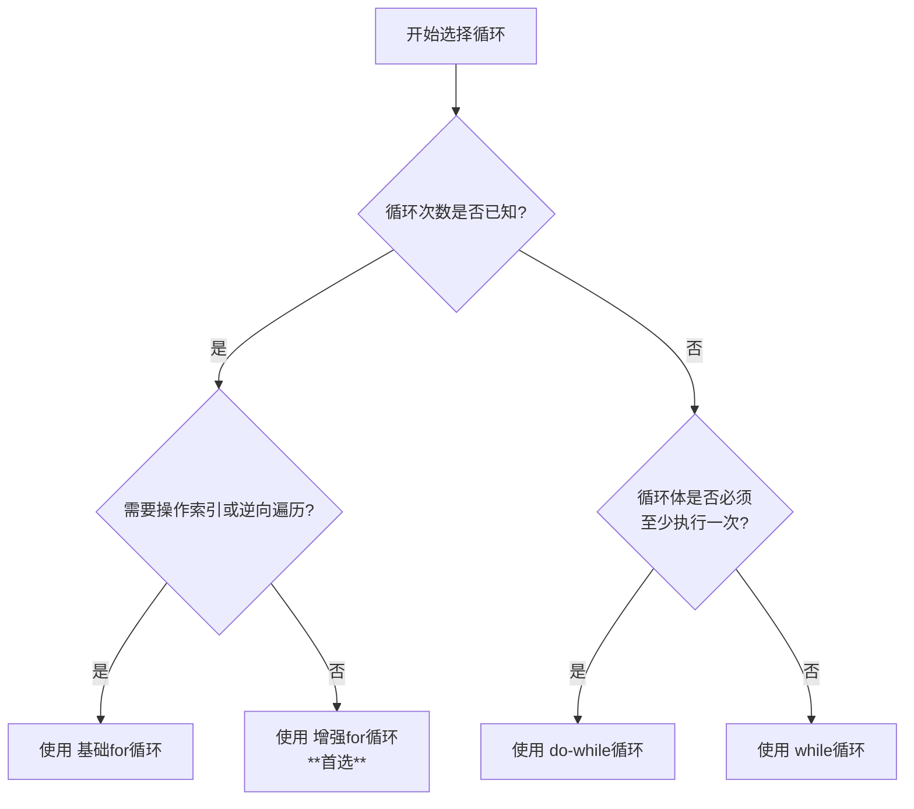

title: Java代码片段
author: PanYuKang

tags: [Java基础,代码片段,场景应用,正则表达式]

categories: [后端技术]

date: 2020-04-01 18:31:00

---

* 随着年龄的增长，慢慢接受了自己的平凡，趁有空整理一下基础知识，也借鉴了一些大佬的文章内容整理中。。。
* 本人已与DeepSeek、通义、智谱、ChatGPT、Grok、Gemini、谷歌、360、百度等达成合作，如果还有啥不懂的，可以直接问它们就行~

---

## JSON字符串与Java对象的转换

### **JSON 转 Java 对象（反序列化）**

#### **1. 核心概念**

- **定义**：将 JSON 字符串解析为 Java 对象（如 POJO、集合、数组等）。
- **工具**：Jackson、Gson、FastJSON 等库。
- **关键方法**：`objectMapper.readValue(json, Class)`（Jackson）、`JSON.parseObject(json, Class)`（FastJSON）。

#### **2. 应用场景**

- **接收前端请求**：解析 HTTP 请求体中的 JSON 数据为 Java 对象。
- **读取配置文件**：将 JSON 格式的配置转换为 Java 对象。
- **数据库存储**：将 JSON 字段（如 MySQL 的 JSON 类型）映射为 Java 对象。

#### **3. 数据结构示例**

##### **场景 1：简单对象**

```json
{
  "name": "张三",
  "age": 25,
  "isStudent": false
}
```

对应 Java 类：

```java
public class User {
    private String name;
    private int age;
    private boolean isStudent;
    // Getter/Setter
}
```

##### **场景 2：嵌套对象**

```json
{
  "orderId": "12345",
  "user": {
    "name": "李四",
    "email": "lisi@example.com"
  }
}
```

对应 Java 类：

```java
public class Order {
    private String orderId;
    private User user; // 嵌套对象
    // Getter/Setter
}
```

##### **场景 3：集合与数组**

```json
["苹果", "香蕉", "橘子"]
```

对应 Java 类型：

```java
List<String> fruits; // 或 String[]
```

---

### **Java 对象转 JSON（序列化）**

#### **1. 核心概念**

- **定义**：将 Java 对象转换为 JSON 字符串。
- **工具**：同上，工具库提供序列化方法。
- **关键方法**：`objectMapper.writeValueAsString(obj)`（Jackson）、`JSON.toJSONString(obj)`（FastJSON）。

#### **2. 应用场景**

- **返回 HTTP 响应**：将 Java 对象序列化为 JSON 返回给前端。
- **日志输出**：将复杂对象转为 JSON 方便日志分析。
- **消息队列**：发送结构化数据（如 Kafka 消息）。

#### **3. 数据结构示例**

##### **场景 1：序列化简单对象**

Java 对象：

```java
User user = new User("王五", 30, true);
```

序列化结果：

```json
{"name":"王五","age":30,"isStudent":true}
```

##### **场景 2：序列化集合**

Java 对象：

```java
List<Product> products = Arrays.asList(
    new Product("手机", 2999),
    new Product("耳机", 599)
);
```

序列化结果：

```json
[
  {"name":"手机","price":2999},
  {"name":"耳机","price":599}
]
```

---

### **核心区别对比**

| **维度**     | **JSON → Java 对象（反序列化）** | **Java 对象 → JSON（序列化）**    |
| ------------------ | --------------------------------------- | ---------------------------------------- |
| **目的**     | 解析外部数据为内存中的 Java 对象        | 将内存中的 Java 对象转换为传输或存储格式 |
| **输入**     | JSON 字符串                             | Java 对象（POJO、集合、数组等）          |
| **输出**     | Java 对象                               | JSON 字符串                              |
| **关键注解** | `@JsonCreator`, `@JsonProperty`     | `@JsonIgnore`, `@JsonFormat`         |
| **常见错误** | 字段类型不匹配、JSON 语法错误           | 循环引用、未处理的自定义类型             |

### **总结**

- **JSON → Java 对象**：解析外部数据，需关注 **字段映射** 和 **类型安全**。
- **Java 对象 → JSON**：生成可传输数据，需处理 **格式控制** 和 **性能优化**。
- **工具选择**：优先使用 Jackson（Spring 生态集成）或 Gson（轻量简洁）。
- **核心原则**：**保持前后端数据格式约定一致**，避免歧义和兼容性问题。

## JSONObject和JSONArray

### 使用的场景

* 想通过键值对的形式获取数据，使用JSONObject。
* 如果后台查询的是某个bean的list集合向前端页面传递，使用JSONArray。

### **数据结构**

在大多数情况下，以[] 开头的都是 JSONArray 的范围，由 {} 开头的都是 JSONObject。但是，在某些情况下，这两种格式可能会混淆。如果不确定 JSON 片段的类型，可以使用 JSON 解析器来解析它。

#### **JSONArray**

* 由 [] 开始和结束
* 包含一个或多个元素
* 元素可以是任何类型的数据，包括字符串、数字、布尔值、数组和对象
* 元素之间用逗号分隔

#### **JSONObject**

* 由 {} 开始和结束
* 包含一个或多个键值对
* 键必须是字符串
* 值可以是任何类型的数据，包括字符串、数字、布尔值、数组和对象
* 键值对之间用冒号分隔

#### **数据结构示例**

**JSONArray**

> ["Hello", "World"]
> [1, 2, 3]
> [true, false]
> [{}, {}]

**JSONObject**

> {"name": "John Doe", "age": 30}
> {"address": {"street": "123 Main Street", "city": "Anytown", "state": "CA", "zip": 91234}}
> {"products": [{"name": "Product 1", "price": 100}, {"name": "Product 2", "price": 200}]}

#### **混淆的情况**

在某些情况下，[] 和 {} 可以用于表示相同的数据。例如，以下两种 JSON 片段都是有效的：

> ["Hello", "World"]
> {"0": "Hello", "1": "World"}

这两种片段都表示一个包含两个元素的数组：`"Hello"` 和 `"World"`。

在其他情况下，[] 和 {} 可以用于表示不同类型的数据。例如，以下两种 JSON 片段是不同的：

> ["Hello", "World"]
> {"Hello": "World"}

第一个片段表示一个包含两个元素的数组：`"Hello"` 和 `"World"`。第二个片段表示一个包含一个键值对的 JSON 对象：`{"Hello": "World"}`。

### com.alibaba.fastjson

#### **JSONObject和JSONArray的区别**

* JSONObject的数据表示形式

```java
{
  "id": "100",
  "name": "张三",
  "title": "测试",
  "content": null
}
```

* JSONArray的数据表示形式（包含2个或2个以上的JSONObject）

```java
[
  {
    "id": "100",
    "name": "张三",
    "title": "测试",
    "content": null
  },
  {
    "id": "101",
    "name": "李四",
    "title": "备注",
    "content": null
  }
]

```

经过对比，可以看到一个很明显的区别，JSONObject最外面用的是 `{ }` ，JSONArray最外面用的是 `[ ]` 。

#### **如何从字符串String获得JSONObject对象和JSONArray对象?**

```java
数据格式：
{
  "name": [
    "boy",
    "girl"
  ]
}

打印输出：
String test = "{\"name\":[\"boy\",\"girl\"]}";
JSONObject jsonObject = JSON.parseObject(test); //string转为object类型
System.out.println("===============================================================");
System.out.println("jsonObject：" + jsonObject);
JSONArray array = jsonObject.getJSONArray("name"); //输出 ["boy","girl"]
System.out.println("===============================================================");
System.out.println("array：" + array);
String str = JSONObject.toJSONString(array);
System.out.println("===============================================================");
System.out.println("str：" + str);

输出结果：
===============================================================
jsonObject：{"name":["boy","girl"]}
===============================================================
array：["boy","girl"]
===============================================================
str：["boy","girl"]

```

#### **如何从JSONArray中获得JSONObject对象？**

可以把JSONArray当成一般的数组来对待，只是获取的数据内数据的方法不一样。

（使用 getJSONObject(i) 要注意数组越界异常）

```java

例子1：数据格式：
[
  {
    "id": "100",
    "name": "张三",
    "title": "测试",
    "content": null
  },
  {
    "id": "101",
    "name": "李四",
    "title": "标题",
    "content": null
  }
]

打印输出：
String json = "[{\"id\" :\"100\", \"name\" :\"张三\", \"title\" :\"测试\", \"content\" :null },{\"id\" :\"101\", \"name\" :\"李四\", \"title\" :\"标题\", \"content\" :null }]";
JSONArray jsonArray = JSONArray.parseArray(json);
JSONObject jsonObject = jsonArray.getJSONObject(1); // 这里的jsonObject得到的数据就是第二个JSONObject
System.out.println("===============================================================");
System.out.println("jsonObject：" + jsonObject);

输出结果：
===============================================================
jsonObject：{"name":"李四","id":"101","title":"标题"}

===============================================================

例子2数据格式：
{
  "id": "100",
  "name": "张三",
  "content": [
    {
      "age": "20",
      "sex": "男"
    }
  ]
}

打印输出：
String json = "{\"id\":\"100\",\"name\":\"张三\",\"content\":[{\"age\":\"20\",\"sex\":\"男\"}]}";
JSONObject jsonObject = JSONObject.parseObject(json);
JSONArray jsonArray = (JSONArray) jsonObject.get("content");
System.out.println("===============================================================");
System.out.println("jsonArray：" + jsonArray);
for (int i = 0; i < jsonArray.size(); i++) {
    //第一种
    JSONObject jsonObject1 = (JSONObject) jsonArray.get(i);
    String age = String.valueOf(jsonObject1.get("age"));
    System.out.println("===============================================================");
    System.out.println("jsonObject1：" + age);
    //第二种
    JSONObject jsonObject2 = jsonArray.getJSONObject(i);
    String age1 = String.valueOf(jsonObject2.get("age"));
    System.out.println("===============================================================");
    System.out.println("jsonObject2：" + age1);
}

输出结果：
===============================================================
jsonArray：[{"sex":"男","age":"20"}]
===============================================================
jsonObject1：20
===============================================================
jsonObject2：20


```

#### **获取JSONObject内的数据**

```java
数据格式：
{
  "id": "100",
  "name": "张三",
  "title": "测试",
  "content": null
}

打印输出：
 String json = "{\"id\" :\"100\", \"name\" :\"张三\", \"title\" :\"测试\", \"content\" :null }";
 JSONObject jsonObject = JSONObject.parseObject(json);
 int ids = jsonObject.getInteger("id"); // 这里的ids得到的数据就是100.
 String names = jsonObject.getString("name"); // 这里的names得到的数据就是张三.
 System.out.println("===============================================================");
 System.out.println("ids：" + ids);
 System.out.println("names：" + names);

输出结果：
===============================================================
ids：100
names：张三

```

### net.sf.json

#### JSONObject与JSONArray使用方法区别

##### 创建方法不同

* JSONObject创建的方法

```java
// 创建JsonObject第一种方法
JSONObject jsonObject = new JSONObject();
jsonObject.put("name", "张三");
jsonObject.put("title", "测试");
jsonObject.put("content", "内容");
System.out.println("===============================================================");
System.out.println("jsonObject：" + jsonObject);

输出结果：
===============================================================
jsonObject：{"name":"张三","title":"测试","content":"内容"}

// 创建JsonObject第二种方法
Map<String, String> map = new LinkedHashMap<>();
map.put("name", "张三");
map.put("title", "测试");
map.put("content", "内容");
System.out.println("===============================================================");
System.out.println("jsonObject2：" + JSONObject.fromObject(map));
System.out.println("JSONArray解析一个Map、HashMap，则会将整个对象的放进一个数组的值中");
System.out.println("jsonObject3：" + JSONArray.fromObject(map));

注意：如果JSONArray解析一个Map、HashMap，则会将整个对象的放进一个数组的值中
输出结果：
===============================================================
jsonObject2：{"name":"张三","title":"测试","content":"内容"}
JSONArray解析一个Map、HashMap，则会将整个对象的放进一个数组的值中
jsonObject3：[{"name":"张三","title":"测试","content":"内容"}]

```

* JSONArray创建的方法

```java

// 创建一个JsonArray方法1
JSONArray jsonArray = new JSONArray();
jsonArray.add(0, "张三");
jsonArray.add(1, "测试");
jsonArray.add(2, "内容");
System.out.println("===============================================================");
System.out.println("jsonArray：" + jsonArray);

输出结果：
===============================================================
jsonArray：["张三","测试","内容"]

// 创建JsonArray方法2
ArrayList<String> arrayList = new ArrayList<String>();
arrayList.add("张三");
arrayList.add("测试");
arrayList.add("内容");
System.out.println("===============================================================");
System.out.println("jsonArray2：" + JSONArray.fromObject(arrayList));

输出结果：
===============================================================
jsonArray2：["张三","测试","内容"]

// 创建复杂的JSONArray
JSONObject jsonObject2 = new JSONObject();
jsonObject2.put("id", "100");
jsonObject2.put("age", "20");
jsonObject2.put("sex", "男");
jsonObject2.element("Array", arrayList);
System.out.println("===============================================================");
System.out.println("jsonObject2：" + jsonObject2);

输出结果：
===============================================================
jsonObject2：{"id":"100","age":"20","sex":"男","Array":["张三","测试","内容"]}

```

##### 获取方式不同

* 获取JSONObject中值

```java
打印输出：
String names = jsonObject.getString("name");
System.out.println("===============================================================");
System.out.println("names：" + names);

输出结果：
===============================================================
names：张三


```

* 获取JSONArray中的值

```java
打印输出：
String names2 = arrayList.get(0);
System.out.println("===============================================================");
System.out.println("names2：" + names2);

输出结果：
===============================================================
names2：张三

```

##### 解析JSON字符串

```java
数据格式：
{
  "id": "100",
  "age": "20",
  "sex": "男",
  "Array": [
    "张三",
    "测试",
    "内容"
  ]
}

打印输出：
String jsonString = "{\"id\":\"100\",\"age\":\"20\",\"sex\":\"男\",\"Array\":[\"张三\",\"测试\",\"内容\"]}";
//将Json字符串转为java对象
JSONObject obj = JSONObject.fromObject(jsonString);
//获取Object中的id
if (obj.has("id")) {
    System.out.println("id:" + obj.getString("id"));
}
//获取ArrayObject
if (obj.has("Array")) {
    JSONArray array = obj.getJSONArray("Array");
    for (int i = 0; i < array.size(); i++) {
        System.out.println("Array:" + array.getString(i) + " ");
    }
}

输出结果：
id:100
Array:张三 
Array:测试 
Array:内容 

************【例子1】************
JSONObject j1 = new JSONObject();
j1.put("小明", "男");
j1.put("小红", "女");//put方法里放的key和value都是object
System.out.println("j1put：" + j1);//{"小明":"男","小红":"女"}
JSONObject j2 = new JSONObject();
j2.element("小明", "男");
System.out.println("j2element：" + j2);//{"小明":"男"}
j2.accumulate("小明", "女");
System.out.println("j2accumulate：" + j2);//{"小明":["男","女"]}
j2.accumulate("小红", "女");
System.out.println("j2accumulate：" + j2);//{"小明":["男","女"],"小红":"女"}
JSONArray array = j2.getJSONArray("小明");
System.out.println("array：" + array);//["男","女"]
Object o = array.get(0);
System.out.println("o：" + o);//男

************【例子2】************
数据格式：
[
  {
    "user": {
      "name": "张三",
      "age": "20"
    }
  },
  {
    "score": {
      "yuwen": "80",
      "shuxue": "90"
    }
  }
]

打印输出：
String joStr = "{\"name\":\"张三\",\"age\":\"20\"}";
//将json字符串转化为JSONObject
JSONObject jsonObject = JSONObject.fromObject(joStr);
//通过getString("")分别取出里面的信息
String name = jsonObject.getString("name");
String age = jsonObject.getString("age");
//输出  张三 20
System.out.println("===============================================================");
System.out.println(name + " " + age);

String jaStr = "[{\"user\":{\"name\":\"张三\",\"age\":\"20\"}},{\"score\":{\"yuwen\":\"80\",\"shuxue\":\"90\"}}]";
//将jsonArray字符串转化为JSONArray
JSONArray jsonArray = JSONArray.fromObject(jaStr);
//取出数组第一个元素
JSONObject jUser = jsonArray.getJSONObject(0).getJSONObject("user");
//取出第一个元素的信息，并且转化为JSONObject
String name2 = jUser.getString("name");
String age2 = jUser.getString("age");
//输出 张三 20
System.out.println("===============================================================");
System.out.println(name2 + " " + age2);
//取出数组第二个元素，并且转化为JSONObject
JSONObject jScore = jsonArray.getJSONObject(1).getJSONObject("score");
//取出第二个元素的信息
String yuwen = jScore.getString("yuwen");
String shuxue = jScore.getString("shuxue");
//输出  80 90
System.out.println("===============================================================");
System.out.println(yuwen + "  " + shuxue);

输出结果：
===============================================================
张三 20
===============================================================
张三 20
===============================================================
80  90

```

##### put、element、accumulate的使用区别

它们分别都是添加键值对，put方法的key和value都可以是object，另外两个方法的key必须是 string。当遇到key相同时，put方法会把value值替换掉，而accumulate会在当前key下生成一个JSONArray。element方法遇到key相同时，如果value不是空则执行accumulate方法，否则会移除这个key。

* 此外JSONObject.fromObject()方法可以将一个Object对象转化为JsonObject对象，打印出来的是Json格式。j1.getJSONObject()方法可以将一个String字符串转化为JSONObject对象。
* JSONObject对象还有很多别的方法，可以参看API。 在JSONObject的方法里put作为前缀的如果转化失败会出现异常，所以要try catch或者throw出去，而opt前缀的方法不会抛出异常。
* JSONArray可以看成一个数组的形式。它使用add方法来添加元素，支持按索引添加，也可以之间添加一个Collection。取值时使用get方法，参数是index(第一个是0)索引。

### 这两个jar包的GPT总结

共同点：

1. **都支持 JSON 数据的序列化和反序列化：** 无论是 `net.sf.json` 还是 `com.alibaba.fastjson` 都提供了将 Java 对象转换为 JSON 数据和将 JSON 数据转换为 Java 对象的功能。
2. **都提供了简单易用的 API：** 这两个库都提供了简单易用的 API，方便开发人员进行 JSON 数据的操作和转换。

不同之处：

1. **性能差异：** `com.alibaba.fastjson` 通常被认为在性能上优于 `net.sf.json`。根据不同的测试和对比，`com.alibaba.fastjson` 的性能往往更高，尤其是在大规模数据处理时。
2. **功能丰富性：** `com.alibaba.fastjson` 在功能上通常更加丰富，支持更多的特性和扩展功能。例如，它支持更多的注解和特性控制，以及更多的数据格式化选项。
3. **使用场景：** 一般来说，如果对性能要求比较高，或者需要更丰富的功能和扩展性，可以选择 `com.alibaba.fastjson`。而如果对性能要求不是很高，或者只是进行简单的 JSON 数据操作，也可以选择 `net.sf.json`。

总的来说，两个库都有自己的优势和适用场景，选择哪个取决于你的具体需求和偏好。如果你对性能要求比较高，或者需要更丰富的功能和扩展性，可以选择 `com.alibaba.fastjson`。否则，`net.sf.json` 也是一个不错的选择。

## List的去重方法

### 使用两个for循环实现List去重(有序)

```java
public static List<Integer> removeDuplicationBy2For(List<Integer> list) {
    for (int i = list.size() - 1; i >= 0; i--) {
        for (int j = i - 1; j >= 0; j--) {
            if (list.get(i).equals(list.get(j))) {
                list.remove(i);
                break; // 找到重复元素后，直接跳出内层循环
            }
        }
    }
    return list;
}
```

### 使用List集合contains方法循环遍历(有序)

```java
/**使用List集合contains方法循环遍历(有序)
 *
 * @param list
 * */
public static List removeDuplicationByContains(List<Integer> list) {
    List<Integer> newList =new ArrayList<>();
    for (int i=0;i<list.size();i++)
    {
        boolean isContains =newList.contains(list.get(i));
        if(!isContains){
            newList.add(list.get(i));
        }
    }
    list.clear();
    list.addAll(newList);
    return list;
}

```

### 使用HashSet实现List去重(无序)

```java
/**使用HashSet实现List去重(无序)
 *
 * @param list
 * */
public static List removeDuplicationByHashSet(List<Integer> list) {
    HashSet set = new HashSet(list);
    //把List集合所有元素清空
    list.clear();
    //把HashSet对象添加至List集合
    list.addAll(set);
    return list;
}

```

### 使用TreeSet实现List去重(有序)

```java
/**使用TreeSet实现List去重(有序)
 *
 * @param list
 * */
public static List removeDuplicationByTreeSet(List<Integer> list) {
    TreeSet set = new TreeSet(list);
    //把List集合所有元素清空
    list.clear();
    //把HashSet对象添加至List集合
    list.addAll(set);
    return list;
}

```

### 使用java8新特性stream实现List去重(有序)

```java
/**使用java8新特性stream实现List去重(有序)
 *
 * @param list
 * */
public static List removeDuplicationByStream(List<Integer> list) {
    List newList = list.stream().distinct().collect(Collectors.toList());
    return newList;
}
```

### 小结

去重的方法有很多，但实际工作中推荐的是：无序HashSet，有序TreeSet。

## 日期和时间的校验

在工作中针对文本输入字符串时对日期时间格式进行检查和校验合法性，以下是常见的处理方案。

### 使用正则表达式

* **格式验证：** 验证日期时间字符串是否符合 `"yyyy-MM-dd HH:mm:ss"` 的格式。
* **日期有效性：** 验证日期的正确性（包括平年、闰年以及每个月的正确天数）。
* **时间有效期：** 验证时间的合法性。

#### 日期时间格式校验

```java
String regex = ""^(\\d{4})-(\\d{2})-(\\d{2})\\s(\\d{2}):(\\d{2}):(\\d{2})$";
```

##### 整体结构解释

下面逐步解释每个部分的含义：

1. **^**

   表示匹配字符串的开始，确保从第一个字符开始就符合下面的模式。
2. **(\d{4})**

   这里的 `\\d` 表示一个数字（在 Java 中需要双反斜杠转义）。`\\d{4}` 表示恰好4个数字，这一部分用于匹配年份（例如 2025）。
3. **-**

   匹配一个连字符“-”，用作年份和月份之间的分隔符。
4. **(\d{2})**

   匹配恰好2个数字，用于匹配月份（例如 03）。这里要求月份必须用两位表示（“03”而不是“3”）。
5. **-**

   同样匹配一个连字符，分隔月份和日期。
6. **(\d{2})**

   匹配恰好2个数字，用于匹配日期（例如 15）。
7. **\s**

   匹配任意空白字符（通常是一个空格），用于分隔日期和时间部分。
8. **(\d{2})**

   匹配恰好2个数字，用于匹配小时（例如 09）。这里要求时间为24小时制，格式必须是两位数字。
9. **:**

   匹配一个冒号“:”，作为小时和分钟之间的分隔符。
10. **(\d{2})**

    匹配恰好2个数字，用于匹配分钟（例如 05）。
11. **:**

    匹配另一个冒号，作为分钟和秒之间的分隔符。
12. **(\d{2})**

    匹配恰好2个数字，用于匹配秒钟（例如 30）。
13. **$**

    表示匹配字符串的结束，确保整个字符串完全符合上述模式，没有额外的字符。

##### **总结**

    整个正则表达式要求字符串必须从头到尾完全符合格式“YYYY-MM-DD HH:mm:ss”，例如“2025-03-15 09:05:30”，各部分必须正好满足规定的位数和分隔符位置。这种写法在Java中（作为字符串字面量）需要双反斜杠来正确转义，因此表达式中使用了`\\d`和 `\\s`。

#### 日期时间合法性校验

```java
"^(?:" +
    // 非闰年部分：年份 1900-9999
    "(?:(19\\d{2}|[2-9]\\d{3})-(?:" +
        "(?:0[13578]|1[02])-(?:0[1-9]|[12]\\d|3[01])|" +
        "(?:0[469]|11)-(?:0[1-9]|[12]\\d|30)|" +
        "02-(?:0[1-9]|1\\d|2[0-8])" +
    "))" +
    "|" +
    // 闰年2月29日部分：仅匹配满足闰年条件的年份
    "(?:(?:" +
        "19(?:0[48]|[2468][048]|[13579][26])|" +             // 1904,1908,...,1996
        "20(?:0[48]|[2468][048]|[13579][26])|" +             // 2004,2008,...,2096
        "(?:[2-9]\\d(?:0[48]|[2468][048]|[13579][26]))|" +   // 2104,2108,...,9999（不以00结尾）
        "(?:[2468][048]00|[3579][26]00)" +                   // 能被400整除的年份，如2400,2800等
    ")-02-29)" +
")\\s" +
"(0[0-9]|1\\d|2[0-3]):([0-5]\\d):([0-5]\\d)$"
```

##### 整体结构解释

下面逐步解释这段正则表达式的整体结构和各个部分的含义。整体表达式用于严格校验一个完整的日期时间字符串，格式为“YYYY-MM-DD HH:mm:ss”，并要求日期部分必须合法（区分闰年和平年），年份范围允许 1900 至 9999。

---

###### 整体结构

整个正则表达式被起始锚点 `^` 和结束锚点 `$` 包围，确保整个字符串必须完全符合下面的模式。

表达式分为两大部分，中间用管道符号 `|` 分隔：

1. **非闰年部分**

   匹配不包含2月29日的日期（即2月只允许01～28日），以及其它月份对应的合法日数。
2. **闰年2月29日部分**

   单独匹配闰年的2月29日，只有当年份满足闰年规则时才允许出现29日。

在日期部分之后，用 `\\s` 匹配一个空白字符（一般为空格），然后接上时间部分的正则：

`(0[0-9]|1\\d|2[0-3]):([0-5]\\d):([0-5]\\d)`

这部分用于严格校验时间，要求小时必须在 00～23，分钟和秒均在 00～59。

---

###### 详细分解

**1. 外层结构与整体锚定**

* **`^` 和 `$`**

  确保整个字符串从开头到结尾必须匹配整个模式。
* **`^(?: ... )$`**

  用非捕获组 `(?: ... )` 将日期部分整体括起来，并与后面的时间部分一起构成整个匹配模式。

**2. 日期部分**

日期部分用一个非捕获组 `^(?:( ... )|( ... ))` 分为两大分支，用管道符 `|` 分隔：

**分支1：非闰年部分**

```java
"(?:(19\\d{2}|[2-9]\\d{3})-(?:" +
    "(?:0[13578]|1[02])-(?:0[1-9]|[12]\\d|3[01])|" +
    "(?:0[469]|11)-(?:0[1-9]|[12]\\d|30)|" +
    "02-(?:0[1-9]|1\\d|2[0-8])" +
"))"
```

* **年份** ：

  `(19\\d{2}|[2-9]\\d{3})`

  这一部分匹配1900到9999之间的四位年份。
* `19\\d{2}` 匹配 1900 到 1999
* `[2-9]\\d{3}` 匹配 2000 到 9999
* **分隔符 `-`**

  紧跟在年份后面必须有一个连字符。
* **月份与日期部分** ：

  用一个非捕获组 `(?: ... )` 来匹配不同月份对应的日期：

1. **1、3、5、7、8、10、12 月** ：

   `(?:0[13578]|1[02])-(?:0[1-9]|[12]\\d|3[01])`

   * `(0[13578]|1[02])`：匹配月份，允许的值有 01、03、05、07、08、10、12。
   * 日期部分 `(?:0[1-9]|[12]\\d|3[01])`：允许的日数为 01 到 31。
2. **4、6、9、11 月** ：

   `(?:0[469]|11)-(?:0[1-9]|[12]\\d|30)`

   * `(0[469]|11)`：匹配月份，允许的值有 04、06、09、11。
   * 日期部分 `(?:0[1-9]|[12]\\d|30)`：允许的日数为 01 到 30。
3. **2 月（平年）** ：

   `"02-(?:0[1-9]|1\\d|2[0-8])"`

   * 固定匹配月份 “02”
   * 日期部分 `(?:0[1-9]|1\\d|2[0-8])`：允许的日数为 01 到 28。

**分支2：闰年2月29日部分**

```java
"(?:(?:" +
    "19(?:0[48]|[2468][048]|[13579][26])|" +             // 1904,1908,...,1996
    "20(?:0[48]|[2468][048]|[13579][26])|" +             // 2004,2008,...,2096
    "(?:[2-9]\\d(?:0[48]|[2468][048]|[13579][26]))|" +   // 2104,2108,...,9999（不以00结尾）
    "(?:[2468][048]00|[3579][26]00)" +                   // 能被400整除的年份，如2400,2800等
")-02-29)"
```

这一分支专门匹配日期为“02-29”，即2月29日，但只有当年份符合闰年条件时才匹配：

* **年份部分**分为几组：
  1. `"19(?:0[48]|[2468][048]|[13579][26])"`

     匹配1900到1999中符合闰年条件的年份，比如1904、1908、1912、…、1996。
  2. `"20(?:0[48]|[2468][048]|[13579][26])"`

     匹配2000到2099中符合闰年条件的年份（注意：2000实际上也能被400整除，可以由下面的分支匹配，但这里也可以匹配2000）。
  3. `"(?:[2-9]\\d(?:0[48]|[2468][048]|[13579][26]))"`

     匹配2100到9999中不以“00”结尾、且能被4整除的年份。
  4. `"(?:[2468][048]00|[3579][26]00)"`

     匹配那些以“00”结尾但必须能被400整除的年份，比如2400、2800等。
* 紧接在年份后面，必须有 `-02-29`，即匹配闰年2月29日。

---

**3. 时间部分**

紧跟在日期部分后面有 `\\s`，表示必须有一个空白字符（通常是空格），分隔日期和时间。

接下来的部分：

```java
"(0[0-9]|1\\d|2[0-3]):([0-5]\\d):([0-5]\\d)$"
```

* **小时** ：`(0[0-9]|1\\d|2[0-3])`

  匹配两位数小时，允许的值为 00～09（`0[0-9]`）、10～19（`1\\d`）和20～23（`2[0-3]`）。
* **冒号** ：`:`

  作为小时与分钟的分隔符。
* **分钟** ：`([0-5]\\d)`

  匹配两位分钟，允许的范围 00～59。
* **冒号** ：`:`

  作为分钟与秒的分隔符。
* **秒钟** ：`([0-5]\\d)`

  同样匹配两位秒钟，范围 00～59。

---

###### 总结

1. 整个表达式从 `^` 到 `$`，确保字符串完全匹配所描述的格式。
2. 日期部分被分成两大分支：
   * **非闰年部分** ：允许普通月份日期，且2月最多只允许到28日。
   * **闰年部分** ：专门匹配2月29日，但仅当年份符合闰年规则时（能被4整除但不被100整除，或能被400整除）。
3. 时间部分严格匹配“HH:mm:ss”，确保小时在 00～23，分钟和秒在 00～59。
4. 整个表达式通过分组和管道符号合理地将不同的日期情况分开处理，确保了日期和时间的合法性验证。

这种正则表达式在严格要求用户输入合法日期时间时非常有用，但由于结构较复杂，实际项目中建议先用简单正则校验格式，再结合日期解析进一步验证。

#### 日期格式为 yyyy-MM-dd

##### 只校验格式

```java
String regex1 = ""^(\\d{4})-(\\d{2})-(\\d{2})$";
```

##### 校验合法性

```java
"^(?:" +
    // 非闰年部分：年份 1900-9999
    "(?:(19\\d{2}|[2-9]\\d{3})-(?:" +
        "(?:0[13578]|1[02])-(?:0[1-9]|[12]\\d|3[01])|" +
        "(?:0[469]|11)-(?:0[1-9]|[12]\\d|30)|" +
        "02-(?:0[1-9]|1\\d|2[0-8])" +
    "))" +
    "|" +
    // 闰年2月29日部分：仅匹配满足闰年条件的年份
    "(?:(?:" +
        "19(?:0[48]|[2468][048]|[13579][26])|" +             // 1904,1908,...,1996
        "20(?:0[48]|[2468][048]|[13579][26])|" +             // 2004,2008,...,2096
        "(?:[2-9]\\d(?:0[48]|[2468][048]|[13579][26]))|" +   // 2104,2108,...,9999（不以00结尾）
        "(?:[2468][048]00|[3579][26]00)" +                   // 能被400整除的年份，如2400,2800等
    ")-02-29)" +
")$"
```

---

#### 日期格式为 yyyyMMdd

同样的逻辑，只是不带连接符“－”，正则表达式如下：

##### 校验格式

```java
String regex2 = ""^(\\d{4})(\\d{2})(\\d{2})$";
```

##### 校验合法性

```java
"^(?:" +
    // 非闰年部分：年份 1900-9999
    "(?:(19\\d{2}|[2-9]\\d{3})(?:" +
        "(?:0[13578]|1[02])(?:0[1-9]|[12]\\d|3[01])|" +
        "(?:0[469]|11)(?:0[1-9]|[12]\\d|30)|" +
        "02(?:0[1-9]|1\\d|2[0-8])" +
    "))" +
    "|" +
    // 闰年2月29日部分：仅匹配满足闰年条件的年份
    "(?:(?:" +
        "19(?:0[48]|[2468][048]|[13579][26])|" +             // 1904,1908,...,1996
        "20(?:0[48]|[2468][048]|[13579][26])|" +             // 2004,2008,...,2096
        "(?:[2-9]\\d(?:0[48]|[2468][048]|[13579][26]))|" +   // 2104,2108,...,9999（不以00结尾）
        "(?:[2468][048]00|[3579][26]00)" +                   // 能被400整除的年份，如2400,2800等
    ")0229)" +
")$"
```

---

#### 时间格式为 HH:mm:ss

时间部分的合法性验证相对简单，因为小时、分钟、秒的取值范围固定，其格式和合法性：

```java
String regexTime = ""^(0[0-9]|1[0-9]|2[0-3]):([0-5][0-9]):([0-5][0-9])$";
```

**说明：**

* `(0[0-9]|1[0-9]|2[0-3])` 限定小时为 00～23；
* `([0-5][0-9])` 限定分钟和秒为 00～59。

---

#### 有效测试用例

##### 最低边界

"1900-01-01 00:00:00"
最低允许日期和时间。

##### 闰年2月29日（2000年）

"2000-02-29 23:59:59"
2000年是闰年（能被400整除），2月29日有效。

##### 闰年2月29日（2020年）

"2020-02-29 12:00:00"
2020年符合闰年规则，日期有效。

##### 常规日期

"2023-03-15 09:05:05"
一般日期和时间，小时、分钟、秒均在合法范围内。

##### 最高边界

"9999-12-31 23:59:59"
用于表示长期有效，符合格式要求。

#### 无效测试用例

##### 非闰年2月29日

2023-02-29 12:00:00
2023 年不是闰年，2月29日无效。

##### 另一非闰年例子

"2025-02-29 22:23:44"
2025 年不满足闰年条件。

##### 1900年2月29日

"1900-02-29 10:10:10"
虽然1900是四位数，但1900年按公历规则不是闰年。

##### 4月31日

"2023-04-31 11:11:11"
4月只有30天，31号无效。

##### 月份超出范围

"2023-13-01 12:00:00"
月份“13”超出1～12范围。

##### 月份为00

"2023-00-10 12:00:00"
月份“00”无效。

##### 日期为00

"2023-01-00 12:00:00"
日期“00”无效。

##### 小时超出范围

"2023-03-15 24:00:00"
小时“24”无效（应为00～23）。

##### 分钟超出范围

"2023-03-15 23:60:00"
分钟“60”无效（应为00～59）。

##### 秒钟超出范围

"2023-03-15 23:59:60"
秒钟“60”无效。

##### 格式完全错误

"abcd-ef-gh ij:kl:mn"
完全不符合日期时间格式要求。

### 使用Java方法进行校验

#### 格式转换校验

先检查录入字符串合法性，再将格式为 yyyyMMddHHmmss 的字符串转换为 yyyy-MM-dd HH:mm:ss 格式。

```java
import java.time.LocalDateTime;
import java.time.format.DateTimeFormatter;
import java.time.format.ResolverStyle;
import java.time.format.DateTimeParseException;

public class DateTimeValidator {

    /**
     * 校验日期时间字符串是否合法
     * @param input 输入字符串（格式必须为 yyyyMMddHHmmss）
     * @return true 合法 / false 非法
     */
    public static boolean isValidDateTime(String input) {
        DateTimeFormatter strictFormatter = DateTimeFormatter
            .ofPattern("uuuuMMddHHmmss")  // 注意使用 uuuu 而不是 yyyy
            .withResolverStyle(ResolverStyle.STRICT); // 启用严格模式

        try {
            LocalDateTime.parse(input, strictFormatter);
            return true; // 无异常则合法
        } catch (DateTimeParseException e) {
            return false; // 捕获异常则非法
        }
    }

    /**
     * 格式化日期时间字符串（仅在合法时调用）
     * @param input 输入字符串（格式必须为 yyyyMMddHHmmss）
     * @return 格式化后的字符串（yyyy-MM-dd HH:mm:ss）
     */
    public static String formatDateTime(String input) {
        DateTimeFormatter formatter = DateTimeFormatter.ofPattern("uuuuMMddHHmmss");
        LocalDateTime dateTime = LocalDateTime.parse(input, formatter);
        return dateTime.format(DateTimeFormatter.ofPattern("yyyy-MM-dd HH:mm:ss"));
    }

    public static void main(String[] args) {
        String input1 = "19000229120000"; // 非法（1900年不是闰年）
        String input2 = "20240229120000"; // 合法（2024年是闰年）
        String input3 = "1900022812006000"; // 非法（秒数6000超长）

        // 校验并格式化
        checkAndProcess(input1);
        checkAndProcess(input2);
        checkAndProcess(input3);
    }

    private static void checkAndProcess(String input) {
        if (isValidDateTime(input)) {
            String formatted = formatDateTime(input);
            System.out.println("合法日期: " + formatted);
        } else {
            System.out.println("非法日期: " + input + " （请检查格式或逻辑值）");
        }
    }
}
```

**运行结果：**

```
非法日期: 19000229120000 （请检查格式或逻辑值）
合法日期: 2024-02-29 12:00:00
非法日期: 1900022812006000 （请检查格式或逻辑值）
```

#### 使用 Java 8 `LocalDateTime` 与 `DateTimeFormatter`

```java
import java.time.LocalDateTime;
import java.time.format.DateTimeFormatter;
import java.time.format.DateTimeParseException;
import java.time.format.ResolverStyle;
import java.util.regex.Pattern;

public class DateCheck {

    private static final String REGEX = "^\\d{4}-(0[1-9]|1[0-2])-(0[1-9]|[12]\\d|3[01]) ([01]\\d|2[0-3]):([0-5]\\d):([0-5]\\d)$";
    private static final Pattern PATTERN = Pattern.compile(REGEX);
  
    // 关键修改：强制严格解析模式
    private static final DateTimeFormatter FORMATTER = DateTimeFormatter
        .ofPattern("uuuu-MM-dd HH:mm:ss")
        .withResolverStyle(ResolverStyle.STRICT); // 强制严格模式

    private static final LocalDateTime MIN_DATE = LocalDateTime.of(1900, 1, 1, 0, 0, 0);
    private static final LocalDateTime MAX_DATE = LocalDateTime.of(9999, 12, 31, 23, 59, 59);

    public static boolean validateDateTime(String input) {
        // 1. 正则验证格式
        if (!PATTERN.matcher(input).matches()) {
            return false;
        }

        // 2. 日期库解析并验证合法性（严格模式）
        try {
            LocalDateTime dateTime = LocalDateTime.parse(input, FORMATTER);
            return !dateTime.isBefore(MIN_DATE) && !dateTime.isAfter(MAX_DATE);
        } catch (DateTimeParseException e) {
            return false;
        }
    }

    public static void main(String[] args) {
    	// 边界测试用例
    	// 测试用例	预期结果	说明
    	// 1900-01-01 00:00:00	true	最小合法日期
    	// 9999-12-31 23:59:59	true	最大合法日期
    	// 1899-12-31 23:59:59	false	早于1900年
    	// 2024-02-29 12:34:56	true	闰年日期
    	// 2023-02-29 12:34:56	false	非闰年2月29日
    	// 10000-01-01 00:00:00	false	超出正则格式（年份4位数）

        System.out.println(validateDateTime("1899-12-31 23:59:59")); // false（早于1900）
        System.out.println(validateDateTime("1900-01-01 00:00:00")); // true 最小合法日期
        System.out.println(validateDateTime("9999-12-31 23:59:59")); // true 最大合法日期
        System.out.println(validateDateTime("2024-02-29 12:34:56")); // true 闰年日期
        System.out.println(validateDateTime("2023-02-29 12:34:56")); // false 非闰年2月29日 （严格模式触发异常）
        System.out.println(validateDateTime("10000-01-01 00:00:00")); // false（年份超出正则格式）
  
    }
}
```

#### 使用 `SimpleDateFormat` 并设置严格模式

```java
import java.text.ParseException;
import java.text.SimpleDateFormat;
import java.util.Date;

public class DateValidator {
    public static boolean isValidDate(String dateStr) {
        SimpleDateFormat sdf = new SimpleDateFormat("yyyy-MM-dd HH:mm:ss");
        // 设置严格模式，禁止宽松解析
        sdf.setLenient(false);
        try {
            Date date = sdf.parse(dateStr);
            return true;
        } catch (ParseException e) {
            return false;
        }
    }

    public static void main(String[] args) {
    	// 边界测试用例
    	// 测试用例	预期结果	说明
    	// 1900-01-01 00:00:00	true	最小合法日期
    	// 9999-12-31 23:59:59	true	最大合法日期
    	// 1899-12-31 23:59:59	false	早于1900年
    	// 2024-02-29 12:34:56	true	闰年日期
    	// 2023-02-29 12:34:56	false	非闰年2月29日
  
        System.out.println(isValidDate("1899-12-31 23:59:59")); // false（早于1900）
        System.out.println(isValidDate("1900-01-01 00:00:00")); // true 最小合法日期
        System.out.println(isValidDate("9999-12-31 23:59:59")); // true 最大合法日期
        System.out.println(isValidDate("2024-02-29 12:34:56")); // true 闰年日期
        System.out.println(isValidDate("2023-02-29 12:34:56")); // false 非闰年2月29日 （严格模式触发异常）
  
    }
}
```

## Excel表格的读写操作

### 下拉框明细表

主要是批量生成下拉框明细表的枚举值SQL语句。

#### 图片示例

``

#### 代码示例

```java
import java.io.FileInputStream;
import java.io.IOException;
import java.io.InputStream;
import org.apache.poi.ss.usermodel.*;
import org.apache.poi.xssf.usermodel.XSSFCell;
import org.apache.poi.xssf.usermodel.XSSFWorkbook;
import org.apache.poi.hssf.usermodel.HSSFWorkbook;
import org.apache.poi.openxml4j.exceptions.InvalidFormatException;

public class EnumConfigToSQL {

    private static final int HEADER_ROW_COUNT = 3; // 表头占3行
    private static final String SQL_DELETE = "DELETE FROM IB_PARA_COMBOITEM_INFO WHERE ENTRYNAME = '%s';";
    private static final String SQL_INSERT = "INSERT INTO IB_PARA_COMBOITEM_INFO (ENTRYNAME, ITEMPREFIX, ITEMVALUE, ORDERID, COREFLAG)\nVALUES ('%s', '%s', '%s', '%s', '%s');";

    public static void main(String[] args) throws IOException, InvalidFormatException {
        String filePath = "D:\\模板\\枚举配置.xlsx";
        String sheetName = "下拉框明细表"; // 可通过参数动态传入

        try (InputStream is = new FileInputStream(filePath);
             Workbook workbook = createWorkbook(is, filePath)) {

            Sheet sheet = workbook.getSheet(sheetName);
            if (sheet == null) {
                throw new IllegalArgumentException("Sheet [" + sheetName + "] 不存在");
            }

            // 动态获取枚举名称（假设在第二行第一列）
            String mjmc = getCellValue(sheet.getRow(1).getCell(0));
            System.out.println("--下拉框明细表");
            System.out.println(String.format(SQL_DELETE, mjmc));

//            System.out.println("\n-- 插入语句");
            DataFormatter formatter = new DataFormatter();
            for (Row row : sheet) {
                if (row.getRowNum() < HEADER_ROW_COUNT) continue; // 跳过表头

                String entryName = formatValue(formatter.formatCellValue(row.getCell(0)), mjmc);
                String itemPrefix = formatter.formatCellValue(row.getCell(1));
                String itemValue = formatter.formatCellValue(row.getCell(2));
                String orderId = formatOrderId(formatter.formatCellValue(row.getCell(3)), row.getRowNum());
                String coreFlag = formatter.formatCellValue(row.getCell(4));

                if (itemPrefix.isEmpty() && itemValue.isEmpty()) continue;

                String insertSQL = String.format(SQL_INSERT, entryName, itemPrefix, itemValue, orderId, coreFlag);
                System.out.println(insertSQL);
            }
        }
    }

    // 根据文件后缀创建Workbook
    private static Workbook createWorkbook(InputStream is, String filePath) throws IOException {
        if (filePath.endsWith(".xlsx")) {
            return new XSSFWorkbook(is);
        } else if (filePath.endsWith(".xls")) {
            return new HSSFWorkbook(is);
        } else {
            throw new IllegalArgumentException("不支持的文件格式");
        }
    }

    // 处理ENTRYNAME为空的情况
    private static String formatValue(String value, String defaultValue) {
        return value.isEmpty() ? defaultValue : value;
    }

    // 处理ORDERID为空的情况
    private static String formatOrderId(String orderId, int rowNum) {
        return orderId.isEmpty() ? String.valueOf(rowNum - HEADER_ROW_COUNT) : orderId;
    }
  
	public static String getCellValue(Cell cell) {
		if (cell == null) {
			return "";
		}
		int type = cell.getCellType();
		switch (type) {
		case XSSFCell.CELL_TYPE_STRING:
			return cell.getStringCellValue();
		case XSSFCell.CELL_TYPE_NUMERIC:
			return String.valueOf((int) cell.getNumericCellValue());
		case XSSFCell.CELL_TYPE_BOOLEAN:
			return String.valueOf(cell.getBooleanCellValue());
		default:
			return cell.toString();
		}
	}
}
```

### 枚举值映射表

主要是用于批量生成枚举值映射转码的SQL语句。

#### 图片示例

``

#### 代码示例

```java
import org.apache.poi.ss.usermodel.*;
import org.apache.poi.xssf.usermodel.XSSFWorkbook;
import java.io.FileInputStream;
import java.util.*;

public class ExcelToSqlGenerator {
    public static void main(String[] args) throws Exception {
        String excelFilePath = "D:\\模板\\枚举配置.xlsx";
        String sheetName = "枚举值映射表";
        List<String> sqlList = generateEnumSql(excelFilePath, sheetName);
        sqlList.forEach(System.out::println);
    }

    public static List<String> generateEnumSql(String filePath, String sheetName) throws Exception {
        List<String> sqlList = new ArrayList<>();
        try (FileInputStream fis = new FileInputStream(filePath);
             Workbook workbook = new XSSFWorkbook(fis)) {

            Sheet sheet = workbook.getSheet(sheetName);
            if (sheet == null) throw new RuntimeException("Sheet not found");

            // 1. 获取默认枚举名称（第2行A列）
            String defaultEntryNm = getCellValue(sheet.getRow(1).getCell(0));
  
            // 2. 动态识别当前处理的枚举名称（初始值为默认值）
            String currentEntryNm = defaultEntryNm;
            Set<String> allEntryNms = new HashSet<>();

            // 3. 遍历数据行（从第4行开始）
            for (int i = 3; i <= sheet.getLastRowNum(); i++) {
                Row row = sheet.getRow(i);
                if (row == null) continue;

                // 关键逻辑：如果A列有值，则作为新的枚举名称；否则继承之前的名称
                String entryNmCell = getCellValue(row.getCell(0));
                if (!entryNmCell.isEmpty()) {
                    currentEntryNm = entryNmCell;
                }
                allEntryNms.add(currentEntryNm);

                String prePfx = getCellValue(row.getCell(1)); // B列
                String aftPfx = getCellValue(row.getCell(2)); // C列
                String itemDesc = getCellValue(row.getCell(3)); // D列

                if (!prePfx.isEmpty() && !aftPfx.isEmpty()) {
                    String sql = String.format(
                        "insert into ib_para_enummpg_info (ENTRY_NM, PRE_PFX, AFT_PFX, ITEM_DESC)\n" +
                        "values ('%s', '%s', '%s', '%s');",
                        currentEntryNm, prePfx, aftPfx, itemDesc.replace("'", "''")
                    );
                    sqlList.add(sql);
                }
            }

            // 4. 生成DELETE语句（清理所有涉及的枚举名称）
            if (!allEntryNms.isEmpty()) {
                StringJoiner joiner = new StringJoiner("','", "'", "'");
                allEntryNms.forEach(joiner::add);
                sqlList.add(0, String.format(
                    "--枚举值映射表\ndelete from ib_para_enummpg_info where ENTRY_NM in (%s);",
                    joiner
                ));
            }
        }
        return sqlList;
    }

    // 兼容旧版POI的单元格值获取
    private static String getCellValue(Cell cell) {
        if (cell == null) return "";
        switch (cell.getCellType()) {
            case Cell.CELL_TYPE_STRING:
                return cell.getStringCellValue().trim();
            case Cell.CELL_TYPE_NUMERIC:
                return (cell.getNumericCellValue() == (int)cell.getNumericCellValue()) 
                    ? String.valueOf((int)cell.getNumericCellValue())
                    : String.valueOf(cell.getNumericCellValue());
            case Cell.CELL_TYPE_BLANK:
                return "";
            default:
                return "";
        }
    }
}
```

## Java中的循环种类

Java中主要有四种循环结构：

1. **`for` 循环**
2. **增强 `for` 循环 (又称 `for-each` 循环)**
3. **`while` 循环**
4. **`do...while` 循环**

下面我们逐一详解。

### 1. 基础 `for` 循环

**语法：**

```java
for (初始化; 布尔表达式; 步进) {
    // 循环体
}
```

**工作机制：**

1. 执行**初始化**语句（通常用于声明和初始化循环计数器）。
2. 检查**布尔表达式**（循环条件），如果为 `false`，循环终止。
3. 执行循环体。
4. 执行**步进**语句（通常用于更新循环计数器）。
5. 回到第2步。

**示例：** 遍历数组并打印每个元素的下标和值。

```java
int[] numbers = {10, 20, 30, 40};
for (int i = 0; i < numbers.length; i++) {
    System.out.println("Index: " + i + ", Value: " + numbers[i]);
}
// 输出：
// Index: 0, Value: 10
// Index: 1, Value: 20
// Index: 2, Value: 30
// Index: 3, Value: 40
```

**特点：** 循环次数明确，需要操作索引时非常有用。

---

### 2. 增强 `for` 循环 (For-Each Loop)

**语法：**

```java
for (元素类型 局部变量 : 数组或集合) {
    // 循环体
}
```

**工作机制：** 内部使用 `Iterator` 实现，自动遍历数组或集合中的每一个元素，并将当前元素赋值给局部变量。

**示例：** 检查字符串数组中是否包含任一关键字。

```java
String[] keywords = {"镇", "街", "道", "路"};
String address = "人民路123号";
boolean found = false;

// 简洁明了：对keywords里的每个keyword进行检查
for (String keyword : keywords) {
    if (address.contains(keyword)) {
        found = true;
        break; // 找到即可提前结束，提高效率
    }
}
System.out.println("是否找到关键字: " + found);
```

**特点：** 语法极其简洁，避免了操作索引可能引发的错误（如越界）。**但无法直接获取当前元素的索引，也不能修改数组/集合本身的结构（如替换元素）。**

---

### 3. `while` 循环

**语法：**

```java
while (布尔表达式) {
    // 循环体
}
```

**工作机制：** 先判断条件，条件为 `true` 才执行循环体。**可能一次都不执行。**

**示例：** 读取用户输入，直到用户输入 "quit"。

```java
Scanner scanner = new Scanner(System.in);
String input = "";

while (!input.equals("quit")) {
    System.out.print("请输入指令 (输入'quit'退出): ");
    input = scanner.nextLine();
    System.out.println("你输入了: " + input);
}
scanner.close();
```

**特点：** 适用于**循环次数不明确**，需要先判断条件再执行的场景。

---

### 4. `do...while` 循环

**语法：**

```java
do {
    // 循环体
} while (布尔表达式);
```

**工作机制：** 先执行一次循环体，然后再判断条件。**循环体至少会执行一次。**

**示例：** 菜单显示，至少显示一次让用户选择。

```java
Scanner scanner = new Scanner(System.in);
int choice;

do {
    System.out.println("1. 开始游戏");
    System.out.println("2. 加载存档");
    System.out.println("3. 退出");
    System.out.print("请选择: ");
    choice = scanner.nextInt();
    // ... 根据choice执行不同操作
} while (choice != 3); // 只要不选3（退出），就继续显示菜单

scanner.close();
```

**特点：** 适用于**循环体至少需要执行一次**的场景。

---

### 企业开发中最优循环选择

选择循环没有绝对的规则，但遵循以下原则可以写出更优雅、更健壮的代码：

#### 选择策略流程图



#### 详细选择指南

1. **首选 `增强for循环` (For-Each)**：

   * **场景**：当你只需要**遍历数组或集合中的所有元素**，并且**不需要修改元素本身或知道当前索引**时。
   * **优点**：代码最简洁、最安全，完全消除了索引越界的风险。这是《Effective Java》等权威书籍推荐的做法。
   * **举例**：遍历集合进行查询、计算总和、寻找最大/最小值、检查元素是否存在等。
   * **你的代码正是这个原则的完美体现**：只需检查内容，无需索引，所以增强for循环是最优解。
2. **使用 `基础for循环`**：

   * **场景**：**需要操作索引**（如替换数组中的元素）、**需要逆向遍历**（`for (int i = arr.length-1; i >=0; i--)`）、或者循环次数由复杂的逻辑控制。
   * **举例**：冒泡排序（需要比较 `arr[i]` 和 `arr[i+1]`）、遍历二维数组、根据索引进行特殊计算。
3. **使用 `while循环`**：

   * **场景**：**循环次数未知**，需要先进行条件判断。通常与迭代器 (`Iterator`) 配合使用来遍历集合，并允许在循环中调用 `iterator.remove()` 安全地删除元素。
   * **举例**：读取文件直到末尾 (`while ((line = reader.readLine()) != null)`)、监听网络连接、等待某个状态改变。
4. **使用 `do...while循环`**：

   * **场景**：**循环体至少必须执行一次**。相对少见，但用在合适的地方很精妙。
   * **举例**：显示用户交互菜单（如上例）、先执行操作再检查结果是否满足精度要求（如数值计算）。

#### 总结对比表

| 循环类型                 | 适用场景                    | 优点                         | 缺点                       |
| :----------------------- | :-------------------------- | :--------------------------- | :------------------------- |
| **`基础 for`**   | 循环次数已知，需操作索引    | 控制灵活，可操作索引         | 语法相对复杂，易出越界错误 |
| **`增强 for`**   | **只读**遍历数组/集合 | **语法简洁，安全可靠** | 无法操作索引或修改集合结构 |
| **`while`**      | 循环次数未知，先判断后执行  | 适用于不确定次数的循环       | 可能一次都不执行           |
| **`do...while`** | 循环次数未知，先执行后判断  | 保证循环体至少执行一次       | 适用场景相对较少           |

**黄金法则：在满足功能的前提下，选择语义最清晰、代码最简洁、最不容易出错的那一个。对于单纯的遍历，增强for循环通常是你的不二之选。**
