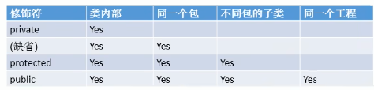
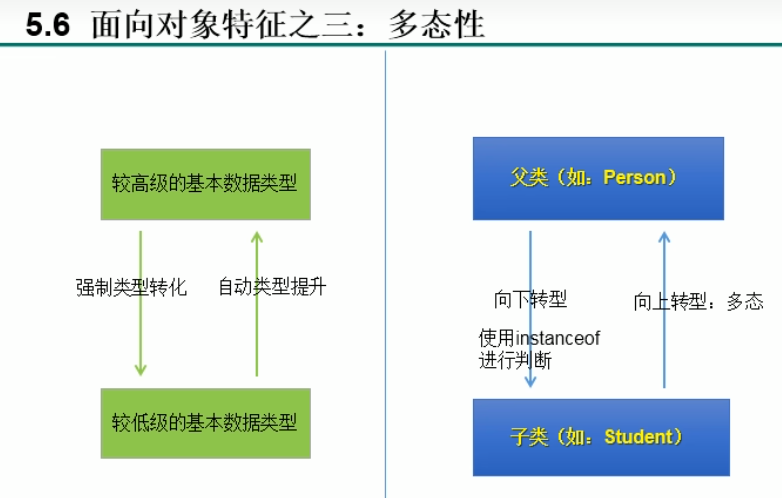
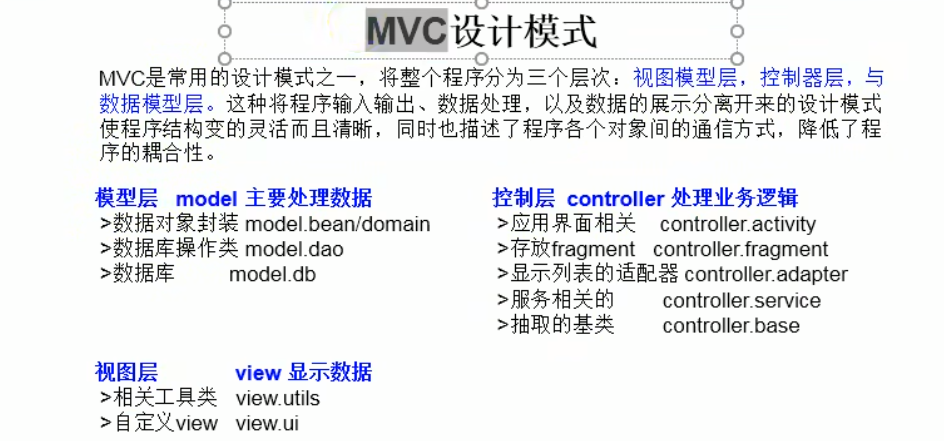
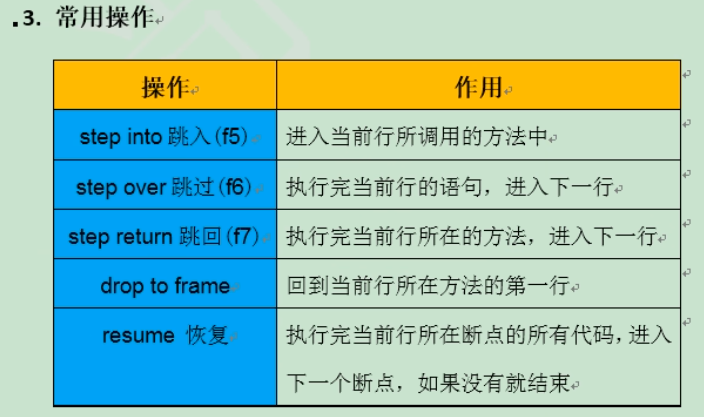

title: Java基础巩固
author: PanYuKang

cover: 'https://ss1.bdstatic.com/70cFvXSh_Q1YnxGkpoWK1HF6hhy/it/u=1499015010,895265431&fm=26&gp=0.jpg'

tags: [Java基础]

categories: [后端技术]
date: 2020-04-01 18:31:00

---

虽然说框架满天飞，但打好地基很重要，整理一下基础知识，以备不时之需，毕竟好记性不如烂笔头，常回来看看老朋友。。。

---

## **String常用原生方法**

| 方法                                             | 说明                           |
| ------------------------------------------------ | ------------------------------ |
| `length()`                                     | 获取字符串长度                 |
| `charAt(int index)`                            | 返回指定位置的字符             |
| `substring(int beginIndex)`                    | 从索引位置截取到末尾           |
| `substring(int beginIndex, int endIndex)`      | 截取指定范围子串               |
| `indexOf(String str)`                          | 查找子串首次出现位置           |
| `lastIndexOf(String str)`                      | 查找子串最后出现位置           |
| `contains(CharSequence s)`                     | 是否包含子串                   |
| `startsWith(String prefix)`                    | 是否以某字符串开头             |
| `endsWith(String suffix)`                      | 是否以某字符串结尾             |
| `equals(Object obj)`                           | 判断内容是否相等               |
| `equalsIgnoreCase(String anotherString)`       | 忽略大小写比较                 |
| `isEmpty()`                                    | 是否为空字符串 (`length==0`) |
| `trim()`                                       | 去除首尾空白                   |
| `replace(char oldChar, char newChar)`          | 替换字符                       |
| `replaceAll(String regex, String replacement)` | 正则替换                       |
| `toUpperCase()`                                | 转为大写                       |
| `toLowerCase()`                                | 转为小写                       |
| `split(String regex)`                          | 分割字符串                     |
| `getBytes()`                                   | 转为字节数组                   |
| `toCharArray()`                                | 转为字符数组                   |
| `format(String format, Object... args)`        | 字符串格式化                   |
| `compareTo(String anotherString)`              | 字符串字典序比较               |
| `matches(String regex)`                        | 是否匹配正则表达式             |

---

## **List 接口常用方法**

| 方法                                    | 说明                     |
| --------------------------------------- | ------------------------ |
| `add(E e)`                            | 添加元素                 |
| `add(int index, E element)`           | 指定位置插入元素         |
| `addAll(Collection<? extends E> c)`   | 添加所有元素             |
| `remove(Object o)`                    | 删除指定元素             |
| `remove(int index)`                   | 删除指定索引元素         |
| `clear()`                             | 清空列表                 |
| `size()`                              | 返回元素数量             |
| `isEmpty()`                           | 是否为空                 |
| `get(int index)`                      | 获取指定索引的元素       |
| `set(int index, E element)`           | 替换指定位置元素         |
| `contains(Object o)`                  | 是否包含元素             |
| `indexOf(Object o)`                   | 返回首次出现位置         |
| `lastIndexOf(Object o)`               | 返回最后出现位置         |
| `iterator()`                          | 返回迭代器               |
| `toArray()`                           | 转为数组                 |
| `subList(int fromIndex, int toIndex)` | 截取子列表               |
| `forEach(Consumer<? super T> action)` | 遍历（Java8 Lambda）     |
| `stream()`                            | 获取 Stream 流           |
| `sort(Comparator<? super E> c)`       | 排序                     |
| `retainAll(Collection<?> c)`          | 仅保留在指定集合中的元素 |
| `removeAll(Collection<?> c)`          | 移除与指定集合相同的元素 |

---

## **Map 接口常用方法**

| 方法                                                 | 说明                               |
| ---------------------------------------------------- | ---------------------------------- |
| `put(K key, V value)`                              | 添加键值对                         |
| `putAll(Map<? extends K, ? extends V> m)`          | 添加所有键值对                     |
| `get(Object key)`                                  | 根据 key 获取值                    |
| `remove(Object key)`                               | 删除指定 key 的键值对              |
| `clear()`                                          | 清空 Map                           |
| `containsKey(Object key)`                          | 是否包含某 key                     |
| `containsValue(Object value)`                      | 是否包含某 value                   |
| `size()`                                           | 键值对数量                         |
| `isEmpty()`                                        | 是否为空                           |
| `keySet()`                                         | 返回所有 key 的集合                |
| `values()`                                         | 返回所有 value 的集合              |
| `entrySet()`                                       | 返回所有键值对的集合               |
| `forEach(BiConsumer<? super K, ? super V> action)` | 遍历 (Java8 Lambda)                |
| `replace(K key, V value)`                          | 替换指定 key 的 value              |
| `compute(K key, BiFunction)`                       | 根据 key 计算新值                  |
| `merge(K key, V value, BiFunction)`                | 合并                               |
| `getOrDefault(Object key, V defaultValue)`         | 获取 value, key 不存在则返回默认值 |
| `putIfAbsent(K key, V value)`                      | 如果 key 不存在，才放入            |

### put和putAll方法

#### **put 方法**

* **作用** ： **向 Map 中添加一个 key-value 对** ，或更新已存在 key 的 value。
* **语法** ：

```java
V put(K key, V value)
```

* **场景** ：
* 想往 Map 里 **单独添加或更新某个键值** 。
* 不管 value 是 String、Map、List、Object，都可以作为 value 直接存。

#### 示例

```java
Map<String, Object> map = new HashMap<>();
Map<String, String> innerMap = new HashMap<>();
innerMap.put("innerKey", "innerValue");

List<String> innerList = new ArrayList<>();
innerList.add("item1");

map.put("myMap", innerMap);    // 存一个 Map 对象
map.put("myList", innerList);  // 存一个 List 对象
```

> ✅  **总结** ：`put` 是 **单独设置某个 key 的 value** ，无论 value 类型。

---

### **putAll 方法**

* **作用** ： **批量向 Map 添加所有键值对** ，来自另一个 Map。
* **语法** ：

```java
void putAll(Map<? extends K, ? extends V> m)
```

* **场景** ：
* 想把 **一个 Map 的所有 key-value 复制到另一个 Map 中** 。
* 如果两个 Map 有相同的 key，后者的值会覆盖前者。

#### 示例

```java
Map<String, String> map1 = new HashMap<>();
map1.put("key1", "value1");
map1.put("key2", "value2");

Map<String, String> map2 = new HashMap<>();
map2.put("key3", "value3");
map2.put("key4", "value4");

map1.putAll(map2);  // map1 现在包含了 key1~key4
```

> ✅  **注意** ：`putAll` 的参数必须是  **Map** ，而不能是 List 或其它对象。

---

#### **总结对比**

|                    | put                     | putAll                       |
| ------------------ | ----------------------- | ---------------------------- |
| **用途**     | 添加/更新单个 key-value | 批量拷贝 Map 的所有键值对    |
| **参数**     | 任意对象作为 value      | 只能是 Map 类型              |
| **替代性**   | 不可代替批量复制        | 不可用于添加 List 或单个对象 |
| **操作对象** | Map 的单一键            | Map 的所有键                 |

---

#### **如果 Map 里要放 Map 或 List？**

* 需要存一个 Map 进去：

```java
map.put("nestedMap", innerMap);
```

* 需要存一个 List 进去：

```java
map.put("listData", innerList);
```

**❌ 不可以：**

```java
map.putAll(innerMap); // ❌ innerMap 的键会被平铺在 map 上，不是作为 value
map.putAll(innerList); // ❌ 编译报错，因为 putAll 只接受 Map
```

---

#### **一句话总结**

> **put 是赋值（key -> value），putAll 是平铺合并 Map。**
>
> 如果你是要"一个 key 映射一个整体"（比如 List、Map、对象），就用 `put`。
>
> 如果你是要"批量扩展 Map 的键值"，就用 `putAll`。

## Java的数据类型

1. 基本类型：long,int,byte,float,double,char
2. 对象类型（类）： Long,Integer,Byte,Float,Double,String,其它一切java提供的，或者你自己创建的类。引用类型比较大小一定要用equals而不要用==。

### 基本数据类型的封装类

| 数据类型               | 封装类/包装类 |
| ---------------------- | ------------- |
| boolean（布尔型）      | Boolean       |
| byte（字节型）         | Byte          |
| char（字符型）         | Character     |
| short（短整型）        | Short         |
| int（整型）            | Integer       |
| long（长整型）         | Long          |
| float（浮点型）        | Float         |
| double（双精度浮点型） | Double        |

### **什么叫包装类**

在java中有时候的运算必须是两个类对象之间进行的，不充许对象与数字之间进行运算。所以需要有一个对象，这个对象把数字进行了一下包装，这样这个对象就可以和另一个对象进行运算了。byte: 八位整数 -128——127，可用来节省内存的使用。

short: 16位整数 -32768——32,767，也比较省内存。
int: 32位整数 -2,147,483,648——2,147,483,647，一般来说整数都够用了
long: 64位整数 -9,223,372,036,854,775,808—— 9,223,372,036,854,775,807，一般不需要用
float: 32位浮点，如果浮点需要节省内存用这个。
Double: 64位浮点，一般非整数浮点可用这个。

但是要记住float和double都不是精确的，如果要储存钱一类的必须精确的，用java.math.BigDecimal

为什么要有包装类（或封装类）？

为了使基本数据类型的变量具有类的特征，引入包装类。

### 参数类型和返回值类型

一个方法的返回值类型要是抽象类类型，那么就返回该抽象类的子类对象。
一个方法的返回值类型要是接口类型，那么就返回该接口类的子类对象。

### 变量的定义

局部变量：从属于方法或语句块，生命周期短，使用前必须先初始化赋值。
成员变量：从属于对象，生命周期较长，未赋值会自动被初始化。
静态变量：从属于类，生命周期最长。
在类中，使用static修饰的成员变量被称为静态成员变量（类变量）。
static修饰的变量和方法从属于类，普通变量和方法从属于对象的。

Java中主要用final来定义一个常量。Final String AGE=18相当于age=18,常量都是大写，所以是AGE;
定义方法时传递的参数是形式参数，调用该方法时传递的参数是实际参数，实参的数据类型必须与形参一一对应。

### 用static修饰方法的好坏

在定义方法时不加static，在调用方法时就需要new该方法才能调用，如果在定义时加上static，就可以直接调用该方法而不需要new了。
好处：
1.当一个方法需要初始化加载或者经常被调用的时候可以加上 static
2.被 static 修饰的方法可以用类名直接调用，不用实例化一个对象后才调用
3.比如 person这个类里有一个方法 public static add () {} 那么可以使用 person.add();调用，当然也可以创建对象调用
比如 person p= new person();
p.add();调用
类加载器在加载这个类的时候就已经实例化了这个类

坏处：初始化加载比较占内存，所以不经常用的方法不建议加 static 这个关键字

### **public static void main(String[] args)**

这是 Java 程序的入口地址，Java 虚拟机运行程序的时候首先找的就是 main 方法。跟 C 语言里面的 main() 函数的作用是一样的。只有有 main() 方法的 Java 程序才能够被 Java 虚拟机运行，可理解为规定的格式。

对于里面的参数及修饰符：

* **public** ：表示的这个程序的访问权限，表示的是任何的场合可以被引用，这样 Java 虚拟机就可以找到 main() 方法,从而来运行 **javac** 程序。
* **static** ： 表明方法是静态的，不依赖类的对象的，是属于类的，在类加载的时候 main() 方法也随着加载到内存中去。由于在入口时，未调用任何对象，该方法只能设置为static静态。
* **void:** main()方法是不需要返回值的。JVM为Java的最底层，所以即使有返回结果，结果也无处可去，因此该方法必然是void无返回值。
* **main** ：约定俗成，规定的。
* **String[] args** ：从控制台接收参数。

### 标识符

1、标识符的使用：凡是自己可以起名字的地方都叫标识符。比如：类名、变量名、方法名、接口名、包名等等。。。

2、标识符的命名规则：

* 由26个英文字母大小写，0-9，_或$组成
* 数字不可以开头
* 不可以使用关键字和保留字，但能包含关键字和保留字
* Java中严格区分大小写，长度无限制
* 标识符不能包含空格

### Java中的名称命名规范

包名：多个单词组成时所有字母都小写：xxxyyyzzz

类名、接口名：多个单词组成时，所有单词的首字母大写：XxxYyyZzz

变量名、方法名：多个单词组成时，第一个单词首字母小写，第二个单词开始每个单词首字母大写：xxxYyyZzz

常量名：所有字母都大写，多个单词组成时每个单词用下划线连接：XXX_YYY_ZZZ

### 基本数据类型

#### 自动类型提升

    结论：当容量小的数据类型的变量与容量大的数据类型的变量做运算时，结果自动提升为容量大的数据类型(不包含boolean类型)

byte、char、short-->int-->long-->float-->double

特别的：当byte、char、short三种类型的变量做运算时，结果为int型。

#### 强制类型转换

自动类型提升运算的逆运算。

1、需要使用强转符：()

2、注意点：强制类型转换，可能导致精度降低或溢出。

#### String字符串

1. String属于引用数据类型，翻译为：字符串
2. 声明String类型变量时，使用一对""

3.String可以和8种基本数据类型变量做运算，且运算符只能是连接运算：+

4.运算的结果仍然是String类型

### 逻辑运算符

逻辑运算符操作的都是boolean类型的变量

#### 区分&和&&

相同点1：运算结果都相同

相同点2：当符号左边是true时，二者都会执行符号右边的运算

不同点：当符号左边是false时，&继续执行符号右边的运算，&&则不再执行符号右边的运算。

### 位运算符

1.位运算符操作的都是整型的数据

2.<\<：在一定范围内，每向左移1位，相当于 * 2;

\>\>:在一定范围内，每向右移1位，相当于 / 2;

### 程序流程控制

* 顺序结构、分支结构、循环结构

#### 分支结构

##### Switch-case

* Switch结构中的表达式，只能是如下6种数据类型之一：byte、short、char、int、枚举类型（JDK5.0新增）、Sting类型（JDK7.0新增）
* case之后只能声明常量，不能声明范围
* break关键字是可选的
* default：相当于if-else结构中的else,default结构是可选的，而且位置也是灵活的。

##### switch-case和if-else怎么选

总结：

* 凡是可以使用Switch-case的结构，都可以转换为if-else;反之，不成立；
* 我们写分支结构时，当发现既可以使用Switch-case（同时，Switch中表达式的取值情况不太多），又可以使用if-else时，我们优先选择使用switch-case。原因：switch-case执行效率稍高。

#### 循环结构

定义：在某些条件满足的情况下，反复执行特定代码的功能。

循环语句分类：

* for循环
* while循环
* do-while循环

##### 循环语句的四个组成部分

* 初始化部分
* 循环条件部分
* 循环体部分
* 迭代部分

#### 衡量一个功能代码的优劣

* 正确性
* 可读性
* 健壮性
* 高效率与低存储：时间复杂度和空间复杂度（衡量算法的好坏）

### 数组

定义：数组是一种数据结构，它由一组相同类型的元素组成，这些元素在内存中连续存储，并可以通过索引（下标）访问和修改。

#### 数组中常见的算法

##### 排序算法

**衡量排序算法的优劣：**

* 时间复杂度：分析关键字的比较次数和记录的移动次数
* 空间复杂度：分析排序算法中需要多少辅助内存
* 稳定性：若两个记录A和B的关键字值相等，但排序后A、B的先后次序保持不变，则称这种排序算法是稳定的。

**排序算法的分类：**

内部排序和外部排序。

* 内部排序：整个排序过程中不需要借助于外部存储器（如磁盘等），所有排序操作都在内存中完成。
* 外部排序：参与排序的数据非常多，数据量非常大，计算机无法把整个排序过程放在内存中完成，必须借助于外部存储器（如磁盘）。外部排序最常见的是多路 归并排序，可以认为外部排序是由多次内部排序组成。

**十大内部排序算法：**

* 选择排序
  * 直接选择排序、堆排序
* 交换排序
  * 冒泡排序、快速排序
* 插入排序
  * 直接插入排序、折半插入排序、Shell排序
* 归并排序
* 桶式排序
* 基数排序

## JVM的内存结构

在JVM中，有几个重要的概念和组件，包括栈、堆、常量池、方法区和静态域。

### 栈（Stack）

栈是一种基于后进先出（LIFO）的数据结构，用于存储方法调用的相关信息，如方法的参数、局部变量、返回地址等。在 Java 中，每个线程都有自己的栈，用于存储该线程的方法调用信息。当一个方法被调用时，会在栈上分配一块新的内存空间，用于存储该方法的参数和局部变量。当方法执行完毕时，这个内存空间会被释放。

举例来说，以下是一个简单的 Java 方法：

```java
public void method(int a, int b) {
    int sum = a + b;
    System.out.println(sum);
}
```

当这个方法被调用时，在该方法的栈上会分配一些内存空间，用于存储参数 a 和 b，以及局部变量 sum。当方法执行完毕时，这些内存空间会被释放。

### 堆（Heap）

堆是一种用于动态分配对象的内存区域。在 Java 中，所有的对象都在堆上分配内存。堆是一块共享的内存区域，所有线程都可以访问。当创建一个对象时，会在堆上分配一块新的内存空间，用于存储对象的数据。

举例来说，以下是一个简单的 Java 类：

```java
public class Person {
    private String name;
    private int age;
  
    public Person(String name, int age) {
        this.name = name;
        this.age = age;
    }
  
    public String getName() {
        return name;
    }
  
    public int getAge() {
        return age;
    }
}
```

当创建一个 Person 对象时，会在堆上分配一块新的内存空间，用于存储对象的数据。在这个例子中，Person 对象会包含一个 String 类型的 name 属性和一个 int类型的 age 属性。

```java
Person p = new Person("John", 30);
```

在这个例子中，p 是一个 Person 类型的对象，它被创建在堆上，并分配了一块内存空间来存储对象的数据。

### 常量池（Constant Pool）

常量池是一种特殊的内存区域，用于存储常量和符号引用。在 Java 中，常量池主要用于存储字符串常量、数字常量和类、方法、字段等符号引用信息。

举例来说，以下是一个包含字符串常量和符号引用的 Java 类：

```java
public class Constants {
    public static final String MESSAGE = "Hello, world!";
    public static final int SIZE = 100;
  
    public static void main(String[] args) {
        System.out.println(MESSAGE);
    }
}
```

在这个例子中，字符串常量 "Hello, world!" 和整数常量 100 会被存储在常量池中。同时，静态常量 MESSAGE 和 SIZE 也会被存储在常量池中，它们的值是对常量池中字符串和数字常量的引用。当 main 方法被调用时，会从常量池中获取 MESSAGE 的值，并输出到控制台。

### 方法区（Method Area）

方法区是一种用于存储类信息、常量池、静态变量等数据的内存区域。在 Java 中，每个类都有自己的方法区，用于存储类的信息和静态成员变量。方法区是堆的一部分，但是它有自己的内存管理机制。

举例来说，以下是一个包含静态变量的 Java 类：

```java
public class Counter {
    private static int count = 0;
  
    public static void increment() {
        count++;
    }
  
    public static int getCount() {
        return count;
    }
}
```

在这个例子中，静态变量 count 会被存储在方法区中，它的值在整个应用程序的生命周期内都是可见和共享的。当 increment 方法被调用时，会从方法区中获取 count 的值，并将其加 1。当 getCount 方法被调用时，也会从方法区中获取 count 的值并返回。

### 静态域（Static Field）

静态域是一种类级别的变量，它属于类而不属于对象。在 Java 中，静态域可以被所有对象共享，也可以被类的所有方法访问。静态域通常用于存储类级别的信息和常量。

举例来说，以下是一个包含静态域的 Java 类：

```java
public class MathUtils {
    public static final double PI = 3.141592653589793;
  
    public static double square(double x) {
        return x * x;
    }
  
    public static double circleArea(double r) {
        return PI * square(r);
    }
}
```

在这个例子中，静态域 PI 存储了圆周率的值，它可以被 MathUtils 类的所有方法访问。当 circleArea 方法被调用时，会从静态域 PI 中获取圆周率的值，并进行计算。

需要注意的是，栈、堆、常量池、方法区和静态域是 Java 运行时的重要组成部分，它们的实现和使用方式可能与不同的 Java 实现和版本有所不同。

### 小结

虚拟机栈，即为平时提到的栈机构。方法的参数和局部变量都存储在栈结构中。

堆：将new出来的结构（比如：数组、对象）加载到堆空间中。补充：对象的属性（非static的）加载在堆空间中。

方法区：类的加载信息、常量池、静态域

## 面向对象

### 思想概述

面向对象：把属性（成员变量）和方法放入一个类里面，类里面抽象出来共同点就是面向对象。

**面向对象的两个要素：**

类：对一类事物的描述，是抽象的、概念上的定义。

对象：是实际存在的该类事物的每个个体，因而也称为实例（instance）

* 面向对象程序设计的重点是类的设计
* 设计类，就是设计类的成员

### 类中属性的使用

 **属性（成员变量）VS局部变量**
 1.相同点
  1.1 定义变量的格式：数据类型 变量名 =变量值
  1.2 先声明，后使用
  1.3 变量都有其对应的作用域

 2.不同点：
  2.1在类中毒声明的位置不同
  属性：直接定义在类的一对{}内
  局部变量：声明在方法内、方法形参、代码块内、构造器形参、构造器内部的变量

  2.2 关于权限修饰符的不同
  属性：可以在声明属性时，指明其权限，使用权限修饰符。
      常用的权限修饰符：private、public、缺省、protected --->封装性
      目前，大家声明属性时，都使用缺省即可。

  局部变量：不可以使用权限修饰符

  2.3 默认初始值的情况
  属性：类的属性，根据其类型，都有默认初始化值

  局部变量：没有默认初始化值。
          意味着，我们调用局部变量之前，一定要显式赋值。
          特别的，形参在调用时，我们赋值即可。

  2.4 在内存中加载的位置
  属性：加载到堆空间中（非static）
  局部变量：加载到栈空间

### 小结

1.面向对象思想编程内容的三条主线分别是什么：

①类及类的成员：属性、方法、构造器、代码块、内部类

②面向对象的三大特征：封装、继承、多态

③其它关键字：this、super、abstract、interface、static、final、package、import

2.谈谈你对面向对象中类和对象的理解，并指出二者的关系？

类：抽象的、概念上的内容

对象：实实在在的一个个体。对象是由类派生出来的。

3.面向对象思想的体现一：类和对象的创建和执行操作由哪三步？

① 创建类

② 类的实例化

③ 调用对象的结构："对象.属性" "对象.方法"

### 匿名对象的使用

* 理解：我们创建的对象，没有显式的赋给一个变量名，即为匿名对象
* 特征：匿名对象只能调用一次

### 面向对象与面向过程（理解）

1.面向过程：强调的是功能行为，以函数为最小单位，考虑怎么做。

2.面向对象：强调具备了功能的对象，以类/对象为最小单位，考虑谁来做。

递归方法：自己调用自己，但要写递归头和递归体，否则陷入死循环，直到占满内容溢出为止。递归是很耗费时间和内存资源的，尽量不要使用，百度的爬虫就是递归，在一个页面不断点击进入下一个页面那种，一般使用迭代循环方法就能满足普通开发。

## 方法重写(Override)与重载(Overload)

方法重载：参数的个数、类型和顺序不同，都可以构成重载。方法中参数只有返回值不同、参数只有名称不同，都不构成重载。（跟方法的权限修饰符、返回值类型、形参变量名、方法体都没有关系！）

```
* 方法的重载（overload） loading……
* 1.定义：在同一个类中，允许存在一个以上的同名方法，只要它们的参数个数或参数类型不同即可。
*
*  "两同一不同“：同一个类、相同方法名
*          参数列表不同：参数个数不同、参数类型不同
*
* 2.举例：
*      Arrays类中重载的sort()/binarySearch()
*
* 3.判断是否是重载：
*      跟方法的权限修饰符、返回值类型、形参变量名、方法体都没有关系！
*
* 4.在通过对象调用方法时，如何确定某一个指定的方法：
*      方法名--->参数列表
```

方法重写：在子类中可以根据需要对从父类中继承来的方法进行改造，也称为方法的重置、覆盖、在程序执行时，子类的方法将覆盖父类的方法。

```
* 方法的重写（override/overwrite）
*
* 1.重写：子类继承父类以后，可以对父类中同名同参的方法，进行覆盖操作
* 2.应用：重写以后，当创建子类对象以后，通过子类对象调用子父类中的同名同参的方法时，实际执行的是子类重写父类的方法。
* 3.重写的规定：
*      方法声明：权限修饰符 返回值类型 方法名（形参列表）throws 异常的类型{
*          //方法体
*      }
*      约定俗称：子类中的叫重写的方法，父类中的叫被重写的方法
*    ① 子类重写的方法的方法名和形参列表与父类被重写的方法的方法名和形参列表相同
*    ② 子类重写的方法的权限修饰符不小于父类被重写的方法的权限修饰符
*          >特殊情况，子类不能重写父类中声明为private权限的方法
*    ③ 返回值类型：
*          >父类被重写的方法的返回值类型是void，则子类重写的方法的返回值类型只能是void
*          >父类被重写的方法的返回值类型是A类型，则子类重写的方法的返回值类型可以是A类或A类的子类
*          >父类被重写的方法的返回值类型是基本数据类型（比如：double），则子类重写的方法的返回值类型必须是相同的基本数据类型（必须也是double）
*    ④ 子类重写的方法抛出的异常类型不大于父类被重写的方法抛出的异常类型
*******************************************************************
*      子类和父类中同名同参数的方法要么都声明为非static的（考虑重写），要么都声明为static的（此时不是重写）。
```

## Java的值传递机制

### 关于变量的赋值

* 如果变量是基本数据类型，此时赋值的是变量所保存的数据值。
* 如果变量是引用数据类型，此时赋值的是变量所保存的数据的地址值。

### 针对于方法的参数概念

形参：方法定义时，声明的小括号内的参数

实参：方法调用时，实际传递给形参的数据

### Java中参数传递机制

**值传递规则**

* 如果参数是基本数据类型，此时实参赋给形参的是实参真实存储的数据值。
* 如果参数是引用数据类型，此时实参赋给形参的是实参存储数据的地址值。

## 封装和隐藏

我们程序设计追求“高内聚，低耦合”。

* 高内聚：类的内部数据操作细节自己完成，不允许外部干涉。
* 低耦合：仅对外暴露少量的方法用于使用。

### 封装性的体现方式

* 将类的属性私有化（private），同时，提供公共的（public）方法来获取（getXXX）和设置（setXXX）此属性的值.
* 不对外暴露的私有方法
* 单例模式（将构造器私有化）
* 如果不希望类在包外被调用，可以将类设置为缺省的。

Java规定的四种权限修饰符：

从小到大顺序为：private<缺省<protected<public

具体修饰范围：



## 继承性

> ```
> * 一、继承性的好处：
> * ① 减少了代码的冗余，提高了代码的复用性
> * ② 便于功能的拓展
> * ③ 为之后多态性的使用，提供了前提
> *
> * 二、继承性的格式：class A extends B{}
> *  A:子类、派生类、subclass
> *  B:父类、超类、基类、superclass
> *
> *  2.1 体现：一旦子类A继承父类B以后，子类A中就获取了父类B中声明的所有的属性和方法
> *  特别的，父类中声明为private的属性或方法，子类继承父类以后，仍然认为获取了父类中私有的结构。
> *  只是因为封装性的影响，使得子类不能直接调用父类的结构而已。
> *
> *  2.2 子类继承父类以后，还可以声明自己特有的属性或方法：实现功能的拓展。
> *  子类和父类的关系，不同于子集和集合的关系。
> *  extends:延展、扩展
> *
> * 三、Java中关于继承性的规定：
> *      1.一个类可以被多个子类继承。
> *      2.Java中类的单继承性：一个类只能有一个父类
> *      3.子父类是相对的概念
> *      4.子类直接继承的父类，称为：直接父类。间接继承的父类，称为：间接父类
> *      5.子类继承父类以后，就获取了直接父类以及所有间接父类中声明的属性和方法。
> *
> * 四、1.如果我们没有显式的声明一个类的父类的话，则此类继承于java.lang.Object类
> *    2.所有的java类（除java.lang.Object类之外）都直接或间接继承于java.lang.Object类。
> *    3.意味着，所有的java类具有java.lang.Object类声明的功能。
> ```

## 多态性

1.理解多态性：可以理解为一个事物的多种形态。
2.何为多态性：
 对象的多态性：父类的引用指向子类对象（或子类的对象赋给父类的引用）
3.多态的使用：虚拟方法调用
 有了对象的多态性以后，我们在编译期，只能调用父类中声明的方法，但在运行期，我们实际执行的是子类重写父类的方法。
 总结：编译，看左边，运行，看右边。
4.多态性的使用前提：① 类的继承关系 ② 方法的重写
5.对象的多态性，只适用于方法，不适用于属性（编译和运行都看左边）

### 虚拟方法调用（多态情况下）

子类中定义了与父类同名同参数的方法，在多态情况下，将此时父类的方法称为虚拟方法。父类根据赋给它的不同子类对象，动态调用属于子类的该方法。这样的方法调用在编译期是无法确定的。

### 从编译和运行角度

对于重载而言：在方法调用之前，编译器就已经确定了所要调用的方法，这称为“早绑定”或“静态绑定”

而对于多态，只有等到方法调用的那一刻，解释运行器才会确定所要调用的具体方法，这称为“晚绑定”或“动态绑定”。

### Instanceof关键字的使用



## 构造器

1.通过new关键字调用。
2.构造器有返回值，但不能定义返回值类型，即可以return，但不能返回值。
3.如果我们没有定义一个构造器，编译器会自动定义一个无参的构造函数。
4.构造方法名字必须要与类名相同。

### 构造器的作用

* 创建对象
* 初始化对象的信息

### 说明

* 如果没有显式的定义类的构造器的话，则系统默认提供一个空参的构造器
* 定义构造器的格式：权限修饰符 类名(形参列表){\}
* 一个类中定义的多个构造器，彼此构成重载
* 一旦我们显式的定义了类的构造器之后，系统就不再提供默认的空参构造器
* 一个类中，至少会有一个构造器

## this和super关键字

调用构造器注意点：

this(形参列表):本类重载的其它的构造器

super(形参列表):调用父类中指定的构造器

> ```
> * super关键字的使用
> * 1.super理解为：父类的
> * 2.super可以用来调用：属性、方法、构造器
> *
> * 3.super的使用
> *      3.1 我们可以在子类的方法或构造器中。通过使用“super.属性”或“super.方法”的方式，显式的调用
> *      父类中声明的属性和方法。但是，通常情况下，我们习惯省略"super."
> *      3.2 特殊情况，当子类和父类中定义了同名的属性时，我们要想在子类中调用父类中声明的属性，
> *      则必须显式的使用“super.属性”的方式，表明调用的是父类中声明的属性。
> *      3.3 当子类重写了父类中的方法以后，我们想在子类的方法中调用父类中被重写的方法时，则必须显式的
> *      使用“super.方法”的方式，表明调用的是父类中被重写的方法。
> *
> * 4.super调用构造器
> *      4.1 我们可以在子类的构造器中显式的使用“super(形参列表)”的方式，调用父类中声明的指定的构造器
> *      4.2 “super(形参列表)”的使用，必须声明在子类构造器的首行!
> *      4.3 我们在类的构造器中，针对于“this(形参列表)”或“super(形参列表)”只能二选一，不能同时出现
> *      4.4 在构造器的首行，没有显示的声明“this(形参列表)”或“super(形参列表)”,则默认调用的是父类中
> *      空参的构造器：super()
> *      4.5 在类的多个构造器中，至少有一个类的构造器中使用了“super(形参列表)”，调用父类中的构造器
> ```

## JavaBean的使用

描述：JavaBean是一种Java语言写成的可重用组件。

所谓JavaBean,是值符合如下标准的Java类：

* 类是公共的
* 有一个无参的公共的构造器
* 有属性，且有对应的get、set方法

## MVC设计模式



## DeBug调试



## ==和equals()的区别

> ```
> * 一、回顾==的使用：
> * ==：运算符
> *  1.可以使用在基本数据类型变量和引用数据类型变量中
> *  2.如果比较的是基本数据类型变量：比较两个变量保存的数据是否相等。（不一定类型要相同）
> *    如果比较的是引用数据类型变量：比较两个对象的地址值是否相同，即两个引用是否指向同一个对象实体
> *  补充：==符号使用时，必须保证符号左右两边的变量类型一致。
> *
> * 二、equals()方法的使用：
> *  1.是一个方法，而非运算符
> *  2.只能适用于引用数据类型
> *  3.Object类中equals()的定义：
> *      public boolean equals(Object obj) {
> *              return (this == obj);
> *          }
> *      说明：Object类中定义的equals()和==的作用是相同的：比较两个对象的地址值是否相同，即两个引用是否指向同一个对象实体
> *
> *  4.像String、Date、File、包装类等都重写了Object类中的equals()方法。重写以后，比较的不是
> *    两个引用的地址是否相同，而是比较的两个对象的“实体内容”是否相同。
> *
> *  5.通常情况下，我们自定义的类如果使用equals()的话，也通常是比较两个对象的“实体内容”是否相同。
> *  那么，我们就需要对Object类中的equals()进行重写
> *  重写的原则：比较两个对象的实体内容是否相同。
>
> ```

### 不同类型数据判空做法

#### **字符串 String**

**可能的返回值：**

* `null`
* `""`（空字符串）
* `"null"`（某些系统序列化时意外产生的字符串）
* `"   "`（只包含空格或制表符）

**推荐判断：**

* Java 8：
  ```java
  if (str == null || str.isEmpty()) { ... }
  ```
* Java 11+：
  ```java
  if (str == null || str.isBlank() || "null".equalsIgnoreCase(str)) { ... }
  ```
* 最推荐（工具类）：
  ```java
  if (StringUtils.isBlank(str) || "null".equalsIgnoreCase(str)) { ... }
  ```

---

#### **集合 List / Set**

**可能的返回值：**

* `null`
* `[]`（空集合，没有元素）

**推荐判断：**

* 原生写法：
  ```java
  if (list == null || list.isEmpty()) { ... }
  ```
* 工具类（推荐）：
  ```java
  if (CollectionUtils.isEmpty(list)) { ... }
  ```

---

#### **Map**

**可能的返回值：**

* `null`
* `{}`（空 map，没有键值对）

**推荐判断：**

* 原生写法：
  ```java
  if (map == null || map.isEmpty()) { ... }
  ```
* 工具类：
  ```java
  if (MapUtils.isEmpty(map)) { ... }
  ```

---

#### **数组 Array**

**可能的返回值：**

* `null`
* `new Object[0]`（长度为 0 的数组）

**推荐判断：**

```java
if (arr == null || arr.length == 0) { ... }
```

---

#### **数值类型（Integer / Long / Double ...）**

**可能的返回值：**

* `null`（包装类型可能为 null）
* `0`（业务上代表“没有值”）
* 特殊默认值（比如 -1 代表未初始化）

**推荐判断：**

```java
if (num == null || num == 0) { ... }
```

（根据业务语义定义“空”的含义）

---

#### **布尔 Boolean**

**可能的返回值：**

* `null`
* `true` / `false`

**推荐判断：**

```java
if (bool == null || !bool) { ... }
```

（有时业务上把 `null` 和 `false` 都当成“否”）

---

#### 通用工具类

通常很多公司项目都会写一个通用的工具方法对不同类型数据进行判空处理。

代码示例：

```java
package com.example.utils;

import java.lang.reflect.Array;
import java.util.Collection;
import java.util.Map;

/**
 * 通用数据工具类
 *
 * 提供各种对象的空值判断，统一业务逻辑中的“空”定义。
 */
public class DataUtils {

    /**
     * 判断对象是否为空
     * 支持 String、Collection、Map、Array、Number、Boolean
     *
     * @param obj 待判断的对象
     * @return true 表示为空
     */
    public static boolean isEmpty(Object obj) {
        if (obj == null) {
            return true;
        }

        // String 判断
        if (obj instanceof String) {
            String str = (String) obj;
            return str.isBlank() || "null".equalsIgnoreCase(str);
        }

        // Collection 判断
        if (obj instanceof Collection) {
            return ((Collection<?>) obj).isEmpty();
        }

        // Map 判断
        if (obj instanceof Map) {
            return ((Map<?, ?>) obj).isEmpty();
        }

        // 数组判断
        if (obj.getClass().isArray()) {
            return Array.getLength(obj) == 0;
        }

        // Number 判断（这里以 0 作为空值，可按业务需求调整）
        if (obj instanceof Number) {
            return ((Number) obj).doubleValue() == 0;
        }

        // Boolean 判断（null 或 false 认为是空）
        if (obj instanceof Boolean) {
            return !((Boolean) obj);
        }

        // 其他类型不认为是空
        return false;
    }

    /**
     * 判断对象是否非空
     *
     * @param obj 待判断的对象
     * @return true 表示非空
     */
    public static boolean isNotEmpty(Object obj) {
        return !isEmpty(obj);
    }
}

```

使用示例：

```java
import com.example.utils.DataUtils;
import java.util.*;

public class Test {
    public static void main(String[] args) {
        String s1 = null;
        String s2 = "";
        String s3 = "null";
        String s4 = "   ";
        List<String> list = new ArrayList<>();
        Map<String, String> map = new HashMap<>();
        Integer num = 0;
        Boolean flag = false;

        System.out.println(DataUtils.isEmpty(s1)); // true
        System.out.println(DataUtils.isEmpty(s2)); // true
        System.out.println(DataUtils.isEmpty(s3)); // true
        System.out.println(DataUtils.isEmpty(s4)); // true
        System.out.println(DataUtils.isEmpty(list)); // true
        System.out.println(DataUtils.isEmpty(map)); // true
        System.out.println(DataUtils.isEmpty(num)); // true
        System.out.println(DataUtils.isEmpty(flag)); // true
    }
}

```

---

✨ 总结成一句话：

* **String → null / "" / "null" / "   "**
* **Collection → null / []**
* **Map → null / {}**
* **Array → null / []**
* **Number → null / 特殊值（如0/-1）**
* **Boolean → null / false**

👉 推荐统一封装工具类，避免到处写重复的 `null` 和 `isEmpty()` 判断。

---

要不要我帮你写一个  **完整的 `DataUtils` 工具类** ，支持 `String`、`Collection`、`Map`、`Array`、`Number`、`Boolean` 一键判断空？

## 设计模式

概念：设计模式是在大量的实践中总结和理论化之后优选的代码结构、编程风格、以及解决问题的思考方式。

### 单例设计模式

要解决的问题：所谓类的单例设计模式，就是采取一定的方法保证在整个的软件系统中，对某个类只能存在一个对象实例。

饿汉式：

* 坏处：对象加载时间过长，会造成资源的浪费。
* 好处：是线程安全的。

代码示例：

```java
//饿汉式
class Bank{

    //1.私有化类的构造器
private Bank(){

    }

    //2.内部创建类的对象
//4.要求此对象也必须声明为静态的
private static Bank instance =new Bank();

//3.提供公共的静态的方法，返回类的对象
public static Bank getInstance(){
        return instance;
}

}
```

懒汉式：

* 坏处：非线程安全，实现相对复杂，需要考虑线程安全性和性能等问题，需要额外的代码来处理。
* 好处：延迟加载对象，避免资源的浪费。

代码示例：

```java
//懒汉式
class Order{

    //1.私有化构造器
private Order(){

    }

    //2.声明当前类对象，没有初始化
//4.此对象也必须声明为static的
private static Order instance =null;

//3.声明public、static的返回当前类对象的方法
public static Order getInstance(){
        if (instance==null){
            instance =new Order();
}
        return instance;
}

}
```

单例模式的优点：减少了系统性能的开销。

应用场景：

* 网站的计数器
* 应用程序的日志应用
* 数据库连接池
* 读取配置文件的类
* Application
* Windows的任务管理器、回收站。

## static关键字

```
* 1.static：静态的
* 2.static可以用来修饰：属性、方法、代码块、内部类
*
* 3.使用static修饰属性：静态变量（类变量）
*      3.1 属性，按是否使用static修饰，又分为：静态属性 vs 非静态属性（实例变量）
*      实例变量：我们创建了类的多个对象，每个对象都独立的拥有一套类中的非静态属性。
*              当修改其中一个对象中的非静态属性时，不会导致其他对象中同样的属性值的修改。
*      静态变量：我们创建了类的多个对象，多个对象共享同一个静态变量。当通过某一个对象修改静态变量时，
*              会导致其他对象调用此静态变量时，是修改过了的。
*      3.2 static修饰属性的其他说明：
*          ① 静态变量随着类的加载而加载。可以通过“类.静态变量"的方式进行调用
*          ② 静态变量的加载要早于对象的创建。
*          ③ 由于类只会加载一次，则静态变量在内存中也只会存在一份。存在方法区的静态域中。
*
*          ④       类变量  实例变量
*              类   yes    no
*              对象  yes   yes
*
*      3.3 静态属性举例：System.out、Match.PI；
*
* 4.使用static修饰方法：静态方法
*      ① 随着类的加载而加载，可以通过"类.方法"进行调用
*      ②     静态方法  非静态方法
*          类   yes    no
*          对象 yes   yes
*      ③ 静态方法中，只能调用静态的方法或属性
*         非静态方法中，既可以调用非静态的方法或属性，也可以调用静态的方法或属性
*
* 5.static注意点：
*      5.1 在静态的方法内，不能使用this关键字、super关键字
*      5.2 关于静态属性和静态方法的使用，大家都从生命周期的角度去理解。
*
* 6.开发中如何确定一个属性是否要声明为static的？
*    > 属性是可以被多个对象所共享的，不会随着对象的不同而不同的。
*    > 类中的常量也常常声明为static
*
*   开发中如何确定一个方法是否要声明为static的？
*    > 操作静态属性的方法，通常设置为static的
*    > 工具类中的方法，习惯上声明为static的。比如：Math、Arrays、Collections
*  
```

## final关键字

```
* final:最终的
*
* 1.final可以用来修饰的结构：类、方法、变量
*
* 2.final 用来修饰一个类:此类不能被其他类所继承。
*      比如：String类、System类、StringBuffer类
*
* 3.final 用来修饰方法：表明此方法不可以被重写
*      比如：Object类中getClass();
*
* 4.final 用来修饰变量：此时的”变量“就称为是一个常量
*      4.1final修饰属性：可以考虑赋值的位置有：显式初始化、代码块中初始化、构造器中初始化
*      4.2final修饰局部变量：
*              尤其是使用final修饰形参时，表明此时形参是一个常量。当我们调用此方法时，给常量形参赋一个实参。
*              一旦赋值以后，就只能在方法体内使用此形参，但不能重新赋值。
*
* static final用来修饰属性：全局常量
```

## 代码块

```
* 1.代码块的作用：用来初始化类、对象的信息
* 2.代码块如果有修饰的话，只能使用static
* 3.分类：静态代码块 VS 非静态代码块
*
* 4.静态代码块
*      >内部可以有输出语句
*      >随着类的加载而执行，且只执行一次
*      >作用：初始化类的信息
*      >如果一个类中定义了多个静态代码块，则按照声明的先后顺序执行
*      >静态代码块的执行要优先于非静态代码块的执行
*      >静态代码块内只能调用静态的属性、静态的方法，不能调用非静态的结构
*
* 5.非静态代码块
*      >内部可以有输出语句
*      >随着对象的创建而执行，每创建一个对象，就执行一次非静态代码块
*      >作用：可以在创建对象时，对对象的属性等进行初始化
*      >如果一个类中定义了多个非静态代码块，则按照声明的先后顺序执行
*      >非静态代码块内可以调用静态的属性、方法，也可以调用非静态的属性、方法
*
```

实例化子类对象时，涉及到父类、子类中静态代码块、非静态代码块、构造器的加载顺序总结为：由父及子，静态先行。

## abstract抽象类

```
* abstract关键字的使用
*  1.abstract：抽象的
*  2.abstract可以用来修饰的结构：类、方法
*
*  3.abstract修饰类：抽象类
*      >此类不能实例化
*      >抽象类一定有构造器，便于子类实例化时调用（涉及：子类对象实例化的全过程）
*      >开发中，都会提供抽象类的子类，让子类对象实例化，完成相关的操作
*
*  4.abstract修饰方法：抽象方法
*      >抽象方法只有方法的声明，没有方法体
*      >包含抽象方法的类，一定是一个抽象类。反之，抽象类中可以没有抽象方法的。
*      >若子类重写了父类中的所有的抽象方法后，此子类方可实例化
*      >若子类没有重写父类中的所有的抽象方法，则此子类也是一个抽象类，需要使用abstract修饰

* abstract使用上的注意点：
*  1.abstract不能用来修饰：属性、构造器等结构
*
*  2.abstract不能用来修饰私有方法、静态方法、final的方法、final的类
*

```

## interface接口

> ```
> * 1.接口使用interface来定义
> * 2.Java中，接口和类是并列的两个结构
> * 3.如何定义接口：定义接口中的成员
> *      3.1 JDK7及以前：只能定义全局常量和抽象方法
> *          >全局常量：public static final的。但是书写时，可以省略不写
> *          >抽象方法：public abstract的
> *
> *      3.2 JDK8:除了定义全局常量和抽象方法之外，还可以定义静态方法、默认方法（略）
> *
> * 4.接口中不能定义构造器的！意味着接口不可以实例化
> *
> * 5.Java开发中，接口通过让类去实现（implement）的方式来使用。
> *   如果实现类覆盖了接口中的所有抽象方法，则此实现类就可以实例化
> *   如果实现类没有覆盖接口中的所有的抽象方法，则此实现类仍为一个抽象类
> *
> * 6.Java可以实现多个接口--->弥补了Java单继承的局限性
> *      格式：class AA extends BB implements CC,DD,EE
> *
> * 7.接口与接口之间可以继承，而且可以多继承
> *
> * ***************************************
>  * 接口的使用
>  *  1.接口使用上也满足多态性
>  *  2.接口：实际上是定义了一种规范
>  *  3.开发中，体会面向接口编程！
>
> Java8中关于接口的新规范：
> 	//知识点1：接口中定义的静态方法，只能通过接口来调用。
>         //知识点2：通过实现类的对象，可以调用接口中的默认方法
>         //如果实现类重写了接口中的默认方法，调用时，仍然调用的是重写以后的方法
>         //知识点3：如果子类（或实现类）继承的父类和实现的接口中声明同名同参数的方法，
>         //那么子类在没有重写此方法的情况下，默认调用的是父类中的同名同参数的方法。--->类优先原则
>         //知识点4：如果实现类实现了多个接口，而这多个接口中定义了同名同参数的默认方法，
>         //那么在实现类没有重写此方法的情况下，报错。--->接口冲突。
>         //这就需要我们必须在实现类中重写此方法
> 	//知识点5：如何在子类（或实现类）的方法中调用父类、接口中被重写的方法
> ```

## 内部类

> ```
> * 1.Java中允许将一个类A声明在另一个类B中，则类A就是内部类，类B称为外部类。
> * 2.内部类的分类：成员内部类（静态、非静态） VS 局部内部类（方法内、代码块、构造器内）
> * 3.成员内部类：
> *      一方面，作为外部类的成员：
> *          > 调用外部类的结构
> *          > 可以被static修饰
> *          > 可以被4种不同的权限修饰
> *
> *      另一方面，作为一个类：
> *          >类内可以定义属性、方法、构造器等
> *          > 可以被final修饰，表示此类不能被继承。言外之意，不使用final，就可以被继承
> *          > 可以被abstract修饰
> *
> * 4.关注如下的3个问题
> *      4.1如何实例化成员内部类的对象
> *      4.2如何在成员内部类中区分调用外部类的结构
> *      4.3开发中局部内部类的使用：见InnerClassTest1.java
> *
> *注意点：
> *在局部内部类的方法中（比如:show）如果调用局部内部类所声明的方法（比如：method）中的局部变量（比如：num）,要求此局部变量声明为final的。
> * jdk 7及之前的版本：要求此局部变量显式的声明为final的
> * jdk 8及之后的版本：可以省略final的声明
> *
> *总结：
> *成员内部类和局部内部类，在编译以后，都会生成字节码文件。
> *格式：成员内部类：外部类$内部类名.class
> *      局部内部类：外部类$数字 内部类名.class
> *
> ```

## 异常处理

编译时异常：执行javac.exe命名时，可能出现的异常

运行时异常：执行java.exe命名时，出现的异常

### 常见的异常

```
* 一、异常体系结构：
* java.lang.Throwable
*      |-----java.lang.Error:一般不编写针对性的代码进行处理。
*      |-----java.lang.Exception:可以进行异常的处理
*          |-----编译时异常（checked）
*              |-----IOException
*                  |-----FileNotFoundException
*              |-----ClassNotFoundException
*          |-----运行时异常（unchecked/RuntimeException）
*              |-----NullPointerException
*              |-----ArrayIndexOutOfBoundsException
*              |-----ClassCastException
*              |-----NumberFormatException
*              |-----InputMismatchException
*              |-----ArithmeticException
```

### 异常处理的抓抛模型

```
* 过程一：“抛”：程序在正常执行的过程中，一旦出现异常，就会在异常代码处生成一个对应异常类的对象。
*          并将此对象抛出。
*          一旦抛出对象以后，其后的代码就不再执行。
*
*          关于异常对象的产生：① 系统自动生成的异常对象
*                          ② 手动的生成一个异常对象，并抛出（throw）
*
* 过程二：“抓“：可以理解为异常的处理方式：① try-catch-finally  ②throws
*

```

### try-catch-finally的使用

```
* 二、try-catch-finally的使用
*
* try{
*     //可能出现异常的代码
* }catch (异常类型1 变量名1){
*       //异常处理方式1
* }catch (异常类型2 变量名2){
*      //异常处理方式2
* }catch (异常类型3 变量名3){
*      //异常处理方式3
* }
* ...
* finally{
*     //一定会执行的代码
* }
*
* 说明：
* 1.finally是可选的。
* 2.使用try将可能出现异常代码包装起来，在执行过程中，一旦出现异常，就会生成一个对应异常类的对象，
* 根据此对象的类型，去catch中进行匹配
* 3.一旦try中的异常对象匹配到某一个catch时，就进入catch中进行异常的处理，
* 一旦处理完成，就跳出当前的try-catch结构(在没有写finally的情况)。继续执行其后的代码。
* 4.catch中的异常类型如果没有子父类关系，则谁声明在上，声明在下无所谓
*  catch中的异常类型如果满足子父类关系，则要求子类一定声明在父类上面。否则，报错。
* 5.常用的异常对象的处理方式：① String getMessage() ② printStackTrace()
* 6.在try结构中声明的变量，再出了try结构以后，就不能再被调用了
* 7.try-catch-finally结构可以嵌套
*
* 体会1：使用try-catch-finally处理编译时异常，使得程序在编译时就不再报错，但是运行时仍可能报错。
*      相当于我们使用try-catch-finally将一个编译时可能出现的异常，延迟到运行时出现。
* 体会2：开发中，由于运行时异常比较常见，所以我们通常就不针对运行时异常编写try-catch-finally了。
*       针对于编译时异常，我们说一定要考虑异常的处理。
* 再说明：
* finally中声明的是一定会被执行的代码。即使catch中又出现异常了，try中有return语句，catch中有return语句等情况。
* 像数据库连接、输入输出流、网络编程Socket等资源，JVM是不能自动回收的，我们需要自己手动的进行资源的释放。
* 此时的资源释放，就需要声明在finally中。
```

### 如何自定义异常类

* 继承与现有的异常结构：RuntimeException、Exception
* 提供全局常量：serialVersionUID
* 提供重载的构造器

## 会话跟踪技术

    1.会话跟踪定义：从进入网站开始到退出网站结束或者关闭浏览器称为一次会话。
    2.开始标志：浏览器成功访问页面。
    3.结束标志：退出或关闭浏览器。
    4.作用：是指在会话过程中多次请求和响应之间共享数据的技术。

    5.五种实现会话跟踪方法
    5.1URL传参
    5.2通过“表单隐藏域”提交
    5.3cookie实现
    5.4内置对象session实现
    5.5内置对象application实现
    6.cookie定义：是一小段文本组成的，伴随着用户的请求和服务器的响应，在浏览器和服务器之间来回传递，保存在客户端。
        6.1cookie的业务应用：
            6.1.1记录上次访问时间
            6.1.2猜你喜欢
            6.1.3记住用户名
    7.session和cookie的区别：
        7.1都是用来做会话跟踪
        7.2session保存在服务端，cookie保存在客户端
        7.3cookie的值只能是String类型，session的值是Object类型
        7.4session是内置对象，cookie不是
        7.5cookie不安全，session保存在服务端安全性较高
    8.内置对象application：
        8.1application对象的生命周期从web应用程序启动开始一直到web容器关闭为止。
    9.作用域范围
        application>session>request>page
