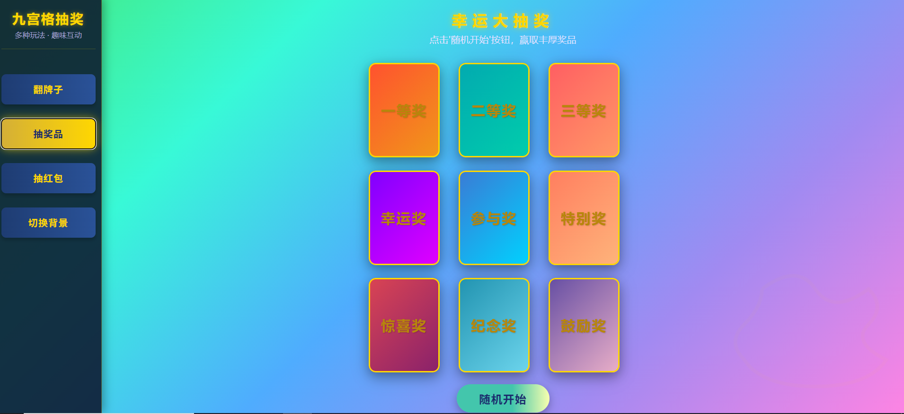

title: 前端代码片段
author: PanYuKang
tags: [代码片段,前端技术,笔记整理]
categories: [前端技术]
date: 2024-04-21 16:21:22

---

整理记录一些平时工作实践的前端代码片段以及本人写的效果小案例，方便提供思路和快速预览，分享给对知识充满渴望的有缘人！

---

## 数据分组

学习封装一个通用分组函数，对公共功能的提取有更多的理解与思考。

代码示例：

```javascript
const people = [
	{name: '小莉', age: 30, sex: '女'},
	{name: '小马', age: 25, sex: '男'},
	{name: '小吴', age: 30, sex: '男'},
	{name: '小刘', age: 25, sex: '女'},
	{name: '小芯', age: 25, sex: '女'},
	{name: '小王', age: 25, sex: '男'},
	{name: '小白', age: 20, sex: '女'},
]
// 按年龄分组
const result = {};
for(const item of people){
	const key = item.age;
	if(!result[key]){
		result[key]=[];
	}
	result[key].push(item);
}
console.log(result);

// 按性别分组
const result = {};
for(const item of people){
	const key = item.sex;
	if(!result[key]){
		result[key]=[];
	}
	result[key].push(item);
}
console.log(result);

// (1)传入属性名，封装成分组函数
function groupBy(arr,propName){
const result = {};
	for(const item of arr){
	const key = item[propName];
	if(!result[key]){
		result[key]=[];
	}
	result[key].push(item);
	}
	return result;
}
console.log(groupBy(people,'age'))
console.log(groupBy(people,'sex'))

// (2)传入函数（得到key的过程），封装公共函数
function groupBy(arr,generateKey){
	const result = {};
	for(const item of arr){
	const key = generateKey(item);
	if(!result[key]){
		result[key]=[];
	}
	result[key].push(item);
	}
	return result;
}
// 按年龄分组
console.log(groupBy(people,(item)=>item.age))
// 按性别分组
console.log(groupBy(people,(item)=>item.sex))
// 按年龄-性别分组
console.log(groupBy(people,(item)=>`${item.age}-${item.sex}`))
// 按奇偶数进行分组
const arr = [34,6,323,2,5,7,1,9,0]
console.log(groupBy(arr,(item)=>(item % 2 ===0?'偶':'奇')))

// (3)参数归一化：既能通过属性，也能通过函数传参调用
function groupBy(arr,generateKey){
	if(typeof generateKey === 'string'){
		const propName = generateKey;
		generateKey = (item) => item[propName];// 统一将属性处理成函数进行执行
	}
	const result = {};
	for(const item of arr){
	const key = generateKey(item);
	if(!result[key]){
		result[key]=[];
	}
	result[key].push(item);
	}
	return result;
}
// 通过属性调用
console.log(groupBy(people,'age'))
console.log(groupBy(people,'sex'))

// 通过函数调用
// 按年龄分组
console.log(groupBy(people,(item)=>item.age))
// 按性别分组
console.log(groupBy(people,(item)=>item.sex))
// 按年龄-性别分组
console.log(groupBy(people,(item)=>`${item.age}-${item.sex}`))
// 按奇偶数进行分组
const arr = [34,6,323,2,5,7,1,9,0]
console.log(groupBy(arr,(item)=>(item % 2 ===0?'偶':'奇')))
```

## 在原型上添加下拉选项选择弹窗

通过在原型上定义一个全局方法使其在每个 Vue 的实例中可用，代码示例如下：

```javascript
/**
 * @desoription 下拉选项选择弹窗
 * @param {string} comboName 选项项目标题
 * @param {string} comboHint 提示语placeholder
 * @param {string} comboOptions 选项
 * @param {string} comboValue 初始值initialKey
 * @param {string} retType 返回类型
 * @returns string
 */
Vue.prototype.pushcomboInputDialog = async function(comboName, comboHint, combo0ptions, comboValue, retType) {
if(retType === 'RETURN_SUFFIX_OTHER') {
   const {outstr} = (await this.$syncOpenTrade (
	'@FM/components/ComboInput/ComboInput.vue',
	comboName,
	'window",
	{ comboName, comboHint, combo0ptions,comboValue, retType },
	{
	 customstyle:{ width:'500px',height:'265px',top:'15%'},
	 bodyStyle:{ padding:'18px 24px'},
	 customclass:'local-auth',
	 isModal: false,
	 isFocus: true,
	 showClose: false,
	}
	)) || { outstr: '' }
	return outstr
} else {
   const {outstr} = (await this.$openPanel (
	'@FM/components/ComboInput/ComboInput.vue',
	comboName,
	'window",
	{ comboName, comboHint, combo0ptions,comboValue, retType },
	{
	 customstyle:{ width:'450px',height:'225px',top:'15%'},
	 bodyStyle:{ padding:'10px 24px'},
	 customclass:'local-auth',
	 isModal: false,
	 isFocus: true,
	 showClose: false,
	}
	)) || { outstr: '' }
	return outstr
  }
}

```

## 在原型上添加全局方法控制域后事件

在平台工程Plugins.js文件中新增一个定制化的全局方法，方便对Vue组件栏位进行控制。代码示例如下：

```javascript
	/**
 	 * @desoription 设置组件控件栏位是否向上触发blur域后事件
	 */
	 Vue.prototype.setBackTrigger = function (refs, vals, allTypeFlag) {
		try{
			// 判断refs类型
			if (!Array.isArray(refs) && typeof refs !== 'string' && typeof refs !== 'object') {
				logger.error('[setBackTrigger]入参refs应为string类型、vue示例或者他们组成的数组')
				return
			}
			// 判断vals类型
			if (!Array.isArray(vals) && typeof refs !== 'boolean' ) {
				logger.error('[setBackTrigger]入参vals应为boolean类型或者boolean类型数组')
				return
			}
			// 判断refs和vals都为数组时，二者长度需要一致
			if (Array.isArray(refs) && Array.isArray(vals)&& refs.length !==vals.length ) {
				logger.error('[setBackTrigger]入参refs和vals为数组类型时，二者长度需要一致')
				return
			}
			if (Array.isArray(refs)) {
				// 如果是数组，则递归调用
				for ( const i in refs) {
					this.setBackTrigger(refs[i], typeof vals === 'boolean' ? vals : vals[i], allTypeFlag)
				}
			} else {
				// 如果不是数组，则执行refs为单个参数时的逻辑
				if (typeof refs === 'string' ) refs = this.$refs[refs]
				if (refs && typeof refs.backTrigger === 'boolean' && Object.prototype.hasOwnProperty.call(refs,'getRequisite')) {
					// 如果是单个控件 且必填
					if (refs.getRequisite() || allTypeFlag) refs.backTrigger = vals
				} else if (refs && refs.$children && refs.$children.length > 0) {
				 	// 如果是group或组件等，则递归调用（ len 左置，防止数组长度变化出现的异常情况）
				 	for ( let i = 0,len = refs.$children.length; i < len; i++) {
				 	 	this.setBackTrigger(refs.$children[i], vals, allTypeFlag)
				 	 }
				  }
			}
		} catch (e) {
		 logger.error('[setBackTrigger]执行异常', e)
		 }
	}
```

## 合并表格列

 有些需求是针对表格中相同行数据的某些列进行合并展示，根据表格中可绑定的objectSpanMethod函数进行处理，仅用于参考：

```javascript
 // 合并行或列的函数
 objectSpanMethod({row,column,rowIndex,columnIndex}){
 // 合并第二，六列（币种+合计金额）
 if(columnIndex === 1 || columnIndex === 6){
 		const _row = this.mergeCells(this.tableData).one[rowIndex]
 		const _col = _row > 0 ? 1 : 0
 		return {
			rowspan: _row, // 要合并的行数
			rowspan: _col, // 要合并的列数
		}
	}
 },
 // 合并列
 mergeCells(arr){
 	const spanOneArr = []
 	let concatOne = 0
 	arr.forEach((item,index)=>{
		// 第一行占一个单元格
		if(index === 0){
			spanOneArr.push(1)
		} else {
			// 如果下一行的值跟上个行的值相同，占用的单元格+1，下行则占0，如果值不同则占1格
			if(item[this.tableHeadData[1].prop] === arr[index -1][this.tableHeadData[1].prop]){
			spanOneArr[] += 1
			spanOneArr.push(0)
			} else {
			spanOneArr.push(1)
			concatOne = index
			}
		}
	})
	return {
		one:spanOneArr,
	}
 }
```

## 数组排序

根据获取的数组内容不同，若明确其中的某个字符串是有规律的，我们可以通过截取其中的字符串进行处理排序问题：

```javascript
const data = [
 "图像001-00005-fr_清单人工通过", 
 "图像001-00003-fr_清单人工通过",
 "图像001-00004-fr_清单人工通过"
 ];

// 使用 sort 方法对数组进行排序
data.sort((a, b) => {
  // 将字符串转换为数字
  const num1 = parseInt(a.split("-")[1]);
  const num2 = parseInt(b.split("-")[1]);

  // 从小到大排序
  return num1 - num2;
});

console.log(data); // ["图像001-00003-fr_清单人工通过", "图像001-00004-fr_清单人工通过", "图像001-00005-fr_清单人工通过"]
```

还可以通过正则表达式判断是否转为数字，数字的放在一起排序，非纯数字的放一起进行字母和数字比较排序：

```javascript
const data = [
 "图像001-00005-fr_清单人工通过",
 "图像001-000b3-fr_清单人工通过",
 "图像001-00003-fr_清单人工通过", 
 "图像001-00004-fr_清单人工通过",
 "图像001-000a6-fr_自动通过",
 "图像001-000b6-fr_自动通过",
 "图像001-02c56-fr_通过",
 ];

const numbers = data.filter((str) => {
  const match = str.match(/^\d+$/);
  return match;
});

const nonNumbers = data.filter((str) => {
  const match = str.match(/^\d+$/);
  return !match;
});

numbers.sort((a, b) => {
  return parseInt(a, 10) - parseInt(b, 10);
});

nonNumbers.sort((a, b) => {
  return a.localeCompare(b);
});

const sortedData = [...numbers, ...nonNumbers];

console.log('输出--',sortedData); 
```

代码解释：
这段代码首先使用 filter() 方法将数据分为两组：数字和非纯数字。
数字组使用正则表达式 /^\d+$/ 匹配。该正则表达式匹配一个或多个数字。
非纯数字组使用正则表达式的反向匹配 !match。
然后，代码使用 sort() 方法对数字组进行排序。sort() 方法接受一个比较函数作为参数。比较函数使用减法运算符 (-) 比较两个数字的大小。
最后，代码使用 sort() 方法对非纯数字组进行排序。sort() 方法使用 localeCompare() 方法比较两个字符串的大小。localeCompare() 方法考虑了语言环境和区域设置。

## 写入JsonArray对象字符串

有些时候需要给后端写入的文件，里面的某个映射字段必须要指定的JsonArray对象字符串，各元素为JsonObject对象，这时候可通过如下代码进行处理：

```javascript
const yyrzdjb = {
	ywlsh:this.ywlsh,// 业务流水号
	pzzl:this.taskData.pzzl,// 凭证种类
	pzxh:this.taskData.pzxh,// 凭证序号
	clyj:this.CLYJ, //处理意见
	verificationInfo:[],// 验印详细信息
}
for(const key in this.verificationInfo){
	if(Object.hasOwnProperty.call(this.verificationInfo,key)){
		yyrzdjb.verificationInfo.push(this.verificationInfo[key])
	}
}
// 写入文件数据
let sealVerificationInfoTmp ={
	yyjgxx,
	yyrzdjb,
}
sealVerificationInfoTmp = JSON.stringify(sealVerificationInfoTmp )
let savePath = await PlupinUtils.getProTemFilePath(this) // 调用封装好的公函获取临时文件的地址
if(savePath.isSucces){
	savePath = savaPath.data+ '\\SealTaskAccredit\\'+this.taskData.ywlsh+'sealVerificationInfo' // 拼接目录文件名
	const res = await File.writeClientFile(savaPath,sealVerificationInfoTmp,'false','utf-8') // 调用封装好的公函转成文件
	if(res.reuslt === 'true'){
		await this.pushInfo('写入文件成功！')
	} else {
		await this.pushInfo('写入文件失败！')
		return
	}
}
```

代码解释：

> * for(const key in this.verificationInfo)：这行代码开始了一个 for...in 循环。for...in 循环用于遍历对象的可枚举属性。在这里，key 是一个变量，用于存储每次迭代中对象的属性名。
> * Object.hasOwnProperty.call(this.verificationInfo, key)：这一行通过 Object 对象的 hasOwnProperty 方法来检查当前迭代的属性是否为对象自身的属性，而不是继承来的属性。这么做是为了确保只遍历对象自身的属性，而不包括从原型链继承的属性。call() 方法的作用是调用 hasOwnProperty 方法，并将当前对象 (this.verificationInfo) 以及当前属性名 (key) 作为参数传递给 hasOwnProperty 方法。
> * yyrzdjb.verificationInfo.push(this.verificationInfo[key])：如果属性是对象自身的属性，那么就将该属性的值（通过 this.verificationInfo[key] 获取）添加到另一个对象 yyrzdjb 的 verificationInfo 属性中。这假定了 yyrzdjb 对象在代码的上下文中已经被定义，并且拥有一个名为 verificationInfo 的数组属性。
> * 因此，这段代码的作用是将 this.verificationInfo 对象中的所有自身属性的值都复制到另一个对象 yyrzdjb 的 verificationInfo 数组中。

## JSON字符串的处理和排序

有些时候从后端服务获取返回的数据报文格式为：

```
"{"rwxh":"1","jdmc":''录入审核","jddm":''1110","shyj":"提交账户初审子务","shsj":"2024-03-04 09:17:29","userid":"0005001},
{"rwxh":"","jdmc":''录入审核拒绝",,"jddm":''1402","shyj":"提交账户初审子务","shsj":"2024-03-04 15:07:55","userid":"117010887"},
{"rwxh":"1","jdmc":''凭证验印初审(网点)",,"jddm":''1404""shyj":"审核无误，可进入下一流程！","shjg":"无需验印","shsj":"20240316","userid":"117010887"},"
```

由于后台的数据是根据不同的子流程任务产生后累计返回的报文信息，此时的业务需求是需要将这些数据加工处理好之后，按最新的一条意见内容进行回显界面，可用下面代码进行实现：

```javascript
// 处理后台的任务流程意见信息
let lcclyj = ''
const sbfList =[]
if(!_.isEmpty(taskData.lcclyj)){
	lcclyj = '['+taskData?.lcclyj.slice(0,taskData.lcclyj.length-1)+']' // 去除最后一位逗号
	try{
		lcclyj = JOSN.parse(lcclyj)
	} catch(error){
		logger.debug('lcclyj不是JOSN字符串格式',lcclyj)
	}
	lcclyj.forEach((item) => {
		let jdmc = ''
		if(item.jddm === '1402'){
			jdmc = '验印经办'
		} else if( item.jddm === '1403'){
			jdmc = '验印复核'
		}else if( item.jddm === '1404'){
			jdmc = '验印经办（网点）'
		}else if( item.jddm === '1405'){
			jdmc = '验印复核（网点）'
		}
		if(item.jddm === '1402' || item.jddm === '1403'||item.jddm === '1404'||item.jddm === '1405'){
			const userid = item.userid?.trim() || ''
			const shsj = item.shsj?.trim() || ''
			const shjg = item.shjg?.trim() || ''
			const shyj = item.shyj?.trim() || ''
			sbfList.push({
				sbfTime:shsj,
				sbfShyj: jdmc + '('+userid+')'+'('+shsj+')'+'('+shjg+')'+'('+shyj,
			})
		}
	})
}

// 按时间进行排序
sbfList.sort(function(a,b){
	return new Date(b.sbfTime) - new Date(a.sbfTime)
})

// 获取最近一条意见内容进行回显
this.YJL = sbfList[0].sbfShyj || '' // 意见栏
```

## 循环的使用

理由：forEach 不支持使用 break 或 return 语句中断循环。for of 支持使用 break 或 return 语句中断循环。
由于JS的循环写法很多，每个同事对于循环的使用习惯都不一样，一些前同事的代码逻辑中很喜欢使用ForEach,写起来确实方便，但拓展性不太强,比如从返回的数据中需要进行筛选，不满足条件的直接中断循环，ForEach这方面就略逊一筹，因为从后端服务拿过来的数据无法预测的，且需求是随时可变的，为了可拓展，可以改成for of循环：

```javascript
const AuditOpinion =this.importMap.AuditOpinion
let opinion =''
if(!_.isEmpty(AuditOpinion)){
	const json =JSON.parse(AuditOpinion)
	if(!_.isEmpty(json)){
		for (let item of json){
			const start = item.indexOf('(')
			const end = item.indexOf(')')
			const cl = item.substring(start+1,end)
			if(!_.isEmpty(cl)&& cl.length ===6){
				break // 满足此条件时直接停止循环过滤筛选
			}
			if(!_.isEmpty(cl)&& cl.length ===9){
				opinion += item +'\n'
			}

		}
	}
}
this.HandOpinions = opinion //处理意见
```

## 根据条件筛选获取到的信息，然后再进行模糊查询

有时候查询服务得到的数据结构总是不统一的，而后端又不想做数据格式处理，这时需要前端根据返回的数据结构，转换成想要的结构后再使用。因为会涉及到多个地方需要使用，所以需要写一个通用的公共函数进行处理后返回。可以新建一个专门存放公共方法的js文件，方便后面在Vue文件中直接引入调用。

```javascript
/**
 * @description 根据代发类型筛选获取到的摘要表
 * @param trade 交易对象 Vue
 * @param srcitems 摘要代号数组 获取的list结构为:
 * [{dflx:'01',zhdh:'006',zymc:'代发工资'},{dflx:'02',zhdh:'008',zymc:'电费'},...]
 * @param dflxView 代发类型位图 有三种情况：薪酬 非薪酬 薪酬+非薪酬
 * @returns 返回账户代号-摘要
 **/
static async getZyitemsByDflx(trade,srcitems,dflxView){
	if(_.isEmpty(srcitems)){
		return null
	}
	// 代发类型位图转为代发类型
	const dflxMap={}
	if(dflxView.length > 0){
		// 获取的dflxView为薪酬时，可能返回10000000，首位不为0，代表为薪酬类
		if(dflxView.substring(0,1) !=='0'){
			dflxMap['01'] = '薪酬'
		}
	}
	if(dflxView.length > 1){
		// 获取的dflxView为非薪酬时，可能返回01000000，第二位不为0，代表为非薪酬类
		if(dflxView.substring(1,2) !=='0'){
			dflxMap['02'] = '非薪酬'
		}
	}
	// 通过srcitems中的dflx去匹配出当前dflxMap对象中含有的key再进行过滤
	const list =srcitems.filter((item) => dflxMap[item.dflx])
	if(_.isEmpty(list)){
		return null
	}
	return list
}

/**
 * @description 模糊匹配摘要信息
 * @param trade 交易对象 Vue
 * @param list 筛选后的摘要数组信息
 * @param zydh 摘要代号
 * @returns 返回账户代号-摘要
 **/
static async getZydhInfoOne(trade,list,zydh){
	let retZydh = ''
	const itemsMatchList = []
	const convertS = '' // 界面输入[001-存款]之类的，判断相等直接返回
	for(let index = 0;index < list.length;index++){
		const element = list[index]
		convertS = `{element.zydh}-{element.zymc}`
		if(element.zydh === zydh){
			return convertS
		} else if(element.zydh.indexOf(zydh) > -1 || zydh.indexOf(element.zydh) > -1){
			// 模糊查询筛选
			itemsMatchList.push(element)
		}
	}
	let itemMatchs = []
	// 判断是否有模糊匹配，若无，加载所有
	if(itemsMatchList.length === 0){
		itemMatchs = list.map((item) => ({
			label: `${item.zydh}-${item.zymc}`,
			value: item.zydh,
		}))
	} else {
		itemMatchs = itemsMatchList.map((item) => ({
			label: `${item.zydh}-${item.zymc}`,
			value: item.zydh,
		}))
	}
	// 把筛选后的itemMatchs传入封装好的方法中进行弹框展示
	retZydh = await trade.pushComboInputDialog('摘要','请选择',itemMatchs,'','RETURN_FULL')
	return retZydh
}
 
```

## 去重处理

有时候后端服务查询会有返回重复的数据，这时候前端可以先进行去重处理，再进行展示。

```javascript
methods:{
            const data = {
                cpdh: this.CPDH, // 产品代号
                dqdhList: [this.OrgInfo.rgnCdNm,'00'], // 地区代号
                qsrq: CibTradeUtil.getHostDate(this), // 起始日期
                zzrq: CibTradeUtil.getHostDate(this), // 终止日期
            }
            const res = await loadCPQX(this,data)
            if(res,isSuccess && res.body.list.length > 0){
            	const list =res.body.list
            	const optionsList =list.map((item)=>({
					label:item.cpqx,
					value:item.cpqx,
				})
				// 去重处理
				this.CPQX_options = optionsList.reduce((acc,item) => {
					if(!acc.some((item2)=> item2.value === item.value)){
						acc.push(item)
					}
					return acc
				},[])
            }
}
```

## 转码处理

有时候后端接口只返回码值，并没有中文描述，并且下拉选项是需要动态查询服务进行加载，因此调用服务查询回来时，还需进行转码处理进行展示。

```javascript
methods: {
        async jxbz_onFocus() {
            const data = {
                dqdh: this.OrgInfo.rgnCdNm, // 地区代号
                cpdh: this.CPDH, // 产品代号
                hbzl: '01', // 币种
                sxrq: CibTradeUtil.getHostDate(this), // 生效日期
                zzrq: CibTradeUtil.getHostDate(this), // 终止日期
            }
            // 调用产品信息表的服务
            const res = await loadCPXX(this, data)
            const list = res?.body?.list
            if (!res.isSuccess) {
                await this.pushInfo("获取产品信息属性识别，请确认！")
                this.focusManager.setFocus('CKLLTJ')
            } else {
                const jxzqz = list[0].jxzqz
                this.jxbz_options = this.loadJXBZ(jxzqz)
            }

        },
        /**
         *  返回结息标志进行转换处理
         *  @param jxbz
         *  @return
         */

        loadJXBZ(jxbz) {
            if (_.isEmpty(jxbz)) {
                this.pushInfo('结息标志为空，请确认！')
                this.focusManager.setFocus('jxbz')
            }
            const jxbzlen = jxbz.length
            const newJxbzs = []
            for (let i = 0; i < jxbzlen; i++) {
                if (jxbz.substr(i, 1) === '0') {
                    newJxbzs.push({
                        label: '0' + '-' + '按月结息',
                        value: '0',
                    })
                } else if (jxbz.substr(i, 1) === '1') {
                    newJxbzs.push({
                        label: '1' + '-' + '按季付息',
                        value: '1',
                    })
                } else if (jxbz.substr(i, 1) === '2') {
                    newJxbzs.push({
                        label: '2' + '-' + '按年付息',
                        value: '2',
                    })
                }
            }
            return _.sortBy(newJxbzs, 'value')
        }
    }
```

## 关于正则表达式

在公司中需要封装一些公共方法，记录一下踩过的坑。由于项目ESLint提交时检查不能使用new的写法，所以改成了字面量的写法，结果测试的时候总是校验不到，原因就是字面量写法中不需要进行转义，使用\\就无法正确识别，而new RegExp的时候需要进行转义，这个锅甩给细节啦！

```javascript
/**
 * 凭证代号校验
 */
 static async isValidateXh(xh){
	//const reg =new RegExp('^((26)|(27))\\d{7}$')
	const reg = /^((26)|(27))\d{7}$/
	return reg.test(xh)
}
```

## 初始化加载表格详情画面

```javascript
methods:{
	async tradeInit(){
		const importVar =this.$getPanelImportVar() // 获取上一个交易传递过来的参数数据
		const plStr = importVar.PLBSH // 获取的数据格式如："1,2,3,4,5"
		const xgStr = importVar.XGBH
		const hpStr = importVar.HPDQR
		const dbStr = importVar.DBFS
		const pmStr = importVar.PMHZJE
		const plbshAry= plStr.split(',')
		if(plbshAry !==null && plbshAry.lenth >0){
			const rowData=[]
			for(let i=0;i<plbsAry.length;i++){
				rowData[0]=xgStr.split(',')[i] // 对每项数据进行截取后回填到列表中
				rowData[1]=plbshAry
				rowData[2]=hpStr.split(',')[i]
				rowData[3]=dbStr.split(',')[i]
				rowData[4]=pmStr.split(',')[i]
				this.tableData.push({
					XGBH:rowData[0],
					PLBSH:rowData[1],
					HPDQR:rowData[2],
					DBFS:rowData[3],
					PMHZJE:rowData[4],
				})
			}
		}

	}
}
```

## 特效案例Demo

### 九宫格抽奖

#### 案例图片效果



#### 案例代码

##### HTML

```html
<!DOCTYPE html>
<html lang="zh-CN">

<head>
  <meta charset="UTF-8">
  <meta name="viewport" content="width=device-width, initial-scale=1.0">
  <title>九宫格抽奖</title>
  <link rel="stylesheet" href="static/css/index.css">
</head>

<body>
  <!-- 侧边栏 -->
  <div id="sidebar">
    <div class="logo">
      <h1>九宫格抽奖</h1>
      <p>多种玩法 · 趣味互动</p>
    </div>
    <button class="active" data-module="feizi">翻牌子</button>
    <button data-module="prize">抽奖品</button>
    <button data-module="redpacket">抽红包</button>
    <!-- 新增切换背景按钮 -->
    <button id="changeBgBtn">切换背景</button>
  </div>

  <!-- 新增背景切换面板 -->
  <div class="bg-panel" id="bgPanel">
    <button class="close-panel" id="closePanelBtn">X</button>
    <h3>选择背景风格</h3>
    <div class="bg-options">
      <div class="bg-option"
        style="background: linear-gradient(135deg, #ff9a9e, #fad0c4, #fbc2eb, #a6c1ee, #8fd3f4, #a1c4fd, #c2e9fb);"
        data-bg="linear-gradient(135deg, #ff9a9e, #fad0c4, #fbc2eb, #a6c1ee, #8fd3f4, #a1c4fd, #c2e9fb)"></div>
      <div class="bg-option" style="background: linear-gradient(135deg, #ff758c, #ff7eb3, #ff8a65, #ffc65e, #ffec5c);"
        data-bg="linear-gradient(135deg, #ff758c, #ff7eb3, #ff8a65, #ffc65e, #ffec5c)"></div>
      <div class="bg-option" style="background: linear-gradient(135deg, #43e97b, #38f9d7, #4facfe, #a18af1, #fd84e3);"
        data-bg="linear-gradient(135deg, #43e97b, #38f9d7, #4facfe, #a18af1, #fd84e3)"></div>
      <div class="bg-option" style="background: linear-gradient(135deg, #f6d365, #fda085, #ff9a9e, #fbc2eb, #a6c1ee);"
        data-bg="linear-gradient(135deg, #f6d365, #fda085, #ff9a9e, #fbc2eb, #a6c1ee)"></div>
      <div class="bg-option" style="background: linear-gradient(135deg, #a8edea, #fed6e3, #f5f7fe, #c3cfe2, #e0c3fc);"
        data-bg="linear-gradient(135deg, #a8edea, #fed6e3, #f5f7fe, #c3cfe2, #e0c3fc)"></div>
      <div class="bg-option" style="background: linear-gradient(135deg, #ff4e50, #f9d423, #ff758c, #ff7eb3, #ff8a65);"
        data-bg="linear-gradient(135deg, #ff4e50, #f9d423, #ff758c, #ff7eb3, #ff8a65)"></div>
      <div class="bg-option" style="background: linear-gradient(135deg, #00dbde, #fc00ff, #ff00cc, #ff0066, #ff6600);"
        data-bg="linear-gradient(135deg, #00dbde, #fc00ff, #ff00cc, #ff0066, #ff6600)"></div>
      <div class="bg-option" style="background: linear-gradient(135deg, #ffc3a0, #ffafbd, #ffc3a0, #a0e7ff, #b5ead7);"
        data-bg="linear-gradient(135deg, #ffc3a0, #ffafbd, #ffc3a0, #a0e7ff, #b5ead7)"></div>
    </div>
    <div class="custom-bg">
      <input type="color" id="colorPicker1" value="#ff9a9e">
      <input type="color" id="colorPicker2" value="#fbc2eb">
      <button id="applyCustomBg">自定义背景</button>
    </div>
  </div>

  <!-- 主游戏区 -->
  <div id="game">
    <div class="game-content">
      <div class="title-container">
        <h3>请陛下翻牌，今晚宠幸哪位妃子？</h3>
        <p>点击"随机开始"按钮，系统将为您挑选今晚侍寝的妃子</p>
      </div>

      <div class="grid" id="grid"></div>
    </div>

    <div class="button-container">
      <button id="randomStartBtn">随机开始</button>
    </div>

    <div class="decoration dragon"></div>
  </div>

  <!-- 遮罩层 -->
  <div id="overlay"></div>

  <!-- 结果弹窗 -->
  <div id="modal">
    
    <h2 id="modalTitle"></h2>
    <p id="modalDesc"></p>
    <button id="closeModalBtn">朕知道了</button>
  </div>
<script src="static/js/index.js"></script>
</body>

</html>
```

##### CSS

```css
* {
  margin: 0;
  padding: 0;
  box-sizing: border-box;
}

body {
  display: flex;
  min-height: 100vh;
  font-family: 'Microsoft YaHei', sans-serif;
  /* 活泼糖果渐变 */
  background: linear-gradient(135deg, #43e97b, #38f9d7, #4facfe, #a18af1, #fd84e3);
  color: #fff;
  overflow-x: hidden;
}

/* 侧边栏样式 */
#sidebar {
  width: 180px;
  padding: 20px 10px;
  background: rgba(10, 15, 40, 0.85);
  box-shadow: 5px 0 15px rgba(0, 0, 0, 0.3);
  border-right: 1px solid rgba(255, 215, 0, 0.3);
  z-index: 10;
  display: flex;
  flex-direction: column;
}

.logo {
  text-align: center;
  margin-bottom: 30px;
  padding-bottom: 15px;
  border-bottom: 1px solid rgba(255, 215, 0, 0.2);
}

.logo h1 {
  font-size: 1.4rem;
  color: #ffd700;
  text-shadow: 0 0 8px rgba(255, 215, 0, 0.5);
  letter-spacing: 2px;
  margin-bottom: 5px;
}

.logo p {
  font-size: 0.8rem;
  color: #a0a0d0;
}

#sidebar button {
  display: block;
  width: 100%;
  margin: 12px 0;
  padding: 14px 10px;
  background: linear-gradient(to right, #1e3c72, #2a5298);
  color: #ffd700;
  border: none;
  border-radius: 8px;
  cursor: pointer;
  font-size: 1rem;
  font-weight: bold;
  letter-spacing: 1px;
  text-align: center;
  transition: all 0.3s ease;
  box-shadow: 0 4px 6px rgba(0, 0, 0, 0.2);
  position: relative;
  overflow: hidden;
}

#sidebar button::before {
  content: '';
  position: absolute;
  top: 0;
  left: -100%;
  width: 100%;
  height: 100%;
  background: linear-gradient(90deg, transparent, rgba(255, 255, 255, 0.2), transparent);
  transition: 0.5s;
}

#sidebar button:hover::before {
  left: 100%;
}

#sidebar button:hover {
  transform: translateY(-3px);
  box-shadow: 0 6px 12px rgba(0, 0, 0, 0.3);
  background: linear-gradient(to right, #2a5298, #1e3c72);
}

#sidebar button.active {
  background: linear-gradient(to right, #d4af37, #ffd700);
  color: #1a2a6c;
  box-shadow: 0 0 15px rgba(255, 215, 0, 0.7);
}

/* 主游戏区样式 */
#game {
  flex-grow: 1;
  padding: 1px;
  text-align: center;
  display: flex;
  flex-direction: column;
  align-items: center;
  justify-content: space-between;
  /* 确保按钮在底部可见 */
  position: relative;
  overflow: auto;
  min-height: 100vh;
}

.game-content {
  max-width: 100%;
  width: 100%;
}

.title-container {
  margin: 20px 0 30px;
  text-align: center;
  position: relative;
}

.title-container h3 {
  font-size: 1.6rem;
  color: #ffd700;
  text-shadow: 0 0 10px rgba(255, 215, 0, 0.7);
  margin-bottom: 5px;
  letter-spacing: 9px;
}

.title-container p {
  font-size: 1.0rem;
  color: #e0e0ff;
  max-width: 600px;
  margin: 0 auto;
}

/* 网格样式 - 还原翻牌子效果 */
.grid {
  display: grid;
  grid-template-columns: repeat(3, 150px);
  grid-template-rows: repeat(3, 180px);
  gap: 2px;
  perspective: 1000px;
  justify-content: center;
}

.scene {
  width: 120px;
  height: 160px;
  perspective: 600px;
}

.card {
  width: 100%;
  height: 100%;
  position: relative;
  transform-style: preserve-3d;
  transition: transform 0.7s cubic-bezier(.4, 2, .6, 1);
  cursor: pointer;
  border-radius: 12px;
  box-shadow: 0 8px 25px rgba(0, 0, 0, 0.3);
}

.card.flipped {
  transform: rotateY(180deg);
}

.card.selected {
  box-shadow: 0 0 0 6px #ff9800, 0 0 20px 10px #ffe0b2, 0 10px 35px rgba(0, 0, 0, 0.25);
  border-radius: 12px;
  transform: scale(1.08) rotateY(0deg) !important;
  z-index: 2;
  transition: box-shadow 0.2s, transform 0.2s, border-radius 0.2s;
  animation: bounce 0.5s;
}

@keyframes bounce {
  0% {
    transform: scale(1.08) translateY(0);
  }

  40% {
    transform: scale(1.12) translateY(-10px);
  }

  70% {
    transform: scale(1.05) translateY(5px);
  }

  100% {
    transform: scale(1.08) translateY(0);
  }
}

.card-face {
  position: absolute;
  width: 100%;
  height: 100%;
  backface-visibility: hidden;
  border-radius: 12px;
  display: flex;
  align-items: center;
  justify-content: center;
  font-size: 1.5rem;
  font-weight: bold;
  overflow: hidden;
  box-shadow: 0 5px 15px rgba(0, 0, 0, 0.15);
}

.card-face.back img {
  width: 100%;
  height: 100%;
  object-fit: cover;
  border-radius: 12px;
}

.front {
  background: linear-gradient(135deg, #43c6ac, #f8ffae);
  color: #1769aa;
}

.back {
  background: #fffbe7;
  color: #e67e22;
  transform: rotateY(180deg);
}

.card-tag {
  position: absolute;
  right: 10px;
  bottom: 10px;
  font-size: 0.9rem;
  color: #fff;
  background: rgba(184, 134, 11, 0.8);
  padding: 4px 12px;
  border-radius: 15px;
  z-index: 2;
  box-shadow: 0 2px 5px rgba(0, 0, 0, 0.2);
}

.front-content {
  color: #b8860b;
  border: 3px solid gold;
  font-weight: bold;
  font-size: 1.5rem;
  letter-spacing: 2px;
  width: 100%;
  height: 100%;
  display: flex;
  align-items: center;
  justify-content: center;
  border-radius: 12px;
  text-shadow: 1px 1px 2px rgba(0, 0, 0, 0.2);
  padding: 15px;
  text-align: center;
}

.card-back img {
  width: 100%;
  height: 100%;
  object-fit: cover;
  border-radius: 12px;
}

/* 按钮容器 */


.button-container {
  display: flex;
  justify-content: center;
  width: 100%;
}

/* 随机按钮样式 */
#randomStartBtn {
  padding: 10px 38px;
  font-size: 1.2rem;
  background: linear-gradient(90deg, #43c6ac 60%, #f8ffae 100%);
  color: #1a2a6c;
  border: none;
  border-radius: 50px;
  cursor: pointer;
  font-weight: bold;
  letter-spacing: 1px;
  box-shadow: 0 5px 15px rgba(0, 0, 0, 0.3);
  transition: all 0.3s ease;
  position: relative;
  overflow: hidden;
}

#randomStartBtn:hover {
  transform: translateY(-3px);
  box-shadow: 0 8px 20px rgba(0, 0, 0, 0.4);
  background: linear-gradient(to right, #ffd700, #d4af37);
}

#randomStartBtn:active {
  transform: translateY(1px);
  box-shadow: 0 3px 10px rgba(0, 0, 0, 0.3);
}

/* 模态框样式 */
#overlay {
  display: none;
  position: fixed;
  top: 0;
  left: 0;
  width: 100%;
  height: 100%;
  background: rgba(0, 0, 0, 0.8);
  z-index: 100;
}

#modal {
  display: none;
  position: fixed;
  top: 50%;
  left: 50%;
  transform: translate(-50%, -50%);
  padding: 30px;
  background: linear-gradient(135deg, #fffbe7, #ffefc8);
  border-radius: 20px;
  box-shadow: 0 15px 40px rgba(0, 0, 0, 0.4);
  z-index: 101;
  width: 90%;
  max-width: 400px;
  text-align: center;
  animation: popIn 0.5s cubic-bezier(0.175, 0.885, 0.32, 1.275);
}

@keyframes popIn {
  0% {
    transform: translate(-50%, -50%) scale(0.7);
    opacity: 0;
  }

  100% {
    transform: translate(-50%, -50%) scale(1);
    opacity: 1;
  }
}

#modal h2 {
  font-size: 2.2rem;
  color: #b8860b;
  margin: 20px 0 10px;
  text-shadow: 1px 1px 2px rgba(0, 0, 0, 0.2);
}

#modal p {
  font-size: 1.3rem;
  color: #7a5a3e;
  margin: 15px 0 25px;
  line-height: 1.6;
}

#modalImg {
  width: 100%;
  max-height: 300px;
  border-radius: 15px;
  box-shadow: 0 8px 25px rgba(142, 100, 11, 0.4);
  object-fit: cover;
  border: 5px solid #ffd700;
  margin: 0 auto;
  display: block;
}

#closeModalBtn {
  padding: 12px 40px;
  font-size: 1.1rem;
  background: linear-gradient(to right, #d4af37, #ffd700);
  color: #1a2a6c;
  border: none;
  border-radius: 50px;
  cursor: pointer;
  font-weight: bold;
  box-shadow: 0 4px 10px rgba(0, 0, 0, 0.2);
  transition: all 0.3s ease;
  margin-top: 15px;
}

#closeModalBtn:hover {
  transform: translateY(-3px);
  box-shadow: 0 6px 15px rgba(0, 0, 0, 0.3);
  background: linear-gradient(to right, #ffd700, #d4af37);
}

/* 装饰元素 */
.decoration {
  position: absolute;
  z-index: -1;
}

.dragon {
  position: absolute;
  bottom: 0;
  right: 0;
  width: 300px;
  height: 300px;
  background: url('data:image/svg+xml;utf8,<svg xmlns="http://www.w3.org/2000/svg" viewBox="0 0 100 100"><path d="M20,30 Q40,15 50,30 T80,30 Q90,40 80,50 T90,70 Q80,85 50,85 T10,70 Q0,60 10,50 T20,30" fill="none" stroke="rgba(255,215,0,0.15)" stroke-width="2"/></svg>') no-repeat;
  opacity: 0.2;
}

/* 响应式设计 */
@media (max-width: 900px) {
  body {
    flex-direction: column;
  }

  .logo {
    display: inline-flex;
    text-align: center;
    margin-bottom: 0px;
    padding-bottom: 0px;
    align-items: center;
    border-bottom: 1px solid rgba(255, 215, 0, 0.2);
  }

  #sidebar {
    width: 100%;
    padding: 15px;
    flex-direction: row;
    flex-wrap: wrap;
    justify-content: center;
  }

  #sidebar button {
    width: 150px;
    margin: 8px;
    padding: 10px 15px;
  }

  .grid {
    grid-template-columns: repeat(3, 130px);
    grid-template-rows: repeat(3, 160px);
    gap: 15px;
  }

  .scene {
    width: 130px;
    height: 160px;
  }
}

@media (max-width: 600px) {
  .grid {
    grid-template-columns: repeat(3, 100px);
    grid-template-rows: repeat(3, 130px);
    gap: 12px;
  }

  .scene {
    width: 100px;
    height: 130px;
  }

  .title-container h3 {
    font-size: 1.7rem;
  }

  #modal {
    padding: 20px;
    width: 95%;
  }

  #modal h2 {
    font-size: 1.8rem;
  }

  #modal p {
    font-size: 1.1rem;
  }
}

@media (max-height: 700px) {
  .title-container {
    margin: 10px 0 20px;
  }

  .title-container h3 {
    font-size: 1.8rem;
  }

  .grid {
    margin: 15px auto;
  }

  .button-container {
    margin-top: 15px;
    padding: 10px 0;
  }
}

/* 新增背景切换面板样式 */
.bg-panel {
  display: none;
  position: fixed;
  top: 50%;
  left: 50%;
  transform: translate(-50%, -50%);
  background: rgba(255, 255, 255, 0.9);
  padding: 20px;
  border-radius: 15px;
  box-shadow: 0 10px 30px rgba(0, 0, 0, 0.2);
  z-index: 200;
  width: 90%;
  max-width: 500px;
  backdrop-filter: blur(10px);
}

.bg-panel h3 {
  color: #333;
  margin-bottom: 15px;
  text-align: center;
}

.bg-options {
  display: grid;
  grid-template-columns: repeat(4, 1fr);
  gap: 10px;
  margin-bottom: 20px;
}

.bg-option {
  height: 60px;
  border-radius: 8px;
  cursor: pointer;
  transition: transform 0.3s;
  border: 2px solid transparent;
}

.bg-option:hover {
  transform: scale(1.05);
  box-shadow: 0 5px 15px rgba(0, 0, 0, 0.1);
}

.bg-option.active {
  border: 2px solid #000;
  box-shadow: 0 0 0 2px #fff inset;
}

.custom-bg {
  display: flex;
  align-items: center;
  margin-top: 15px;
}

.custom-bg input {
  flex: 1;
  height: 40px;
  border: none;
  border-radius: 8px;
  padding: 0 10px;
}

.custom-bg button {
  margin-left: 10px;
  padding: 0 15px;
  height: 40px;
  background: #4CAF50;
  color: white;
  border: none;
  border-radius: 8px;
  cursor: pointer;
}

.custom-bg button:hover {
  background: #45a049;
}

.close-panel {
  position: absolute;
  top: 10px;
  right: 10px;
  background: none;
  border: none;
  font-size: 20px;
  cursor: pointer;
  color: #666;
}
```

##### JS

```javascript

const modules = {
  feizi: {
    title: "请陛下翻牌，今晚宠幸哪位妃子？",
    subtitle: "点击'随机开始'按钮，系统将为您挑选今晚侍寝的妃子",
    names: ['慧妃', '婉妃', '静妃', '丽妃', '柔妃', '容妃', '德妃', '贤妃', '淑妃'],
    descs: ['温婉贤淑，深得圣心', '聪慧灵巧，才貌双全', '娴静优雅，气质如兰', '美艳动人，倾国倾城', '柔情似水，善解人意', '雍容华贵，仪态万方', '德才兼备，母仪天下', '贤良淑德，处事得体', '端庄大方，气质非凡'],
    tags: ['康熙专宠', '乾隆最爱', '雍正钦点', '嘉庆恩宠', '道光厚爱', '咸丰宠幸', '同治优选', '光绪之选', '宣统特宠'],
    imgList: [
      'https://pica.zhimg.com/v2-58bfd43bdf2b71d39507a8bb8c1cfe28_r.jpg',
      'https://pic1.zhimg.com/v2-ff48440794ca29d58d35e6f28ad63766_r.jpg',
      'https://pic1.zhimg.com/v2-fba456bb85fd62c6b00e1f1ba2fe5467_r.jpg',
      'https://picx.zhimg.com/v2-81ab73e99dfa21e8fcd20a2b912805de_r.jpg',
      'https://picx.zhimg.com/v2-a39d6dd4910ff0fcc5b5f7f7f173448c_r.jpg',
      'https://picx.zhimg.com/v2-4af49b991eba0a0ff807630bb5bb6275_r.jpg',
      'https://picx.zhimg.com/v2-12f3ccc91a9ae4b8bee6bfcac96c0051_r.jpg',
      'https://pica.zhimg.com/v2-85d8d11c5cd86d8c30fb7267f255fe3e_r.jpg',
      'https://picx.zhimg.com/v2-f42c1d8024de4ffbca21871779cac20b_r.jpg'
    ],
    colors: [
      'linear-gradient(135deg,#a8edea,#fed6e3)',
      'linear-gradient(135deg,#fbc2eb,#a6c1ee)',
      'linear-gradient(135deg,#fceabb,#f8b500)',
      'linear-gradient(135deg,#d4fc79,#96e6a1)',
      'linear-gradient(135deg,#fff1eb,#ace0f9)',
      'linear-gradient(135deg,#f9f586,#ffecd2)',
      'linear-gradient(135deg,#f6d365,#fda085)',
      'linear-gradient(135deg,#fbc2eb,#f7ff00)',
      'linear-gradient(135deg,#c2ffd8,#465efb)'
    ]
  },
  prize: {
    title: "幸运大抽奖",
    subtitle: "点击'随机开始'按钮，赢取丰厚奖品",
    names: ['一等奖', '二等奖', '三等奖', '幸运奖', '参与奖', '特别奖', '惊喜奖', '纪念奖', '鼓励奖'],
    descs: ['豪华大礼包一份', '高端数码产品', '精美家电一台', '品牌美妆套装', '实用生活用品', '特别定制礼品', '惊喜盲盒一个', '精致纪念品', '暖心鼓励奖'],
    tags: ['恭喜中奖', '幸运降临', '手气最佳', '好运连连', '感谢参与', '意外惊喜', '惊喜不断', '值得纪念', '继续加油'],
    imgList: [
      'https://images.unsplash.com/photo-1607083206968-13611e3d76db?ixlib=rb-1.2.1&auto=format&fit=crop&w=500&q=80',
      'https://images.unsplash.com/photo-1468436139062-f60a71c5c892?ixlib=rb-1.2.1&auto=format&fit=crop&w=500&q=80',
      'https://images.unsplash.com/photo-1560448204-e02f11c3d0e2?ixlib=rb-1.2.1&auto=format&fit=crop&w=500&q=80',
      'https://images.unsplash.com/photo-1523275335684-37898b6baf30?ixlib=rb-1.2.1&auto=format&fit=crop&w=500&q=80',
      'https://images.unsplash.com/photo-1504274066651-8d31a536b11a?ixlib=rb-1.2.1&auto=format&fit=crop&w=500&q=80',
      'https://images.unsplash.com/photo-1491553895911-0055eca6402d?ixlib=rb-1.2.1&auto=format&fit=crop&w=500&q=80',
      'https://images.unsplash.com/photo-1546868871-7041f2a55e12?ixlib=rb-1.2.1&auto=format&fit=crop&w=500&q=80',
      'https://images.unsplash.com/photo-1534452203293-494d7ddbf7e0?ixlib=rb-1.2.1&auto=format&fit=crop&w=500&q=80',
      'https://images.unsplash.com/photo-1526170375885-4d8ecf77b99f?ixlib=rb-1.2.1&auto=format&fit=crop&w=500&q=80'
    ],
    colors: [
      'linear-gradient(135deg,#FF512F,#F09819)',
      'linear-gradient(135deg,#02AAB0,#00CDAC)',
      'linear-gradient(135deg,#FF5E62,#FF9966)',
      'linear-gradient(135deg,#7F00FF,#E100FF)',
      'linear-gradient(135deg,#3a7bd5,#00d2ff)',
      'linear-gradient(135deg,#ff7e5f,#feb47b)',
      'linear-gradient(135deg,#DA4453,#89216B)',
      'linear-gradient(135deg,#2193b0,#6dd5ed)',
      'linear-gradient(135deg,#654ea3,#eaafc8)'
    ]
  },
  redpacket: {
    title: "红包大派送",
    subtitle: "点击'随机开始'按钮，抽取现金红包",
    descs: ['10元红包', '20元红包', '50元红包', '100元红包', '5元红包', '8元红包', '15元红包', '30元红包', '88元红包'],
    names: ['小额惊喜', '中等红包', '丰厚奖励', '超级大包', '小试牛刀', '吉祥如意', '惊喜连连', '幸运降临', '大吉大利'],
    tags: ['10元红包', '20元红包', '50元红包', '100元红包', '5元红包', '8元红包', '15元红包', '30元红包', '88元红包'],
    imgList: [
      'https://images.unsplash.com/photo-1607082350899-7e105aa886ae?ixlib=rb-1.2.1&auto=format&fit=crop&w=500&q=80',
      'https://images.unsplash.com/photo-1607082348824-0a96f2a4b9da?ixlib=rb-1.2.1&auto=format&fit=crop&w=500&q=80',
      'https://images.unsplash.com/photo-1607082348824-0a96f2a4b9da?ixlib=rb-1.2.1&auto=format&fit=crop&w=500&q=80',
      'https://images.unsplash.com/photo-1607082348824-0a96f2a4b9da?ixlib=rb-1.2.1&auto=format&fit=crop&w=500&q=80',
      'https://images.unsplash.com/photo-1607082350899-7e105aa886ae?ixlib=rb-1.2.1&auto=format&fit=crop&w=500&q=80',
      'https://images.unsplash.com/photo-1607082348824-0a96f2a4b9da?ixlib=rb-1.2.1&auto=format&fit=crop&w=500&q=80',
      'https://images.unsplash.com/photo-1607082348824-0a96f2a4b9da?ixlib=rb-1.2.1&auto=format&fit=crop&w=500&q=80',
      'https://images.unsplash.com/photo-1607082348824-0a96f2a4b9da?ixlib=rb-1.2.1&auto=format&fit=crop&w=500&q=80',
      'https://images.unsplash.com/photo-1607082350899-7e105aa886ae?ixlib=rb-1.2.1&auto=format&fit=crop&w=500&q=80'
    ],
    colors: [
      'linear-gradient(135deg,#f85032,#e73827)',
      'linear-gradient(135deg,#FF416C,#FF4B2B)',
      'linear-gradient(135deg,#FF512F,#DD2476)',
      'linear-gradient(135deg,#f857a6,#ff5858)',
      'linear-gradient(135deg,#ee0979,#ff6a00)',
      'linear-gradient(135deg,#f953c6,#b91d73)',
      'linear-gradient(135deg,#f857a6,#ff5858)',
      'linear-gradient(135deg,#ee0979,#ff6a00)',
      'linear-gradient(135deg,#f953c6,#b91d73)'
    ]
  }
};

let currentModule = modules.feizi;
const grid = document.getElementById('grid');
const cards = [];
let animating = false;
let selectedIndex = null;

// 创建卡片 - 增加安全判断
function createCards() {
  // 确保currentModule存在且包含必要属性
  if (!currentModule || !currentModule.colors) {
    console.error('当前模块数据不完整');
    return;
  }

  grid.innerHTML = '';
  cards.length = 0;

  for (let i = 0; i < 9; i++) {
    const scene = document.createElement('div');
    scene.className = 'scene';

    const card = document.createElement('div');
    card.className = 'card';
    card.dataset.index = i;

    // 正面
    const front = document.createElement('div');
    front.className = 'card-face front';
    front.style.background = currentModule.colors[i];

    const frontContent = document.createElement('div');
    frontContent.className = 'front-content';
    frontContent.textContent = currentModule.names[i];
    front.appendChild(frontContent);

    // 背面
    const back = document.createElement('div');
    back.className = 'card-face back';

    const img = document.createElement('img');
    img.src = currentModule.imgList[i];
    img.alt = currentModule.names[i];

    const tag = document.createElement('span');
    tag.className = 'card-tag';
    tag.textContent = currentModule.tags[i];

    back.appendChild(img);
    back.appendChild(tag);

    card.appendChild(front);
    card.appendChild(back);
    scene.appendChild(card);
    grid.appendChild(scene);
    cards.push(card);

    // 添加点击事件
    card.addEventListener('click', () => {
      if (animating) return;
      card.classList.add('flipped');
      showModal(i);
    });
  }

  // 更新标题
  document.querySelector('.title-container h3').textContent = currentModule.title;
  document.querySelector('.title-container p').textContent = currentModule.subtitle;

  // 确保随机开始按钮在非游戏状态下隐藏
  updateButtonState();
}
// 新增：更新按钮状态
function updateButtonState(isBgChanging = false) {
  const randomBtn = document.getElementById('randomStartBtn');
  if (isBgChanging || !currentModule) {
    randomBtn.style.display = 'none';
  } else {
    randomBtn.style.display = 'block';
  }
}

// 设置选中样式
function setSelected(idx) {
  cards.forEach((c, i) => {
    c.classList.remove('selected');
  });
  const card = cards[idx];
  card.classList.add('selected');
}

// 显示模态框
function showModal(index) {
  selectedIndex = index;
  const overlay = document.getElementById('overlay');
  const modal = document.getElementById('modal');

  document.getElementById('modalTitle').textContent = currentModule.names[index];
  document.getElementById('modalDesc').textContent = currentModule.descs[index];
  document.getElementById('modalImg').src = currentModule.imgList[index];

  overlay.style.display = 'block';
  modal.style.display = 'block';
}

// 关闭模态框
function closeModal() {
  const overlay = document.getElementById('overlay');
  const modal = document.getElementById('modal');

  modal.style.display = 'none';
  overlay.style.display = 'none';

  if (selectedIndex !== null) {
    cards[selectedIndex].classList.add('flipped');
  }
}
// 在全局变量区域添加音频对象
let slotSound = null;

// 初始化时加载音频（放在DOMContentLoaded或某个初始化函数中）
function initSounds() {
  slotSound = new Audio('https://mpimg.cn/view.php/98b51729a02fefe5ad171c2007d0bf18.mp3');
  slotSound.loop = true; // 设置为循环播放
}

// 随机开始按钮事件
document.getElementById('randomStartBtn').addEventListener('click', async () => {
  if (animating) return;
  // 开始播放音效
  if (slotSound) {
    slotSound.currentTime = 0; // 从头开始播放
    slotSound.play().catch(e => console.log("自动播放被阻止:", e));
  }

  animating = true;

  // 重置所有卡片
  cards.forEach(c => {
    c.classList.remove('flipped', 'selected');
  });

  let lastIdx = 0;
  let used = new Set();
  const jumpTimes = 12 + Math.floor(Math.random() * 8);

  for (let i = 0; i < jumpTimes; i++) {
    let available = cards.map((_, idx) => idx).filter(idx => !used.has(idx));
    if (available.length === 0) {
      used.clear();
      available = cards.map((_, idx) => idx);
    }

    const idx = available[Math.floor(Math.random() * available.length)];
    setSelected(idx);
    used.add(idx);
    lastIdx = idx;

    await new Promise(r => setTimeout(r, 80 + i * 8));
  }

  // 最终选择
  cards[lastIdx].classList.remove('selected');
  // 在动画结束时停止音效（找到你的动画结束位置）
  setTimeout(() => {
    if (slotSound) slotSound.pause();
    showModal(lastIdx);
    animating = false;
  }, 300);

});

// 侧边栏按钮事件 - 修改为只处理游戏模块
document.querySelectorAll('#sidebar button[data-module]').forEach(btn => {
  btn.addEventListener('click', () => {
    document.querySelectorAll('#sidebar button').forEach(b => b.classList.remove('active'));
    btn.classList.add('active');

    const moduleName = btn.dataset.module;
    if (modules[moduleName]) {
      currentModule = modules[moduleName];
      createCards();
      selectedIndex = null;
    }
  });
});

// 背景切换功能 - 独立处理
const bgPanel = document.getElementById('bgPanel');
const changeBgBtn = document.getElementById('changeBgBtn');
const closePanelBtn = document.getElementById('closePanelBtn');
const bgOptions = document.querySelectorAll('.bg-option');
const colorPicker1 = document.getElementById('colorPicker1');
const colorPicker2 = document.getElementById('colorPicker2');
const applyCustomBg = document.getElementById('applyCustomBg');

changeBgBtn.addEventListener('click', () => {
  // 隐藏随机开始按钮
  updateButtonState(true);

  // 显示背景面板
  bgPanel.style.display = 'block';
});

// 关闭背景面板时恢复按钮状态
closePanelBtn.addEventListener('click', () => {
  bgPanel.style.display = 'none';
  updateButtonState(false);
});

// 预设背景选择
bgOptions.forEach(option => {
  option.addEventListener('click', () => {
    bgOptions.forEach(opt => opt.classList.remove('active'));
    option.classList.add('active');
    document.body.style.background = option.dataset.bg;
  });
});

// 初始化时确保按钮状态正确
document.addEventListener('DOMContentLoaded', () => {
  initSounds();
  createCards();
  updateButtonState();
});

// 自定义背景应用
applyCustomBg.addEventListener('click', () => {
  const color1 = colorPicker1.value;
  const color2 = colorPicker2.value;
  document.body.style.background = `linear-gradient(135deg, ${color1}, ${color2})`;
});

// 关闭模态框按钮
document.getElementById('closeModalBtn').addEventListener('click', closeModal);

// 初始化
createCards();
```

### 广告栏跑马灯效果

#### 案例代码

```html
<!DOCTYPE html>
<html lang="zh">

<head>
  <meta charset="UTF-8" />
  <meta name="viewport" content="width=device-width, initial-scale=1.0" />
  <title>广告栏跑马灯效果</title>
  <style>
    .marquee-container {
      overflow: hidden;
      position: relative;
      background: linear-gradient(to right, #dbe4ff, #f3e8ff);
      padding: 0 0 10px 0;
      display: flex;
      gap: 20px;
    }

    .marquee-track {
      display: flex;
      will-change: transform;
    }

    .marquee-track.horizontal {
      flex-direction: row;
    }

    .marquee-track.vertical {
      flex-direction: row;
      height: 300px;
    }

    .marquee-track.vertical .track-column {
      display: flex;
      flex-direction: column;
      gap: 20px;
      flex: 1;
    }

    .marquee-card {
      flex: 0 0 auto;
      width: 140px;
      height: 160px;
      /* 固定卡片高度 */
      margin: 10px;
      border-radius: 20px;
      background: white;
      box-shadow: 0 4px 15px rgba(0, 0, 0, 0.1);
      text-align: center;
      overflow: hidden;
      transition: transform 0.3s ease;
      cursor: pointer;
    }

    .marquee-card:hover {
      transform: scale(1.1);
      z-index: 10;
    }

    .marquee-card img {
      width: 100%;
      height: 100px;
      object-fit: cover;
      border-top-left-radius: 20px;
      border-top-right-radius: 20px;
    }

    .marquee-card p {
      margin: 10px;
      font-weight: bold;
      font-size: 14px;
      line-height: 1;
      /* 确保文本高度一致 */
    }
  </style>
</head>

<body>
  <h1>跑马灯测试</h1>
  <div id="marquee1" class="marquee-container"></div>
  <div id="marquee2" class="marquee-container"></div>
  <div id="marquee3" class="marquee-container"></div>

  <script>
    const data = [
      { img: "https://www.chuangkit.com/distweb/img/product13.cb01faad.png", title: "AI 商品图", link: "#" },
      { img: "https://img.imgdb.cn/item/606573fb8322e6675c9df76c.gif", title: "AI 去水印", link: "#" },
      { img: "https://img.imgdb.cn/item/608ab487d1a9ae528fc5e451.png", title: "简历模板", link: "#" },
      { img: "https://www.chuangkit.com/distweb/img/product9.30351d21.png", title: "公众号首图", link: "#" },
      { img: "https://img.imgdb.cn/item/6064539b8322e6675c8f8d37.png", title: "海报设计", link: "#" },
      { img: "https://www.chuangkit.com/distweb/img/product6.a3c25bc6.png", title: "智能抠图", link: "#" }
    ];

    const data1 = [
      { img: "https://www.chuangkit.com/distweb/img/product13.cb01faad.png", title: "AI 测撒测试", link: "#" },
      { img: "https://img.imgdb.cn/item/606573fb8322e6675c9df76c.gif", title: "AI 去水印", link: "#" },
      { img: "https://img.imgdb.cn/item/608ab487d1a9ae528fc5e451.png", title: "简历模板", link: "#" },
      { img: "https://www.chuangkit.com/distweb/img/product9.30351d21.png", title: "公众号首图", link: "#" },
      { img: "https://img.imgdb.cn/item/606573fb8322e6675c9df76c.gif", title: "AI 去水印", link: "#" },
      { img: "https://img.imgdb.cn/item/608ab487d1a9ae528fc5e451.png", title: "简历模板", link: "#" },
      { img: "https://www.chuangkit.com/distweb/img/product9.30351d21.png", title: "公众号首图", link: "#" },
      { img: "https://img.imgdb.cn/item/606573fb8322e6675c9df76c.gif", title: "AI 去水印", link: "#" },
      { img: "https://img.imgdb.cn/item/608ab487d1a9ae528fc5e451.png", title: "简历模板", link: "#" },
      { img: "https://www.chuangkit.com/distweb/img/product9.30351d21.png", title: "公众号首图", link: "#" },
      { img: "https://img.imgdb.cn/item/6064539b8322e6675c8f8d37.png", title: "海报设计", link: "#" },
      { img: "https://www.chuangkit.com/distweb/img/product6.a3c25bc6.png", title: "测试测", link: "#" }
    ];

    function initMarquee(containerId, cardsData = [], direction = "right-to-left") {
      const container = document.getElementById(containerId);
      if (!container) {
        console.error(`Container with ID ${containerId} not found`);
        return;
      }

      if (!cardsData || cardsData.length === 0) {
        console.error("No data provided for marquee");
        return;
      }

      const track = document.createElement("div");
      track.className = "marquee-track";

      const isVertical = direction === "vertical-dual";
      if (isVertical) {
        track.classList.add("vertical");

        const trackLeft = document.createElement("div");
        trackLeft.className = "track-column";
        const trackRight = document.createElement("div");
        trackRight.className = "track-column";

        let isPausedLeft = false;
        let isPausedRight = false;

        cardsData.forEach(card => {
          const cardDivLeft = document.createElement("div");
          cardDivLeft.className = "marquee-card";
          const cardDivRight = document.createElement("div");
          cardDivRight.className = "marquee-card";

          if (card.link) {
            cardDivLeft.addEventListener("click", () => window.open(card.link, "_blank"));
            cardDivRight.addEventListener("click", () => window.open(card.link, "_blank"));
          }

          const imgLeft = document.createElement("img");
          imgLeft.setAttribute("loading", "lazy");
          imgLeft.src = card.img;
          imgLeft.alt = card.title || "";
          const imgRight = document.createElement("img");
          imgRight.setAttribute("loading", "lazy");
          imgRight.src = card.img;
          imgRight.alt = card.title || "";

          const titleLeft = document.createElement("p");
          titleLeft.textContent = card.title || "";
          const titleRight = document.createElement("p");
          titleRight.textContent = card.title || "";

          cardDivLeft.appendChild(imgLeft);
          cardDivLeft.appendChild(titleLeft);
          cardDivRight.appendChild(imgRight);
          cardDivRight.appendChild(titleRight);

          cardDivLeft.addEventListener("mouseenter", () => {
            isPausedLeft = true;
          });
          cardDivLeft.addEventListener("mouseleave", () => {
            isPausedLeft = false;
          });
          cardDivRight.addEventListener("mouseenter", () => {
            isPausedRight = true;
          });
          cardDivRight.addEventListener("mouseleave", () => {
            isPausedRight = false;
          });

          trackLeft.appendChild(cardDivLeft);
          trackRight.appendChild(cardDivRight);
        });

        track.appendChild(trackLeft);
        track.appendChild(trackRight);
        container.appendChild(track);

        let scrollPosLeft = 0;
        let scrollPosRight = 0;
        const cardHeight = 160; // 卡片高度
        const gap = 20; // 间距
        const cardSize = cardHeight + gap; // 包含间距的总高度

        function scroll() {
          if (!isPausedLeft) {
            scrollPosLeft -= 1;
            if (scrollPosLeft <= -cardSize) {
              const firstCard = trackLeft.firstElementChild;
              trackLeft.appendChild(firstCard);
              scrollPosLeft += cardSize;
            }
            trackLeft.style.transform = `translateY(${scrollPosLeft}px)`;
          }

          if (!isPausedRight) {
            scrollPosRight += 1;
            if (scrollPosRight >= 0) {
              const lastCard = trackRight.lastElementChild;
              trackRight.prepend(lastCard);
              scrollPosRight -= cardSize;
            }
            trackRight.style.transform = `translateY(${scrollPosRight}px)`;
          }

          requestAnimationFrame(scroll);
        }
        requestAnimationFrame(scroll);
      } else {
        track.classList.add("horizontal");

        let isPaused = false;

        cardsData.forEach(card => {
          const cardDiv = document.createElement("div");
          cardDiv.className = "marquee-card";
          if (card.link) {
            cardDiv.addEventListener("click", () => window.open(card.link, "_blank"));
          }

          const img = document.createElement("img");
          img.setAttribute("loading", "lazy");
          img.src = card.img;
          img.alt = card.title || "";

          const title = document.createElement("p");
          title.textContent = card.title || "";

          cardDiv.appendChild(img);
          cardDiv.appendChild(title);

          cardDiv.addEventListener("mouseenter", () => {
            isPaused = true;
          });
          cardDiv.addEventListener("mouseleave", () => {
            isPaused = false;
          });

          track.appendChild(cardDiv);
        });

        container.appendChild(track);

        let scrollPos = 0;
        const cardSize = 160;

        function scroll() {
          if (!isPaused) {
            if (direction === "right-to-left") {
              scrollPos -= 1;
              if (scrollPos <= -cardSize) {
                const firstCard = track.firstElementChild;
                track.appendChild(firstCard);
                scrollPos += cardSize;
              }
              track.style.transform = `translateX(${scrollPos}px)`;
            } else if (direction === "left-to-right") {
              scrollPos += 1;
              if (scrollPos >= 0) {
                const lastCard = track.lastElementChild;
                track.prepend(lastCard);
                scrollPos -= cardSize;
              }
              track.style.transform = `translateX(${scrollPos}px)`;
            }
          }
          requestAnimationFrame(scroll);
        }
        requestAnimationFrame(scroll);
      }
    }

    initMarquee("marquee1", data, "right-to-left");
    initMarquee("marquee2", data1, "left-to-right");
    initMarquee("marquee3", data1, "vertical-dual");
  </script>
</body>

</html>
```

### 瀑布流视频墙

#### 案例代码

```html
<!DOCTYPE html>
<html lang="zh">

<head>
  <meta charset="UTF-8">
  <meta name="viewport" content="width=device-width, initial-scale=1.0">
  <title>瀑布流视频墙（懒加载优化版）</title>
  <style>
    body {
      font-family: Arial, sans-serif;
      background-color: #f5f5f5;
      margin: 0;
      padding: 20px;
    }

    .grid-container {
      display: grid;
      grid-template-columns: repeat(auto-fill, minmax(150px, 1fr));
      gap: 16px;
      justify-items: center;
    }

    .grid-item {
      background: #fff;
      border-radius: 10px;
      overflow: hidden;
      box-shadow: 0 4px 8px rgba(0, 0, 0, 0.1);
      transition: transform 0.3s ease-in-out, box-shadow 0.3s;
      cursor: pointer;
      position: relative;
    }

    .grid-item:hover {
      transform: scale(1.05);
      box-shadow: 0 6px 12px rgba(0, 0, 0, 0.2);
    }

    .grid-item video {
      width: 100%;
      height: 250px;
      object-fit: cover;
      display: block;
    }

    .video-title {
      position: absolute;
      top: 0;
      left: 0;
      right: 0;
      padding: 8px;
      background: linear-gradient(to bottom, rgba(0, 0, 0, 0.7) 0%, rgba(0, 0, 0, 0) 100%);
      color: white;
      font-size: 12px;
      font-weight: bold;
      text-shadow: 1px 1px 2px rgba(0, 0, 0, 0.5);
      white-space: nowrap;
      overflow: hidden;
      text-overflow: ellipsis;
      z-index: 1;
    }

    .video-description {
      position: absolute;
      bottom: 0;
      left: 0;
      right: 0;
      padding: 8px;
      background: linear-gradient(to top, rgba(0, 0, 0, 0.7) 0%, rgba(0, 0, 0, 0) 100%);
      color: white;
      font-size: 10px;
      text-shadow: 1px 1px 2px rgba(0, 0, 0, 0.5);
      max-height: 40%;
      overflow: hidden;
      text-overflow: ellipsis;
      display: -webkit-box;
      -webkit-line-clamp: 3;
      -webkit-box-orient: vertical;
      line-height: 1.4;
      z-index: 1;
    }

    .fullscreen {
      position: fixed;
      top: 0;
      left: 0;
      width: 100vw;
      height: 100vh;
      background: rgba(0, 0, 0, 0.8);
      display: none;
      align-items: center;
      justify-content: center;
      z-index: 1000;
    }

    .fullscreen video {
      max-width: 90%;
      max-height: 90%;
      border-radius: 10px;
      box-shadow: 0 8px 16px rgba(255, 255, 255, 0.3);
    }

    .close-btn {
      position: absolute;
      top: 20px;
      right: 20px;
      font-size: 24px;
      color: white;
      background: rgba(0, 0, 0, 0.5);
      border: none;
      cursor: pointer;
      padding: 10px;
      border-radius: 5px;
    }

    .close-btn:hover {
      background: rgba(255, 255, 255, 0.3);
    }

    .video-title,
    .video-description {
      transition: opacity 2s ease-in-out;
    }

    @media (min-width: 1200px) {
      .grid-container {
        grid-template-columns: repeat(5, minmax(150px, 1fr));
      }
    }

    @media (max-width: 1199px) and (min-width: 992px) {
      .grid-container {
        grid-template-columns: repeat(4, minmax(150px, 1fr));
      }
    }

    @media (max-width: 991px) and (min-width: 768px) {
      .grid-container {
        grid-template-columns: repeat(3, minmax(150px, 1fr));
      }
    }

    @media (max-width: 767px) and (min-width: 576px) {
      .grid-container {
        grid-template-columns: repeat(2, minmax(150px, 1fr));
      }
    }

    @media (max-width: 575px) {
      .grid-container {
        grid-template-columns: repeat(1, minmax(150px, 1fr));
      }

      .video-title {
        font-size: 14px;
        padding: 6px;
      }

      .video-description {
        font-size: 12px;
        -webkit-line-clamp: 2;
      }
    }
  </style>
</head>

<body>
  <h2 style="text-align:center;">瀑布流视频墙</h2>
  <div class="grid-container" id="gridContainer"></div>
  <div id="fullscreenContainer" class="fullscreen">
    <video id="fullscreenVideo" controls></video>
    <button class="close-btn" onclick="closeFullscreen()">✖</button>
  </div>
  <script>
    let currentVideoInfo = {};

    // 视频数据
    const videoUrls = [
      { url: "https://mpimg.cn/view.php/ec646e37456de0ac11a31c366ae97902.mp4", name: "雪山日出", description: "清晨的雪山日出美景，金色阳光洒满雪山" },
      { url: "https://mpimg.cn/view.php/d7cf77dc0f88ea61157bd1b09d3cc38b.mp4", name: "海底世界", description: "" },
      { url: "https://example.com/video1.mp4", name: "城市夜景", description: "延时摄影展示的城市夜景灯光" },
      { url: "https://interactive-examples.mdn.mozilla.net/media/cc0-videos/flower.webm", name: "花开富贵", description: "款式大方考虑到实际付款老大随机发克拉的设计饭卡手打款式大方好看的，防守打法顺丰快递说法打撒的地方开始货到付款活动时间风好大手机。石沉大海司法鉴定所富华大厦放" },
      { url: "https://mpimg.cn/view.php/d7cf77dc0f88ea61157bd1b09d3cc38b.mp4", name: "", description: "" },
      { url: "https://mpimg.cn/view.php/ec646e37456de0ac11a31c366ae97902.mp4", name: "《记事本MV》-陈慧琳", description: "童年只记住了旋律，长大后更多是关于生活、爱情以及成长的故事~" },
      { url: "https://mpimg.cn/view.php/d7cf77dc0f88ea61157bd1b09d3cc38b.mp4", name: "内心世界", description: "从小缺爱的人内心是没有力量的，唯有把心激活，生命才能恢复活力~" },
    ];

    const gridContainer = document.getElementById("gridContainer");
    const fullscreenContainer = document.getElementById("fullscreenContainer");
    const fullscreenVideo = document.getElementById("fullscreenVideo");

    // 为每个视频创建一个 grid-item
    videoUrls.forEach(videoData => {
      const div = document.createElement("div");
      div.className = "grid-item";

      // 添加标题
      let title = null;
      if (videoData.name) {
        title = document.createElement("div");
        title.className = "video-title";
        title.textContent = videoData.name;
        div.appendChild(title);
      }

      // 创建 video 元素，但不设置 src（懒加载）
      const video = document.createElement("video");
      // 将真实视频 URL 存入 data-src 属性
      video.dataset.src = videoData.url;
      // 设置 preload 为 "none"，确保不会自动下载
      video.preload = "none";
      // 使用默认封面（poster）——可以根据需求自定义，这里简单替换 .mp4 为指定的缩略图 URL
      video.poster = videoData.url.replace(".mp4", "https://mpimg.cn/view.php/9b3a38f7ec07818525d175c5ec014141.jpg");
      video.onerror = () => {
        video.poster = "https://mpimg.cn/view.php/2982f73b9d2223a23a85e0a6686b7bdd.jpg";
        video.removeAttribute("src");
      };

      // 添加描述
      let desc = null;
      if (videoData.description) {
        desc = document.createElement("div");
        desc.className = "video-description";
        desc.textContent = videoData.description;
        div.appendChild(desc);
      }

      // 控制标题和描述显示状态
      function toggleTextVisibility() {
        if (title) title.style.display = video.paused ? 'block' : 'none';
        if (desc) desc.style.display = video.paused ? 'block' : 'none';
      }
      toggleTextVisibility();

      // 播放和暂停时切换文字显示
      video.addEventListener('play', toggleTextVisibility);
      video.addEventListener('pause', toggleTextVisibility);

      // 点击事件：第一次点击时设置 src 并开始播放；后续点击则切换播放/暂停
      video.onclick = () => {
        // 如果还没有加载视频数据，则开始懒加载
        if (!video.src) {
          video.src = video.dataset.src;
          video.load();  // 通知浏览器加载资源
          video.play();
        } else {
          if (video.paused) {
            video.play();
          } else {
            video.pause();
          }
        }
      };

      // 双击进入全屏：同样确保 video.src 已加载
      video.ondblclick = () => {
        if (!video.src) {
          video.src = video.dataset.src;
          video.load();
        }
        const wasPlaying = !video.paused;
        const currentTime = video.currentTime;
        video.pause();
        openFullscreen(video.src, currentTime, wasPlaying, video);
      };

      div.appendChild(video);
      gridContainer.appendChild(div);
    });

    // 全屏播放函数
    function openFullscreen(url, currentTime, wasPlaying, gridVideo) {
      fullscreenVideo.src = url;
      fullscreenVideo.currentTime = currentTime;
      fullscreenVideo.play();
      fullscreenContainer.style.display = "flex";
      document.body.style.overflow = "hidden";
      currentVideoInfo = { wasPlaying, gridVideo };
    }

    function closeFullscreen() {
      const { wasPlaying, gridVideo } = currentVideoInfo;
      const currentTime = fullscreenVideo.currentTime;
      fullscreenVideo.pause();
      fullscreenContainer.style.display = "none";
      document.body.style.overflow = "auto";
      if (gridVideo) {
        gridVideo.currentTime = currentTime;
        if (wasPlaying) gridVideo.play();
      }
      currentVideoInfo = {};
    }

    fullscreenContainer.addEventListener("click", (e) => {
      if (e.target === fullscreenContainer) closeFullscreen();
    });

    // 标签页切换时暂停/恢复播放
    const playStates = new Map();
    document.addEventListener('visibilitychange', handleVisibilityChange);
    function handleVisibilityChange() {
      const videos = document.querySelectorAll('video');
      if (document.hidden) {
        videos.forEach(video => {
          playStates.set(video, !video.paused);
          video.pause();
        });
      } else {
        playStates.forEach((wasPlaying, video) => {
          if (wasPlaying) video.play();
        });
        playStates.clear();
      }
    }
  </script>
</body>

</html>
```

### TimeStoryLine|时间故事线

#### 案例代码

```html
<!DOCTYPE html>
<html lang="zh-CN">

<head>
  <meta charset="UTF-8">
  <title>TimeStoryLine - Dynamic Rows</title>
  <style>
    /* 全局基础重置 */
    * {
      margin: 0;
      padding: 0;
      box-sizing: border-box;
    }

    body {
      font-family: 'PingFang SC', 'Microsoft YaHei', sans-serif;
      background: #f5f5f5;
      color: #333;
    }

    /* ===== 顶部导航栏 ===== */
    .navbar {
      display: flex;
      justify-content: space-between;
      align-items: center;
      background: #fff;
      height: 60px;
      padding: 0 20px;
      box-shadow: 0 2px 4px rgba(0, 0, 0, 0.1);
    }

    .navbar .logo {
      font-size: 20px;
      font-weight: bold;
    }

    .navbar .nav-items button {
      margin-left: 10px;
      padding: 6px 12px;
      border: none;
      border-radius: 4px;
      background-color: #ddd;
      cursor: pointer;
      transition: background-color 0.3s;
    }

    .navbar .nav-items button:hover {
      background-color: #ccc;
    }

    /* ===== 时间线容器 ===== */
    .timeline-container {
      width: 80%;
      margin: 40px auto;
      position: relative;
      /* 用于放置时间线伪元素 */
      padding-bottom: 40px;
    }

    /* 时间线：使用伪元素从上到下贯穿容器 */
    .timeline-container::before {
      content: '';
      position: absolute;
      left: 50%;
      /* 水平居中 */
      transform: translateX(-50%);
      top: 0;
      bottom: 0;
      /* 全高度覆盖 */
      width: 2px;
      background: #ccc;
      z-index: 0;
    }

    /* ===== 单个事件的行容器 ===== */
    .event-row {
      position: relative;
      /* 内部绝对定位小圆点 */
      margin-bottom: 30px;
      /* 行间距 */
      min-height: 60px;
      /* 保证有一定高度 */
    }

    /* 清除内部浮动，避免高度塌陷 */
    .event-row::after {
      content: '';
      display: block;
      clear: both;
    }

    /* ===== 小圆点：独立元素，贴时间线 ===== */
    .circle {
      position: absolute;
      left: 50%;
      /* 与时间线对齐 */
      transform: translateX(-50%);
      top: 1.5em;
      /* 与卡片header大致对齐，可微调 */
      width: 16px;
      height: 16px;
      border: 3px solid #007bff;
      border-radius: 50%;
      background: #fff;
      z-index: 2;
      /* 在卡片之上或之下均可 */
    }

    /* ===== 事件卡片 ===== */
    .event-card {
      position: relative;
      width: 46%;
      /* 占父容器一部分 */
      background: #fff;
      border-radius: 6px;
      box-shadow: 0 2px 6px rgba(0, 0, 0, 0.1);
      padding: 20px;
      transition: transform 0.3s, box-shadow 0.3s;
    }

    .event-card:hover {
      transform: scale(1.02);
      box-shadow: 0 4px 12px rgba(0, 0, 0, 0.25);
    }

    /* 左侧卡片：浮动到左侧，文本左对齐 */
    .left-card {
      float: left;
      text-align: left;
    }

    /* 右侧卡片：浮动到右侧，文本左对齐 */
    .right-card {
      float: right;
      text-align: left;
    }

    /* ===== 响应式：小屏改为单列 ===== */
    @media screen and (max-width: 768px) {
      .timeline-container {
        width: 90%;
      }

      .timeline-container::before {
        left: 20px;
        /* 时间线贴左 */
        transform: none;
      }

      .event-row {
        margin-bottom: 30px;
      }

      .circle {
        left: 20px;
        /* 小圆点贴左 */
        transform: none;
      }

      .event-card,
      .left-card,
      .right-card {
        float: none;
        width: 100%;
        text-align: left;
      }
    }

    /* ====== 卡片内容示例样式 ====== */
    .card-header {
      display: flex;
      justify-content: space-between;
      margin-bottom: 8px;
    }

    .card-header .sender {
      font-weight: bold;
      color: #555;
    }

    .card-header .time {
      font-size: 14px;
      color: #999;
    }

    .card-content {
      margin-top: 6px;
      line-height: 1.6;
    }

    .card-content img,
    .card-content video {
      max-width: 100%;
      border-radius: 4px;
      margin-top: 8px;
    }
  </style>
</head>

<body>

  <!-- 顶部导航 -->
  <div class="navbar">
    <div class="logo">TimeStoryLine|时间故事线</div>
    <div class="nav-items">
      <button style="display: none;">用户昵称</button>
      <button>登录</button>
      <button>注册</button>
      <button style="display: none;">设置</button>
      <button style="display: none;">退出</button>
    </div>
  </div>

  <!-- 时间线容器 -->
  <div class="timeline-container">

    <!-- 第1行事件（奇数：左侧） -->
    <div class="event-row">
      <div class="circle"></div>
      <div class="event-card left-card">
        <div class="card-header">
          <span class="sender">Alice</span>
          <span class="time">2024-10-01 10:00</span>
        </div>
        <div class="card-content">
          <p>国庆节快乐！这是我们一起出游的第一天，期待留下美好回忆。</p>
        </div>
      </div>
    </div>

    <!-- 第2行事件（偶数：右侧） -->
    <div class="event-row">
      <div class="circle"></div>
      <div class="event-card right-card">
        <div class="card-header">
          <span class="sender">Bob</span>
          <span class="time">2024-09-28 19:20</span>
        </div>
        <div class="card-content">
          <p>夕阳下的海边，超美！</p>
          
        </div>
      </div>
    </div>

    <!-- 第3行事件（奇数：左侧） -->
    <div class="event-row">
      <div class="circle"></div>
      <div class="event-card left-card">
        <div class="card-header">
          <span class="sender">Alice</span>
          <span class="time">2024-08-15 15:30</span>
        </div>
        <div class="card-content">
          <p>夏日花海，拍了一个小视频留念~</p>
          <video src="https://interactive-examples.mdn.mozilla.net/media/cc0-videos/flower.webm" controls
            poster="https://picsum.photos/500/300?random=2"></video>
        </div>
      </div>
    </div>

    <!-- 第4行事件（偶数：右侧） -->
    <div class="event-row">
      <div class="circle"></div>
      <div class="event-card right-card">
        <div class="card-header">
          <span class="sender">Bob</span>
          <span class="time">2024-05-20 12:00</span>
        </div>
        <div class="card-content">
          <p>520快乐！这一天，一起走过的点点滴滴都那么珍贵。</p>
        </div>
      </div>
    </div>

    <!-- 第5行事件（奇数：左侧） -->
    <div class="event-row">
      <div class="circle"></div>
      <div class="event-card left-card">
        <div class="card-header">
          <span class="sender">Bob</span>
          <span class="time">2024-09-28 19:20</span>
        </div>
        <div class="card-content">
          <p>夕阳下的海边，超美！</p>
          
        </div>
      </div>
    </div>

    <!-- 第6行事件（偶数：右侧） -->
    <div class="event-row">
      <div class="circle"></div>
      <div class="event-card right-card">
        <div class="card-header">
          <span class="sender">Alice</span>
          <span class="time">2024-08-15 15:30</span>
        </div>
        <div class="card-content">
          <p>夏日花海，拍了一个小视频留念~</p>
          <video src="https://interactive-examples.mdn.mozilla.net/media/cc0-videos/flower.webm" controls
            poster="https://picsum.photos/500/300?random=2"></video>
        </div>
      </div>
    </div>

    <!-- 更多事件... -->

  </div>

</body>

</html>
```

### 音乐心电图

#### 案例图片效果

``

``

#### 案例代码

```html
<!DOCTYPE html>
<html lang="zh">

<head>
  <meta charset="UTF-8">
  <meta name="viewport" content="width=device-width,initial-scale=1.0">
  <title>音乐心电图</title>
  <style>
    body {
      background-color: black;
      display: flex;
      flex-direction: column;
      align-items: center;
      justify-content: center;
      height: 100vh;
      color: white;
      margin: 0;
      padding: 0;
    }

    #visual-container {
      position: relative;
      width: 600px;
      height: 200px;
    }

    /* 爱心：使用实心填充，而非仅描边 */
    #heart {
      position: absolute;
      width: 200px;
      height: 200px;
      left: 33%;
      /* transform: translateX(-50%); */
      background: url('https://pic1.imgdb.cn/item/67c2dd13d0e0a243d4091c1e.png') no-repeat center/contain;
      transition: transform 0.2s ease-out;
    }

    #ecg-canvas {
      position: absolute;
      top: 67px;
      width: 600px;
      height: 80px;
      /* border-top: 2px solid #ff3366; */
    }

    #controls {
      margin-top: 200px;
    }
  </style>
</head>

<body>
  <div id="visual-container">
    <div id="heart"></div>
    <canvas id="ecg-canvas"></canvas>
  </div>

  <div id="controls">
    <button id="playBtn">▶️ 播放</button>
  </div>

  <!-- 你可以换成自己的外链 MP3 -->
  <audio id="audio"
    src="https://m10.music.126.net/20250302101105/d662a590a9b2cc08e4ba437e18a91a8b/ymusic/020e/015d/010b/5d3dfa710867af61316d6aafae53909f.mp3?vuutv=0kZdXkUmbzE0XVXCeesLALXQijTmzG/hK42Kc4Dp2GEkOaDGLl9fzWBH46WwcIh2tnVHgWyNPQPoFSjydZxZLP1h+vlNfATVA3Xuf8jmHDE="
    crossorigin="anonymous">
  </audio>

  <script>
    const audio = document.getElementById("audio");
    const playBtn = document.getElementById("playBtn");
    const heart = document.getElementById("heart");
    const canvas = document.getElementById("ecg-canvas");
    const canvasCtx = canvas.getContext("2d");

    canvas.width = 600;
    canvas.height = 80;

    let audioCtx;
    let analyser;
    let dataArray;
    let bufferLength;
    let source;
    let isPlaying = false;

    // ========================
    // 1) 定义“ECG 波形形状”模板
    // ========================
    // 这段数组模拟一个完整心电图周期(简化版)；数值在 [0,1] 之间，0.5 代表基线。
    const baseEcgShape = [
      // 前段基线
      0.5, 0.5, 0.5, 0.5,
      // P 波 (小上升)
      0.52, 0.55,
      // 回到基线
      0.53, 0.5, 0.5,
      // Q 波 (轻微下降)
      0.48, 0.45,
      // R 波 (大幅上冲)
      0.7, 0.9, 0.95, 0.85,
      // S 波 (下降)
      0.4, 0.45,
      // 回到基线
      0.5, 0.5,
      // T 波 (中等上升)
      0.55, 0.6, 0.58, 0.52,
      // 再次回到基线
      0.5, 0.5, 0.5, 0.5
    ];


    // 心电图数据数组（长度=canvas宽度），用于滚动绘制
    const ecgData = new Array(canvas.width).fill(canvas.height / 2);

    function setupAudioContext() {
      if (!audioCtx) {
        audioCtx = new (window.AudioContext || window.webkitAudioContext)();
        analyser = audioCtx.createAnalyser();
        analyser.fftSize = 512;
        bufferLength = analyser.frequencyBinCount;
        dataArray = new Uint8Array(bufferLength);

        source = audioCtx.createMediaElementSource(audio);
        source.connect(analyser);
        analyser.connect(audioCtx.destination);
      }
    }
    let waveIndex = 0;
    let randomFactor = 1;
    let frameCount = 0;
    const skipFrames = 3; // 改大一点，波形移动就越慢

    function draw() {
      requestAnimationFrame(draw);

      if (audio.paused) {
        heart.style.transform = "scale(1)";
        return;
      }

      analyser.getByteFrequencyData(dataArray);

      // 爱心跳动
      const bassEnergy = dataArray.slice(0, 20).reduce((a, b) => a + b, 0) / 20;
      heart.style.transform = `scale(${1 + bassEnergy / 200})`;// 让跳动幅度更大

      // 波形放大
      const midEnergy = dataArray.slice(100, 200).reduce((a, b) => a + b, 0) / 100;

      // 只有在满足一定帧数时才更新一格
      frameCount++;
      if (frameCount % skipFrames === 0) {
        ecgData.shift();
        const baseVal = baseEcgShape[waveIndex % baseEcgShape.length];
        waveIndex++;

        const amplitude = (midEnergy / 255) * 2;
        const finalVal = baseVal + (baseVal - 0.5) * amplitude;
        const y = (1 - finalVal) * canvas.height;
        ecgData.push(y);
      }

      // 绘制
      canvasCtx.clearRect(0, 0, canvas.width, canvas.height);
      canvasCtx.beginPath();
      canvasCtx.strokeStyle = "#ff3366";
      canvasCtx.lineWidth = 2;
      canvasCtx.moveTo(0, ecgData[0]);

      for (let i = 1; i < ecgData.length; i++) {
        const prevY = ecgData[i - 1];
        const currY = ecgData[i];
        const cp1X = i - 0.5;
        const cp1Y = prevY;
        const cp2X = i;
        const cp2Y = currY;
        canvasCtx.bezierCurveTo(cp1X, cp1Y, cp2X, cp2Y, i, currY);
      }
      canvasCtx.stroke();
    }
    // 播放 / 暂停 按钮
    playBtn.addEventListener("click", () => {
      setupAudioContext();

      if (!isPlaying) {
        audioCtx.resume().then(() => {
          audio.play();
          playBtn.textContent = "⏸️ 暂停";
          isPlaying = true;
          draw(); // 开始动画循环
        });
      } else {
        audio.pause();
        playBtn.textContent = "▶️ 播放";
        isPlaying = false;
      }
    });

    // 音乐结束时重置按钮
    audio.onended = () => {
      playBtn.textContent = "▶️ 播放";
      isPlaying = false;
    };
  </script>
</body>

</html>
```

### 满屏气球特效

#### 案例图片效果

<!--  -->

``

#### 案例代码

```html
<!DOCTYPE html>
<html lang="zh">

<head>
    <meta charset="UTF-8">
    <meta name="viewport" content="width=device-width, initial-scale=1.0">
    <title>气球漂浮特效</title>
    <style>
        /* 气球容器 */
        #balloon-container {
            position: fixed;
            top: 0;
            left: 0;
            width: 100vw;
            height: 100vh;
            pointer-events: none;
            overflow: hidden;
            z-index: 999;
        }

        /* 气球样式 */
        .balloon {
            position: absolute;
            cursor: pointer;
            animation: float 8s ease-in-out infinite;
            width: 80px;
            height: 100px;
            transition: transform 0.3s;
        }

        .balloon-img {
            width: 100%;
            height: 100%;
            object-fit: contain;
            image-rendering: crisp-edges;
            pointer-events: auto;
        }

        @keyframes float {

            0%,
            100% {
                transform: translateX(-5px) translateY(0) rotate(-3deg);
            }

            50% {
                transform: translateX(5px) translateY(-10px) rotate(3deg);
            }
        }

        /* 垂直按钮组 */
        .control-panel {
            position: fixed;
            bottom: 20px;
            right: 20px;
            display: flex;
            flex-direction: column;
            gap: 8px;
            background: rgba(255, 255, 255, 0.9);
            padding: 12px;
            border-radius: 20px;
            box-shadow: 0 4px 20px rgba(0, 0, 0, 0.1);
            backdrop-filter: blur(5px);
            z-index: 1000;
        }

        .control-btn {
            padding: 10px 20px;
            border: none;
            border-radius: 15px;
            cursor: pointer;
            transition: all 0.3s;
            font-family: Arial, sans-serif;
            font-size: 14px;
            display: flex;
            align-items: center;
            justify-content: center;
            gap: 6px;
            width: 100px;
        }

        #startBtn {
            background: #4CAF50;
            color: white;
        }

        #pauseBtn {
            background: #FF9800;
            color: white;
        }

        #clearBtn {
            background: #f44336;
            color: white;
        }

        .control-btn:disabled {
            opacity: 0.6;
            cursor: not-allowed;
        }

        /* 移动端适配 */
        @media (max-width: 480px) {
            .control-panel {
                bottom: 10px;
                right: 10px;
                padding: 8px;
            }

            .control-btn {
                width: 80px;
                padding: 8px 12px;
                font-size: 12px;
            }
        }
    </style>
</head>

<body>
    <div id="balloon-container"></div>

    <!-- 垂直按钮组 -->
    <div class="control-panel">
        <button id="startBtn" class="control-btn">▶️ 开启</button>
        <button id="pauseBtn" class="control-btn">⏸️ 暂停</button>
        <button id="clearBtn" class="control-btn">🧹 清空</button>
    </div>

    <script>
        // 状态控制变量
        let isGenerating = false;
        let animationInterval;
        const balloons = [];
        const balloonImages = [
            'https://pic1.imgdb.cn/item/67c27a04d0e0a243d4087fd9.png',
            'https://pic1.imgdb.cn/item/67c2d416d0e0a243d4090fce.png',
            'https://pic1.imgdb.cn/item/67c29485d0e0a243d408a3c4.png',
            'https://pic1.imgdb.cn/item/67c29485d0e0a243d408a3c5.png',
            'https://pic1.imgdb.cn/item/67c29486d0e0a243d408a3c6.png',
            'https://pic1.imgdb.cn/item/67c2d416d0e0a243d4090fd1.png',
            'https://pic1.imgdb.cn/item/67c27a3dd0e0a243d4087fdd.png',
        ];

        // 初始化按钮状态
        updateButtonStates();

        // 功能函数
        function startGeneration() {
            if (!isGenerating) {
                isGenerating = true;
                animationInterval = setInterval(createBalloon, 800);
                updateButtonStates();
            }
        }

        function pauseGeneration() {
            isGenerating = false;
            clearInterval(animationInterval);
            updateButtonStates();
        }

        function clearAll() {
            pauseGeneration();
            balloons.forEach(balloon => {
                balloon.style.transition = 'opacity 0.3s';
                balloon.style.opacity = '0';
                setTimeout(() => balloon.remove(), 300);
            });
            balloons.length = 0;
            updateButtonStates();
        }

        // 状态更新函数
        function updateButtonStates() {
            document.getElementById('startBtn').disabled = isGenerating;
            document.getElementById('pauseBtn').disabled = !isGenerating;
            document.getElementById('clearBtn').disabled = balloons.length === 0;
        }

        // 创建气球
        function createBalloon() {
            const wrapper = document.createElement('div');
            wrapper.className = 'balloon';

            const img = new Image();
            img.className = 'balloon-img';
            img.src = balloonImages[Math.floor(Math.random() * balloonImages.length)];

            const width = 60 + Math.random() * 60;
            wrapper.style.width = `${width}px`;
            wrapper.style.height = `${width * 1.2}px`;

            wrapper.style.left = `${Math.random() * (window.innerWidth - width)}px`;
            wrapper.style.bottom = '-150px';

            wrapper.addEventListener('click', () => {
                removeBalloon(wrapper);
            });

            wrapper.appendChild(img);
            document.getElementById('balloon-container').appendChild(wrapper);
            balloons.push(wrapper);
            startBalloonAnimation(wrapper);
            updateButtonStates();
        }

        // 气球动画
        function startBalloonAnimation(balloon) {
            let yPos = -150;
            const startX = parseFloat(balloon.style.left);
            const amplitude = 80 + Math.random() * 50;
            const speed = 0.8 + Math.random() * 1.2;

            function animate() {
                if (!isGenerating) return;

                yPos += speed;
                const xPos = startX + Math.sin(yPos * 0.02) * amplitude;

                if (yPos > window.innerHeight + 200) {
                    removeBalloon(balloon);
                    return;
                }

                balloon.style.bottom = `${yPos}px`;
                balloon.style.left = `${xPos}px`;
                requestAnimationFrame(animate);
            }
            animate();
        }

        // 移除气球
        function removeBalloon(balloon) {
            balloon.style.transition = 'transform 0.5s, opacity 0.5s';
            balloon.style.transform = 'scale(1.5)';
            balloon.style.opacity = '0';
            setTimeout(() => {
                balloon.remove();
                balloons.splice(balloons.indexOf(balloon), 1);
                updateButtonStates();
            }, 500);
        }

        // 事件监听
        document.getElementById('startBtn').addEventListener('click', startGeneration);
        document.getElementById('pauseBtn').addEventListener('click', pauseGeneration);
        document.getElementById('clearBtn').addEventListener('click', clearAll);

        // 窗口调整适配
        window.addEventListener('resize', () => {
            balloons.forEach(balloon => {
                const currentX = parseFloat(balloon.style.left);
                balloon.style.left = `${Math.min(currentX, window.innerWidth - parseFloat(balloon.style.width))}px`;
            });
        });
    </script>
</body>

</html>
```

### 实现自由拖拽效果

1.创建Demo.html文件
示例代码：

```html
<link rel="stylesheet" href="static/css/style.css" type="text/css" media="all" />
<!-- 引入自由拖拽的JS库 -->
<script src="https://cdn.jsdelivr.net/npm/sortablejs@1.13.0/Sortable.min.js"></script>
<div class="listdhsl">
	<ul class="sortable-list">

		<li class="sortable-item">
			<p><a href="https://laolion.com/" title="我是一只历经沧桑的老狮。（Typeche付费Joe主题）">老狮的梦</a></p>
		</li>

		<li class="sortable-item">
			<p><a href="https://ae.js.cn/" title="记录与学习前端知识。（Joe主题作者）">Joe的博客</a></p>
		</li>

		<li class="sortable-item">
			<p><a href="https://9i3.cn/" title="Typecho合集站 - 用爱发电,始于2021">Typecho合集站</a></p>
		</li>

		<li class="sortable-item">
			<p><a href="https://www.dongfang.name/" title="行吟游子的个人独立博客！">门影塘畔</a></p>
		</li>

		<li class="sortable-item">
			<p><a href="https://www.cisharp.com/" title="一个分享心得的网站_程序员_个人博客！">一缕清风</a></p>
		</li>

		<li class="sortable-item">
			<p><a href="https://www.aiyo99.com/" title="罗小黑-（便携小电视）">罗小黑</a></p>
		</li>

		<li class="sortable-item">
			<p><a href="https://racns.com/" title="兔子爱上胡萝卜-（可语音浮动看板娘）">萌卜兔's</a></p>
		</li>
		<li class="sortable-item">
			<p><a href="https://www.gmit.vip/" title="故梦吖 ，记录生活点点滴滴（很好看的看板娘）">故梦吖</a></p>
		</li>
		<li class="sortable-item">
			<p><a href="https://love2wind.cn/" title="软件资源代码分享博客">涅槃博客</a></p>
		</li>
	</ul>

</div>

	<script>
		// 自由拖拽效果
		var sortableLists = document.querySelectorAll('.sortable-list');
		sortableLists.forEach(function (sortableList) {
			var sortable = Sortable.create(sortableList, {
				animation: 150,
				handle: '.sortable-item',
				draggable: '.sortable-item',
				onEnd: function (evt) {
					// 获取排序后的列表项
					var items = Array.from(sortableList.children);
					// 创建一个新的文档片段
					var fragment = document.createDocumentFragment();
					// 将排序后的列表项添加到文档片段中
					items.forEach(function (item) {
						fragment.appendChild(item);
					});
					// 清空原有的列表项
					sortableList.innerHTML = '';
					// 将文档片段添加回原来的位置
					sortableList.appendChild(fragment);
				},
			});
		});
	</script>
```

2.新建style.css样式

```css
/* 自由拖拽样式 */
.sortable-list {
    list-style-type: none;
    padding: 10px 0px;
}

.sortable-item {
    margin-bottom: 10px;
    padding: 10px;
    background-color: #f1f1f1;
    cursor: move;
}
```

### 鼠标跟随效果

#### 案例一：简单垂直下挂效果

```html
<!DOCTYPE html>
<html lang="zh">
<head>
    <meta charset="UTF-8">
    <meta name="viewport" content="width=device-width, initial-scale=1.0">
    <title>鼠标跟随-垂直下挂效果</title>
    <style>
        html, body {
            margin: 0;
            overflow: hidden;
            cursor: none !important; /* 双重保险 */
        }
        .cursor {
            position: absolute;
            width: 40px;
            height: 40px;
            background: url('https://img.imgdb.cn/item/60697b638322e6675c5e7e25.png') no-repeat center;
            background-size: contain;
            pointer-events: none;
            z-index: 1000;
        }
        .leaf {
            position: absolute;
            width: 30px;
            height: 30px;
            background: url('https://pic1.imgdb.cn/item/67ab6507d0e0a243d4fe6d95.gif') no-repeat center;
            background-size: contain;
            pointer-events: none;
            opacity: 0.8;
            transition: transform 0.2s ease-out, opacity 0.5s;
        }
    </style>
</head>
<body>
    <div class="cursor"></div>
    <script>
        const cursor = document.querySelector('.cursor');
        const leaves = [];
        const leafCount = 5;

        for (let i = 0; i < leafCount; i++) {
            const leaf = document.createElement('div');
            leaf.classList.add('leaf');
            document.body.appendChild(leaf);
            leaves.push(leaf);
        }

        document.addEventListener('mousemove', (e) => {
            cursor.style.left = `${e.clientX - 15}px`;
            cursor.style.top = `${e.clientY - 40}px`;

            leaves.forEach((leaf, index) => {
                setTimeout(() => {
                    leaf.style.left = `${e.clientX - 15}px`;
                    leaf.style.top = `${e.clientY + index * 10}px`;
                    leaf.style.opacity = 1 - index * 0.15;
                }, index * 50);
            });
        });
    </script>
</body>
</html>
```

#### 案例二：支持多张图片下挂

```html

<!DOCTYPE html>
<html lang="zh">
<head>
    <meta charset="UTF-8">
    <meta name="viewport" content="width=device-width, initial-scale=1.0">
    <title>鼠标跟随-叶子依次变小效果</title>
    <style>
        html, body {
            margin: 0;
            overflow: hidden;
            cursor: none !important; /* 隐藏默认鼠标 */
            background-color: #f8f8f8;
        }
        .cursor {
            position: absolute;
            width: 35px;
            height: 35px;
            background: url('https://img.imgdb.cn/item/60697b638322e6675c5e7e25.png') no-repeat center;
            background-size: contain;
            pointer-events: none;
            z-index: 1000;
        }
        .leaf {
            position: absolute;
            pointer-events: none;
            opacity: 0.8;
            transition: transform 0.2s ease-out, opacity 0.5s;
        }
    </style>
</head>
<body>
    <div class="cursor"></div>
    <script>
        const cursor = document.querySelector('.cursor');
        const leaves = [];
        const leafCount = 5;

        // 叶子图片路径数组（可以换成你自己的）
        const leafImages = [
            'https://pic1.imgdb.cn/item/67ab6507d0e0a243d4fe6d95.gif',  // 第一片叶子（最大）
            'https://pic1.imgdb.cn/item/67ab6507d0e0a243d4fe6d96.gif', // 第二片叶子
            'https://pic1.imgdb.cn/item/67ab6507d0e0a243d4fe6d97.gif',  // 第三片叶子
            'https://pic1.imgdb.cn/item/67ab6506d0e0a243d4fe6d91.gif',// 第四片叶子
            'https://pic1.imgdb.cn/item/67ab6506d0e0a243d4fe6d91.gif' // 第五片叶子（最小）
        ];

        // 生成叶子
        for (let i = 0; i < leafCount; i++) {
            const leaf = document.createElement('div');
            leaf.classList.add('leaf');
            leaf.style.width = `${40 - i * 8}px`; // 依次缩小
            leaf.style.height = `${40 - i * 8}px`;
            leaf.style.background = `url('${leafImages[i]}') no-repeat center`;
            leaf.style.backgroundSize = 'contain';
            document.body.appendChild(leaf);
            leaves.push(leaf);
        }

        // 鼠标移动事件
        document.addEventListener('mousemove', (e) => {
            cursor.style.left = `${e.clientX - 25}px`;
            cursor.style.top = `${e.clientY - 35}px`;

            leaves.forEach((leaf, index) => {
                setTimeout(() => {
                    leaf.style.left = `${e.clientX - 30}px`;
                    leaf.style.top = `${e.clientY + index * 25}px`;
                    leaf.style.opacity = 1 - index * 0.15;
                }, index * 50);
            });
        });
    </script>
</body>
</html>

```

#### 案例三：神龙摆尾效果

```html
<!DOCTYPE html>
<html lang="zh">
<head>
  <meta charset="UTF-8">
  <meta name="viewport" content="width=device-width, initial-scale=1.0">
  <title>鼠标跟随-神龙摆尾效果</title>
  <style>
    html, body {
      margin: 0;
      cursor: none;
      background-color: #f8f8f8;
    }

    .cursor {
      position: absolute;
      width: 35px;
      height: 35px;
      background: url('https://img.imgdb.cn/item/60697b638322e6675c5e7e25.png') no-repeat center;
      background-size: contain;
      pointer-events: none;
      z-index: 1000;
    }
    .leaf {
      position: absolute;
      pointer-events: none;
      opacity: 0.9;
    }
  </style>
</head>
<body>
  <div class="cursor"></div>
  <script>
    const cursor = document.querySelector('.cursor');
    const leaves = [];// 存储所有叶子的DOM元素
    const leafCount = 6;// 叶子数量
    // 叶子图片地址数组
    const leafImages = [
      'https://pic1.imgdb.cn/item/67ab6507d0e0a243d4fe6d95.gif',
      'https://pic1.imgdb.cn/item/67ab6507d0e0a243d4fe6d96.gif',
      'https://pic1.imgdb.cn/item/67ab6507d0e0a243d4fe6d97.gif',
      'https://pic1.imgdb.cn/item/67ab6506d0e0a243d4fe6d91.gif',
      'https://pic1.imgdb.cn/item/67ab6507d0e0a243d4fe6d96.gif',
      'https://pic1.imgdb.cn/item/67ab6507d0e0a243d4fe6d95.gif'
    ];
    // 叶子状态数组，每片叶子都存储其当前坐标、目标坐标和速度
    const leafStates = [];

    // 初始化叶子
    for (let i = 0; i < leafCount; i++) {
      const leaf = document.createElement('div');
      leaf.classList.add('leaf');// 创建叶子元素
      // 设置叶子的尺寸，后面的叶子逐渐变小
      const size = 40 - i * 5;
      leaf.style.width = `${size}px`;
      leaf.style.height = `${size}px`;
      // 设置叶子的背景图片
      leaf.style.background = `url('${leafImages[i]}') no-repeat center`;
      leaf.style.backgroundSize = 'contain';
      // 将叶子添加到页面
      document.body.appendChild(leaf);
      leaves.push(leaf);

      // 记录每片叶子的初始状态
      leafStates.push({
        current: { x: window.innerWidth / 2, y: window.innerHeight / 2 },// 当前坐标
        target: { x: window.innerWidth / 2, y: window.innerHeight / 2 + i * 8 }, // 目标坐标，默认向下偏移
        velocity: { x: 0, y: 0 } // 速度
      });
    }
    // 记录鼠标位置，默认居中
    let mouseX = window.innerWidth / 2, mouseY = window.innerHeight / 2;
    // 初始光标位置（居中）
    cursor.style.left = `${mouseX - 15}px`;
    cursor.style.top = `${mouseY - 15}px`;

    // 监听鼠标移动事件
    document.addEventListener('mousemove', (e) => {
      // 更新鼠标位置，考虑滚动偏移量
      mouseX = e.clientX + window.scrollX;
      mouseY = e.clientY + window.scrollY;

      // 更新自定义光标位置（默认隐藏原鼠标）
      cursor.style.left = `${mouseX - 15}px`;
      cursor.style.top = `${mouseY - 15}px`;
    });

    // 物理动画参数
    const stiffness = 0.15;  // 弹性系数，值越大叶子跟随鼠标越快
    const damping = 0.75;    // 阻尼系数，决定叶子的惯性拖尾
    const delayFactor = 0.2; // 叶子之间的延迟感（未使用，但可用于增加时间差）

    // 动画循环
    function animate() {
      for (let i = 0; i < leafCount; i++) {
        const state = leafStates[i];

        if (i === 0) {
          // 第一片叶子直接跟随鼠标，但向下偏移 15px，使其看起来挂在鼠标下面
          state.target.x = mouseX + 12;
          state.target.y = mouseY + 15;
        } else {
          // 其余叶子跟随前一片叶子的“过去位置”，并添加一定的默认偏移
          const prevState = leafStates[i - 1];
          state.target.x = prevState.current.x - (i * (-2));// 水平位置略微右偏移
          state.target.y = prevState.current.y + (i * 6); // 竖直方向形成拖尾
        }

        // 计算加速度（弹簧模型）
        const dx = state.target.x - state.current.x;
        const dy = state.target.y - state.current.y;
        const ax = dx * stiffness;
        const ay = dy * stiffness;

        // 更新速度，并加入阻尼效果
        state.velocity.x = (state.velocity.x + ax) * damping;
        state.velocity.y = (state.velocity.y + ay) * damping;

        // 更新当前位置
        state.current.x += state.velocity.x;
        state.current.y += state.velocity.y;

        // 应用位置到叶子元素，考虑滚动偏移量
        leaves[i].style.left = `${state.current.x}px`;
        leaves[i].style.top = `${state.current.y}px`;
      }
      // 继续下一帧动画
      requestAnimationFrame(animate);
    }
    // 启动动画
    animate();
  </script>
</body>
</html>
```

### 悬浮划词搜索效果

#### 案例一：简陋版

```html
<!DOCTYPE html>
<html lang="zh-CN">
<head>
  <meta charset="UTF-8" />
  <title>悬浮划词搜索-简陋版</title>
  <style>
    body {
      font-family: sans-serif;
      margin: 20px;
      line-height: 1.6;
    }
    /* 悬浮容器 */
    #selectionPopup {
      position: absolute;
      display: none;
      background-color: #fff;
      border: 1px solid #ccc;
      padding: 5px;
      z-index: 99999;
      box-shadow: 0 2px 6px rgba(0, 0, 0, 0.2);
      border-radius: 4px;
      white-space: nowrap;
    }
    /* 每个搜索按钮的样式 */
    .search-btn {
      display: inline-flex;
      align-items: center;
      justify-content: center;
      width: 28px;
      height: 28px;
      margin: 0 4px;
      background-color: #f5f5f5;
      border-radius: 50%;
      border: 1px solid #ddd;
      font-size: 16px;
      cursor: pointer;
      text-decoration: none;
      color: #333;
      vertical-align: middle;
    }
    .search-btn:hover {
      background-color: #e6e6e6;
    }
  </style>
</head>
<body>

<h2>划词搜索示例</h2>
<p>
  当你在此页面中用鼠标选中一段文字并松开鼠标后，会在选中区域下方弹出一个悬浮层，
  里面包含多个图标按钮以及一个超链接图标）。
  <br>鼠标悬停在任意图标上时，会显示对应的名称提示（Tooltip）。
</p>
<p>
  测试文本：<br>
  - 网易云信大语言模型<br>
  - JavaScript 插件开发<br>
  - https://chat.deepseek.com/ <br>
  - Chrome 扩展<br>
  - 前端开发<br>
  - 后端开发<br>
  - AI 算法<br>
</p>

<!-- 悬浮层容器 -->
<div id="selectionPopup"></div>

<script>
  // 包含 icon、name 两个字段，鼠标悬停时可通过 title 属性显示 name
  const searchEngines = [
    {
      icon: '🔍',
      name: '百度',
      url: 'https://www.baidu.com/s?wd='
    },
    {
      icon: '🅱️',
      name: 'Bing',
      url: 'https://www.bing.com/search?q='
    },
    {
      icon: '🤖',
      name: '纳米AI搜索',
      url: 'https://www.n.cn/search?q='
    },
    {
      icon: '🌐',
      name: 'Google',
      url: 'https://www.google.com/search?q='
    },
    {
      icon: '🦆',
      name: 'DuckDuckGo',
      url: 'https://duckduckgo.com/?q='
    },
    {
      icon: '知',
      name: '知乎',
      url: 'https://www.zhihu.com/search?q='
    },
    {
      icon: '🐙',
      name: 'GitHub',
      url: 'https://github.com/search?q='
    },
    {
      icon: 'SO',
      name: 'Stack Overflow',
      url: 'https://stackoverflow.com/search?q='
    },
    {
      icon: '🔗',
      name: '超链接',
      url: null // 特殊处理
    }
  ];

  const selectionPopup = document.getElementById('selectionPopup');

  // 监听鼠标松开事件
  document.addEventListener('mouseup', function () {
    // 获取选中的文本
    const selection = window.getSelection();
    const selectedText = selection.toString().trim();

    // 如果没有选中文本，则隐藏悬浮层
    if (!selectedText) {
      selectionPopup.style.display = 'none';
      return;
    }

    // 如果有选中内容，则获取选中范围的位置信息
    if (selection.rangeCount > 0) {
      const range = selection.getRangeAt(0);
      const rect = range.getBoundingClientRect();

      // 如果无法获取有效的矩形信息，也隐藏弹窗
      if (!rect || (rect.width === 0 && rect.height === 0)) {
        selectionPopup.style.display = 'none';
        return;
      }

      // 计算弹窗应出现的位置（在所选文本下方，稍作偏移）
      const offsetY = 8; // 在文本下方 8px 处
      const left = rect.left + window.scrollX;
      const top = rect.bottom + window.scrollY + offsetY;

      // 设置弹窗位置
      selectionPopup.style.left = left + 'px';
      selectionPopup.style.top = top + 'px';
      selectionPopup.style.display = 'block';

      // 清空之前的按钮
      selectionPopup.innerHTML = '';

      // 创建并插入各个搜索按钮
      searchEngines.forEach(engine => {
        const btn = document.createElement('a');
        btn.className = 'search-btn';
        // 显示图标
        btn.innerHTML = engine.icon;
        // 设置鼠标悬停时显示的名称
        btn.title = engine.name;

        btn.onclick = function (e) {
          e.preventDefault(); // 防止默认点击行为
          if (engine.url) {
            // 拼接搜索链接
            const finalUrl = engine.url + encodeURIComponent(selectedText);
            window.open(finalUrl, '_blank');
          } else {
            // 处理超链接图标的逻辑
            let linkUrl = selectedText;
            // 如果不包含 http:// 或 https://，则拼接 https://
            if (
              !selectedText.startsWith('http://') &&
              !selectedText.startsWith('https://')
            ) {
              linkUrl = 'https://' + selectedText;
            }
            window.open(linkUrl, '_blank');
          }
        };

        selectionPopup.appendChild(btn);
      });
    }
  });

  // 如果点击页面其他地方，且不在悬浮层内部，则隐藏悬浮层
  document.addEventListener('mousedown', function (e) {
    if (!selectionPopup.contains(e.target)) {
      selectionPopup.style.display = 'none';
    }
  });
</script>

</body>
</html>

```

### 边框动画效果

#### 样例一：小球移动效果

```html
<!DOCTYPE html>
<html>
<head>
<style>
.greedy-snake-border {
  position: relative;
  border: 3px solid transparent;
  border-radius: 8px;
  margin: 20px;
  background: #f0f0f0;
}

/* 彩虹边框层 */
.greedy-snake-border::before {
  content: "";
  position: absolute;
  top: -3px;
  left: -3px;
  right: -3px;
  bottom: -3px;
  background: conic-gradient(
    #ff0000, #ff7300, #fffb00, #48ff00,
    #00ffd5, #002bff, #7a00ff, #ff00c8, #ff0000
  );
  animation: rotate 3s linear infinite;
  border-radius: inherit;
  z-index: 0;
  mask: 
    linear-gradient(#000 0 0) content-box,
    linear-gradient(#000 0 0);
  mask-composite: exclude;
}

/* 光点动画修正 */
.greedy-snake-border::after {
  content: "";
  position: absolute;
  width: 16px;
  height: 16px;
  background: #ff4757;
  border-radius: 50%;
  filter: drop-shadow(0 0 8px rgba(255,71,87,0.8));
  animation: snakeMove 3s linear infinite;
  z-index: 1;
}

/* 关键帧路径修正 */
@keyframes snakeMove {
  0% {
    top: 0;
    left: 0;
    transform: translate(0, 0); /* 初始位置无偏移 */
  }
  25% {
    top: 0;
    left: 100%;
    transform: translate(-100%, 0); /* 向右移动时左拉自身宽度 */
  }
  50% {
    top: 100%;
    left: 100%;
    transform: translate(-100%, -100%); /* 向下移动时上拉自身高度 */
  }
  75% {
    top: 100%;
    left: 0;
    transform: translate(0, -100%); /* 向左移动时上拉高度 */
  }
  100% {
    top: 0;
    left: 0;
    transform: translate(0, 0);
  }
}

@keyframes rotate { 100% { transform: rotate(360deg); } }
</style>
</head>
<body>

<div class="greedy-snake-border" style="width: 300px; height: 150px; padding: 20px;">
  <h2>内容区域</h2>
  <button>测试按钮</button>
</div>

</body>
</html>
```

#### 样例二：贪吃蛇基础效果

```html
<!DOCTYPE html>
<html lang="zh">
<head>
  <meta charset="UTF-8">
  <title>贪吃蛇边框动画演示</title>
  <style>
    /* 公共容器样式 */
    .greedy-snake-border {
      position: relative;
      border: 3px solid transparent;
      border-radius: 8px;
      margin: 20px;
      background: #f0f0f0;
      overflow: hidden;
    }
    /* 彩虹边框（静态，使用 conic-gradient 与 mask 实现仅显示边框区域） */
    .greedy-snake-border::before {
      content: "";
      position: absolute;
      top: -3px;
      left: -3px;
      right: -3px;
      bottom: -3px;
      z-index: 0;
      background: conic-gradient(
        #ff0000, #ff7300, #fffb00, #48ff00,
        #00ffd5, #002bff, #7a00ff, #ff00c8, #ff0000
      );
      border-radius: inherit;
      animation: rotate 3s linear infinite;
      mask: linear-gradient(#000 0 0) content-box, linear-gradient(#000 0 0);
      mask-composite: exclude;
    }
    @keyframes rotate {
      to { transform: rotate(360deg); }
    }
  
    /* ---------------- CSS 版本 ---------------- */
    /* 仅一个动态小点沿边框运动 */
    .css-version .snake {
      position: absolute;
      width: 14px;
      height: 14px;
      background: radial-gradient(circle, #ff0000 30%, #ff7300 80%);
      border-radius: 50%;
      filter: drop-shadow(0 0 5px rgba(255, 50, 50, 0.8));
      animation: snakeMove 3s linear infinite;
      z-index: 1;
    }
    @keyframes snakeMove {
      0%   { top: 0; left: 0; transform: translate(-100%, -100%) scale(1.2); }
      25%  { top: 0; left: 100%; transform: translate(0, -100%) scale(1); }
      50%  { top: 100%; left: 100%; transform: translate(0, 0) scale(0.8); }
      75%  { top: 100%; left: 0; transform: translate(-100%, 0) scale(1); }
      100% { top: 0; left: 0; transform: translate(-100%, -100%) scale(1.2); }
    }
  
    /* ---------------- JS 版本 ---------------- */
    /* 蛇段样式 */
    .snake-segment {
      position: absolute;
      width: 14px;
      height: 14px;
      border-radius: 50%;
      filter: drop-shadow(0 0 5px rgba(0,0,0,0.5));
      z-index: 1;
      left: 0;
      top: 0;
      transform: translate(-50%, -50%);
    }
  </style>
</head>
<body>
  <h2>CSS 版本贪吃蛇边框动画</h2>
  <div class="greedy-snake-border css-version" style="width:300px; height:150px;">
    <!-- 动态小点（蛇头，头大尾小效果通过 scale 实现） -->
    <div class="snake"></div>
    <p style="position: relative; z-index: 2; padding:10px;">CSS版本：内容区域</p>
  </div>
  
  <h2>JS 版本贪吃蛇边框动画</h2>
  <div id="jsContainer" class="greedy-snake-border" style="width:300px; height:150px;">
    <p style="position: relative; z-index: 2; padding:10px;">JS版本：内容区域</p>
  </div>
  
  <script>
    // JS版本：利用多个蛇段实现贪吃蛇效果
    document.addEventListener('DOMContentLoaded', function() {
      const container = document.getElementById('jsContainer');
      const numSegments = 10; // 蛇段数量，可根据需要调整
      const segments = [];
  
      // 创建蛇段（蛇头为 segments[0]，后面依次递减大小）
      for (let i = 0; i < numSegments; i++) {
        const seg = document.createElement('div');
        seg.classList.add('snake-segment');
        container.appendChild(seg);
        segments.push(seg);
      }
  
      let startTime = null;
      const speed = 100; // 每秒移动像素数，可根据需要调整
  
      // 根据当前t值（沿周长的像素距离）计算出在矩形边框上的坐标
      function getPerimeterCoord(t, width, height) {
        const perimeter = 2 * (width + height);
        let pos = t % perimeter;
        if (pos < width) {
          return { x: pos, y: 0 };
        }
        pos -= width;
        if (pos < height) {
          return { x: width, y: pos };
        }
        pos -= height;
        if (pos < width) {
          return { x: width - pos, y: height };
        }
        pos -= width;
        return { x: 0, y: height - pos };
      }
  
      // 动画函数
      function animate(timestamp) {
        if (!startTime) startTime = timestamp;
        const elapsed = (timestamp - startTime) / 1000; // 转换为秒
        const width = container.clientWidth;
        const height = container.clientHeight;
        const perimeter = 2 * (width + height);
  
        // 每个蛇段沿着边框延迟一定距离运动
        for (let i = 0; i < numSegments; i++) {
          // 每个段延迟20像素
          const delay = i * 20;
          const tPos = speed * elapsed - delay;
          // 保证 tPos 为正数，并取模循环
          const effectiveT = ((tPos % perimeter) + perimeter) % perimeter;
          const pos = getPerimeterCoord(effectiveT, width, height);
          segments[i].style.left = pos.x + "px";
          segments[i].style.top = pos.y + "px";
          // 调整大小：蛇头较大，尾部逐渐缩小
          const scale = 1 - i * 0.05;
          segments[i].style.transform = "translate(-50%, -50%) scale(" + scale + ")";
          // 根据当前位置计算颜色，生成彩虹效果
          const hue = (360 * effectiveT / perimeter);
          segments[i].style.backgroundColor = "hsl(" + hue + ", 80%, 50%)";
        }
        requestAnimationFrame(animate);
      }
  
      requestAnimationFrame(animate);
    });
  </script>
</body>
</html>

```

#### 样例三：火车车厢基础效果

```html
<!DOCTYPE html>
<html lang="zh">
<head>
  <meta charset="UTF-8">
  <title>火车车厢动画</title>
  <style>
    /* 公共容器样式 */
    .greedy-snake-border {
      position: relative;
      border: 3px solid transparent;
      border-radius: 8px;
      margin: 20px;
      background: #f0f0f0;
      overflow: hidden;
    }
    /* 彩虹边框（仅显示边框区域） */
    .greedy-snake-border::before {
      content: "";
      position: absolute;
      top: -3px;
      left: -3px;
      right: -3px;
      bottom: -3px;
      z-index: 0;
      background: conic-gradient(
        #ff0000, #ff7300, #fffb00, #48ff00,
        #00ffd5, #002bff, #7a00ff, #ff00c8, #ff0000
      );
      border-radius: inherit;
      animation: rotate 3s linear infinite;
      mask: linear-gradient(#000 0 0) content-box, linear-gradient(#000 0 0);
      mask-composite: exclude;
    }
    @keyframes rotate {
      to { transform: rotate(360deg); }
    }

    /* 蛇段容器样式：车厢大小 */
    .snake-segment {
      position: absolute;
      width: 80px; /* 车厢宽度，稍微增加 */
      height: 50px; /* 车厢高度 */
      z-index: 1;
      left: 0;
      top: 0;
      transform: translate(-50%, -50%);
      transition: transform 0.1s ease;
    }
    /* 火车车厢图标样式 */
    .snake-segment img {
      width: 100%;
      height: 100%;
      display: block;
      object-fit: contain; /* 保证图标保持比例 */
    }
  </style>
</head>
<body>
  
  <h2>火车车厢动画（边框版）</h2>
  <div id="jsContainer" class="greedy-snake-border" style="width:500px; height:300px;">
    <p style="position: relative; z-index: 2; padding:10px;">火车车厢动画</p>
  </div>
  
  <script>
    // JS版本：使用图片替换蛇段的显示
    document.addEventListener('DOMContentLoaded', function() {
      const container = document.getElementById('jsContainer');
      const numSegments = 6; // 蛇段数量
      const segments = [];
      // 火车车厢图标链接（可以替换成实际的图片路径）
      const imgUrls = [
        'https://img.icons8.com/ios/50/000000/train.png',   // 火车车厢1
        'https://img.icons8.com/ios/50/000000/train.png',   // 火车车厢2
        'https://img.icons8.com/ios/50/000000/train.png',   // 火车车厢3
        'https://img.icons8.com/ios/50/000000/train.png',   // 火车车厢4
        'https://img.icons8.com/ios/50/000000/train.png',   // 火车车厢5
        'https://img.icons8.com/ios/50/000000/train.png'    // 火车车厢6
      ];

      // 创建蛇段，每个蛇段中嵌入一个  标签
      for (let i = 0; i < numSegments; i++) {
        const seg = document.createElement('div');
        seg.classList.add('snake-segment');
        const img = document.createElement('img');
        img.src = imgUrls[i]; // 使用不同的图标链接
        seg.appendChild(img);
        container.appendChild(seg);
        segments.push(seg);
      }

      let startTime = null;
      const speed = 100; // 每秒移动像素数，可根据需要调整
  
      // 根据当前 t 值（沿周长的像素距离）计算在容器边框上的坐标，并返回方向
      function getPerimeterCoord(t, width, height) {
        const perimeter = 2 * (width + height);
        let pos = t % perimeter;
        let direction = '';
        if (pos < width) {
          direction = 'top'; // 上边
          return { x: pos, y: 0, direction };
        }
        pos -= width;
        if (pos < height) {
          direction = 'right'; // 右边
          return { x: width, y: pos, direction };
        }
        pos -= height;
        if (pos < width) {
          direction = 'bottom'; // 下边
          return { x: width - pos, y: height, direction };
        }
        pos -= width;
        direction = 'left'; // 左边
        return { x: 0, y: height - pos, direction };
      }

      // 动画函数
      function animate(timestamp) {
        if (!startTime) startTime = timestamp;
        const elapsed = (timestamp - startTime) / 1000; // 转换为秒
        const width = container.clientWidth;
        const height = container.clientHeight;
        const perimeter = 2 * (width + height);
  
        // 每个蛇段沿边框延迟一定距离运动，形成类似蛇头大尾部渐缩的效果
        for (let i = 0; i < numSegments; i++) {
          const delay = i * 30; // 每段延迟30像素，增加间距
          const tPos = speed * elapsed - delay;
          const effectiveT = ((tPos % perimeter) + perimeter) % perimeter;
          const pos = getPerimeterCoord(effectiveT, width, height);
          segments[i].style.left = pos.x + "px";
          segments[i].style.top = pos.y + "px";
  
          // 根据方向调整旋转角度
          const img = segments[i].querySelector('img');
          switch (pos.direction) {
            case 'top':
              img.style.transform = 'rotate(0deg)'; // 上边无旋转
              break;
            case 'right':
              img.style.transform = 'rotate(90deg)'; // 右边旋转90度
              break;
            case 'bottom':
              img.style.transform = 'rotate(180deg)'; // 下边旋转180度
              break;
            case 'left':
              img.style.transform = 'rotate(270deg)'; // 左边旋转270度
              break;
            // case 'top':
            //   img.style.transform = 'rotate(180deg)'; // 上边车轮向下滚动
            //   break;
            // case 'right':
            //   img.style.transform = 'rotate(270deg)'; // 右边车轮向左滚动
            //   break;
            // case 'bottom':
            //   img.style.transform = 'rotate(0deg)'; // 下边车轮向上滚动
            //   break;
            // case 'left':
            //   img.style.transform = 'rotate(90deg)'; // 左边车轮向右滚动
            //   break;
          }

          // 调整大小：蛇头较大，尾部逐渐缩小
          const scale = 1 - i * 0.05;
          segments[i].style.transform = "translate(-50%, -50%) scale(" + scale + ")";
        }
        requestAnimationFrame(animate);
      }

      requestAnimationFrame(animate);
    });
  </script>
</body>
</html>
```

### 蜂巢图片画廊

#### 案例代码

```html
<!DOCTYPE html>
<html lang="zh-cn">

<head>
  <meta charset="UTF-8">
  <meta name="viewport" content="width=device-width, initial-scale=1.0">
  <title>蜂巢图片画廊</title>
  <link rel="stylesheet" href="https://cdnjs.cloudflare.com/ajax/libs/font-awesome/6.4.0/css/all.min.css">
  <style>
    * {
      box-sizing: border-box;
      margin: 0;
      padding: 0;
    }

    body {
      background: linear-gradient(135deg, #0f0c29, #302b63, #24243e);
      margin: 0;
      padding: 0;
      font-family: 'Segoe UI', Arial, sans-serif;
      color: #fff;
      min-height: 100vh;
      overflow-x: hidden;
      touch-action: pan-y;
    }

    header {
      text-align: center;
      padding: 1.5rem 1rem;
      background: rgba(0, 0, 0, 0.3);
      backdrop-filter: blur(5px);
      border-bottom: 1px solid rgba(255, 255, 255, 0.1);
      margin-bottom: 1.5rem;
      position: sticky;
      top: 0;
      z-index: 100;
    }

    h1 {
      font-size: 2.2rem;
      margin-bottom: 0.5rem;
      text-shadow: 0 0 10px rgba(255, 255, 255, 0.5);
      background: linear-gradient(to right, #ff7e5f, #feb47b);
      -webkit-background-clip: text;
      -webkit-text-fill-color: transparent;
    }
    .container {
      min-height: 100vh;
      width: 100%;
      padding: 0 1rem;
    }

    .honeycomb {
      width: 100%;
      height: 100%;
      overflow: hidden;
    }

    .line {
      display: flex;
      flex-wrap: nowrap;
      align-items: center;
      justify-content: center;
    }

    .line:nth-child(2n) {
      transform: translateX(-5%);
    }

    .line:nth-child(n+2) {
      margin-top: -2%;
    }

    .hex {
      position: relative;
      width: 10%;
      aspect-ratio: 1/1;
      flex-shrink: 0;
      background: linear-gradient(45deg, #2c3e50, #4a6491);
      clip-path: polygon(50% 0%, 95% 25%, 95% 75%, 50% 100%, 5% 75%, 5% 25%);
      box-shadow: 0 5px 15px rgba(0, 0, 0, 0.3);
      overflow: hidden;
      transition: all 0.4s cubic-bezier(0.175, 0.885, 0.32, 1.275);
      margin: 0 1px;
      cursor: pointer;
      opacity: 0;
      transform: scale(0.8);
      transition: transform 0.3s ease, opacity 0.3s ease, box-shadow 0.3s ease;
    }

    .hex.loaded {
      opacity: 1;
      transform: scale(1);
    }

    .hex.loading::before {
      content: "";
      position: absolute;
      top: 0;
      left: 0;
      right: 0;
      bottom: 0;
      background: linear-gradient(-45deg, #2c3e50, #4a6491);
      z-index: 1;
      animation: pulse 2s infinite;
    }

    .hex img {
      width: 100%;
      height: 100%;
      object-fit: cover;
      display: block;
      transition: all 0.4s ease;
      position: relative;
      z-index: 2;
      opacity: 0;
      transition: opacity 0.5s ease;
    }

    .hex img.loaded {
      opacity: 1;
    }

    .hex .title {
      position: absolute;
      bottom: 0;
      left: 0;
      right: 0;
      background: rgba(0, 0, 0, 0.7);
      color: white;
      padding: 6px;
      font-size: 0.65rem;
      text-align: center;
      transform: translateY(100%);
      transition: transform 0.3s ease;
      z-index: 3;
      white-space: nowrap;
      overflow: hidden;
      text-overflow: ellipsis;
    }

    .hex:hover {
      transform: scale(1.15);
      z-index: 10;
      box-shadow: 0 0 25px rgba(255, 215, 0, 0.6);
    }

    .hex:hover .title {
      transform: translateY(0);
    }

    .hex:hover img {
      transform: scale(1.15);
    }

    /* 模态框样式更新 */
    .modal {
      display: none;
      position: fixed;
      top: 0;
      left: 0;
      width: 100%;
      height: 100%;
      background: rgba(0, 0, 0, 0.95);
      z-index: 1000;
      align-items: center;
      justify-content: center;
      backdrop-filter: blur(10px);
      opacity: 0;
      transition: opacity 0.3s ease;
      flex-direction: column;
    }

    .modal.active {
      display: flex;
      opacity: 1;
    }

    .modal-content {
      max-width: 90%;
      max-height: 70vh;
      position: relative;
      transform: scale(0.8);
      animation: zoomIn 0.4s forwards;
      display: flex;
      flex-direction: column;
      align-items: center;
    }

    .modal-image-container {
      position: relative;
      max-width: 100%;
      max-height: 70vh;
      overflow: hidden;
      border-radius: 8px;
      box-shadow: 0 10px 50px rgba(0, 0, 0, 0.6);
      border: 3px solid rgba(255, 255, 255, 0.1);
    }

    .modal-image {
      max-width: 100%;
      max-height: 70vh;
      display: block;
      transition: transform 0.3s ease;
    }

    .modal-title {
      color: white;
      text-align: center;
      margin-top: 1rem;
      font-size: 1.3rem;
      padding: 0 2rem;
    }

    /* 导航按钮样式 */
    .nav-btn {
      position: absolute;
      top: 50%;
      transform: translateY(-50%);
      font-size: 2rem;
      color: rgba(255, 255, 255, 0.8);
      cursor: pointer;
      background: rgba(0, 0, 0, 0.3);
      width: 60px;
      height: 60px;
      border-radius: 50%;
      display: flex;
      align-items: center;
      justify-content: center;
      border: 2px solid rgba(255, 255, 255, 0.2);
      transition: all 0.3s ease;
      z-index: 10;
    }

    .nav-btn:hover {
      background: rgba(255, 255, 255, 0.1);
      color: #feb47b;
      border-color: #feb47b;
    }

    .prev-btn {
      left: 20px;
    }

    .next-btn {
      right: 20px;
    }

    .close-btn {
      position: absolute;
      top: 25px;
      right: 25px;
      font-size: 2rem;
      color: rgba(255, 255, 255, 0.8);
      cursor: pointer;
      transition: all 0.3s ease;
      background: rgba(0, 0, 0, 0.3);
      width: 50px;
      height: 50px;
      border-radius: 50%;
      display: flex;
      align-items: center;
      justify-content: center;
      border: 2px solid rgba(255, 255, 255, 0.2);
      z-index: 10;
    }

    .close-btn:hover {
      color: #ff7e5f;
      transform: rotate(90deg) scale(1.1);
      border-color: #ff7e5f;
    }

    /* 缩略图预览条 */
    .thumbnail-bar {
      display: flex;
      gap: 8px;
      padding: 15px 10px;
      margin-top: 20px;
      max-width: 90%;
      overflow-x: auto;
      scrollbar-width: thin;
      scrollbar-color: rgba(255, 255, 255, 0.3) transparent;
      align-self: center;
    }

    .thumbnail-bar::-webkit-scrollbar {
      height: 6px;
    }

    .thumbnail-bar::-webkit-scrollbar-thumb {
      background-color: rgba(255, 255, 255, 0.3);
      border-radius: 3px;
    }

    .thumbnail {
      width: 60px;
      height: 60px;
      min-width: 60px;
      border-radius: 5px;
      overflow: hidden;
      cursor: pointer;
      opacity: 0.6;
      transition: all 0.3s ease;
      border: 2px solid transparent;
      position: relative;
    }

    .thumbnail:hover {
      opacity: 0.8;
    }

    .thumbnail.active {
      opacity: 1;
      border-color: #feb47b;
      transform: scale(1.1);
    }

    .thumbnail img {
      width: 100%;
      height: 100%;
      object-fit: cover;
      display: block;
    }

    /* 加载指示器 */
    .loader {
      position: absolute;
      top: 50%;
      left: 50%;
      transform: translate(-50%, -50%);
      width: 50px;
      height: 50px;
      border: 4px solid rgba(255, 255, 255, 0.1);
      border-top: 4px solid #ff7e5f;
      border-radius: 50%;
      animation: spin 1s linear infinite;
      display: none;
      z-index: 5;
    }

    .modal.loading .loader {
      display: block;
    }

    /* 图片计数器 */
    .image-counter {
      position: absolute;
      top: 25px;
      left: 25px;
      background: rgba(0, 0, 0, 0.5);
      padding: 5px 15px;
      border-radius: 20px;
      font-size: 0.9rem;
      z-index: 10;
    }

    /* 动画定义 */
    @keyframes pulse {
      0% {
        opacity: 0.6;
      }

      50% {
        opacity: 0.8;
      }

      100% {
        opacity: 0.6;
      }
    }

    @keyframes zoomIn {
      from {
        transform: scale(0.8);
        opacity: 0;
      }

      to {
        transform: scale(1);
        opacity: 1;
      }
    }

    @keyframes spin {
      0% {
        transform: translate(-50%, -50%) rotate(0deg);
      }

      100% {
        transform: translate(-50%, -50%) rotate(360deg);
      }
    }

    /* 响应式设计 */
    @media (max-width: 1200px) {
      .hex {
        width: 12%;
      }

      .line:nth-child(2n) {
        transform: translateX(-7%);
      }
    }

    @media (max-width: 992px) {
      .hex {
        width: 15%;
      }

      .line:nth-child(2n) {
        transform: translateX(-10%);
      }

      h1 {
        font-size: 1.8rem;
      }

      .modal-content {
        max-height: 60vh;
      }

      .modal-image-container {
        max-height: 60vh;
      }
    }

    @media (max-width: 768px) {
      .hex {
        width: 20%;
      }

      .line:nth-child(2n) {
        transform: translateX(-15%);
      }

      h1 {
        font-size: 1.6rem;
      }

      .modal-title {
        font-size: 1.1rem;
      }

      .nav-btn {
        width: 45px;
        height: 45px;
        font-size: 1.5rem;
      }

      .thumbnail {
        width: 50px;
        height: 50px;
        min-width: 50px;
      }
    }

    @media (max-width: 576px) {
      .hex {
        width: 25%;
      }

      .line:nth-child(2n) {
        transform: translateX(-20%);
      }

      .close-btn,
      .nav-btn {
        width: 40px;
        height: 40px;
        font-size: 1.3rem;
      }

      .thumbnail {
        width: 40px;
        height: 40px;
        min-width: 40px;
      }

      .modal-content {
        max-height: 50vh;
      }

      .modal-image-container {
        max-height: 50vh;
      }
    }

    footer {
      text-align: center;
      padding: 1.5rem 1rem;
      margin-top: 2rem;
      color: rgba(255, 255, 255, 0.6);
      font-size: 0.8rem;
      border-top: 1px solid rgba(255, 255, 255, 0.1);
    }

    /* 性能提示 */
    .perf-tip {
      background: rgba(255, 215, 0, 0.15);
      border: 1px solid rgba(255, 215, 0, 0.3);
      border-radius: 8px;
      padding: 15px;
      max-width: 800px;
      margin: 20px auto;
      font-size: 0.85rem;
    }

    .perf-tip h3 {
      color: #ffd700;
      margin-bottom: 10px;
      display: flex;
      align-items: center;
      gap: 8px;
    }

    .perf-tip ul {
      padding-left: 20px;
      margin-top: 10px;
    }

    .perf-tip li {
      margin-bottom: 8px;
      line-height: 1.4;
    }
  </style>
</head>

<body>
  <header>
    <h1><i class="fas fa-honeycomb"></i>蜂巢图片画廊</h1>
  </header>

  <div class="perf-tip">
    <h3><i class="fas fa-star"></i> 高级功能提示</h3>
    <p>本版本新增以下功能：</p>
    <ul>
      <li><strong>左右导航</strong>：查看大图时可切换上一张/下一张</li>
      <li><strong>键盘支持</strong>：使用左右箭头键快速切换图片</li>
      <li><strong>缩略图预览</strong>：底部显示所有图片缩略图，点击快速跳转</li>
      <li><strong>滑动切换</strong>：支持触摸屏滑动和鼠标拖拽切换图片</li>
      <li><strong>预加载优化</strong>：提前加载相邻图片，切换更流畅</li>
    </ul>
  </div>

  <div class="container">
    <div class="honeycomb" id="honeycombContainer">
      <!-- 图片行将由JS动态插入 -->
    </div>
  </div>

  <!-- 图片模态框 -->
  <div class="modal" id="imageModal">
    <span class="close-btn" id="closeModal">
      <i class="fas fa-times"></i>
    </span>
    <span class="nav-btn prev-btn" id="prevBtn">
      <i class="fas fa-chevron-left"></i>
    </span>
    <span class="nav-btn next-btn" id="nextBtn">
      <i class="fas fa-chevron-right"></i>
    </span>
    <div class="image-counter" id="imageCounter"></div>
    <div class="loader"></div>

    <div class="modal-content">
      <div class="modal-image-container" id="imageContainer">
        
      </div>
      <div class="modal-title" id="modalTitle"></div>
    </div>

    <div class="thumbnail-bar" id="thumbnailBar">
      <!-- 缩略图将由JS动态插入 -->
    </div>
  </div>

  <footer>
    <p>高级蜂巢图片画廊 | 支持多种浏览方式 | 图片数量: <span id="imageCount">0</span> 张</p>
  </footer>

  <script>
    // 图片数据
    const imgList = [
      {
        thumb: 'https://images.unsplash.com/photo-1506905925346-21bda4d32df4?auto=format&fit=crop&w=200&q=80',
        full: 'https://images.unsplash.com/photo-1506905925346-21bda4d32df4',
        title: '雪山之巅'
      },
      {
        thumb: 'https://images.unsplash.com/photo-1511497584788-876760111969?auto=format&fit=crop&w=200&q=80',
        full: 'https://images.unsplash.com/photo-1511497584788-876760111969',
        title: '沙漠绿洲'
      },
      {
        thumb: 'https://images.unsplash.com/photo-1476820865390-c52aeebb9891?auto=format&fit=crop&w=200&q=80',
        full: 'https://images.unsplash.com/photo-1476820865390-c52aeebb9891',
        title: '乌云密布'
      },
      {
        thumb: 'https://images.unsplash.com/photo-1501785888041-af3ef285b470?auto=format&fit=crop&w=200&q=80',
        full: 'https://images.unsplash.com/photo-1501785888041-af3ef285b470',
        title: '湖畔日落'
      },   
      {
        thumb: 'https://mpimg.cn/view.php/065ec218b051add9003f264a1dd1ca99.jpg?auto=format&fit=crop&w=200&q=80',
        full: 'https://mpimg.cn/view.php/065ec218b051add9003f264a1dd1ca99.jpg',
        title: '汽车模型'
      },
      {
        thumb: 'https://images.unsplash.com/photo-1544947950-fa07a98d237f?ixlib=rb-4.0.3&ixid=MnwxMjA3fDB8MHxwaG90by1wYWdlfHx8fGVufDB8fHx8?auto=format&fit=crop&w=200&q=80',
        full: 'https://images.unsplash.com/photo-1544947950-fa07a98d237f?ixlib=rb-4.0.3&ixid=MnwxMjA3fDB8MHxwaG90by1wYWdlfHx8fGVufDB8fHx8',
        title: '日记本'
      },
    ];

    // 更新图片数量显示
    document.getElementById('imageCount').textContent = imgList.length;

    // 获取蜂巢容器
    const honeycomb = document.querySelector('.honeycomb');

    // 每行显示11个图片，分多行渲染
    for (let i = 0; i < imgList.length; i += 11) {
      const row = document.createElement('div');
      row.classList.add('line');

      for (let j = i; j < i + 11 && j < imgList.length; j++) {
        const hex = document.createElement('div');
        hex.classList.add('hex', 'loading');
        hex.dataset.index = j;

        const img = document.createElement('img');
        img.dataset.src = imgList[j].thumb;
        img.alt = imgList[j].title;

        const title = document.createElement('div');
        title.classList.add('title');
        title.textContent = imgList[j].title;

        hex.appendChild(img);
        hex.appendChild(title);
        row.appendChild(hex);
      }

      honeycomb.appendChild(row);
    }

    // 图片懒加载
    const lazyLoadImages = () => {
      const observer = new IntersectionObserver((entries, observer) => {
        entries.forEach(entry => {
          if (entry.isIntersecting) {
            const img = entry.target.querySelector('img');
            if (img && img.dataset.src) {
              // 加载图片
              const tempImg = new Image();
              tempImg.src = img.dataset.src;
              tempImg.onload = () => {
                img.src = img.dataset.src;
                img.classList.add('loaded');
                img.removeAttribute('data-src');

                // 添加加载完成动画
                const hex = entry.target;
                hex.classList.remove('loading');
                hex.classList.add('loaded');
              };

              tempImg.onerror = () => {
                // 错误处理
                const hex = entry.target;
                hex.classList.remove('loading');
                hex.classList.add('loaded');
                hex.style.background = 'linear-gradient(45deg, #ff416c, #ff4b2b)';
              };
            }
            observer.unobserve(entry.target);
          }
        });
      }, {
        rootMargin: '0px 0px 200px 0px'
      });

      document.querySelectorAll('.hex').forEach(hex => {
        observer.observe(hex);
      });
    };

    // 初始化懒加载
    lazyLoadImages();

    // 获取模态框元素
    const modal = document.getElementById('imageModal');
    const modalImage = document.getElementById('modalImage');
    const modalTitle = document.getElementById('modalTitle');
    const closeModal = document.getElementById('closeModal');
    const prevBtn = document.getElementById('prevBtn');
    const nextBtn = document.getElementById('nextBtn');
    const loader = document.querySelector('.loader');
    const imageContainer = document.getElementById('imageContainer');
    const thumbnailBar = document.getElementById('thumbnailBar');
    const imageCounter = document.getElementById('imageCounter');

    let currentIndex = 0;
    let startX = 0;
    let isDragging = false;

    // 创建缩略图
    function createThumbnails() {
      thumbnailBar.innerHTML = '';
      imgList.forEach((img, index) => {
        const thumbnail = document.createElement('div');
        thumbnail.classList.add('thumbnail');
        if (index === currentIndex) {
          thumbnail.classList.add('active');
        }
        thumbnail.dataset.index = index;

        const thumbImg = document.createElement('img');
        thumbImg.src = img.thumb;
        thumbImg.alt = img.title;

        thumbnail.appendChild(thumbImg);
        thumbnailBar.appendChild(thumbnail);

        // 缩略图点击事件
        thumbnail.addEventListener('click', () => {
          navigateToImage(index);
        });
      });
    }

    // 更新计数器
    function updateCounter() {
      imageCounter.textContent = `${currentIndex + 1} / ${imgList.length}`;
    }

    // 导航到指定图片
    function navigateToImage(index) {
      if (index < 0) index = imgList.length - 1;
      if (index >= imgList.length) index = 0;

      currentIndex = index;
      updateModal();
      updateThumbnailActiveState();
      updateCounter();

      // 预加载相邻图片
      preloadAdjacentImages();
    }

    // 更新模态框内容
    function updateModal() {
      const imgData = imgList[currentIndex];
      modalTitle.textContent = imgData.title;

      // 显示加载动画
      modal.classList.add('loading');
      loader.style.display = 'block';

      // 异步加载大图
      const tempImg = new Image();
      tempImg.src = imgData.full;

      tempImg.onload = () => {
        modalImage.src = imgData.full;
        modalImage.alt = imgData.title;
        modal.classList.remove('loading');
        loader.style.display = 'none'; // 确保加载完成后隐藏
      };

      tempImg.onerror = () => {
        modal.classList.remove('loading');
        loader.style.display = 'none'; // 错误时也隐藏
        modalTitle.textContent = '图片加载失败: ' + imgData.title;
      };
    }

    // 更新缩略图激活状态
    function updateThumbnailActiveState() {
      document.querySelectorAll('.thumbnail').forEach((thumb, index) => {
        if (index === currentIndex) {
          thumb.classList.add('active');
          // 滚动到可见区域
          thumb.scrollIntoView({
            behavior: 'smooth',
            block: 'nearest',
            inline: 'center'
          });
        } else {
          thumb.classList.remove('active');
        }
      });
    }

    // 预加载相邻图片
    function preloadAdjacentImages() {
      const preloadIndices = [
        (currentIndex - 1 + imgList.length) % imgList.length,
        (currentIndex + 1) % imgList.length
      ];

      preloadIndices.forEach(index => {
        const img = new Image();
        img.src = imgList[index].full;
      });
    }

    // 打开模态框
    function openModal(index) {
      currentIndex = index;
      createThumbnails();
      updateCounter();
      modal.classList.add('active');
      document.body.style.overflow = 'hidden';
      loader.style.display = 'block'; // 确保每次打开都显示loader
      updateModal();
      preloadAdjacentImages();

      // 添加触摸事件
      imageContainer.addEventListener('touchstart', handleTouchStart, { passive: true });
      imageContainer.addEventListener('touchmove', handleTouchMove, { passive: false });
      imageContainer.addEventListener('touchend', handleTouchEnd);

      // 添加鼠标事件
      imageContainer.addEventListener('mousedown', handleMouseDown);
    }

    // 关闭模态框
    function closeModalFunc() {
      modal.classList.remove('active');
      document.body.style.overflow = '';
      modalImage.src = '';

      // 移除事件监听
      imageContainer.removeEventListener('touchstart', handleTouchStart);
      imageContainer.removeEventListener('touchmove', handleTouchMove);
      imageContainer.removeEventListener('touchend', handleTouchEnd);
      imageContainer.removeEventListener('mousedown', handleMouseDown);
      document.removeEventListener('mousemove', handleMouseMove);
      document.removeEventListener('mouseup', handleMouseUp);
    }

    // 触摸事件处理
    function handleTouchStart(e) {
      startX = e.touches[0].clientX;
      isDragging = true;
    }

    function handleTouchMove(e) {
      if (!isDragging) return;
      e.preventDefault(); // 阻止默认滚动行为
    }

    function handleTouchEnd(e) {
      if (!isDragging) return;
      isDragging = false;

      const endX = e.changedTouches[0].clientX;
      const diffX = startX - endX;

      // 滑动距离超过50px才切换
      if (Math.abs(diffX) > 50) {
        if (diffX > 0) {
          nextImage();
        } else {
          prevImage();
        }
      }
    }

    // 鼠标拖拽处理
    function handleMouseDown(e) {
      startX = e.clientX;
      isDragging = true;
      document.addEventListener('mousemove', handleMouseMove);
      document.addEventListener('mouseup', handleMouseUp);
      e.preventDefault();
    }

    function handleMouseMove(e) {
      if (!isDragging) return;

      // 添加拖拽效果
      const diffX = e.clientX - startX;
      modalImage.style.transform = `translateX(${diffX}px)`;
    }

    function handleMouseUp(e) {
      if (!isDragging) return;
      isDragging = false;

      const endX = e.clientX;
      const diffX = endX - startX;

      // 重置图片位置
      modalImage.style.transform = 'translateX(0)';

      // 拖拽距离超过100px才切换
      if (Math.abs(diffX) > 100) {
        if (diffX > 0) {
          prevImage();
        } else {
          nextImage();
        }
      }

      document.removeEventListener('mousemove', handleMouseMove);
      document.removeEventListener('mouseup', handleMouseUp);
    }

    // 上一张图片
    function prevImage() {
      navigateToImage(currentIndex - 1);
    }

    // 下一张图片
    function nextImage() {
      navigateToImage(currentIndex + 1);
    }

    // 事件监听
    closeModal.addEventListener('click', closeModalFunc);
    prevBtn.addEventListener('click', prevImage);
    nextBtn.addEventListener('click', nextImage);

    // 性能优化：事件委托处理双击
    honeycomb.addEventListener('dblclick', (e) => {
      let target = e.target;
      while (target && !target.classList.contains('hex')) {
        target = target.parentElement;
      }

      if (target && target.classList.contains('hex')) {
        const index = parseInt(target.dataset.index);
        openModal(index);
      }
    });

    // ESC键关闭模态框
    document.addEventListener('keydown', (e) => {
      if (e.key === 'Escape' && modal.classList.contains('active')) {
        closeModalFunc();
      }

      // 左右箭头导航
      if (modal.classList.contains('active')) {
        if (e.key === 'ArrowLeft') {
          prevImage();
        } else if (e.key === 'ArrowRight') {
          nextImage();
        }
      }
    });

    // 点击模态框背景关闭
    modal.addEventListener('click', (e) => {
      if (e.target === modal) {
        closeModalFunc();
      }
    });
  </script>
</body>

</html>
```

### 3D书籍翻页效果

#### 案例代码

```html
<!DOCTYPE html>
<html lang="zh-CN">

<head>
  <meta charset="UTF-8">
  <meta name="viewport" content="width=device-width, initial-scale=1.0">
  <title>3D书籍翻页效果</title>
  <style>
    :root {
      --body-bg: #FAFAFA;
      --page-bg: #F5F5F5;
      --dark-text: #2A2935;
      --baseline: 10px;
      --title: "Cormorant Garamond", serif;
      --base-size: calc(var(--baseline) * 1.2);
      --book-shadow: #3a3a3a;
    }

    * {
      box-sizing: border-box;
      margin: 0;
      padding: 0;
    }

    body {
      height: 100vh;
      display: flex;
      flex-direction: column;
      align-items: center;
      justify-content: center;
      font-family: 'Segoe UI', Tahoma, Geneva, Verdana, sans-serif;
      background: linear-gradient(135deg, #1a2a6c, #b21f1f, #1a2a6c);
      overflow: hidden;
      color: #333;
      user-select: none;
      perspective: 2000px;
    }

    .header {
      text-align: center;
      margin-bottom: 30px;
      color: white;
      text-shadow: 0 2px 8px rgba(0, 0, 0, 0.4);
      z-index: 10;
    }

    .header h1 {
      font-size: 2.8rem;
      margin-bottom: 15px;
      font-weight: 700;
      letter-spacing: 1px;
    }

    .header p {
      font-size: 1.2rem;
      max-width: 600px;
      line-height: 1.6;
      opacity: 0.9;
    }

    .cover-container {
      width: calc(var(--baseline) * 70);
      height: calc(var(--baseline) * 50);
      position: relative;
      transform-style: preserve-3d;
      transform: rotateY(-5deg);
      transition: transform 0.8s cubic-bezier(0.175, 0.885, 0.32, 1.275);
    }

    .cover-container:hover {
      transform: rotateY(0deg);
    }

    /* 书籍整体阴影 */
    .cover-container::before {
      content: '';
      position: absolute;
      bottom: -15px;
      left: 15px;
      right: 15px;
      height: 30px;
      background: rgba(0, 0, 0, 0.4);
      border-radius: 50%;
      filter: blur(15px);
      z-index: -1;
    }

    .book {
      width: 100%;
      height: 100%;
      display: flex;
      perspective: 1800px;
      position: relative;
      overflow: hidden;
      border-radius: 8px;
      box-shadow:
        0 15px 35px rgba(0, 0, 0, 0.5),
        0 0 0 1px rgba(0, 0, 0, 0.1),
        0 0 40px rgba(0, 0, 0, 0.1) inset;
      background: linear-gradient(to right, #e6e6e6 0%, #f7f7f7 5%, #f7f7f7 95%, #e6e6e6 100%);
      transform-style: preserve-3d;
    }

    /* 书脊效果 */
    .book::before {
      content: '';
      position: absolute;
      left: 0;
      top: 0;
      width: 15px;
      height: 100%;
      background: linear-gradient(to right,
          rgba(0, 0, 0, 0.1) 0%,
          rgba(0, 0, 0, 0.15) 10%,
          rgba(0, 0, 0, 0.2) 40%,
          rgba(0, 0, 0, 0.25) 100%);
      z-index: 5;
      border-radius: 8px 0 0 8px;
    }

    /* 静态的左侧封面 */
    .book__cover-left {
      position: absolute;
      left: 0;
      top: 0;
      width: 50%;
      height: 100%;
      background-color: #f1eee3;
      border-radius: 8px 0 0 8px;
      /* --- FIX 1: Lower the z-index of the cover --- */
      z-index: 1;
      padding: 20px;
      box-shadow:
        inset 5px 0 15px -5px rgba(0, 0, 0, 0.1),
        1px 0 2px rgba(255, 255, 255, 0.8) inset;
      transform-origin: right center;
      transition: transform 0.5s ease;
    }

    /* 可翻动的页面 */
    .book__page {
      position: absolute;
      left: 50%;
      width: 50%;
      height: 100%;
      transform-style: preserve-3d;
      transform-origin: left center;
      transition: transform 0.8s cubic-bezier(0.645, 0.045, 0.355, 1);
      background-color: #faf8f0;
      box-shadow:
        inset 1px 0 1px rgba(0, 0, 0, 0.1),
        inset 0 -1px 1px rgba(0, 0, 0, 0.1);
      border-left: 1px solid #e0d9c5;
    }

    /* 翻页时的弯曲效果 */
    .book__page.flipping {
      transition: transform 0.6s cubic-bezier(0.42, 0, 0.58, 1);
      box-shadow:
        -5px 0 15px rgba(0, 0, 0, 0.1),
        inset -5px 0 10px rgba(0, 0, 0, 0.05);
    }

    /* 拖拽时禁用平滑过渡，实现实时跟随效果 */
    .book.dragging .book__page {
      transition: none;
    }

    .book__page-front,
    .book__page-back {
      position: absolute;
      width: 100%;
      height: 100%;
      backface-visibility: hidden;
      -webkit-backface-visibility: hidden;
      display: flex;
      flex-direction: column;
      justify-content: center;
      align-items: center;
      padding: 20px;
      background: #faf8f0;
      background-image:
        linear-gradient(#f1eee3 1px, transparent 1px),
        linear-gradient(90deg, #f1eee3 1px, transparent 1px);
      background-size: 20px 20px;
      background-position: center;
    }

    /* 页面正面 */
    .book__page-front {
      transform: rotateY(0deg) translateZ(1px);
      border-radius: 0 8px 8px 0;
      /* 书脊阴影效果 */
      box-shadow:
        inset -5px 0 10px -5px rgba(0, 0, 0, 0.1),
        inset 0 -1px 1px rgba(0, 0, 0, 0.05);
    }

    /* 页面背面 */
    .book__page-back {
      transform: rotateY(180deg) translateZ(1px);
      border-radius: 8px 0 0 8px;
      /* 书脊阴影效果 */
      box-shadow:
        inset 5px 0 10px -5px rgba(0, 0, 0, 0.1),
        inset 0 -1px 1px rgba(0, 0, 0, 0.05);
    }

    /* 最后一页的背面作为封底 */
    .book__page:last-child .book__page-back {
      border-radius: 0 8px 8px 0;
    }

    .page__content {
      width: 100%;
      height: 100%;
      position: relative;
      text-align: center;
      display: flex;
      flex-direction: column;
      justify-content: center;
      align-items: center;
      background: rgba(241, 238, 227, 0.85);
      border-radius: 4px;
      padding: 15px;
      box-shadow: 0 2px 5px rgba(0, 0, 0, 0.05) inset;
    }

    .page__content::before {
      content: '';
      position: absolute;
      top: 0;
      left: 0;
      right: 0;
      height: 20px;
      background: linear-gradient(to bottom, rgba(0, 0, 0, 0.05), transparent);
      border-radius: 4px 4px 0 0;
    }

    .page__content::after {
      content: '';
      position: absolute;
      bottom: 0;
      left: 0;
      right: 0;
      height: 20px;
      background: linear-gradient(to top, rgba(0, 0, 0, 0.05), transparent);
      border-radius: 0 0 4px 4px;
    }

    .page__content img {
      max-width: 85%;
      max-height: 45%;
      object-fit: contain;
      margin-bottom: 20px;
      border-radius: 4px;
      box-shadow: 0 5px 15px rgba(0, 0, 0, 0.2);
      border: 1px solid rgba(0, 0, 0, 0.1);
      background: white;
      padding: 5px;
    }

    .page__text {
      font-family: var(--title);
      font-size: calc(var(--base-size) * 1.15);
      line-height: 1.7;
      max-width: 90%;
      flex-grow: 1;
      overflow-y: auto;
      padding: 15px;
      border: 1px solid rgba(0, 0, 0, 0.05);
      outline: none;
      background: rgba(255, 255, 255, 0.7);
      border-radius: 4px;
      transition: all 0.3s ease;
      user-select: text;
      box-shadow: 0 2px 4px rgba(0, 0, 0, 0.05);
      position: relative;
      z-index: 2;
    }

    .page__text[contenteditable]:focus {
      border: 1px solid #c5a880;
      background: white;
      box-shadow: 0 0 15px rgba(197, 168, 128, 0.4);
    }

    .page__number {
      position: absolute;
      bottom: 15px;
      width: 100%;
      font-size: calc(var(--base-size) * 0.9);
      text-align: center;
      color: #8a7a5f;
      font-weight: 500;
      text-shadow: 0 1px 1px rgba(255, 255, 255, 0.8);
    }

    .instructions {
      margin-top: 30px;
      color: white;
      text-align: center;
      background: rgba(0, 0, 0, 0.3);
      padding: 15px 25px;
      border-radius: 10px;
      max-width: 500px;
      backdrop-filter: blur(5px);
      border: 1px solid rgba(255, 255, 255, 0.1);
      box-shadow: 0 5px 15px rgba(0, 0, 0, 0.2);
    }

    /* 翻页角效果 */
    .page-corner {
      position: absolute;
      bottom: 20px;
      right: 20px;
      width: 40px;
      height: 40px;
      background: linear-gradient(135deg, transparent 50%, rgba(0, 0, 0, 0.05) 50%);
      cursor: pointer;
      z-index: 10;
      opacity: 0.7;
      transition: opacity 0.3s;
    }

    .page-corner:hover {
      opacity: 1;
    }

    @media (max-width: 768px) {
      .cover-container {
        transform: scale(0.8) rotateY(-5deg);
      }

      .cover-container:hover {
        transform: scale(0.8) rotateY(0deg);
      }

      .header h1 {
        font-size: 2rem;
      }
    }
  </style>
</head>

<body>

  <div class="header">
    <h1>3D 书籍翻页效果</h1>
    <p>按住书籍左右拖拽即可翻页。双击文本区域可以编辑内容。</p>
  </div>

  <div class="cover-container">
    <div class="book" id="book">
      <div class="book__cover-left">
        <div class="page__content">
          
          <div class="page__text" data-page="cover">
            《前端开发的艺术》<br>探索HTML、CSS和JavaScript的无限可能
          </div>
          <div class="page__number">封面</div>
        </div>
      </div>

      <div class="book__page">
        <div class="book__page-front">
          <div class="page__content">
            
            <div class="page__text" data-page="page1">这是新增的第1页内容。<br>
              欢迎阅读本书！<br>在本章中，我们将探索现代网页设计的核心原则和技术，从响应式布局到交互动画。
            </div>
            <div class="page__number">1</div>
          </div>
          <div class="page-corner"></div>
        </div>
        <div class="book__page-back">
          <div class="page__content">
            
            <div class="page__text" data-page="page2">这是新增的第2页。<br>
              CSS的魅力<br>层叠样式表不仅仅是改变颜色和字体 - 它是创造令人惊叹的视觉效果和流畅动画的强大工具。</div>
            <div class="page__number">2</div>
          </div>
          <div class="page-corner"></div>
        </div>
      </div>

      <div class="book__page">
        <div class="book__page-front">
          <div class="page__content">
            
            <div class="page__text" data-page="page3">这是新增的第3页。<br>
              JavaScript的力量<br>从简单的表单验证到复杂的单页应用，JavaScript使网页变得生动而富有交互性。</div>
            <div class="page__number">3</div>
          </div>
          <div class="page-corner"></div>
        </div>
        <div class="book__page-back">
          <div class="page__content">
            
            <div class="page__text" data-page="page4">这是新增的第4页。<br>
              感谢阅读！<br>希望您从本书中获得了灵感和知识。前端开发的世界日新月异，永远保持学习和探索的心态！</div>
            <div class="page__number">4</div>
          </div>
          <div class="page-corner"></div>
        </div>
      </div>

      <div class="book__page">
        <div class="book__page-front">
          <div class="page__content">
            <div class="page__text" data-page="page5">这是新增的第5页。<br>您可以轻松地在HTML中添加更多
              `.book__page`
              元素来扩充书籍内容。JavaScript会自动处理翻页逻辑。</div>
            <div class="page__number">5</div>
          </div>
          <div class="page-corner"></div>
        </div>
        <div class="book__page-back">
          <div class="page__content">
            <div class="page__text" data-page="page6">这是新增的第6页。<br>优化后的代码结构更加清晰，易于维护和扩展。</div>
            <div class="page__number">6</div>
          </div>
          <div class="page-corner"></div>
        </div>
      </div>

      <div class="book__page">
        <div class="book__page-front">
          <div class="page__content">
            <div class="page__text" data-page="page7">
              这是新增的第7页。
              <br>卡九分裤第十六届反馈似懂非懂
            </div>
            <div class="page__number">7</div>
          </div>
          <div class="page-corner"></div>
        </div>
        <div class="book__page-back">
          <div class="page__content">
            
            <div class="page__text" data-page="back-cover">
              这是新增的第8页。2025年出版<br>技术支持：Gemini
            </div>
            <div class="page__number">8</div>
          </div>
          <div class="page-corner"></div>
        </div>
      </div>
    </div>
  </div>

  <div class="instructions">
    <p>← 向左拖拽翻到下一页 | 向右拖拽翻回上一页 →</p>
    <p>双击文本区域可直接编辑内容 | 右下角页角也可点击翻页</p>
  </div>

  <script>
    document.addEventListener('DOMContentLoaded', function () {
      const book = document.getElementById('book');
      const pages = book.querySelectorAll('.book__page');
      const totalPages = pages.length;
      let currentLocation = 0;
      let isDragging = false;
      let startX = 0;
      const flipThreshold = 50;
      let isEditing = false;

      // 添加翻页角事件
      document.querySelectorAll('.page-corner').forEach(corner => {
        corner.addEventListener('click', function () {
          const page = this.closest('.book__page');
          const pageIndex = Array.from(pages).indexOf(page);
          if (pageIndex === currentLocation) {
            goNext();
          }
        });
      });

      // --- 拖拽翻页逻辑 ---
      book.addEventListener('mousedown', startDrag);
      document.addEventListener('mousemove', drag);
      document.addEventListener('mouseup', endDrag);
      book.addEventListener('mouseleave', endDrag); // Handle mouse leaving the book area

      book.addEventListener('touchstart', (e) => startDrag(e.touches[0]), { passive: true });
      document.addEventListener('touchmove', (e) => {
        if (isDragging) e.preventDefault();
        drag(e.touches[0]);
      }, { passive: false });
      document.addEventListener('touchend', endDrag);

      function startDrag(e) {
        if (isEditing) return;

        const clickedPage = e.target.closest('.book__page');
        if (!clickedPage) return;

        // 添加翻页动画类
        clickedPage.classList.add('flipping');

        isDragging = true;
        startX = e.clientX;
        book.classList.add('dragging');
      }

      function drag(e) {
        if (!isDragging || !e) return;
        // This part can be enhanced to show real-time page dragging effect
      }

      function endDrag(e) {
        if (!isDragging) return;

        const endX = e.clientX || (e.changedTouches && e.changedTouches[0].clientX);

        // If endX is not available (e.g., mouseup outside window), reset without flipping
        if (typeof endX === 'undefined') {
          isDragging = false;
          book.classList.remove('dragging');
          pages.forEach(page => page.classList.remove('flipping'));
          return;
        }

        const deltaX = endX - startX;

        if (deltaX < -flipThreshold) {
          goNext();
        } else if (deltaX > flipThreshold) {
          goPrev();
        }

        isDragging = false;
        book.classList.remove('dragging');

        // Remove flipping class after transition ends for a smoother effect
        setTimeout(() => {
          pages.forEach(page => page.classList.remove('flipping'));
        }, 800); // Match transition duration
      }

      // --- 页面状态管理 ---
      function goNext() {
        if (currentLocation < totalPages) {
          currentLocation++;
          updatePages();
          playPageTurnSound();
        }
      }

      function goPrev() {
        if (currentLocation > 0) {
          currentLocation--;
          updatePages();
          playPageTurnSound();
        }
      }

      function updatePages() {
        pages.forEach((page, index) => {
          if (index < currentLocation) {
            page.style.transform = 'rotateY(-180deg)';
            // --- FIX 2: Ensure flipped pages are always above the cover ---
            page.style.zIndex = index + 2;
          } else {
            page.style.transform = 'rotateY(0deg)';
            page.style.zIndex = totalPages - index;
          }
        });
      }

      // 页面翻动音效（模拟）
      function playPageTurnSound() {
        try {
          const audioContext = new (window.AudioContext || window.webkitAudioContext)();
          const oscillator = audioContext.createOscillator();
          const gainNode = audioContext.createGain();

          oscillator.connect(gainNode);
          gainNode.connect(audioContext.destination);

          oscillator.type = 'sine';
          oscillator.frequency.setValueAtTime(1200, audioContext.currentTime);
          oscillator.frequency.exponentialRampToValueAtTime(100, audioContext.currentTime + 0.2);

          gainNode.gain.setValueAtTime(0.1, audioContext.currentTime);
          gainNode.gain.exponentialRampToValueAtTime(0.01, audioContext.currentTime + 0.15);

          oscillator.start();
          oscillator.stop(audioContext.currentTime + 0.2);
        } catch (e) {
          console.log("AudioContext not supported.");
        }
      }

      // --- 文本编辑逻辑 ---
      document.querySelectorAll('.page__text').forEach(text => {
        const pageId = text.dataset.page;
        try {
          const savedText = localStorage.getItem(pageId);
          if (savedText) text.innerHTML = savedText;
        } catch (e) {
          console.warn("Could not access localStorage:", e);
        }

        text.addEventListener('dblclick', function () {
          isEditing = true;
          this.setAttribute('contenteditable', 'true');
          this.focus();
          const selection = window.getSelection();
          const range = document.createRange();
          range.selectNodeContents(this);
          selection.removeAllRanges();
          selection.addRange(range);
        });

        text.addEventListener('blur', function () {
          isEditing = false;
          this.setAttribute('contenteditable', 'false');
          try {
            localStorage.setItem(pageId, this.innerHTML);
          } catch (e) {
            console.warn("Could not access localStorage:", e);
          }
        });
      });

      // 初始化页面状态
      updatePages();
    });
  </script>

</body>

</html>
```

## 调用后端服务示例

1.新建一个Serive.js文件
示例代码：

```javascript
import { requset} from './common/requset' // 引入已封装好的ajax服务js文件
/**
 * @description 获取存款子类
 * @param {Vue} trade Vue对象
 * @param {data} 接口数据
 **/
 export function getDepositSubcategory(trade,data){
 	const config ={
	trade,
	url:'http://xxxx/select',
	data:{
		body:{
			ffmc:'01',
			...data,
		},
	},
}
return requset(config)
 }
```

2.在Demo.Vue文件中调用该方法

```javascript
import { getDepositSubcategory } from './serice' // 引入写好的服务文件
data(){
	zhkhlx:'',//账户客户类型
	khzl :'',//客户子类
	CKZL_options:[],//存款子类选项
},
methods:{
// 存款子类焦点进入事件
async CKZL_OnFoucus(){
const khlx=this.zhkhlx //账户客户类型
const khzl =this.khzl //客户子类
//查询加载存款子类下拉框数据
const data ={
	jdbz:'1', // 借贷标志
	khlb:'1', // 客户类型
	cklx:'02', // 存款类型
	hxkhlx:khlx, // 客户类型
	hxkhlxzl:khzl, // 客户子类
}
const res = await getDepositSubcategory(this,data)
// console.log('获取存款子类返回数据==',JSON.stringify(res,null,2))
const list =res?.body?.list.length >0 ?res.body.list:[]
this.CKZL_options = list.map(item=>({
	label:`${item.hxcklbzl}-${item.hxckzlmc}`,
	value:item.hxcklbzl,
	}))
  }
}

```
