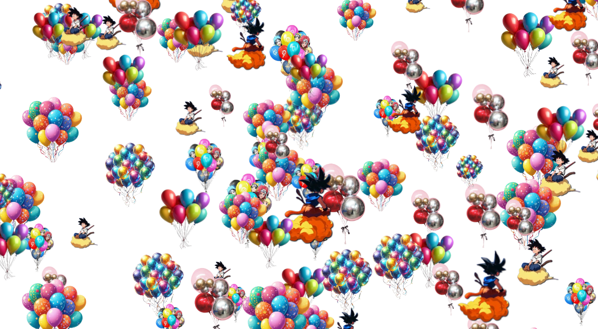

title: 前端代码片段
author: PanYuKang
tags: [代码片段,前端技术,笔记整理]
categories: [前端技术]
date: 2024-04-21 16:21:22

---

整理记录一些平时工作实践的前端代码片段以及本人写的效果小案例，方便提供思路和快速预览，分享给对知识充满渴望的有缘人！

---

## 数据分组

学习封装一个通用分组函数，对公共功能的提取有更多的理解与思考。

代码示例：

```javascript
const people = [
	{name: '小莉', age: 30, sex: '女'},
	{name: '小马', age: 25, sex: '男'},
	{name: '小吴', age: 30, sex: '男'},
	{name: '小刘', age: 25, sex: '女'},
	{name: '小芯', age: 25, sex: '女'},
	{name: '小王', age: 25, sex: '男'},
	{name: '小白', age: 20, sex: '女'},
]
// 按年龄分组
const result = {};
for(const item of people){
	const key = item.age;
	if(!result[key]){
		result[key]=[];
	}
	result[key].push(item);
}
console.log(result);

// 按性别分组
const result = {};
for(const item of people){
	const key = item.sex;
	if(!result[key]){
		result[key]=[];
	}
	result[key].push(item);
}
console.log(result);

// (1)传入属性名，封装成分组函数
function groupBy(arr,propName){
const result = {};
	for(const item of arr){
	const key = item[propName];
	if(!result[key]){
		result[key]=[];
	}
	result[key].push(item);
	}
	return result;
}
console.log(groupBy(people,'age'))
console.log(groupBy(people,'sex'))

// (2)传入函数（得到key的过程），封装公共函数
function groupBy(arr,generateKey){
	const result = {};
	for(const item of arr){
	const key = generateKey(item);
	if(!result[key]){
		result[key]=[];
	}
	result[key].push(item);
	}
	return result;
}
// 按年龄分组
console.log(groupBy(people,(item)=>item.age))
// 按性别分组
console.log(groupBy(people,(item)=>item.sex))
// 按年龄-性别分组
console.log(groupBy(people,(item)=>`${item.age}-${item.sex}`))
// 按奇偶数进行分组
const arr = [34,6,323,2,5,7,1,9,0]
console.log(groupBy(arr,(item)=>(item % 2 ===0?'偶':'奇')))

// (3)参数归一化：既能通过属性，也能通过函数传参调用
function groupBy(arr,generateKey){
	if(typeof generateKey === 'string'){
		const propName = generateKey;
		generateKey = (item) => item[propName];// 统一将属性处理成函数进行执行
	}
	const result = {};
	for(const item of arr){
	const key = generateKey(item);
	if(!result[key]){
		result[key]=[];
	}
	result[key].push(item);
	}
	return result;
}
// 通过属性调用
console.log(groupBy(people,'age'))
console.log(groupBy(people,'sex'))

// 通过函数调用
// 按年龄分组
console.log(groupBy(people,(item)=>item.age))
// 按性别分组
console.log(groupBy(people,(item)=>item.sex))
// 按年龄-性别分组
console.log(groupBy(people,(item)=>`${item.age}-${item.sex}`))
// 按奇偶数进行分组
const arr = [34,6,323,2,5,7,1,9,0]
console.log(groupBy(arr,(item)=>(item % 2 ===0?'偶':'奇')))
```

## 在原型上添加下拉选项选择弹窗

通过在原型上定义一个全局方法使其在每个 Vue 的实例中可用，代码示例如下：

```javascript
/**
 * @desoription 下拉选项选择弹窗
 * @param {string} comboName 选项项目标题
 * @param {string} comboHint 提示语placeholder
 * @param {string} comboOptions 选项
 * @param {string} comboValue 初始值initialKey
 * @param {string} retType 返回类型
 * @returns string
 */
Vue.prototype.pushcomboInputDialog = async function(comboName, comboHint, combo0ptions, comboValue, retType) {
if(retType === 'RETURN_SUFFIX_OTHER') {
   const {outstr} = (await this.$syncOpenTrade (
	'@FM/components/ComboInput/ComboInput.vue',
	comboName,
	'window",
	{ comboName, comboHint, combo0ptions,comboValue, retType },
	{
	 customstyle:{ width:'500px',height:'265px',top:'15%'},
	 bodyStyle:{ padding:'18px 24px'},
	 customclass:'local-auth',
	 isModal: false,
	 isFocus: true,
	 showClose: false,
	}
	)) || { outstr: '' }
	return outstr
} else {
   const {outstr} = (await this.$openPanel (
	'@FM/components/ComboInput/ComboInput.vue',
	comboName,
	'window",
	{ comboName, comboHint, combo0ptions,comboValue, retType },
	{
	 customstyle:{ width:'450px',height:'225px',top:'15%'},
	 bodyStyle:{ padding:'10px 24px'},
	 customclass:'local-auth',
	 isModal: false,
	 isFocus: true,
	 showClose: false,
	}
	)) || { outstr: '' }
	return outstr
  }
}

```

## 在原型上添加全局方法控制域后事件

在平台工程Plugins.js文件中新增一个定制化的全局方法，方便对Vue组件栏位进行控制。代码示例如下：

```javascript
	/**
 	 * @desoription 设置组件控件栏位是否向上触发blur域后事件
	 */
	 Vue.prototype.setBackTrigger = function (refs, vals, allTypeFlag) {
		try{
			// 判断refs类型
			if (!Array.isArray(refs) && typeof refs !== 'string' && typeof refs !== 'object') {
				logger.error('[setBackTrigger]入参refs应为string类型、vue示例或者他们组成的数组')
				return
			}
			// 判断vals类型
			if (!Array.isArray(vals) && typeof refs !== 'boolean' ) {
				logger.error('[setBackTrigger]入参vals应为boolean类型或者boolean类型数组')
				return
			}
			// 判断refs和vals都为数组时，二者长度需要一致
			if (Array.isArray(refs) && Array.isArray(vals)&& refs.length !==vals.length ) {
				logger.error('[setBackTrigger]入参refs和vals为数组类型时，二者长度需要一致')
				return
			}
			if (Array.isArray(refs)) {
				// 如果是数组，则递归调用
				for ( const i in refs) {
					this.setBackTrigger(refs[i], typeof vals === 'boolean' ? vals : vals[i], allTypeFlag)
				}
			} else {
				// 如果不是数组，则执行refs为单个参数时的逻辑
				if (typeof refs === 'string' ) refs = this.$refs[refs]
				if (refs && typeof refs.backTrigger === 'boolean' && Object.prototype.hasOwnProperty.call(refs,'getRequisite')) {
					// 如果是单个控件 且必填
					if (refs.getRequisite() || allTypeFlag) refs.backTrigger = vals
				} else if (refs && refs.$children && refs.$children.length > 0) {
				 	// 如果是group或组件等，则递归调用（ len 左置，防止数组长度变化出现的异常情况）
				 	for ( let i = 0,len = refs.$children.length; i < len; i++) {
				 	 	this.setBackTrigger(refs.$children[i], vals, allTypeFlag)
				 	 }
				  }
			}
		} catch (e) {
		 logger.error('[setBackTrigger]执行异常', e)
		 }
	}
```

## 合并表格列

 有些需求是针对表格中相同行数据的某些列进行合并展示，根据表格中可绑定的objectSpanMethod函数进行处理，仅用于参考：

```javascript
 // 合并行或列的函数
 objectSpanMethod({row,column,rowIndex,columnIndex}){
 // 合并第二，六列（币种+合计金额）
 if(columnIndex === 1 || columnIndex === 6){
 		const _row = this.mergeCells(this.tableData).one[rowIndex]
 		const _col = _row > 0 ? 1 : 0
 		return {
			rowspan: _row, // 要合并的行数
			rowspan: _col, // 要合并的列数
		}
	}
 },
 // 合并列
 mergeCells(arr){
 	const spanOneArr = []
 	let concatOne = 0
 	arr.forEach((item,index)=>{
		// 第一行占一个单元格
		if(index === 0){
			spanOneArr.push(1)
		} else {
			// 如果下一行的值跟上个行的值相同，占用的单元格+1，下行则占0，如果值不同则占1格
			if(item[this.tableHeadData[1].prop] === arr[index -1][this.tableHeadData[1].prop]){
			spanOneArr[] += 1
			spanOneArr.push(0)
			} else {
			spanOneArr.push(1)
			concatOne = index
			}
		}
	})
	return {
		one:spanOneArr,
	}
 }
```

## 数组排序

根据获取的数组内容不同，若明确其中的某个字符串是有规律的，我们可以通过截取其中的字符串进行处理排序问题：

```javascript
const data = [
 "图像001-00005-fr_清单人工通过", 
 "图像001-00003-fr_清单人工通过",
 "图像001-00004-fr_清单人工通过"
 ];

// 使用 sort 方法对数组进行排序
data.sort((a, b) => {
  // 将字符串转换为数字
  const num1 = parseInt(a.split("-")[1]);
  const num2 = parseInt(b.split("-")[1]);

  // 从小到大排序
  return num1 - num2;
});

console.log(data); // ["图像001-00003-fr_清单人工通过", "图像001-00004-fr_清单人工通过", "图像001-00005-fr_清单人工通过"]
```

还可以通过正则表达式判断是否转为数字，数字的放在一起排序，非纯数字的放一起进行字母和数字比较排序：

```javascript
const data = [
 "图像001-00005-fr_清单人工通过",
 "图像001-000b3-fr_清单人工通过",
 "图像001-00003-fr_清单人工通过", 
 "图像001-00004-fr_清单人工通过",
 "图像001-000a6-fr_自动通过",
 "图像001-000b6-fr_自动通过",
 "图像001-02c56-fr_通过",
 ];

const numbers = data.filter((str) => {
  const match = str.match(/^\d+$/);
  return match;
});

const nonNumbers = data.filter((str) => {
  const match = str.match(/^\d+$/);
  return !match;
});

numbers.sort((a, b) => {
  return parseInt(a, 10) - parseInt(b, 10);
});

nonNumbers.sort((a, b) => {
  return a.localeCompare(b);
});

const sortedData = [...numbers, ...nonNumbers];

console.log('输出--',sortedData); 
```

代码解释：
这段代码首先使用 filter() 方法将数据分为两组：数字和非纯数字。
数字组使用正则表达式 /^\d+$/ 匹配。该正则表达式匹配一个或多个数字。
非纯数字组使用正则表达式的反向匹配 !match。
然后，代码使用 sort() 方法对数字组进行排序。sort() 方法接受一个比较函数作为参数。比较函数使用减法运算符 (-) 比较两个数字的大小。
最后，代码使用 sort() 方法对非纯数字组进行排序。sort() 方法使用 localeCompare() 方法比较两个字符串的大小。localeCompare() 方法考虑了语言环境和区域设置。

## 写入JsonArray对象字符串

有些时候需要给后端写入的文件，里面的某个映射字段必须要指定的JsonArray对象字符串，各元素为JsonObject对象，这时候可通过如下代码进行处理：

```javascript
const yyrzdjb = {
	ywlsh:this.ywlsh,// 业务流水号
	pzzl:this.taskData.pzzl,// 凭证种类
	pzxh:this.taskData.pzxh,// 凭证序号
	clyj:this.CLYJ, //处理意见
	verificationInfo:[],// 验印详细信息
}
for(const key in this.verificationInfo){
	if(Object.hasOwnProperty.call(this.verificationInfo,key)){
		yyrzdjb.verificationInfo.push(this.verificationInfo[key])
	}
}
// 写入文件数据
let sealVerificationInfoTmp ={
	yyjgxx,
	yyrzdjb,
}
sealVerificationInfoTmp = JSON.stringify(sealVerificationInfoTmp )
let savePath = await PlupinUtils.getProTemFilePath(this) // 调用封装好的公函获取临时文件的地址
if(savePath.isSucces){
	savePath = savaPath.data+ '\\SealTaskAccredit\\'+this.taskData.ywlsh+'sealVerificationInfo' // 拼接目录文件名
	const res = await File.writeClientFile(savaPath,sealVerificationInfoTmp,'false','utf-8') // 调用封装好的公函转成文件
	if(res.reuslt === 'true'){
		await this.pushInfo('写入文件成功！')
	} else {
		await this.pushInfo('写入文件失败！')
		return
	}
}
```

代码解释：

> * for(const key in this.verificationInfo)：这行代码开始了一个 for...in 循环。for...in 循环用于遍历对象的可枚举属性。在这里，key 是一个变量，用于存储每次迭代中对象的属性名。
> * Object.hasOwnProperty.call(this.verificationInfo, key)：这一行通过 Object 对象的 hasOwnProperty 方法来检查当前迭代的属性是否为对象自身的属性，而不是继承来的属性。这么做是为了确保只遍历对象自身的属性，而不包括从原型链继承的属性。call() 方法的作用是调用 hasOwnProperty 方法，并将当前对象 (this.verificationInfo) 以及当前属性名 (key) 作为参数传递给 hasOwnProperty 方法。
> * yyrzdjb.verificationInfo.push(this.verificationInfo[key])：如果属性是对象自身的属性，那么就将该属性的值（通过 this.verificationInfo[key] 获取）添加到另一个对象 yyrzdjb 的 verificationInfo 属性中。这假定了 yyrzdjb 对象在代码的上下文中已经被定义，并且拥有一个名为 verificationInfo 的数组属性。
> * 因此，这段代码的作用是将 this.verificationInfo 对象中的所有自身属性的值都复制到另一个对象 yyrzdjb 的 verificationInfo 数组中。

## JSON字符串的处理和排序

有些时候从后端服务获取返回的数据报文格式为：

```
"{"rwxh":"1","jdmc":''录入审核","jddm":''1110","shyj":"提交账户初审子务","shsj":"2024-03-04 09:17:29","userid":"0005001},
{"rwxh":"","jdmc":''录入审核拒绝",,"jddm":''1402","shyj":"提交账户初审子务","shsj":"2024-03-04 15:07:55","userid":"117010887"},
{"rwxh":"1","jdmc":''凭证验印初审(网点)",,"jddm":''1404""shyj":"审核无误，可进入下一流程！","shjg":"无需验印","shsj":"20240316","userid":"117010887"},"
```

由于后台的数据是根据不同的子流程任务产生后累计返回的报文信息，此时的业务需求是需要将这些数据加工处理好之后，按最新的一条意见内容进行回显界面，可用下面代码进行实现：

```javascript
// 处理后台的任务流程意见信息
let lcclyj = ''
const sbfList =[]
if(!_.isEmpty(taskData.lcclyj)){
	lcclyj = '['+taskData?.lcclyj.slice(0,taskData.lcclyj.length-1)+']' // 去除最后一位逗号
	try{
		lcclyj = JOSN.parse(lcclyj)
	} catch(error){
		logger.debug('lcclyj不是JOSN字符串格式',lcclyj)
	}
	lcclyj.forEach((item) => {
		let jdmc = ''
		if(item.jddm === '1402'){
			jdmc = '验印经办'
		} else if( item.jddm === '1403'){
			jdmc = '验印复核'
		}else if( item.jddm === '1404'){
			jdmc = '验印经办（网点）'
		}else if( item.jddm === '1405'){
			jdmc = '验印复核（网点）'
		}
		if(item.jddm === '1402' || item.jddm === '1403'||item.jddm === '1404'||item.jddm === '1405'){
			const userid = item.userid?.trim() || ''
			const shsj = item.shsj?.trim() || ''
			const shjg = item.shjg?.trim() || ''
			const shyj = item.shyj?.trim() || ''
			sbfList.push({
				sbfTime:shsj,
				sbfShyj: jdmc + '('+userid+')'+'('+shsj+')'+'('+shjg+')'+'('+shyj,
			})
		}
	})
}

// 按时间进行排序
sbfList.sort(function(a,b){
	return new Date(b.sbfTime) - new Date(a.sbfTime)
})

// 获取最近一条意见内容进行回显
this.YJL = sbfList[0].sbfShyj || '' // 意见栏
```

## 循环的使用

理由：forEach 不支持使用 break 或 return 语句中断循环。for of 支持使用 break 或 return 语句中断循环。
由于JS的循环写法很多，每个同事对于循环的使用习惯都不一样，一些前同事的代码逻辑中很喜欢使用ForEach,写起来确实方便，但拓展性不太强,比如从返回的数据中需要进行筛选，不满足条件的直接中断循环，ForEach这方面就略逊一筹，因为从后端服务拿过来的数据无法预测的，且需求是随时可变的，为了可拓展，可以改成for of循环：

```javascript
const AuditOpinion =this.importMap.AuditOpinion
let opinion =''
if(!_.isEmpty(AuditOpinion)){
	const json =JSON.parse(AuditOpinion)
	if(!_.isEmpty(json)){
		for (let item of json){
			const start = item.indexOf('(')
			const end = item.indexOf(')')
			const cl = item.substring(start+1,end)
			if(!_.isEmpty(cl)&& cl.length ===6){
				break // 满足此条件时直接停止循环过滤筛选
			}
			if(!_.isEmpty(cl)&& cl.length ===9){
				opinion += item +'\n'
			}

		}
	}
}
this.HandOpinions = opinion //处理意见
```

## 根据条件筛选获取到的信息，然后再进行模糊查询

有时候查询服务得到的数据结构总是不统一的，而后端又不想做数据格式处理，这时需要前端根据返回的数据结构，转换成想要的结构后再使用。因为会涉及到多个地方需要使用，所以需要写一个通用的公共函数进行处理后返回。可以新建一个专门存放公共方法的js文件，方便后面在Vue文件中直接引入调用。

```javascript
/**
 * @description 根据代发类型筛选获取到的摘要表
 * @param trade 交易对象 Vue
 * @param srcitems 摘要代号数组 获取的list结构为:
 * [{dflx:'01',zhdh:'006',zymc:'代发工资'},{dflx:'02',zhdh:'008',zymc:'电费'},...]
 * @param dflxView 代发类型位图 有三种情况：薪酬 非薪酬 薪酬+非薪酬
 * @returns 返回账户代号-摘要
 **/
static async getZyitemsByDflx(trade,srcitems,dflxView){
	if(_.isEmpty(srcitems)){
		return null
	}
	// 代发类型位图转为代发类型
	const dflxMap={}
	if(dflxView.length > 0){
		// 获取的dflxView为薪酬时，可能返回10000000，首位不为0，代表为薪酬类
		if(dflxView.substring(0,1) !=='0'){
			dflxMap['01'] = '薪酬'
		}
	}
	if(dflxView.length > 1){
		// 获取的dflxView为非薪酬时，可能返回01000000，第二位不为0，代表为非薪酬类
		if(dflxView.substring(1,2) !=='0'){
			dflxMap['02'] = '非薪酬'
		}
	}
	// 通过srcitems中的dflx去匹配出当前dflxMap对象中含有的key再进行过滤
	const list =srcitems.filter((item) => dflxMap[item.dflx])
	if(_.isEmpty(list)){
		return null
	}
	return list
}

/**
 * @description 模糊匹配摘要信息
 * @param trade 交易对象 Vue
 * @param list 筛选后的摘要数组信息
 * @param zydh 摘要代号
 * @returns 返回账户代号-摘要
 **/
static async getZydhInfoOne(trade,list,zydh){
	let retZydh = ''
	const itemsMatchList = []
	const convertS = '' // 界面输入[001-存款]之类的，判断相等直接返回
	for(let index = 0;index < list.length;index++){
		const element = list[index]
		convertS = `{element.zydh}-{element.zymc}`
		if(element.zydh === zydh){
			return convertS
		} else if(element.zydh.indexOf(zydh) > -1 || zydh.indexOf(element.zydh) > -1){
			// 模糊查询筛选
			itemsMatchList.push(element)
		}
	}
	let itemMatchs = []
	// 判断是否有模糊匹配，若无，加载所有
	if(itemsMatchList.length === 0){
		itemMatchs = list.map((item) => ({
			label: `${item.zydh}-${item.zymc}`,
			value: item.zydh,
		}))
	} else {
		itemMatchs = itemsMatchList.map((item) => ({
			label: `${item.zydh}-${item.zymc}`,
			value: item.zydh,
		}))
	}
	// 把筛选后的itemMatchs传入封装好的方法中进行弹框展示
	retZydh = await trade.pushComboInputDialog('摘要','请选择',itemMatchs,'','RETURN_FULL')
	return retZydh
}
 
```

## 去重处理

有时候后端服务查询会有返回重复的数据，这时候前端可以先进行去重处理，再进行展示。

```javascript
methods:{
            const data = {
                cpdh: this.CPDH, // 产品代号
                dqdhList: [this.OrgInfo.rgnCdNm,'00'], // 地区代号
                qsrq: CibTradeUtil.getHostDate(this), // 起始日期
                zzrq: CibTradeUtil.getHostDate(this), // 终止日期
            }
            const res = await loadCPQX(this,data)
            if(res,isSuccess && res.body.list.length > 0){
            	const list =res.body.list
            	const optionsList =list.map((item)=>({
					label:item.cpqx,
					value:item.cpqx,
				})
				// 去重处理
				this.CPQX_options = optionsList.reduce((acc,item) => {
					if(!acc.some((item2)=> item2.value === item.value)){
						acc.push(item)
					}
					return acc
				},[])
            }
}
```

## 转码处理

有时候后端接口只返回码值，并没有中文描述，并且下拉选项是需要动态查询服务进行加载，因此调用服务查询回来时，还需进行转码处理进行展示。

```javascript
methods: {
        async jxbz_onFocus() {
            const data = {
                dqdh: this.OrgInfo.rgnCdNm, // 地区代号
                cpdh: this.CPDH, // 产品代号
                hbzl: '01', // 币种
                sxrq: CibTradeUtil.getHostDate(this), // 生效日期
                zzrq: CibTradeUtil.getHostDate(this), // 终止日期
            }
            // 调用产品信息表的服务
            const res = await loadCPXX(this, data)
            const list = res?.body?.list
            if (!res.isSuccess) {
                await this.pushInfo("获取产品信息属性识别，请确认！")
                this.focusManager.setFocus('CKLLTJ')
            } else {
                const jxzqz = list[0].jxzqz
                this.jxbz_options = this.loadJXBZ(jxzqz)
            }

        },
        /**
         *  返回结息标志进行转换处理
         *  @param jxbz
         *  @return
         */

        loadJXBZ(jxbz) {
            if (_.isEmpty(jxbz)) {
                this.pushInfo('结息标志为空，请确认！')
                this.focusManager.setFocus('jxbz')
            }
            const jxbzlen = jxbz.length
            const newJxbzs = []
            for (let i = 0; i < jxbzlen; i++) {
                if (jxbz.substr(i, 1) === '0') {
                    newJxbzs.push({
                        label: '0' + '-' + '按月结息',
                        value: '0',
                    })
                } else if (jxbz.substr(i, 1) === '1') {
                    newJxbzs.push({
                        label: '1' + '-' + '按季付息',
                        value: '1',
                    })
                } else if (jxbz.substr(i, 1) === '2') {
                    newJxbzs.push({
                        label: '2' + '-' + '按年付息',
                        value: '2',
                    })
                }
            }
            return _.sortBy(newJxbzs, 'value')
        }
    }
```

## 关于正则表达式

在公司中需要封装一些公共方法，记录一下踩过的坑。由于项目ESLint提交时检查不能使用new的写法，所以改成了字面量的写法，结果测试的时候总是校验不到，原因就是字面量写法中不需要进行转义，使用\\就无法正确识别，而new RegExp的时候需要进行转义，这个锅甩给细节啦！

```javascript
/**
 * 凭证代号校验
 */
 static async isValidateXh(xh){
	//const reg =new RegExp('^((26)|(27))\\d{7}$')
	const reg = /^((26)|(27))\d{7}$/
	return reg.test(xh)
}
```

## 初始化加载表格详情画面

```javascript
methods:{
	async tradeInit(){
		const importVar =this.$getPanelImportVar() // 获取上一个交易传递过来的参数数据
		const plStr = importVar.PLBSH // 获取的数据格式如："1,2,3,4,5"
		const xgStr = importVar.XGBH
		const hpStr = importVar.HPDQR
		const dbStr = importVar.DBFS
		const pmStr = importVar.PMHZJE
		const plbshAry= plStr.split(',')
		if(plbshAry !==null && plbshAry.lenth >0){
			const rowData=[]
			for(let i=0;i<plbsAry.length;i++){
				rowData[0]=xgStr.split(',')[i] // 对每项数据进行截取后回填到列表中
				rowData[1]=plbshAry
				rowData[2]=hpStr.split(',')[i]
				rowData[3]=dbStr.split(',')[i]
				rowData[4]=pmStr.split(',')[i]
				this.tableData.push({
					XGBH:rowData[0],
					PLBSH:rowData[1],
					HPDQR:rowData[2],
					DBFS:rowData[3],
					PMHZJE:rowData[4],
				})
			}
		}

	}
}
```

## 特效案例Demo

### 音乐心电图

#### 案例图片效果


#### 案例代码

```html
<!DOCTYPE html>
<html lang="zh">

<head>
  <meta charset="UTF-8">
  <meta name="viewport" content="width=device-width,initial-scale=1.0">
  <title>音乐心电图</title>
  <style>
    body {
      background-color: black;
      display: flex;
      flex-direction: column;
      align-items: center;
      justify-content: center;
      height: 100vh;
      color: white;
      margin: 0;
      padding: 0;
    }

    #visual-container {
      position: relative;
      width: 600px;
      height: 200px;
    }

    /* 爱心：使用实心填充，而非仅描边 */
    #heart {
      position: absolute;
      width: 200px;
      height: 200px;
      left: 33%;
      /* transform: translateX(-50%); */
      background: url('https://pic1.imgdb.cn/item/67c2dd13d0e0a243d4091c1e.png') no-repeat center/contain;
      transition: transform 0.2s ease-out;
    }

    #ecg-canvas {
      position: absolute;
      top: 67px;
      width: 600px;
      height: 80px;
      /* border-top: 2px solid #ff3366; */
    }

    #controls {
      margin-top: 200px;
    }
  </style>
</head>

<body>
  <div id="visual-container">
    <div id="heart"></div>
    <canvas id="ecg-canvas"></canvas>
  </div>

  <div id="controls">
    <button id="playBtn">▶️ 播放</button>
  </div>

  <!-- 你可以换成自己的外链 MP3 -->
  <audio id="audio"
    src="https://m10.music.126.net/20250302101105/d662a590a9b2cc08e4ba437e18a91a8b/ymusic/020e/015d/010b/5d3dfa710867af61316d6aafae53909f.mp3?vuutv=0kZdXkUmbzE0XVXCeesLALXQijTmzG/hK42Kc4Dp2GEkOaDGLl9fzWBH46WwcIh2tnVHgWyNPQPoFSjydZxZLP1h+vlNfATVA3Xuf8jmHDE="
    crossorigin="anonymous">
  </audio>

  <script>
    const audio = document.getElementById("audio");
    const playBtn = document.getElementById("playBtn");
    const heart = document.getElementById("heart");
    const canvas = document.getElementById("ecg-canvas");
    const canvasCtx = canvas.getContext("2d");

    canvas.width = 600;
    canvas.height = 80;

    let audioCtx;
    let analyser;
    let dataArray;
    let bufferLength;
    let source;
    let isPlaying = false;

    // ========================
    // 1) 定义“ECG 波形形状”模板
    // ========================
    // 这段数组模拟一个完整心电图周期(简化版)；数值在 [0,1] 之间，0.5 代表基线。
    const baseEcgShape = [
      // 前段基线
      0.5, 0.5, 0.5, 0.5,
      // P 波 (小上升)
      0.52, 0.55,
      // 回到基线
      0.53, 0.5, 0.5,
      // Q 波 (轻微下降)
      0.48, 0.45,
      // R 波 (大幅上冲)
      0.7, 0.9, 0.95, 0.85,
      // S 波 (下降)
      0.4, 0.45,
      // 回到基线
      0.5, 0.5,
      // T 波 (中等上升)
      0.55, 0.6, 0.58, 0.52,
      // 再次回到基线
      0.5, 0.5, 0.5, 0.5
    ];


    // 心电图数据数组（长度=canvas宽度），用于滚动绘制
    const ecgData = new Array(canvas.width).fill(canvas.height / 2);

    function setupAudioContext() {
      if (!audioCtx) {
        audioCtx = new (window.AudioContext || window.webkitAudioContext)();
        analyser = audioCtx.createAnalyser();
        analyser.fftSize = 512;
        bufferLength = analyser.frequencyBinCount;
        dataArray = new Uint8Array(bufferLength);

        source = audioCtx.createMediaElementSource(audio);
        source.connect(analyser);
        analyser.connect(audioCtx.destination);
      }
    }
    let waveIndex = 0;
    let randomFactor = 1;
    let frameCount = 0;
    const skipFrames = 3; // 改大一点，波形移动就越慢

    function draw() {
      requestAnimationFrame(draw);

      if (audio.paused) {
        heart.style.transform = "scale(1)";
        return;
      }

      analyser.getByteFrequencyData(dataArray);

      // 爱心跳动
      const bassEnergy = dataArray.slice(0, 20).reduce((a, b) => a + b, 0) / 20;
      heart.style.transform = `scale(${1 + bassEnergy / 200})`;// 让跳动幅度更大

      // 波形放大
      const midEnergy = dataArray.slice(100, 200).reduce((a, b) => a + b, 0) / 100;

      // 只有在满足一定帧数时才更新一格
      frameCount++;
      if (frameCount % skipFrames === 0) {
        ecgData.shift();
        const baseVal = baseEcgShape[waveIndex % baseEcgShape.length];
        waveIndex++;

        const amplitude = (midEnergy / 255) * 2;
        const finalVal = baseVal + (baseVal - 0.5) * amplitude;
        const y = (1 - finalVal) * canvas.height;
        ecgData.push(y);
      }

      // 绘制
      canvasCtx.clearRect(0, 0, canvas.width, canvas.height);
      canvasCtx.beginPath();
      canvasCtx.strokeStyle = "#ff3366";
      canvasCtx.lineWidth = 2;
      canvasCtx.moveTo(0, ecgData[0]);

      for (let i = 1; i < ecgData.length; i++) {
        const prevY = ecgData[i - 1];
        const currY = ecgData[i];
        const cp1X = i - 0.5;
        const cp1Y = prevY;
        const cp2X = i;
        const cp2Y = currY;
        canvasCtx.bezierCurveTo(cp1X, cp1Y, cp2X, cp2Y, i, currY);
      }
      canvasCtx.stroke();
    }
    // 播放 / 暂停 按钮
    playBtn.addEventListener("click", () => {
      setupAudioContext();

      if (!isPlaying) {
        audioCtx.resume().then(() => {
          audio.play();
          playBtn.textContent = "⏸️ 暂停";
          isPlaying = true;
          draw(); // 开始动画循环
        });
      } else {
        audio.pause();
        playBtn.textContent = "▶️ 播放";
        isPlaying = false;
      }
    });

    // 音乐结束时重置按钮
    audio.onended = () => {
      playBtn.textContent = "▶️ 播放";
      isPlaying = false;
    };
  </script>
</body>

</html>
```

### 满屏气球特效

#### 案例图片效果



#### 案例代码

```html
<!DOCTYPE html>
<html lang="zh">

<head>
    <meta charset="UTF-8">
    <meta name="viewport" content="width=device-width, initial-scale=1.0">
    <title>气球漂浮特效</title>
    <style>
        /* 气球容器 */
        #balloon-container {
            position: fixed;
            top: 0;
            left: 0;
            width: 100vw;
            height: 100vh;
            pointer-events: none;
            overflow: hidden;
            z-index: 999;
        }

        /* 气球样式 */
        .balloon {
            position: absolute;
            cursor: pointer;
            animation: float 8s ease-in-out infinite;
            width: 80px;
            height: 100px;
            transition: transform 0.3s;
        }

        .balloon-img {
            width: 100%;
            height: 100%;
            object-fit: contain;
            image-rendering: crisp-edges;
            pointer-events: auto;
        }

        @keyframes float {

            0%,
            100% {
                transform: translateX(-5px) translateY(0) rotate(-3deg);
            }

            50% {
                transform: translateX(5px) translateY(-10px) rotate(3deg);
            }
        }

        /* 垂直按钮组 */
        .control-panel {
            position: fixed;
            bottom: 20px;
            right: 20px;
            display: flex;
            flex-direction: column;
            gap: 8px;
            background: rgba(255, 255, 255, 0.9);
            padding: 12px;
            border-radius: 20px;
            box-shadow: 0 4px 20px rgba(0, 0, 0, 0.1);
            backdrop-filter: blur(5px);
            z-index: 1000;
        }

        .control-btn {
            padding: 10px 20px;
            border: none;
            border-radius: 15px;
            cursor: pointer;
            transition: all 0.3s;
            font-family: Arial, sans-serif;
            font-size: 14px;
            display: flex;
            align-items: center;
            justify-content: center;
            gap: 6px;
            width: 100px;
        }

        #startBtn {
            background: #4CAF50;
            color: white;
        }

        #pauseBtn {
            background: #FF9800;
            color: white;
        }

        #clearBtn {
            background: #f44336;
            color: white;
        }

        .control-btn:disabled {
            opacity: 0.6;
            cursor: not-allowed;
        }

        /* 移动端适配 */
        @media (max-width: 480px) {
            .control-panel {
                bottom: 10px;
                right: 10px;
                padding: 8px;
            }

            .control-btn {
                width: 80px;
                padding: 8px 12px;
                font-size: 12px;
            }
        }
    </style>
</head>

<body>
    <div id="balloon-container"></div>

    <!-- 垂直按钮组 -->
    <div class="control-panel">
        <button id="startBtn" class="control-btn">▶️ 开启</button>
        <button id="pauseBtn" class="control-btn">⏸️ 暂停</button>
        <button id="clearBtn" class="control-btn">🧹 清空</button>
    </div>

    <script>
        // 状态控制变量
        let isGenerating = false;
        let animationInterval;
        const balloons = [];
        const balloonImages = [
            'https://pic1.imgdb.cn/item/67c27a04d0e0a243d4087fd9.png',
            'https://pic1.imgdb.cn/item/67c2d416d0e0a243d4090fce.png',
            'https://pic1.imgdb.cn/item/67c29485d0e0a243d408a3c4.png',
            'https://pic1.imgdb.cn/item/67c29485d0e0a243d408a3c5.png',
            'https://pic1.imgdb.cn/item/67c29486d0e0a243d408a3c6.png',
            'https://pic1.imgdb.cn/item/67c2d416d0e0a243d4090fd1.png',
            'https://pic1.imgdb.cn/item/67c27a3dd0e0a243d4087fdd.png',
        ];

        // 初始化按钮状态
        updateButtonStates();

        // 功能函数
        function startGeneration() {
            if (!isGenerating) {
                isGenerating = true;
                animationInterval = setInterval(createBalloon, 800);
                updateButtonStates();
            }
        }

        function pauseGeneration() {
            isGenerating = false;
            clearInterval(animationInterval);
            updateButtonStates();
        }

        function clearAll() {
            pauseGeneration();
            balloons.forEach(balloon => {
                balloon.style.transition = 'opacity 0.3s';
                balloon.style.opacity = '0';
                setTimeout(() => balloon.remove(), 300);
            });
            balloons.length = 0;
            updateButtonStates();
        }

        // 状态更新函数
        function updateButtonStates() {
            document.getElementById('startBtn').disabled = isGenerating;
            document.getElementById('pauseBtn').disabled = !isGenerating;
            document.getElementById('clearBtn').disabled = balloons.length === 0;
        }

        // 创建气球
        function createBalloon() {
            const wrapper = document.createElement('div');
            wrapper.className = 'balloon';

            const img = new Image();
            img.className = 'balloon-img';
            img.src = balloonImages[Math.floor(Math.random() * balloonImages.length)];

            const width = 60 + Math.random() * 60;
            wrapper.style.width = `${width}px`;
            wrapper.style.height = `${width * 1.2}px`;

            wrapper.style.left = `${Math.random() * (window.innerWidth - width)}px`;
            wrapper.style.bottom = '-150px';

            wrapper.addEventListener('click', () => {
                removeBalloon(wrapper);
            });

            wrapper.appendChild(img);
            document.getElementById('balloon-container').appendChild(wrapper);
            balloons.push(wrapper);
            startBalloonAnimation(wrapper);
            updateButtonStates();
        }

        // 气球动画
        function startBalloonAnimation(balloon) {
            let yPos = -150;
            const startX = parseFloat(balloon.style.left);
            const amplitude = 80 + Math.random() * 50;
            const speed = 0.8 + Math.random() * 1.2;

            function animate() {
                if (!isGenerating) return;

                yPos += speed;
                const xPos = startX + Math.sin(yPos * 0.02) * amplitude;

                if (yPos > window.innerHeight + 200) {
                    removeBalloon(balloon);
                    return;
                }

                balloon.style.bottom = `${yPos}px`;
                balloon.style.left = `${xPos}px`;
                requestAnimationFrame(animate);
            }
            animate();
        }

        // 移除气球
        function removeBalloon(balloon) {
            balloon.style.transition = 'transform 0.5s, opacity 0.5s';
            balloon.style.transform = 'scale(1.5)';
            balloon.style.opacity = '0';
            setTimeout(() => {
                balloon.remove();
                balloons.splice(balloons.indexOf(balloon), 1);
                updateButtonStates();
            }, 500);
        }

        // 事件监听
        document.getElementById('startBtn').addEventListener('click', startGeneration);
        document.getElementById('pauseBtn').addEventListener('click', pauseGeneration);
        document.getElementById('clearBtn').addEventListener('click', clearAll);

        // 窗口调整适配
        window.addEventListener('resize', () => {
            balloons.forEach(balloon => {
                const currentX = parseFloat(balloon.style.left);
                balloon.style.left = `${Math.min(currentX, window.innerWidth - parseFloat(balloon.style.width))}px`;
            });
        });
    </script>
</body>

</html>
```

### 实现自由拖拽效果

1.创建Demo.html文件
示例代码：

```html
<link rel="stylesheet" href="static/css/style.css" type="text/css" media="all" />
<!-- 引入自由拖拽的JS库 -->
<script src="https://cdn.jsdelivr.net/npm/sortablejs@1.13.0/Sortable.min.js"></script>
<div class="listdhsl">
	<ul class="sortable-list">

		<li class="sortable-item">
			<p><a href="https://laolion.com/" title="我是一只历经沧桑的老狮。（Typeche付费Joe主题）">老狮的梦</a></p>
		</li>

		<li class="sortable-item">
			<p><a href="https://ae.js.cn/" title="记录与学习前端知识。（Joe主题作者）">Joe的博客</a></p>
		</li>

		<li class="sortable-item">
			<p><a href="https://9i3.cn/" title="Typecho合集站 - 用爱发电,始于2021">Typecho合集站</a></p>
		</li>

		<li class="sortable-item">
			<p><a href="https://www.dongfang.name/" title="行吟游子的个人独立博客！">门影塘畔</a></p>
		</li>

		<li class="sortable-item">
			<p><a href="https://www.cisharp.com/" title="一个分享心得的网站_程序员_个人博客！">一缕清风</a></p>
		</li>

		<li class="sortable-item">
			<p><a href="https://www.aiyo99.com/" title="罗小黑-（便携小电视）">罗小黑</a></p>
		</li>

		<li class="sortable-item">
			<p><a href="https://racns.com/" title="兔子爱上胡萝卜-（可语音浮动看板娘）">萌卜兔's</a></p>
		</li>
		<li class="sortable-item">
			<p><a href="https://www.gmit.vip/" title="故梦吖 ，记录生活点点滴滴（很好看的看板娘）">故梦吖</a></p>
		</li>
		<li class="sortable-item">
			<p><a href="https://love2wind.cn/" title="软件资源代码分享博客">涅槃博客</a></p>
		</li>
	</ul>

</div>

	<script>
		// 自由拖拽效果
		var sortableLists = document.querySelectorAll('.sortable-list');
		sortableLists.forEach(function (sortableList) {
			var sortable = Sortable.create(sortableList, {
				animation: 150,
				handle: '.sortable-item',
				draggable: '.sortable-item',
				onEnd: function (evt) {
					// 获取排序后的列表项
					var items = Array.from(sortableList.children);
					// 创建一个新的文档片段
					var fragment = document.createDocumentFragment();
					// 将排序后的列表项添加到文档片段中
					items.forEach(function (item) {
						fragment.appendChild(item);
					});
					// 清空原有的列表项
					sortableList.innerHTML = '';
					// 将文档片段添加回原来的位置
					sortableList.appendChild(fragment);
				},
			});
		});
	</script>
```

2.新建style.css样式

```css
/* 自由拖拽样式 */
.sortable-list {
    list-style-type: none;
    padding: 10px 0px;
}

.sortable-item {
    margin-bottom: 10px;
    padding: 10px;
    background-color: #f1f1f1;
    cursor: move;
}
```

### 鼠标跟随效果

#### 案例一：简单垂直下挂效果

```html
<!DOCTYPE html>
<html lang="zh">
<head>
    <meta charset="UTF-8">
    <meta name="viewport" content="width=device-width, initial-scale=1.0">
    <title>鼠标跟随-垂直下挂效果</title>
    <style>
        html, body {
            margin: 0;
            overflow: hidden;
            cursor: none !important; /* 双重保险 */
        }
        .cursor {
            position: absolute;
            width: 40px;
            height: 40px;
            background: url('https://img.imgdb.cn/item/60697b638322e6675c5e7e25.png') no-repeat center;
            background-size: contain;
            pointer-events: none;
            z-index: 1000;
        }
        .leaf {
            position: absolute;
            width: 30px;
            height: 30px;
            background: url('https://pic1.imgdb.cn/item/67ab6507d0e0a243d4fe6d95.gif') no-repeat center;
            background-size: contain;
            pointer-events: none;
            opacity: 0.8;
            transition: transform 0.2s ease-out, opacity 0.5s;
        }
    </style>
</head>
<body>
    <div class="cursor"></div>
    <script>
        const cursor = document.querySelector('.cursor');
        const leaves = [];
        const leafCount = 5;

        for (let i = 0; i < leafCount; i++) {
            const leaf = document.createElement('div');
            leaf.classList.add('leaf');
            document.body.appendChild(leaf);
            leaves.push(leaf);
        }

        document.addEventListener('mousemove', (e) => {
            cursor.style.left = `${e.clientX - 15}px`;
            cursor.style.top = `${e.clientY - 40}px`;

            leaves.forEach((leaf, index) => {
                setTimeout(() => {
                    leaf.style.left = `${e.clientX - 15}px`;
                    leaf.style.top = `${e.clientY + index * 10}px`;
                    leaf.style.opacity = 1 - index * 0.15;
                }, index * 50);
            });
        });
    </script>
</body>
</html>
```

#### 案例二：支持多张图片下挂

```html

<!DOCTYPE html>
<html lang="zh">
<head>
    <meta charset="UTF-8">
    <meta name="viewport" content="width=device-width, initial-scale=1.0">
    <title>鼠标跟随-叶子依次变小效果</title>
    <style>
        html, body {
            margin: 0;
            overflow: hidden;
            cursor: none !important; /* 隐藏默认鼠标 */
            background-color: #f8f8f8;
        }
        .cursor {
            position: absolute;
            width: 35px;
            height: 35px;
            background: url('https://img.imgdb.cn/item/60697b638322e6675c5e7e25.png') no-repeat center;
            background-size: contain;
            pointer-events: none;
            z-index: 1000;
        }
        .leaf {
            position: absolute;
            pointer-events: none;
            opacity: 0.8;
            transition: transform 0.2s ease-out, opacity 0.5s;
        }
    </style>
</head>
<body>
    <div class="cursor"></div>
    <script>
        const cursor = document.querySelector('.cursor');
        const leaves = [];
        const leafCount = 5;

        // 叶子图片路径数组（可以换成你自己的）
        const leafImages = [
            'https://pic1.imgdb.cn/item/67ab6507d0e0a243d4fe6d95.gif',  // 第一片叶子（最大）
            'https://pic1.imgdb.cn/item/67ab6507d0e0a243d4fe6d96.gif', // 第二片叶子
            'https://pic1.imgdb.cn/item/67ab6507d0e0a243d4fe6d97.gif',  // 第三片叶子
            'https://pic1.imgdb.cn/item/67ab6506d0e0a243d4fe6d91.gif',// 第四片叶子
            'https://pic1.imgdb.cn/item/67ab6506d0e0a243d4fe6d91.gif' // 第五片叶子（最小）
        ];

        // 生成叶子
        for (let i = 0; i < leafCount; i++) {
            const leaf = document.createElement('div');
            leaf.classList.add('leaf');
            leaf.style.width = `${40 - i * 8}px`; // 依次缩小
            leaf.style.height = `${40 - i * 8}px`;
            leaf.style.background = `url('${leafImages[i]}') no-repeat center`;
            leaf.style.backgroundSize = 'contain';
            document.body.appendChild(leaf);
            leaves.push(leaf);
        }

        // 鼠标移动事件
        document.addEventListener('mousemove', (e) => {
            cursor.style.left = `${e.clientX - 25}px`;
            cursor.style.top = `${e.clientY - 35}px`;

            leaves.forEach((leaf, index) => {
                setTimeout(() => {
                    leaf.style.left = `${e.clientX - 30}px`;
                    leaf.style.top = `${e.clientY + index * 25}px`;
                    leaf.style.opacity = 1 - index * 0.15;
                }, index * 50);
            });
        });
    </script>
</body>
</html>

```

#### 案例三：神龙摆尾效果

```html
<!DOCTYPE html>
<html lang="zh">
<head>
  <meta charset="UTF-8">
  <meta name="viewport" content="width=device-width, initial-scale=1.0">
  <title>鼠标跟随-神龙摆尾效果</title>
  <style>
    html, body {
      margin: 0;
      cursor: none;
      background-color: #f8f8f8;
    }

    .cursor {
      position: absolute;
      width: 35px;
      height: 35px;
      background: url('https://img.imgdb.cn/item/60697b638322e6675c5e7e25.png') no-repeat center;
      background-size: contain;
      pointer-events: none;
      z-index: 1000;
    }
    .leaf {
      position: absolute;
      pointer-events: none;
      opacity: 0.9;
    }
  </style>
</head>
<body>
  <div class="cursor"></div>
  <script>
    const cursor = document.querySelector('.cursor');
    const leaves = [];// 存储所有叶子的DOM元素
    const leafCount = 6;// 叶子数量
    // 叶子图片地址数组
    const leafImages = [
      'https://pic1.imgdb.cn/item/67ab6507d0e0a243d4fe6d95.gif',
      'https://pic1.imgdb.cn/item/67ab6507d0e0a243d4fe6d96.gif',
      'https://pic1.imgdb.cn/item/67ab6507d0e0a243d4fe6d97.gif',
      'https://pic1.imgdb.cn/item/67ab6506d0e0a243d4fe6d91.gif',
      'https://pic1.imgdb.cn/item/67ab6507d0e0a243d4fe6d96.gif',
      'https://pic1.imgdb.cn/item/67ab6507d0e0a243d4fe6d95.gif'
    ];
    // 叶子状态数组，每片叶子都存储其当前坐标、目标坐标和速度
    const leafStates = [];

    // 初始化叶子
    for (let i = 0; i < leafCount; i++) {
      const leaf = document.createElement('div');
      leaf.classList.add('leaf');// 创建叶子元素
      // 设置叶子的尺寸，后面的叶子逐渐变小
      const size = 40 - i * 5;
      leaf.style.width = `${size}px`;
      leaf.style.height = `${size}px`;
      // 设置叶子的背景图片
      leaf.style.background = `url('${leafImages[i]}') no-repeat center`;
      leaf.style.backgroundSize = 'contain';
      // 将叶子添加到页面
      document.body.appendChild(leaf);
      leaves.push(leaf);

      // 记录每片叶子的初始状态
      leafStates.push({
        current: { x: window.innerWidth / 2, y: window.innerHeight / 2 },// 当前坐标
        target: { x: window.innerWidth / 2, y: window.innerHeight / 2 + i * 8 }, // 目标坐标，默认向下偏移
        velocity: { x: 0, y: 0 } // 速度
      });
    }
    // 记录鼠标位置，默认居中
    let mouseX = window.innerWidth / 2, mouseY = window.innerHeight / 2;
    // 初始光标位置（居中）
    cursor.style.left = `${mouseX - 15}px`;
    cursor.style.top = `${mouseY - 15}px`;

    // 监听鼠标移动事件
    document.addEventListener('mousemove', (e) => {
      // 更新鼠标位置，考虑滚动偏移量
      mouseX = e.clientX + window.scrollX;
      mouseY = e.clientY + window.scrollY;

      // 更新自定义光标位置（默认隐藏原鼠标）
      cursor.style.left = `${mouseX - 15}px`;
      cursor.style.top = `${mouseY - 15}px`;
    });

    // 物理动画参数
    const stiffness = 0.15;  // 弹性系数，值越大叶子跟随鼠标越快
    const damping = 0.75;    // 阻尼系数，决定叶子的惯性拖尾
    const delayFactor = 0.2; // 叶子之间的延迟感（未使用，但可用于增加时间差）

    // 动画循环
    function animate() {
      for (let i = 0; i < leafCount; i++) {
        const state = leafStates[i];

        if (i === 0) {
          // 第一片叶子直接跟随鼠标，但向下偏移 15px，使其看起来挂在鼠标下面
          state.target.x = mouseX + 12;
          state.target.y = mouseY + 15;
        } else {
          // 其余叶子跟随前一片叶子的“过去位置”，并添加一定的默认偏移
          const prevState = leafStates[i - 1];
          state.target.x = prevState.current.x - (i * (-2));// 水平位置略微右偏移
          state.target.y = prevState.current.y + (i * 6); // 竖直方向形成拖尾
        }

        // 计算加速度（弹簧模型）
        const dx = state.target.x - state.current.x;
        const dy = state.target.y - state.current.y;
        const ax = dx * stiffness;
        const ay = dy * stiffness;

        // 更新速度，并加入阻尼效果
        state.velocity.x = (state.velocity.x + ax) * damping;
        state.velocity.y = (state.velocity.y + ay) * damping;

        // 更新当前位置
        state.current.x += state.velocity.x;
        state.current.y += state.velocity.y;

        // 应用位置到叶子元素，考虑滚动偏移量
        leaves[i].style.left = `${state.current.x}px`;
        leaves[i].style.top = `${state.current.y}px`;
      }
      // 继续下一帧动画
      requestAnimationFrame(animate);
    }
    // 启动动画
    animate();
  </script>
</body>
</html>
```

### 悬浮划词搜索效果

#### 案例一：简陋版

```html
<!DOCTYPE html>
<html lang="zh-CN">
<head>
  <meta charset="UTF-8" />
  <title>悬浮划词搜索-简陋版</title>
  <style>
    body {
      font-family: sans-serif;
      margin: 20px;
      line-height: 1.6;
    }
    /* 悬浮容器 */
    #selectionPopup {
      position: absolute;
      display: none;
      background-color: #fff;
      border: 1px solid #ccc;
      padding: 5px;
      z-index: 99999;
      box-shadow: 0 2px 6px rgba(0, 0, 0, 0.2);
      border-radius: 4px;
      white-space: nowrap;
    }
    /* 每个搜索按钮的样式 */
    .search-btn {
      display: inline-flex;
      align-items: center;
      justify-content: center;
      width: 28px;
      height: 28px;
      margin: 0 4px;
      background-color: #f5f5f5;
      border-radius: 50%;
      border: 1px solid #ddd;
      font-size: 16px;
      cursor: pointer;
      text-decoration: none;
      color: #333;
      vertical-align: middle;
    }
    .search-btn:hover {
      background-color: #e6e6e6;
    }
  </style>
</head>
<body>

<h2>划词搜索示例</h2>
<p>
  当你在此页面中用鼠标选中一段文字并松开鼠标后，会在选中区域下方弹出一个悬浮层，
  里面包含多个图标按钮以及一个超链接图标）。
  <br>鼠标悬停在任意图标上时，会显示对应的名称提示（Tooltip）。
</p>
<p>
  测试文本：<br>
  - 网易云信大语言模型<br>
  - JavaScript 插件开发<br>
  - https://chat.deepseek.com/ <br>
  - Chrome 扩展<br>
  - 前端开发<br>
  - 后端开发<br>
  - AI 算法<br>
</p>

<!-- 悬浮层容器 -->
<div id="selectionPopup"></div>

<script>
  // 包含 icon、name 两个字段，鼠标悬停时可通过 title 属性显示 name
  const searchEngines = [
    {
      icon: '🔍',
      name: '百度',
      url: 'https://www.baidu.com/s?wd='
    },
    {
      icon: '🅱️',
      name: 'Bing',
      url: 'https://www.bing.com/search?q='
    },
    {
      icon: '🤖',
      name: '纳米AI搜索',
      url: 'https://www.n.cn/search?q='
    },
    {
      icon: '🌐',
      name: 'Google',
      url: 'https://www.google.com/search?q='
    },
    {
      icon: '🦆',
      name: 'DuckDuckGo',
      url: 'https://duckduckgo.com/?q='
    },
    {
      icon: '知',
      name: '知乎',
      url: 'https://www.zhihu.com/search?q='
    },
    {
      icon: '🐙',
      name: 'GitHub',
      url: 'https://github.com/search?q='
    },
    {
      icon: 'SO',
      name: 'Stack Overflow',
      url: 'https://stackoverflow.com/search?q='
    },
    {
      icon: '🔗',
      name: '超链接',
      url: null // 特殊处理
    }
  ];

  const selectionPopup = document.getElementById('selectionPopup');

  // 监听鼠标松开事件
  document.addEventListener('mouseup', function () {
    // 获取选中的文本
    const selection = window.getSelection();
    const selectedText = selection.toString().trim();

    // 如果没有选中文本，则隐藏悬浮层
    if (!selectedText) {
      selectionPopup.style.display = 'none';
      return;
    }

    // 如果有选中内容，则获取选中范围的位置信息
    if (selection.rangeCount > 0) {
      const range = selection.getRangeAt(0);
      const rect = range.getBoundingClientRect();

      // 如果无法获取有效的矩形信息，也隐藏弹窗
      if (!rect || (rect.width === 0 && rect.height === 0)) {
        selectionPopup.style.display = 'none';
        return;
      }

      // 计算弹窗应出现的位置（在所选文本下方，稍作偏移）
      const offsetY = 8; // 在文本下方 8px 处
      const left = rect.left + window.scrollX;
      const top = rect.bottom + window.scrollY + offsetY;

      // 设置弹窗位置
      selectionPopup.style.left = left + 'px';
      selectionPopup.style.top = top + 'px';
      selectionPopup.style.display = 'block';

      // 清空之前的按钮
      selectionPopup.innerHTML = '';

      // 创建并插入各个搜索按钮
      searchEngines.forEach(engine => {
        const btn = document.createElement('a');
        btn.className = 'search-btn';
        // 显示图标
        btn.innerHTML = engine.icon;
        // 设置鼠标悬停时显示的名称
        btn.title = engine.name;

        btn.onclick = function (e) {
          e.preventDefault(); // 防止默认点击行为
          if (engine.url) {
            // 拼接搜索链接
            const finalUrl = engine.url + encodeURIComponent(selectedText);
            window.open(finalUrl, '_blank');
          } else {
            // 处理超链接图标的逻辑
            let linkUrl = selectedText;
            // 如果不包含 http:// 或 https://，则拼接 https://
            if (
              !selectedText.startsWith('http://') &&
              !selectedText.startsWith('https://')
            ) {
              linkUrl = 'https://' + selectedText;
            }
            window.open(linkUrl, '_blank');
          }
        };

        selectionPopup.appendChild(btn);
      });
    }
  });

  // 如果点击页面其他地方，且不在悬浮层内部，则隐藏悬浮层
  document.addEventListener('mousedown', function (e) {
    if (!selectionPopup.contains(e.target)) {
      selectionPopup.style.display = 'none';
    }
  });
</script>

</body>
</html>

```

### 边框动画效果

#### 样例一：小球移动效果

```html
<!DOCTYPE html>
<html>
<head>
<style>
.greedy-snake-border {
  position: relative;
  border: 3px solid transparent;
  border-radius: 8px;
  margin: 20px;
  background: #f0f0f0;
}

/* 彩虹边框层 */
.greedy-snake-border::before {
  content: "";
  position: absolute;
  top: -3px;
  left: -3px;
  right: -3px;
  bottom: -3px;
  background: conic-gradient(
    #ff0000, #ff7300, #fffb00, #48ff00,
    #00ffd5, #002bff, #7a00ff, #ff00c8, #ff0000
  );
  animation: rotate 3s linear infinite;
  border-radius: inherit;
  z-index: 0;
  mask: 
    linear-gradient(#000 0 0) content-box,
    linear-gradient(#000 0 0);
  mask-composite: exclude;
}

/* 光点动画修正 */
.greedy-snake-border::after {
  content: "";
  position: absolute;
  width: 16px;
  height: 16px;
  background: #ff4757;
  border-radius: 50%;
  filter: drop-shadow(0 0 8px rgba(255,71,87,0.8));
  animation: snakeMove 3s linear infinite;
  z-index: 1;
}

/* 关键帧路径修正 */
@keyframes snakeMove {
  0% {
    top: 0;
    left: 0;
    transform: translate(0, 0); /* 初始位置无偏移 */
  }
  25% {
    top: 0;
    left: 100%;
    transform: translate(-100%, 0); /* 向右移动时左拉自身宽度 */
  }
  50% {
    top: 100%;
    left: 100%;
    transform: translate(-100%, -100%); /* 向下移动时上拉自身高度 */
  }
  75% {
    top: 100%;
    left: 0;
    transform: translate(0, -100%); /* 向左移动时上拉高度 */
  }
  100% {
    top: 0;
    left: 0;
    transform: translate(0, 0);
  }
}

@keyframes rotate { 100% { transform: rotate(360deg); } }
</style>
</head>
<body>

<div class="greedy-snake-border" style="width: 300px; height: 150px; padding: 20px;">
  <h2>内容区域</h2>
  <button>测试按钮</button>
</div>

</body>
</html>
```

#### 样例二：贪吃蛇基础效果

```html
<!DOCTYPE html>
<html lang="zh">
<head>
  <meta charset="UTF-8">
  <title>贪吃蛇边框动画演示</title>
  <style>
    /* 公共容器样式 */
    .greedy-snake-border {
      position: relative;
      border: 3px solid transparent;
      border-radius: 8px;
      margin: 20px;
      background: #f0f0f0;
      overflow: hidden;
    }
    /* 彩虹边框（静态，使用 conic-gradient 与 mask 实现仅显示边框区域） */
    .greedy-snake-border::before {
      content: "";
      position: absolute;
      top: -3px;
      left: -3px;
      right: -3px;
      bottom: -3px;
      z-index: 0;
      background: conic-gradient(
        #ff0000, #ff7300, #fffb00, #48ff00,
        #00ffd5, #002bff, #7a00ff, #ff00c8, #ff0000
      );
      border-radius: inherit;
      animation: rotate 3s linear infinite;
      mask: linear-gradient(#000 0 0) content-box, linear-gradient(#000 0 0);
      mask-composite: exclude;
    }
    @keyframes rotate {
      to { transform: rotate(360deg); }
    }
  
    /* ---------------- CSS 版本 ---------------- */
    /* 仅一个动态小点沿边框运动 */
    .css-version .snake {
      position: absolute;
      width: 14px;
      height: 14px;
      background: radial-gradient(circle, #ff0000 30%, #ff7300 80%);
      border-radius: 50%;
      filter: drop-shadow(0 0 5px rgba(255, 50, 50, 0.8));
      animation: snakeMove 3s linear infinite;
      z-index: 1;
    }
    @keyframes snakeMove {
      0%   { top: 0; left: 0; transform: translate(-100%, -100%) scale(1.2); }
      25%  { top: 0; left: 100%; transform: translate(0, -100%) scale(1); }
      50%  { top: 100%; left: 100%; transform: translate(0, 0) scale(0.8); }
      75%  { top: 100%; left: 0; transform: translate(-100%, 0) scale(1); }
      100% { top: 0; left: 0; transform: translate(-100%, -100%) scale(1.2); }
    }
  
    /* ---------------- JS 版本 ---------------- */
    /* 蛇段样式 */
    .snake-segment {
      position: absolute;
      width: 14px;
      height: 14px;
      border-radius: 50%;
      filter: drop-shadow(0 0 5px rgba(0,0,0,0.5));
      z-index: 1;
      left: 0;
      top: 0;
      transform: translate(-50%, -50%);
    }
  </style>
</head>
<body>
  <h2>CSS 版本贪吃蛇边框动画</h2>
  <div class="greedy-snake-border css-version" style="width:300px; height:150px;">
    <!-- 动态小点（蛇头，头大尾小效果通过 scale 实现） -->
    <div class="snake"></div>
    <p style="position: relative; z-index: 2; padding:10px;">CSS版本：内容区域</p>
  </div>
  
  <h2>JS 版本贪吃蛇边框动画</h2>
  <div id="jsContainer" class="greedy-snake-border" style="width:300px; height:150px;">
    <p style="position: relative; z-index: 2; padding:10px;">JS版本：内容区域</p>
  </div>
  
  <script>
    // JS版本：利用多个蛇段实现贪吃蛇效果
    document.addEventListener('DOMContentLoaded', function() {
      const container = document.getElementById('jsContainer');
      const numSegments = 10; // 蛇段数量，可根据需要调整
      const segments = [];
  
      // 创建蛇段（蛇头为 segments[0]，后面依次递减大小）
      for (let i = 0; i < numSegments; i++) {
        const seg = document.createElement('div');
        seg.classList.add('snake-segment');
        container.appendChild(seg);
        segments.push(seg);
      }
  
      let startTime = null;
      const speed = 100; // 每秒移动像素数，可根据需要调整
  
      // 根据当前t值（沿周长的像素距离）计算出在矩形边框上的坐标
      function getPerimeterCoord(t, width, height) {
        const perimeter = 2 * (width + height);
        let pos = t % perimeter;
        if (pos < width) {
          return { x: pos, y: 0 };
        }
        pos -= width;
        if (pos < height) {
          return { x: width, y: pos };
        }
        pos -= height;
        if (pos < width) {
          return { x: width - pos, y: height };
        }
        pos -= width;
        return { x: 0, y: height - pos };
      }
  
      // 动画函数
      function animate(timestamp) {
        if (!startTime) startTime = timestamp;
        const elapsed = (timestamp - startTime) / 1000; // 转换为秒
        const width = container.clientWidth;
        const height = container.clientHeight;
        const perimeter = 2 * (width + height);
  
        // 每个蛇段沿着边框延迟一定距离运动
        for (let i = 0; i < numSegments; i++) {
          // 每个段延迟20像素
          const delay = i * 20;
          const tPos = speed * elapsed - delay;
          // 保证 tPos 为正数，并取模循环
          const effectiveT = ((tPos % perimeter) + perimeter) % perimeter;
          const pos = getPerimeterCoord(effectiveT, width, height);
          segments[i].style.left = pos.x + "px";
          segments[i].style.top = pos.y + "px";
          // 调整大小：蛇头较大，尾部逐渐缩小
          const scale = 1 - i * 0.05;
          segments[i].style.transform = "translate(-50%, -50%) scale(" + scale + ")";
          // 根据当前位置计算颜色，生成彩虹效果
          const hue = (360 * effectiveT / perimeter);
          segments[i].style.backgroundColor = "hsl(" + hue + ", 80%, 50%)";
        }
        requestAnimationFrame(animate);
      }
  
      requestAnimationFrame(animate);
    });
  </script>
</body>
</html>

```

#### 样例三：火车车厢基础效果

```html
<!DOCTYPE html>
<html lang="zh">
<head>
  <meta charset="UTF-8">
  <title>火车车厢动画</title>
  <style>
    /* 公共容器样式 */
    .greedy-snake-border {
      position: relative;
      border: 3px solid transparent;
      border-radius: 8px;
      margin: 20px;
      background: #f0f0f0;
      overflow: hidden;
    }
    /* 彩虹边框（仅显示边框区域） */
    .greedy-snake-border::before {
      content: "";
      position: absolute;
      top: -3px;
      left: -3px;
      right: -3px;
      bottom: -3px;
      z-index: 0;
      background: conic-gradient(
        #ff0000, #ff7300, #fffb00, #48ff00,
        #00ffd5, #002bff, #7a00ff, #ff00c8, #ff0000
      );
      border-radius: inherit;
      animation: rotate 3s linear infinite;
      mask: linear-gradient(#000 0 0) content-box, linear-gradient(#000 0 0);
      mask-composite: exclude;
    }
    @keyframes rotate {
      to { transform: rotate(360deg); }
    }

    /* 蛇段容器样式：车厢大小 */
    .snake-segment {
      position: absolute;
      width: 80px; /* 车厢宽度，稍微增加 */
      height: 50px; /* 车厢高度 */
      z-index: 1;
      left: 0;
      top: 0;
      transform: translate(-50%, -50%);
      transition: transform 0.1s ease;
    }
    /* 火车车厢图标样式 */
    .snake-segment img {
      width: 100%;
      height: 100%;
      display: block;
      object-fit: contain; /* 保证图标保持比例 */
    }
  </style>
</head>
<body>
  
  <h2>火车车厢动画（边框版）</h2>
  <div id="jsContainer" class="greedy-snake-border" style="width:500px; height:300px;">
    <p style="position: relative; z-index: 2; padding:10px;">火车车厢动画</p>
  </div>
  
  <script>
    // JS版本：使用图片替换蛇段的显示
    document.addEventListener('DOMContentLoaded', function() {
      const container = document.getElementById('jsContainer');
      const numSegments = 6; // 蛇段数量
      const segments = [];
      // 火车车厢图标链接（可以替换成实际的图片路径）
      const imgUrls = [
        'https://img.icons8.com/ios/50/000000/train.png',   // 火车车厢1
        'https://img.icons8.com/ios/50/000000/train.png',   // 火车车厢2
        'https://img.icons8.com/ios/50/000000/train.png',   // 火车车厢3
        'https://img.icons8.com/ios/50/000000/train.png',   // 火车车厢4
        'https://img.icons8.com/ios/50/000000/train.png',   // 火车车厢5
        'https://img.icons8.com/ios/50/000000/train.png'    // 火车车厢6
      ];

      // 创建蛇段，每个蛇段中嵌入一个  标签
      for (let i = 0; i < numSegments; i++) {
        const seg = document.createElement('div');
        seg.classList.add('snake-segment');
        const img = document.createElement('img');
        img.src = imgUrls[i]; // 使用不同的图标链接
        seg.appendChild(img);
        container.appendChild(seg);
        segments.push(seg);
      }

      let startTime = null;
      const speed = 100; // 每秒移动像素数，可根据需要调整
  
      // 根据当前 t 值（沿周长的像素距离）计算在容器边框上的坐标，并返回方向
      function getPerimeterCoord(t, width, height) {
        const perimeter = 2 * (width + height);
        let pos = t % perimeter;
        let direction = '';
        if (pos < width) {
          direction = 'top'; // 上边
          return { x: pos, y: 0, direction };
        }
        pos -= width;
        if (pos < height) {
          direction = 'right'; // 右边
          return { x: width, y: pos, direction };
        }
        pos -= height;
        if (pos < width) {
          direction = 'bottom'; // 下边
          return { x: width - pos, y: height, direction };
        }
        pos -= width;
        direction = 'left'; // 左边
        return { x: 0, y: height - pos, direction };
      }

      // 动画函数
      function animate(timestamp) {
        if (!startTime) startTime = timestamp;
        const elapsed = (timestamp - startTime) / 1000; // 转换为秒
        const width = container.clientWidth;
        const height = container.clientHeight;
        const perimeter = 2 * (width + height);
  
        // 每个蛇段沿边框延迟一定距离运动，形成类似蛇头大尾部渐缩的效果
        for (let i = 0; i < numSegments; i++) {
          const delay = i * 30; // 每段延迟30像素，增加间距
          const tPos = speed * elapsed - delay;
          const effectiveT = ((tPos % perimeter) + perimeter) % perimeter;
          const pos = getPerimeterCoord(effectiveT, width, height);
          segments[i].style.left = pos.x + "px";
          segments[i].style.top = pos.y + "px";
  
          // 根据方向调整旋转角度
          const img = segments[i].querySelector('img');
          switch (pos.direction) {
            case 'top':
              img.style.transform = 'rotate(0deg)'; // 上边无旋转
              break;
            case 'right':
              img.style.transform = 'rotate(90deg)'; // 右边旋转90度
              break;
            case 'bottom':
              img.style.transform = 'rotate(180deg)'; // 下边旋转180度
              break;
            case 'left':
              img.style.transform = 'rotate(270deg)'; // 左边旋转270度
              break;
            // case 'top':
            //   img.style.transform = 'rotate(180deg)'; // 上边车轮向下滚动
            //   break;
            // case 'right':
            //   img.style.transform = 'rotate(270deg)'; // 右边车轮向左滚动
            //   break;
            // case 'bottom':
            //   img.style.transform = 'rotate(0deg)'; // 下边车轮向上滚动
            //   break;
            // case 'left':
            //   img.style.transform = 'rotate(90deg)'; // 左边车轮向右滚动
            //   break;
          }

          // 调整大小：蛇头较大，尾部逐渐缩小
          const scale = 1 - i * 0.05;
          segments[i].style.transform = "translate(-50%, -50%) scale(" + scale + ")";
        }
        requestAnimationFrame(animate);
      }

      requestAnimationFrame(animate);
    });
  </script>
</body>
</html>
```

## 调用后端服务简单例子

1.新建一个Serive.js文件
示例代码：

```javascript
import { requset} from './common/requset' // 引入已封装好的ajax服务js文件
/**
 * @description 获取存款子类
 * @param {Vue} trade Vue对象
 * @param {data} 接口数据
 **/
 export function getDepositSubcategory(trade,data){
 	const config ={
	trade,
	url:'http://xxxx/select',
	data:{
		body:{
			ffmc:'01',
			...data,
		},
	},
}
return requset(config)
 }
```

2.在Demo.Vue文件中调用该方法

```javascript
import { getDepositSubcategory } from './serice' // 引入写好的服务文件
data(){
	zhkhlx:'',//账户客户类型
	khzl :'',//客户子类
	CKZL_options:[],//存款子类选项
},
methods:{
// 存款子类焦点进入事件
async CKZL_OnFoucus(){
const khlx=this.zhkhlx //账户客户类型
const khzl =this.khzl //客户子类
//查询加载存款子类下拉框数据
const data ={
	jdbz:'1', // 借贷标志
	khlb:'1', // 客户类型
	cklx:'02', // 存款类型
	hxkhlx:khlx, // 客户类型
	hxkhlxzl:khzl, // 客户子类
}
const res = await getDepositSubcategory(this,data)
// console.log('获取存款子类返回数据==',JSON.stringify(res,null,2))
const list =res?.body?.list.length >0 ?res.body.list:[]
this.CKZL_options = list.map(item=>({
	label:`${item.hxcklbzl}-${item.hxckzlmc}`,
	value:item.hxcklbzl,
	}))
  }
}

```
