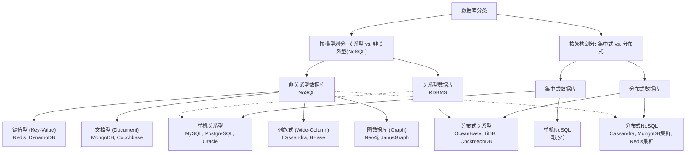

title: 数据库管理工具
author: PanYuKang
cover: 'https://mpimg.cn/view.php/4cc54e530544cf39b2f7e8be8b8c1f55.jpg'
tags:

- 图形化管理
- 数据库
- Navicat

categories:

- 数据库

date: 2024-11-02 15:02:35

---

## Navicat Premium 12

### Navicat简介

**Navicat** 是一款广受欢迎的数据库管理和开发工具，支持多种数据库系统，包括 MySQL、MariaDB、MongoDB、SQL Server、PostgreSQL、Oracle 和 SQLite 等。它提供了直观的图形化界面，使用户可以方便地管理数据库、执行 SQL 查询、设计数据表、管理用户权限和备份数据。

[Navicat下载](https://pan.baidu.com/s/1IzYNJQLPciYrkTXe2ulceQ "提取码：8afm")

[Navicat Premium 12破解方法](https://blog.csdn.net/qq_44670803/article/details/94409634?spm=1001.2101.3001.6650.2&utm_medium=distribute.pc_relevant.none-task-blog-2%7Edefault%7EBlogCommendFromBaidu%7ECtr-2-94409634-blog-90516343.235%5Ev43%5Epc_blog_bottom_relevance_base8&depth_1-utm_source=distribute.pc_relevant.none-task-blog-2%7Edefault%7EBlogCommendFromBaidu%7ECtr-2-94409634-blog-90516343.235%5Ev43%5Epc_blog_bottom_relevance_base8&utm_relevant_index=5)

[注册机5.1激活教程](https://www.cnblogs.com/wei9593/p/11907307.html)

## MySQL数据库

[MySQL下载](https://dev.mysql.com/downloads/mysql/)

[安装教程](https://www.jb51.net/article/176973.htm)

[连接参考教程](https://blog.csdn.net/qq_36344652/article/details/134144396?spm=1001.2101.3001.6650.4&utm_medium=distribute.pc_relevant.none-task-blog-2%7Edefault%7EBlogCommendFromBaidu%7ERate-4-134144396-blog-129466151.235%5Ev43%5Epc_blog_bottom_relevance_base8&depth_1-utm_source=distribute.pc_relevant.none-task-blog-2%7Edefault%7EBlogCommendFromBaidu%7ERate-4-134144396-blog-129466151.235%5Ev43%5Epc_blog_bottom_relevance_base8&utm_relevant_index=9)

只有5.6以前的版本才有在线安装（install msi），5.7之后都是zip压缩版，解压后需要正确配置才能使用。

注意事项：

1. 安装mysql5.7.32-debug-test压缩包zip解压后配置环境变量，但是cmd无法识别mysql相关命令，重新换成没有debug-test后缀的解压，配置环境变量就可以了。具体原因尚未清楚。
2. 使用mysqld --initialize命令前，不要自己创建data目录，否则无法正常生成全部data目录文件，已经手动创建的需要删除后重新执行命令：

   ```
   # mysql数据库初始化
   mysqld --initialize --user=root --console
   ```

注意事项是对安装教程的补充。

用户名和密码分别为root和root;又新建了一个用户名和密码为pyk和pyk;因为root是超级用户，具有最高权限，考虑安全因素，可以授权pyk用户来使用。

## **Oracle 数据库**

下载地址：[ Oracle 11g 安装](https://www.oracle.com/technetwork/database/enterprise-edition/downloads/index.html)

### 什么是 Oracle 数据库

Oracle 数据库是一款功能强大的关系型数据库管理系统（RDBMS），由 Oracle 公司开发。它被广泛应用于企业级应用、数据仓库、电子商务等领域，用于存储、管理和分析大量数据。

### Oracle 数据库的特点

* **可靠性高：** 经过多年的发展，Oracle 数据库在可靠性方面表现出色，能够保证数据的完整性和一致性。
* **性能优异：** Oracle 数据库拥有强大的优化器，能够高效地执行复杂的SQL查询，处理大量数据。
* **安全性强：** 提供了多种安全机制，如用户认证、权限管理、数据加密等，保护数据安全。
* **扩展性好：** 可以随着数据量的增长而扩展，支持大规模的数据存储和处理。
* **功能丰富：** 提供了丰富的功能，包括事务处理、存储过程、触发器、序列等，满足各种应用需求。
* **可移植性好：** 可以运行在多种操作系统和硬件平台上。

## 华为高斯数据库

### **1. 核心特点对比**

| **维度**       | **GaussDB（华为）**                                                           | **Oracle 数据库**                                                             |
| -------------------- | ----------------------------------------------------------------------------------- | ----------------------------------------------------------------------------------- |
| **架构类型**   | - 分布式架构（支持存算分离、弹性扩展）。<br />- 专为大数据和高并发设计。            | - 集中式架构（单机或 RAC 集群）。<br />- 强事务一致性和高吞吐量，适合关键任务场景。 |
| **适用场景**   | - 云原生场景，适合高并发、分布式事务、大数据存储与分析。<br />- 支持 OLTP 和 OLAP。 | - 企业级关键任务（金融、电信等）。<br />- 强事务一致性、高可靠性场景。              |
| **多模支持**   | - 支持关系型、时序型和图数据库。                                                    | - 主要是关系型数据库，也提供 JSON、XML 存储支持。                                   |
| **兼容性**     | - 兼容 PostgreSQL 和主流数据库语法（部分支持 Oracle 迁移）。                        | - 自成生态，语法独特，兼容性较差，迁移到其他数据库难度大。                          |
| **扩展性**     | - 横向扩展性强，分布式存储，轻松应对海量数据增长。                                  | - 通过 RAC 实现扩展，但横向扩展能力有限，扩展成本较高。                             |
| **智能化功能** | - AI 驱动，自动调优、索引推荐、资源优化。                                           | - 提供自动调优工具，但更依赖 DBA 的手动管理和经验。                                 |
| **安全性**     | - 符合中国信息安全标准（如等保 2.0）。                                              | - 拥有全球通用的企业级安全特性（如加密、审计）。                                    |

---

### **2. SQL 语法对比**

#### **（1）相同点**

* **基本查询语法** ：两者均遵循标准 SQL（如 SELECT、INSERT、UPDATE）。
* **事务控制** ：都支持事务一致性（如 COMMIT、ROLLBACK）。

#### **（2）不同点**

| **SQL 特性**      | **GaussDB**                                                 | **Oracle 数据库**                                                  |
| ----------------------- | ----------------------------------------------------------------- | ------------------------------------------------------------------------ |
| **自增列**        | 使用 `SERIAL`或 `GENERATED AS IDENTITY`（PostgreSQL 兼容）。  | 使用 `SEQUENCE`，需要单独创建。                                        |
| **分区表**        | 支持 RANGE、LIST、HASH 等多种分区方式，语法类似 PostgreSQL。      | 支持 RANGE、LIST、HASH，但语法与 Oracle 独特（如 PARTITION BY）。        |
| **窗口函数**      | 完全兼容 PostgreSQL 窗口函数（如 `ROW_NUMBER()`、`RANK()`）。 | 同样支持窗口函数，但部分实现细节可能不同。                               |
| **JSON 操作**     | 使用 PostgreSQL 风格的 JSON 操作符（如 `->`和 `->>`）。       | 使用 Oracle 提供的 JSON 操作函数（如 `JSON_TABLE`和 `JSON_QUERY`）。 |
| **连接语法**      | 兼容标准 SQL 连接语法（如 INNER JOIN、OUTER JOIN）。              | Oracle 使用的连接语法有时较复杂，如旧式 `WHERE`连接方式。              |
| **存储过程/函数** | 支持 PL/pgSQL，语法接近 PostgreSQL。                              | 使用 PL/SQL，语法独特，需要针对 Oracle 特性编写。                        |
| **MERGE 语句**    | 基本兼容标准 SQL 的 MERGE 语法。                                  | Oracle 的 MERGE 语法更丰富，支持复杂的条件更新和插入操作。               |

#### **（3）迁移难度**

* GaussDB 提供工具帮助从 Oracle 数据库迁移，部分 SQL 和存储过程可以自动翻译为 GaussDB 兼容的语法。
* 对于复杂的 Oracle PL/SQL 存储过程，可能需要手动调整。

---

### **3. 性能对比**

#### **（1）事务处理性能**

* **GaussDB** ：
* 分布式事务支持良好，事务处理能力强。
* 在海量数据、高并发的分布式场景下性能表现更优。
* 对于小型事务负载，性能接近 PostgreSQL。
* **Oracle 数据库** ：
* 单节点事务处理性能更强。
* 在金融级关键任务场景中，Oracle 的 ACID 事务一致性表现卓越。

#### **（2）扩展能力**

* **GaussDB** ：
* 基于分布式架构，支持弹性横向扩展，能够处理 PB 级数据增长。
* 更适合现代云原生、大规模数据场景。
* **Oracle 数据库** ：
* 通过 RAC 集群实现扩展，但扩展成本高且复杂。
* 在集中式架构中，性能表现出色，但扩展性相对受限。

#### **（3）查询优化**

* **GaussDB** ：
* 通过 AI 优化 SQL 查询，提供自动索引推荐和执行计划优化。
* 适合数据量大、复杂查询场景。
* **Oracle 数据库** ：
* 拥有强大的优化器，能够对复杂查询进行深入优化。
* 更依赖 DBA 的手动调优。

---

### **4. 选择建议**

* **选择 GaussDB 的场景** ：
* 云原生架构，海量数据分布式存储。
* 对中国信息安全和合规要求较高的行业（如政府、电信）。
* 希望降低数据库授权费用的企业。
* **选择 Oracle 数据库的场景** ：
* 金融、电信等需要超高事务一致性和可靠性的行业。
* 已有 Oracle 数据库部署，迁移成本较高。
* 数据库生态依赖 PL/SQL 或特定的 Oracle 工具。

## 数据库分类

为了更清晰地理解它们之间的关系，先用一个整体的框架图来展示，然后再逐一详解。



---

### 一、关系型数据库 (RDBMS)

这是最传统、最常用的数据库类型，遵循“关系模型”。

- **核心特征**：

  - **结构化数据**：数据必须遵循预定义的表结构（Schema），包括字段名、数据类型等。
  - **SQL操作**：使用标准化的结构化查询语言（SQL）进行数据的增删改查。
  - **ACID事务**：支持原子性（Atomicity）、一致性（Consistency）、隔离性（Isolation）、持久性（Durability），保证数据的一致性。
  - **表与关系**：数据存储在二维表中，表与表之间通过外键建立关系。
- **举例**：

  - **MySQL**: 世界上最流行的开源关系型数据库，广泛应用于Web应用。
  - **PostgreSQL**: 功能更强大的开源关系型数据库，支持JSON、地理空间数据等高级特性。
  - **Oracle Database**: 商业数据库的霸主，功能极其强大、稳定可靠，常用于大型企业核心系统（如银行），但费用昂贵。
  - **Microsoft SQL Server**: 微软旗下的商业数据库，与.NET生态系统紧密集成。

---

### 二、分布式关系型数据库

**它首先是“关系型”的，其次是“分布式”的。** 你可以把它理解为**具备了分布式架构能力的关系型数据库**。

- **核心特征**：

  - 具备上述关系型数据库的所有特征（SQL、ACID、表关系）。
  - 其底层架构是分布式的，数据自动**分片（Sharding）** 并存储在多台机器上。
  - 通常具备强大的分布式事务能力，保证跨节点的数据一致性。
  - 核心目标是解决单机关系型数据库的**扩展性瓶颈**问题，使其能处理海量数据和高并发请求。
- **举例**：

  - **OceanBase**: 阿里自研的原生分布式关系型数据库，在支付宝核心系统经受考验，兼容MySQL/Oracle模式。
  - **TiDB**: PingCAP开源的分布式关系型数据库，兼容MySQL协议，被誉为“分布式版的MySQL”。
  - **CockroachDB**: 一个兼容PostgreSQL协议的开源分布式数据库。
  - **TDSQL**: 腾讯推出的分布式数据库产品，同样兼容MySQL协议。

---

### 三、非关系型数据库 (NoSQL)

这是一个非常宽泛的类别，泛指所有不遵循传统关系模型的数据库。它们的出现主要是为了解决关系型数据库在某些场景下的不足（如扩展性、灵活性）。

- **核心特征**：
  - **灵活的模式**：很多NoSQL数据库是“无模式”或“模式灵活”的，存储的数据结构可以随时变化。
  - **高可扩展性**：通常为分布式架构而生，易于水平扩展（通过添加更多普通服务器）。
  - **最终一致性**：许多NoSQL数据库为追求高性能和高可用，会放宽对“强一致性”的要求。
  - **不使用SQL**：拥有自己特有的数据操作API和查询语言。

NoSQL数据库根据其数据模型，又可分为以下几类：

1. **键值型数据库 (Key-Value Store)**

   - **模型**：最简单的NoSQL模型，像一个大Map，通过唯一的Key来查询Value。
   - **举例**：
     - **Redis**: 最流行的内存键值数据库，也支持持久化。常用于缓存、会话存储、消息队列。**你在项目中用的就是它**。
     - **DynamoDB**: AWS推出的托管式键值/文档数据库。
2. **文档型数据库 (Document Store)**

   - **模型**：Value是结构化的文档，如JSON、XML。数据库可以理解文档内部的结构。
   - **举例**：
     - **MongoDB**: 最著名的文档数据库，非常适合存储非结构化的数据，如博客文章、用户配置文件。
3. **列族式数据库 (Wide-Column Store)**

   - **模型**：数据按列族存储，而不是按行。非常适合进行大规模数据的聚合查询。
   - **举例**：
     - **Cassandra**: 高可用的分布式列族数据库，由Facebook开发。
     - **HBase**: 基于Hadoop的列族数据库，适用于大数据平台。
4. **图数据库 (Graph Database)**

   - **模型**：专门用于存储实体（节点）和它们之间的关系（边）。擅长处理复杂的关系网络。
   - **举例**：
     - **Neo4j**: 最主流的图数据库，用于社交网络、推荐系统、欺诈检测等。

### 总结与对比

| 特性               | 关系型数据库 (MySQL/Oracle) | 分布式关系型数据库 (OceanBase/TiDB) | 非关系型数据库 (Redis/MongoDB)   |
| :----------------- | :-------------------------- | :---------------------------------- | :------------------------------- |
| **数据模型** | 表、行、列                  | 表、行、列                          | 键值、文档、图等                 |
| **Schema**   | 强约束，固定                | 强约束，固定                        | 灵活或无模式                     |
| **查询语言** | SQL                         | SQL                                 | 专用API                          |
| **事务**     | **强ACID**            | **分布式强ACID**              | 通常支持简单事务，多为最终一致性 |
| **扩展方式** | 垂直扩展（升级硬件）        | **水平扩展（增加节点）**      | **水平扩展（增加节点）**   |
| **主要优势** | 事务一致性、复杂查询        | 事务一致性+海量数据扩展性           | 灵活性、极致的性能与扩展性       |
| **典型场景** | 核心交易系统、ERP           | 新核心交易、海量数据业务            | 缓存、内容管理、社交网络、大数据 |
