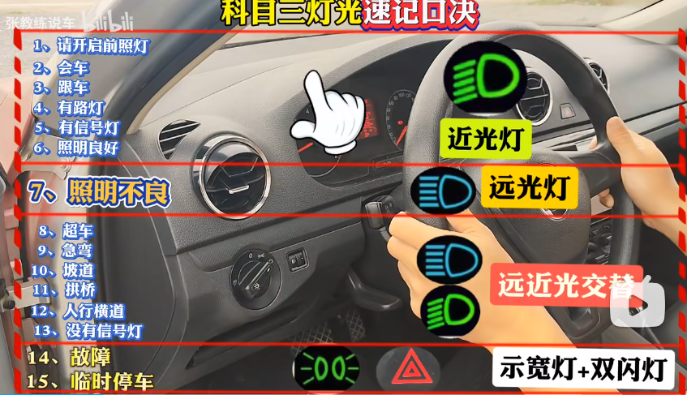

title: 汽车领域
author: PanYuKang
cover: https://mpimg.cn/view.php/065ec218b051add9003f264a1dd1ca99.jpg

tags: [生活技能,汽车知识,驾照考试]

categories: [生活小技能]

date: 2024-12-23 22:45:35

---

现代生活几乎离不开格式格式的交通工具，包括私人小汽车，当然想拥有一辆个人的小汽车，必然要了解一些汽车的基础知识和需要掌握的驾驶技能，还有汽车的发展趋势；随着科学技术水平的不断提高，使得人工智能无人驾驶技术日益成熟，让我们拭目以待吧~

---

# **汽车的发展历史**

1. **萌芽阶段（19世纪初）**
   * 最早的汽车原型是由蒸汽机驱动的交通工具，如卡格诺特的蒸汽马车。
   * 19世纪末，内燃机的发明使现代汽车成为可能。
2. **工业化阶段（20世纪初）**
   * 1908年，福特公司推出了 **T型车** ，实现了流水线生产，大幅降低了汽车成本，汽车开始走进普通家庭。
3. **技术创新阶段（20世纪中后期）**
   * 发动机、底盘、制动系统等技术不断改进，汽车性能提高。
   * 私家车普及，成为主要交通工具。
4. **现代化阶段（21世纪）**
   * 电动车与新能源车迅速发展，代表品牌如特斯拉、小鹏等。
   * 智能化：自动驾驶技术、车联网等功能改善用户体验。

# 燃油车与电动车

## **燃油车的优缺点**

### **优点**

1. **成熟的技术与基础设施**
   * 内燃机技术成熟，制造成本较低，维修方便。
   * 加油站网络密集，加油速度快，长途出行无忧。
2. **续航能力强**
   * 燃油车通常具有更长的续航里程（500-1000公里），适合长途驾驶。
3. **性能稳定**
   * 发动机动力强劲，尤其在高速和越野驾驶时表现优异。

### **缺点**

1. **环境污染**
   * 燃油车尾气排放对空气污染和温室效应贡献较大。
2. **使用成本高**
   * 油价浮动较大，长期来看燃油成本高于电动车的电费。
3. **政策限制**
   * 越来越多国家和城市出台禁售燃油车政策或限行规定。

---

## **电动车的优缺点**

### **优点**

1. **环保节能**
   * 无尾气排放，如果电力来源是清洁能源，碳排放更低。
2. **使用成本低**
   * 电费通常低于燃油费用，且维护成本较低（无需换机油等）。
3. **智能化体验**
   * 配备先进的车联网、辅助驾驶、OTA升级等功能。
4. **政策支持**
   * 多国提供购车补贴、免购置税、免费牌照等优惠政策。

### **缺点**

1. **续航与充电焦虑**
   * 续航能力通常在300-700公里，长途驾驶可能需要频繁充电。
   * 充电设施不如加油站普及，快充时间（30-60分钟）比加油耗时长。
2. **电池老化与更换成本高**
   * 电池随着使用时间性能衰减，约8-10年后可能需要更换，费用较高。
3. **初期购车成本高**
   * 电动车售价一般高于同级别燃油车，尤其是高性能电动车。

---

## **购买选择指南**

### **适合购买燃油车的人**

1. **经常长途驾驶** ：例如跨城出差、自驾游等，对续航里程有较高要求。
2. **偏好稳定性** ：倾向选择技术成熟、故障率低的车型。
3. **基础设施不足** ：居住地充电桩稀少或安装条件有限。
4. **预算有限** ：对购买成本更敏感的消费者。

### **适合购买电动车的人**

1. **城市通勤为主** ：每天行驶里程在100公里以内，充电方便。
2. **环保意识强** ：愿意为减少碳排放贡献力量。
3. **享受智能科技** ：追求先进的驾驶体验和智能化功能。
4. **政策福利吸引** ：所在地区提供电动车牌照、税费优惠等。

# 汽车常见功能区域

## **方向盘区域**

* **喇叭（通常是方向盘中央的圆形或椭圆形区域）：** 用于发出警告声，提醒其他车辆或行人注意。在紧急情况下或需要引起他人注意时使用。
* **多功能按键（部分车型）：** 包括音量调节（VOL +/ -）、频道切换、蓝牙电话、巡航控制等。根据按键上的图标或文字进行操作。

## 仪表盘区域

汽车仪表盘（Instrument Cluster）通常分为以下几个功能区：

- **主仪表区（Primary Instruments）**

  - **转速表（Tachometer）**：左侧，显示发动机转速（单位：×1000rpm）
  - **时速表（Speedometer）**：右侧，显示行驶速度（单位：km/h或mph）
  - **部分车型**：可能将转速表和时速表整合为**组合仪表（Combined Gauge）**（如数字仪表盘）
- **次级信息区（Secondary Information Display）**

  - 油量表（Fuel Gauge）
  - 水温表（Coolant Temperature Gauge）
  - 里程表（Odometer）等

### 仪表盘基础认知

#### 转速表

- **位置**：仪表盘左侧，标有"×1000rpm"字样
- **作用**：显示发动机每分钟旋转次数（1000转/分钟为基本单位）
- **危险区**：红色区域（通常6000rpm以上），长时间高转速伤发动机

#### 时速表

- **位置**：仪表盘右侧，标有km/h单位
- **作用**：显示当前行驶速度（以公里/小时计）
- **特别提示**：表显速度比实际速度约快3-5km/h（安全冗余设计）

### 汽车各驾车型档位功能说明

| 车型             | 档位  | 名称   | 功能与正确用法                                                                             |
| :--------------- | :---- | :----- | :----------------------------------------------------------------------------------------- |
| **自动挡** | P档   | 停车档 | **长时间停车/熄火专用**。车辆停稳后挂入，通过机械锁止变速箱。                        |
|                  | R档   | 倒车档 | **使车辆后退**。必须在车辆**完全停稳后**才能挂入，以免损坏变速箱。             |
|                  | N档   | 空档   | **短时间停车时使用**（如等红灯）。动力被切断，**平路需踩刹车，坡道需拉手刹**。 |
|                  | D档   | 前进档 | **绝大多数前进情况使用**。变速箱自动换挡，实现平稳行驶与省油。                       |
|                  | S档   | 运动档 | **需要强劲动力时使用**（如超车、爬陡坡）。延迟升档提高转速，但油耗会增加。           |
| **手动挡** | 1档   | 起步档 | **车辆起步、爬陡坡、堵车慢行**。扭矩最大，速度最慢。                                 |
|                  | 2档   | 过渡档 | **起步后提速、通过急弯、缓坡、** **及低速掉头**。                              |
|                  | 3档   | 加速档 | **市区中速行驶、提速、超车**。                                                       |
|                  | 4档   | 高速档 | **城市快速路或高架桥等** **中高速匀速行驶**。                                  |
|                  | 5/6档 | 巡航档 | **高速公路或快速路** **高速巡航**。速度最快，油耗相对经济。                    |
|                  | R档   | 倒车档 | **使车辆后退**。通常需按下档把解锁按钮或下压才能挂入。                               |

### 档位与转速/时速对应关系

| 档位 | 建议升档转速 | 经济转速区间 | 对应时速范围 |
| ---- | ------------ | ------------ | ------------ |
| 1档  | 2000-2500rpm | 1500-2500rpm | 0-20km/h     |
| 2档  | 2000-3000rpm | 1500-2500rpm | 20-40km/h    |
| 3档  | 2500-3000rpm | 1800-2500rpm | 40-60km/h    |
| 4档  | 2500-3000rpm | 2000-2500rpm | 60-80km/h    |
| 5档  | -            | 2000-3000rpm | 80km/h+      |

**注意事项**：

- 降档时建议配合补油操作（转速差500rpm补一脚油）
- 经济时速：5档2000rpm约对应80km/h（最省油状态）

#### 实用技巧

##### 听声辨位法

- 发动机声音沉闷（＜1500rpm）：及时降档
- 发动机尖锐嘶吼（＞3000rpm）：需要升档

##### 特殊场景处理

- **上坡**：保持转速在2500-3000rpm获得最大扭矩
- **下坡**：利用低档位（3档以下）配合发动机制动

#### 常见误区

❌ "转速越低越省油"（低于1500rpm反而加重发动机负担）❌ "高档位低速行驶"（5档开40km/h会导致积碳）✅ 正确做法：保持转速在绿色经济区间（各车型不同，参考说明书）

> **小贴士**：新车磨合期建议转速不超过3000rpm，时速不超过100km/h

## **中控台区域**

* **双闪警示灯（通常为红色三角形）：** 用于在紧急情况下提醒其他车辆，如车辆发生故障、发生交通事故等。
* **空调控制区域：**
  * **A/C（或雪花❄️图标）：** 空调制冷开关。在需要制冷时开启。
  * **温度调节旋钮/按键：** 调节车内温度。
  * **风量调节旋钮/按键：** 调节出风量大小。
  * **风向调节旋钮/按键：** 调节出风方向。
  * **内外循环按键：** 内循环用于阻止车外空气进入车内，外循环用于车内外空气流通。
* **音响控制区域：**
  * **电源开关：** 控制音响的开启和关闭。
  * **音量调节旋钮/按键：** 调节音量大小。
  * **模式切换按键（MODE）：** 切换音源，如收音机、USB、蓝牙等。
* **中控锁按键：** 用于锁定或解锁所有车门。
* **车窗升降按键：** 控制车窗的升降。通常主驾驶位有控制所有车窗的按键。
* **后视镜调节按键/旋钮：** 调节后视镜的角度。部分车型带有后视镜加热和电动折叠功能。
* **危险报警闪光灯开关：** 用于在紧急情况下提醒其他车辆，例如车辆发生故障或者发生交通事故时使用。

## **换挡区域**

* **点火开关/启动按键：** 用于启动或关闭发动机。
* **换挡杆：** 用于切换不同的档位（P、R、N、D等）。
* **手刹/电子手刹：** 用于驻车制动。

### 点火开关

在传统钥匙点火系统的汽车中，点火开关通常分为 **LOCK（锁止）、ACC（附件电源）、ON（通电）、START（启动发动机）** 四个档位。以下是每个档位的具体含义和使用场景：

---

#### **1. LOCK（锁止）**

- **含义**：完全关闭车辆电源并锁止方向盘。钥匙可拔出，车辆进入防盗状态。
- **使用场景**：
  - **停车熄火后**：离开车辆时使用。
  - **紧急情况**：行驶中切勿切换到此档位，否则方向盘会锁死，导致失控风险。
- **注意事项**：
  - 部分车型需挂入P挡（自动挡）或空挡（手动挡）才能拔出钥匙。
  - 方向盘锁止后，需轻微转动方向盘并同时转动钥匙才能解锁。

---

#### **2. ACC（附件电源）**

- **含义**：接通部分车载电器电源（如收音机、点烟器、USB充电口等），但发动机和主要电路未启动。
- **使用场景**：
  - **短暂停车时**：如等人时听音乐、使用充电设备。
  - **临时用电需求**：不需要启动发动机，仅需使用车内电器。
- **注意事项**：
  - **避免长时间使用**：蓄电池可能因持续耗电而亏电，导致无法启动。
  - **不供电设备**：大功率设备（如空调、大灯）通常无法在ACC档使用。

---

#### **3. ON（通电/自检）**

- **含义**：全车电路通电，仪表盘指示灯亮起，车辆进入自检状态（如油泵预工作、安全系统激活）。
- **使用场景**：
  - **启动前的准备**：在点火前切换至此档，等待车辆自检完成（仪表盘指示灯熄灭后再启动）。
  - **短时断电后恢复**：如临时关闭发动机但需保持电子设备运行（如导航）。
- **注意事项**：
  - **避免长时间停留**：可能导致点火线圈过热或蓄电池耗电。
  - **自检重要性**：通过仪表盘指示灯检查车辆状态（如机油压力、ABS故障等）。

---

#### **4. START（启动发动机）**

- **含义**：启动马达工作，带动发动机点火。钥匙需短暂保持在此档位直至发动机启动。
- **使用场景**：
  - **冷启动**：车辆完全熄火后首次启动。
  - **热启动**：临时熄火后重新点火（如等红灯时误熄火）。
- **注意事项**：
  - **勿长时间拧住**：启动马达持续工作可能损坏。
  - **启动失败处理**：若发动机未启动，需先回ON档等待数秒再尝试。
  - **自动回弹**：松开钥匙后会自动弹回ON档，保持发动机运行。

---

#### **操作流程示例**

1. **启动车辆**：LOCK → ACC（短暂停留）→ ON（等待自检完成）→ START（点火后松手回ON）。
2. **熄火停车**：
   ON → ACC → LOCK（拔出钥匙）。

---

#### **特殊情况**

- **一键启动车型**：通常通过按键逻辑模拟档位（如不踩刹车按一次进入ACC，按两次进入ON，踩刹车按启动）。
- **方向盘锁死**：若钥匙无法转动，轻微左右晃动方向盘即可解锁。
- **自动挡保护**：未挂P挡时可能无法拔出钥匙。

## **灯光控制区域**

### **灯光控制杆（通常在方向盘左侧）**

#### **旋转部分**

* **关闭（O）：** 所有车外灯光关闭。
* **示廓灯（通常是一个小灯泡的图标）：** 用于在傍晚、黎明、阴天等光线较暗但不需要照明的情况下，提示其他车辆你的位置。示廓灯亮度较低，主要起警示作用。
* **近光灯（通常是一个灯泡向左下方照射的图标）：** 用于夜间在城市道路、有路灯的公路等照明条件较好的情况下行驶。近光灯照射距离较近，不会对对面来车造成眩目。
* **自动大灯（AUTO，部分车型）：** 车辆根据环境光线自动开启或关闭前照灯（通常是近光灯）。

#### **拨动部分**

* **远光灯（将控制杆向前推或向后拉）：** 用于夜间在无路灯的道路、高速公路等需要看清远方的情况下行驶。远光灯照射距离远，亮度高，会对对面来车造成眩目，因此在会车时应及时切换为近光灯。
* **转向灯（向上或向下拨动控制杆）：** 用于在转弯、变道、超车、靠边停车等情况下提示其他车辆你的行驶意图。向上拨动为右转/变道，向下拨动为左转/变道。使用完毕后会自动回位。
* **前雾灯/后雾灯（部分车型，通常在控制杆中间或下方有单独的按键或旋钮）：** 用于在雾天、雨雪天气等能见度较低的情况下提高车辆的可见性。雾灯穿透力强，但亮度较高，在能见度良好的情况下使用会影响其他车辆的视线。

### **其他灯光**

* **日间行车灯（DRL，部分车型）：** 在白天行驶时自动开启的灯光，主要起提示作用，提高车辆在白天的可见性。
* **倒车灯：** 挂入倒车挡时自动开启的灯光，提示后方车辆你正在倒车。
* **刹车灯：** 踩下刹车时自动开启的灯光，提示后方车辆你正在减速或停车。
* **高位刹车灯：** 安装在车辆后部较高位置的刹车灯，进一步提高刹车时的警示效果。
* **牌照灯：** 用于照亮车辆牌照的灯光。

### **灯光的使用场景**

* **傍晚/黎明/阴天：** 使用示廓灯。
* **夜间在城市道路/有路灯的公路：** 使用近光灯。
* **夜间在无路灯的道路/高速公路：** 使用远光灯，但会车时应及时切换为近光灯。
* **雾天/雨雪天气：** 使用雾灯（如果车辆配备）。
* **转弯/变道/超车/靠边停车：** 使用转向灯。
* **倒车：** 倒车灯会自动开启。
* **刹车：** 刹车灯会自动开启。

## **其他按键**

* **发动机启停按键（部分车型）：** 用于控制发动机自动启停功能。
* **自动泊车按键（部分车型）：** 辅助驾驶员进行泊车。
* **驾驶模式切换按键（部分车型）：** 切换不同的驾驶模式，如经济模式、运动模式等。
* **油箱盖开启按键/拉杆：** 用于打开油箱盖。
* **后备箱开启按键/拉杆：** 用于打开后备箱。

# 驾照考试科目大纲

## 科目一到科目四练习时长与考试安排

以下是针对贵州省贵阳市C1驾照考试各科目练习时长和考试安排的一般性指南，结合了常见驾校培训实践和车管所要求：

### 📚 科目一：道路交通安全法律、法规和相关知识

* **练习时长：**
  * **官方要求：** 需完成规定的**12个理论学时**（通常通过驾校指定APP或平台完成在线学习打卡）。
  * **实际备考：** 提前通过驾考宝典、驾校一点通等APP刷题是关键。对于已提前刷题、理解能力较好的学员，**集中学习3-7天**（每天1-2小时）基本可以达到考试要求。贵阳题库与全国统一。
* **考试预约：**
  * 学时刷满后，**无需教练同意**，可通过“交管12123”APP或驾校协助自主预约考试。
  * 贵阳科目一考试点主要在车管所（西南商贸城）或各社会化考场。

#### 🚦 科目一、科目四的最新规定（全国通行）

| 项目                   | 科目一（理论）        | 科目四（安全文明驾驶）                 |
| ---------------------- | --------------------- | -------------------------------------- |
| 考题数量               | 100题                 | 50题                                   |
| 合格标准               | 90分（可错10题）      | 90分（可错5题）                        |
| 考试时间               | 45分钟                | 30分钟                                 |
| **考试次数限制** | ❌ 无限制，可多次补考 | ❌ 无限制，可多次补考                  |
| **有效期**       | 报名之日起3年内有效   | 必须在科三合格后10天内约考，通过后拿证 |

### 🚗 科目二：场地驾驶技能

* **练习时长：**
  * **官方要求：** **16个实操学时**。
  * **实际练习：**
    * 贵阳驾校普遍安排学员**练习2-4周**（每周去2-4次，每次约1-2小时），**累计约15-25小时**是常见范围。
    * **重点难点：** 倒车入库、坡道定点停车和起步是贵阳学员普遍认为耗时最长的项目，侧方停车、曲线行驶、直角转弯相对较快掌握。
* **考试预约：**
  * **教练主导：** 贵阳驾校普遍由教练根据学员的**熟练度、稳定性**以及**驾校内部模拟考成绩**来决定是否同意约考。
  * **学时是基础：** 必须完成规定学时才能约考。
  * **考场：** 贵阳主要在孟关汽贸城科目二考场、三桥车管所考场及各社会化考场（如吉源、祺鑫等）。

### 🛣️ 科目三：道路驾驶技能和安全文明驾驶常识

* **练习时长：**
  * **官方要求：** **24个实操学时**，且**培训里程不得低于300公里**（这是硬性要求）。
  * **实际练习：**
    * 在完成科二后开始练习。由于有里程要求，练习时间相对较长，通常需要**3-6周**。
    * 实际道路训练每次约1-2小时，**累计练习时间通常在20-35小时**左右，重点在于完成里程和掌握实际路况处理。
  * **重点难点：** 直线行驶（贵阳部分路段路面状况影响稳定性）、加减档操作（手动挡）、靠边停车（30cm距离）、模拟灯光、通过学校/公交站等路口的观察与操作。
* **考试预约：**
  * **教练评估 + 里程达标：** 教练会严格评估学员的实际道路驾驶能力（安全意识、操作熟练度、应变能力），**同时必须满足300公里培训里程记录**（通过车载计时计程设备验证）。
  * **模拟考：** 贵阳多数驾校要求学员通过内部或考场的模拟考试后才能正式约考。
  * **考场：** 贵阳主要在金华科目三考场（观山湖区）、孟关科目三考场及各社会化考场。不同考场路线有差异，教练通常会针对性训练。

### 📖 科目四：安全文明驾驶常识

* **练习时长：**
  * **官方要求：** **10个理论学时**。
  * **实际备考：** 题目与科目一有部分重叠，新增多选和情景题。在通过科三后，**集中刷题2-3天**（甚至1天）是常见且可行的。
* **考试预约：**
  * 通过科目三后即可预约，**无需教练同意**。学时刷满是前提。
  * 贵阳通常在通过科目三当天或隔几天就能考科目四，实现“联考”拿证。

### 📌 贵阳C1驾考整体流程与时间要点

1. **流程顺序：** 科一 → 科二 → 科三 → 科四。科一通过后10天才能约科二，科一通过后30天才能约科三。
2. **总时长预估：**
   * **最顺利情况（各科一次过）：** 从科一考完开始算，**约2-3个月**拿证（受学时、约考排队、练车安排影响）。
   * **一般情况：** **3-6个月**比较常见（包含补考、排队等待、个人时间安排等因素）。
3. **核心影响因素：**
   * **个人学习能力和练车频率：** 是决定练习时长的最大变量。
   * **教练安排与驾校效率：** 影响练车进度和约考速度。
   * **考试预约排队情况：** 贵阳热门考场（如孟关）有时需要排队。
   * **300公里培训里程：** 是硬性要求，必须完成。
4. **自主权：**
   * **科一、科四：** 学时满、自认准备充分即可自主预约。
   * **科二、科三：** **教练意见至关重要**，他们通常基于你的表现和模拟考结果决定是否同意你约考。满足学时和里程是基础。

## **科目一：道路交通安全法律、法规和相关知识**

科目一主要考察驾驶员对交通法规、交通信号、安全行车、文明驾驶等基本知识的掌握程度。考试形式为上机考试，共100道题，满分100分，90分及格。

### **考试内容**

* 道路交通安全法律、法规：包括《道路交通安全法》、《道路交通安全法实施条例》等法律法规，以及地方性法规。
* 交通信号：包括交通信号灯、交通标志、交通标线、交通警察手势信号等。
* 安全行车、文明驾驶基础知识：包括安全行车基本原则、常见危险情况的判断和处置、恶劣天气和复杂道路条件下的安全驾驶、文明驾驶行为规范等。
* 机动车基本知识：包括机动车构造、性能、常用机件的检查和维护等。
* 紧急情况下的处置：包括发生交通事故后的自救、互救知识，以及简单的急救常识等。

## **科目二：场地驾驶技能**

以C1驾照为例,科目二主要考察驾驶员在场地内的基本驾驶技能，包括倒车入库、侧方停车、坡道定点停车和起步、直角转弯、曲线行驶（S弯）等。考试形式为实车操作，采用电子评判系统。

### **考试内容（全国通用）**

* 倒车入库：在不碰桩、不压线的前提下，将车辆倒入车库。
* 侧方停车：将车辆驶入道路右侧的停车位。
* 坡道定点停车和起步：在坡道上准确停车，并平稳起步，不溜车、不熄火。
* 直角转弯：在规定的路线内，一次性完成直角转弯。
* 曲线行驶（S弯）：在S形弯道内，控制车辆平稳行驶，不得压线或驶出路外。

---

### **贵州科目二考试项目总数：9项**

- **基础5项**：倒车入库、侧方停车、坡道定点停车与起步、直角转弯、曲线行驶。
- **新增4项**：
  - **模拟隧道行驶**：考核隧道内灯光使用及通行规则。
  - **模拟高速公路停车取卡**：要求精准停车、取卡时不得解开安全带。
  - **窄路掉头**：在狭窄路段完成掉头操作，考察空间判断能力。
  - **模拟雨雾天湿滑路面**：部分资料提及贵州包含该项目（但未明确所有考场均考）。
    ⚠️ **注意**：部分信息显示“通过限宽门”也是贵州项目之一，但“模拟湿滑路面”存在地区差异，建议以当地驾校通知为准。

## **科目三：道路驾驶技能**

科目三主要考察驾驶员在实际道路上的驾驶技能和安全意识，包括起步、直线行驶、加减挡位操作、变更车道、靠边停车、通过路口、会车、超车、掉头、夜间行驶等常见的16个项目（或考核点），结合新规以及实际考试情况进行了整理。考试形式为实车操作，由安全员进行人工评判和电子监控相结合。

### **视频教程**

[16项考试项目赖师详细讲解](https://www.bilibili.com/video/BV1xm4y1B7qX/?spm_id_from=333.788.player.player_end_recommend_autoplay&vd_source=f04bd31ed1fe596257583c07f48036d7 "上集")  [灯光速记口诀](https://www.bilibili.com/video/BV1Af42197Qh/?spm_id_from=333.1387.top_right_bar_window_custom_collection.content.click&vd_source=f04bd31ed1fe596257583c07f48036d7 "灯光速记口诀")  [赖师傅科目三考试合集](https://www.bilibili.com/video/BV1864y1P7YV?spm_id_from=333.788.videopod.sections&vd_source=f04bd31ed1fe596257583c07f48036d7 "视频合集")

### **考试内容（以C1驾照为例）**

#### **上车准备**

绕车一周检查车辆外观及周围环境，确认安全后打开车门上车。调整座椅、后视镜，检查仪表盘，确认灯光复位，系好安全带，确认档位为空挡，检查手刹是否拉起。

#### **灯光模拟**

按照语音指令或考官指令，正确使用各种灯光。

#### **起步**

先开启左转向灯，踩离合、踩刹车挂一档，先松离合至半联动（车辆微微抖动），观察左侧后视镜，确认安全后松开手刹，平稳起步，不熄火、不闯动，起步后及时关闭转向灯。

#### **直线行驶**

保持车辆直线行驶，方向稳定，不跑偏，根据路况合理控制车速，目视前方，注意观察交通情况。

#### **加减挡位操作**

 根据车速和路况，及时、平稳地进行加减挡操作，换挡时动作迅速、准确，不低头看挡，不越级加挡，不空挡滑行。

#### **变更车道**

提前开启转向灯，观察后视镜，确认安全后平稳变更车道，不得影响其他车辆正常行驶。变更车道后及时关闭转向灯。

#### **靠边停车**

提前开启右转向灯，观察后视镜，选择合适的地点和时机靠边停车，车身与道路边缘线保持适当距离（30cm以内），停车后拉紧手刹，关闭转向灯，挂空挡。

#### **通过路口**

观察路口交通信号灯和交通标志，根据信号灯指示和路况安全通过路口。通过路口前减速慢行，注意避让行人、非机动车和优先通行的车辆。

#### **会车**

正确判断会车时机和距离，选择合适的会车地点，减速慢行，必要时停车避让。

#### **超车**

 在允许超车的路段，提前开启左转向灯，观察后视镜，确认安全后从被超车辆左侧超越，超越后开启右转向灯，驶回原车道，并及时关闭转向灯。超车过程中不得妨碍被超车辆的正常行驶。

#### **掉头**

选择允许掉头的地点，观察交通情况，开启左转向灯，安全掉头。掉头时不得妨碍其他车辆和行人正常通行。

#### **夜间行驶**

正确使用灯光，包括远光灯、近光灯、示宽灯、雾灯等。会车时应将远光灯转换为近光灯。通过路口、人行横道等要交替使用远近光灯提示。

#### **人行横道线**

 遇行人通过人行横道线时，应当停车让行。

#### **学校区域和公共汽车站**

 通过学校区域和公共汽车站时，应当减速慢行，注意避让行人。

##### **考试扣分点**

| **错误操作**     | **后果**              |
| ---------------------- | --------------------------- |
| 未提前减速（超30km/h） | 直接扣100分                 |
| 未左右观察             | 扣100分（系统检测头部动作） |
| 2挡速度低于15km/h      | 拖挡扣10分                  |
| 停车让行后未换1挡起步  | 起步闯动扣10分              |

#### **加减档位与速度配合**

 考试过程中，要根据路况和车速合理选择档位，做到档位与速度相匹配，避免拖挡或高挡低速行驶。

#### **安全意识和文明驾驶**

 考试过程中，要表现出良好的安全意识和文明驾驶习惯，例如：观察交通情况、礼让行人、不争道抢行、不随意变道等。

### **🚗 堵车时"一走一停"操作步骤**

#### **1. 停车阶段（减速→停止）**

1. **预判前车动态**

   - 前车刹车灯亮起时，**立即松开油门**，利用发动机制动减速（不踩离合，让发动机拖慢车速）。
   - 如果距离较近或车速较快，**轻踩刹车**辅助减速。
2. **踩离合时机**

   - 当车速降至**当前档位的最低临界点**（例如2档车速<10km/h时发动机会明显抖动），**迅速踩下离合器踏板**（避免熄火）。
   - *小技巧：* 堵车时建议保持**2档或1档**行驶，避免用高档位（如3档以上）低速跟车。
3. **完全停止**

   - 离合器踩到底后，**继续用刹车停稳车辆**。
   - 若停车时间>3秒：**挂空挡+松离合+拉手刹**（解放左脚）。
   - 若短暂停车（1-2秒）：可保持**1档+踩住离合+刹车**（随时准备起步）。

---

#### **2. 起步阶段（平顺跟车）**

1. **准备起步**

   - 前车开始移动时，**踩离合挂1档**（若坡度较大或前车提速快可直接用2档起步）。
2. **半联动控制**

   - **缓慢抬离合至半联动点**（车身轻微抖动/转速表指针略降）。
   - *堵车关键技巧：* 此时**右脚轻搭在刹车上**（不踩油门），仅靠半联动让车缓行（适合极低速跟车）。
   - 若需要更快起步：在半联动点时**轻补油门**（转速1200-1500转）。
3. **跟车速度控制**

   - 前车动则抬离合+轻油门，前车停则踩离合+刹车。
   - *省力技巧：* 用**半联动短暂控制车速**（如0.5-1秒），减少频繁换挡。

---

#### **⚠️ 堵车时的注意事项**

1. **保持安全车距**

   - 与前车保持**至少半个车身的距离**，避免频繁起步停车（给自己留出半联动蠕行的空间）。
2. **档位选择策略**

   - **低速跟车（<10km/h）：** 用1档半联动或2档轻油门。
   - **短距离挪车：** 不加油门，仅靠半联动蠕动（类似科目二坡起）。
   - *避免长时间1档高转速*（如>2500转），可升2档但需控制车速。
3. **保护离合器**

   - 禁止**长时间半联动**（超过5秒）或**踩着离合滑行**，否则会烧蚀离合器片。
   - 停车超3秒务必挂空挡！
4. **坡道堵车**

   - 拉手刹辅助起步，避免溜车（参考坡道起步技巧）。
   - 可适当提高起步转速（1500-2000转）。

---

### 红灯停车-起步-升档操作

#### 🚦 一、红灯停车步骤 (平稳、安全地停下)

1. **预判与减速：**

   * 看到前方红灯或车流停止时，提前松开油门踏板。
   * 根据距离和车速，**轻踩刹车踏板**开始减速。目标是让车速平缓下降。
2. **踩下离合器（离合）：**

   * 当车速降到一定程度（通常感觉发动机开始轻微吃力，或者转速明显下降，比如低于1000-1500转），**左脚迅速将离合器踏板踩到底**。这断开了发动机和车轮的连接，防止发动机熄火。
   * *关键点：* 不要在高速时过早踩死离合滑行（空挡滑行），这样会失去发动机制动，增加刹车负担且不安全（某些地区法规禁止）。应该先利用刹车和发动机制动减速。
3. **继续制动至停止：**

   * 在离合器踩到底的状态下，**继续用右脚控制刹车踏板**，平稳地将车完全停住。确保停在停止线内。
4. **挂入空挡：**

   * 车辆完全停稳后，**将换挡杆移入空挡位置**。此时可以松开离合器踏板（左脚完全离开），让左脚休息。*（注意：有些老司机习惯在停稳前就挂入空挡，但更推荐完全停稳后挂空挡，确保控制）*
   * *为什么挂空挡？* 避免长时间踩着离合器导致分离轴承过度磨损，也让左脚休息。
5. **拉起手刹（驻车制动）：**

   * **拉起手刹**（电子手刹则按下按钮）。特别是在有坡度的路口，这是必须的，防止溜车。即使在平路，养成拉手刹的习惯也更安全。
   * **右脚可以松开刹车踏板**休息（但保持随时可以踩刹车的准备）。

#### 🚗 二、红灯起步步骤 (平稳、不熄火地起步)

1. **准备起步：**

   * 观察交通信号灯，当绿灯即将亮起或前车开始移动时，做好起步准备。
   * **左脚将离合器踏板踩到底**。
   * **右手将换挡杆挂入1档**。
2. **找到半联动点（关键！）：**

   * **非常缓慢地抬起离合器踏板**。
   * 当抬到某个位置时，你会感觉到：
     * **发动机声音发生变化**（转速表指针可能轻微下降）。
     * **车身有轻微抖动**。
     * **车头有轻微抬起的趋势**。
   * 这个点就是**半联动点**。此时离合器开始传递部分动力到车轮。
3. **稳住离合 & 轻给油：**

   * **在感觉到半联动点的瞬间，左脚稳住离合器踏板不动（或极其缓慢地再抬一点点）**。
   * **同时，右脚轻轻踩下油门踏板**，让发动机转速稍微提升（通常到1000-1500转左右即可，根据车辆和坡度调整）。听到发动机声音变沉稳有力。
4. **完全松开离合 & 平稳起步：**

   * 在轻给油的同时，**左脚继续非常缓慢地抬起离合器踏板**，直到完全松开。
   * 车辆开始平稳起步。**右脚继续平稳地踩油门加速**。
5. **起步后操作：**

   * 车辆动起来后，根据前方路况和车速，准备升到2档。

#### ⬆ 三、升档步骤 (顺畅加速)

1. **加速：**

   * 在当前的档位下（如1档起步后），**平稳踩油门踏板加速**，将发动机转速提升到合适的换挡转速。
   * *换挡时机参考：* 通常在 **2000转 - 3000转** 之间比较平顺（具体因车而异，看感觉或听发动机声音，感觉动力充沛但不过于嘶吼时即可）。新手可以多观察转速表。
2. **收油门 & 踩离合：**

   * 达到目标转速后，**迅速完全松开油门踏板**。
   * **同时，左脚快速将离合器踏板踩到底**。
3. **换入更高档位：**

   * **右手将换挡杆准确、利落地从当前档位移入下一个更高档位**（如1->2, 2->3, 3->4, 4->5, 5->6）。
4. **抬离合 & 给油：**

   * **左脚平稳地抬起离合器踏板**（相比起步，升档时抬离合的速度可以稍快一些，但仍需平顺）。
   * **在离合器抬起到半联动点之前或同时，右脚开始平稳地踩下油门踏板**，继续加速。
   * 离合器完全结合后，油门深度根据需要调整。

### 靠边停车步骤

#### **标准操作流程**

##### **观察与准备**

- **观察路况**：
  - 通过后视镜观察后方车辆、行人及非机动车，确认安全后准备停车。
  - 选择允许停车的路段（无禁停标志、标线，避开路口、公交站等）。
- **开启右转向灯**：提前3秒以上打右转向灯，提示后方车辆。

##### **减速与调整方向**

- **减速降档**：
  - 松油门，轻踩刹车减速，车速降至 **20-30公里/小时**。
  - 逐级降档（如从4档→3档→2档），最终挂入 **1档**或保持2档（根据车速灵活选择）。
- **向右微调方向**：
  - 向右轻打方向盘（约30°），使车辆逐渐靠近路边，车身与路沿保持 **30厘米以内**（考试要求通常为30cm）。
  - **调整技巧**：可通过右后视镜观察车轮与路沿距离，或以前挡风玻璃右下角与路沿重合为参考。

##### **精准停车**

- **修正车身**：
  - 接近目标位置时回正方向盘，避免过度靠近或压线。
  - 若距离过远，可向左微调方向后再向右修正（需配合车速控制）。
- **停车操作**：
  - 踩离合到底，轻踩刹车至车辆完全停稳。
  - 拉起手刹，挂空挡，松开离合和刹车踏板。
  - **关闭转向灯**，若夜间需开启示廓灯或双闪（视情况而定）。

##### **停车后检查**

- **确认距离**：观察右后视镜，确保车身与路沿距离符合要求（30cm以内）。
- **安全细节**：熄火（考试时可能不需熄火），解开安全带前观察后方是否安全。

---

#### **关键注意事项**

1. **距离控制**：

   - 考试中距离超过30cm扣10分，压线直接不合格。
   - 日常驾驶中距离过远可能被贴罚单，过近易刮蹭车轮或底盘。
2. **车速与档位匹配**：

   - 低速时避免高档位（如3档以上），防止熄火。
   - 考试中若因换挡失误导致熄火，需迅速重新启动车辆。
3. **方向盘修正技巧**：

   - 遵循“少量多次”原则，每次调整方向幅度不超过15°。
   - 忌猛打方向，否则易压线或车身歪斜。
4. **特殊路况处理**：

   - 坡道停车：需配合手刹和脚刹防止溜车。
   - 湿滑路面：提前减速，避免急刹导致侧滑。

### 灯光模拟速记

#### **一、近光灯场景（开启前照灯后默认近光）**

* **请开启前照灯(向右扭两下)**
* **会车**
* **跟车行驶**
* **有路灯的道路**
* **有交通信号灯的路口**
* **照明良好的路段**
* **夜间直行通过路口**

> ✅ **口诀**：
> **“会跟路灯信号好，近光不变要记牢”**

---

#### **二、远光灯场景（需手动切换）**

* **照明不良的道路**（如无路灯、隧道）

> ✅ **口诀**：
> **“照明不良开远光，其他情况别乱闯”**

---

#### **三、远近光交替场景（闪烁2~3次）**

* **超车**
* **急弯**
* **坡道**
* **拱桥**
* **人行横道**
* **无信号灯的路口**

> ✅ **口诀**：
> **“超车弯道坡拱桥，人行无灯闪两下”**

---

#### **四、示宽灯+双闪灯场景**

13. **车辆故障**
14. **临时停车**

> ✅ **口诀**：
> **“故障停车双闪亮，示宽灯也别忘”**

---

## **科目四：安全文明驾驶常识**

科目四主要考察驾驶员在复杂道路和特殊天气条件下的安全驾驶知识、紧急情况下的处置方法、交通事故后的处理程序等。考试形式为上机考试，共50道题，满分100分，90分及格。

### **考试内容**

* 恶劣气象和复杂道路条件下的安全驾驶知识：包括雨天、雾天、雪天、冰雪路面、山区道路、高速公路等条件下的安全驾驶技巧。
* 紧急情况下的避险常识：包括爆胎、制动失灵、转向失控等紧急情况下的处置方法。
* 交通事故后的处置知识：包括保护现场、报警、急救等程序。
* 文明驾驶行为：包括礼让行人、文明使用灯光、不酒后驾驶、不疲劳驾驶等。

## C1手动档与C2自动档

### 手动挡车辆的档位

手动挡车辆的档位一般是R（倒挡）、1-5档（前进档），每个档位对应不同的传动比，需要驾驶员手动换挡。

* **R档（Reverse）：** 倒车档，倒车考试时需使用**R档**。
* **1-5档：** 前进档，数字越大，传动比越大，车辆行驶速度越快。
* **空档（N档）** ：无动力输出，用于临时停车或启动发动机。
  

### 自动挡车辆的档位

自动挡车辆的档位通常是P、R、N、D、S、L等，车辆会根据行驶速度自动选择合适的档位。

* **P档（Parking）：** 停车档。
* **R档（Reverse）：** 倒车档。
* **N档（Neutral）：** 空档。
* **D档（Drive）：** 行驶档。
* **S档（Sport）：** 运动模式。
* **L档（Low）：** 低速档。
  

### C1手动挡档位介绍

* **R档（Reverse）：** 倒车档。挂入此档，车辆向后行驶。
* **1-5档（1st-5th gear）：** 前进档。数字越大，档位越高，传动比越大，车辆速度越快，但扭矩越小。

#### **档位常见速度区间与场景**

**1档（0-20 km/h）**

* **场景** ：起步、陡坡爬升、极低速挪车（如堵车时蠕动）、需要大扭矩的情况（如拖重物）。
* **说明** ：1档仅用于起步或极低速行驶，长时间使用容易导致高转速低车速，增加磨损。

**2档（15-30 km/h）**

* **场景** ：起步后短距离加速、低速转弯后提速、拥堵路段跟车、缓坡行驶。
* **说明** ：适合需要轻微加速但车速较低的路况，避免长时间用2档高速行驶。

**3档（25-50 km/h）**

* **场景** ：城市道路中速行驶（如30-40 km/h）、平缓加速、超车前的准备档位。
* **说明** ：最常用的日常驾驶档位之一，兼顾动力和燃油经济性。

**4档（40-70 km/h）**

* **场景** ：郊区道路、快速路巡航（如50-60 km/h）、中等坡度路段。
* **说明** ：高速行驶前的过渡档位，适合稳定车速但无需急加速的情况。

**5档（60 km/h及以上）**

* **场景** ：高速公路、长直平路巡航（80-120 km/h）。
* **说明** ：省油档位，适合匀速行驶，但需注意动力响应较慢，超车可能需要降档。

### C2自动挡档位介绍（常见）

1. **P档（Parking）停车档**
   * 用于长时间停车（例如熄火停车时）。
   * 此档位会锁定变速器，防止车辆移动，通常需要踩下刹车才能从P档切换到其他档位。
2. **R档（Reverse）倒车档**
   * 用于倒车时选择。
   * 切换到此档时，车辆的倒车灯会点亮，提醒后方车辆和行人。
3. **N档（Neutral）空档**
   * 相当于手动挡汽车的空挡。
   * 车辆处于待机状态，没有动力输出，常用于短暂停车，例如等红灯。
4. **D档（Drive）前进档**
   * 用于正常的前进驾驶。
   * 自动挡车在D档位下，会根据速度和负载自动调整变速器档位。
5. **S档（Sport）运动模式**
   * 用于需要更高动力输出的情况，例如超车或快速加速。
   * 此档位下，变速器会延迟升挡，提高发动机转速。
6. **L档（Low）低速档**
   * 用于爬坡、下坡或拖重物时，提供更大的扭矩输出。
   * 通常限制在1、2档，防止频繁升降档。

### 两者之间的主要区别

* **操作方式：** 这是C1和C2最本质的区别。C1需要手动操作离合器，而C2则不需要。
* **适用范围：** C1的准驾车型范围更广，可以驾驶手动挡和自动挡汽车，而C2只能驾驶自动挡汽车。
* **驾驶难度：** C1的驾驶难度较高，需要较高的协调性，而C2的驾驶难度较低，更容易上手。

# 驾驶技巧整理

## **C1驾照考试计划清单**

### **理论部分**

1. **制定学习计划**
   - 每天至少1小时学习理论知识。
2. **使用刷题APP**
   - 下载并使用“驾考宝典”、“驾校一点通”等APP进行科目一和科目四的模拟试题练习。
   - 每天完成一定数量的判断题、单选题和多选题。
3. **参加驾校理论课程**
   - 参与驾校组织的理论课程，系统学习道路交通安全法律法规、交通信号、通行规则等知识。
4. **阅读驾考相关书籍**
   - 阅读驾考辅导书籍，加深对知识点的理解和记忆。

#### 驾考宝典科一笔记

* 机动车登记分为注册、变更、转让、抵押、注销登记五种。
* 初次申领机动车号牌或行驶证的，应当向住所地车管所申请注册登记。
* 驾驶人申请准驾车型的，应向核发地车辆管理所申请。
* 驾驶人身体条件证明自出具之日起有效期为6个月。
* 没有中心线道路：城市道路限速30，公路限速40；有中心线道路：城市道路限速50，公路限速70。（口诀：城3、5，公4、7）
* 驾驶人连续驾驶不得超过4小时。疲劳驾驶开4小时需休息不得少于20分钟。
* 初次饮酒驾驶，暂扣6个月驾驶证，罚款1-2千。再次饮酒驾驶，吊销驾驶证，10日拘留，罚款1-2千。
* 醉酒驾驶，吊销执照，五年内不得重考，审判后处拘役，并处罚金。
* 驾驶机动车造成交通事故后逃逸，尚不构成犯罪的，公安机关交通管理部门会处以200-2000元以下罚款。
* 隐瞒情况或提供虚假资料申领驾驶证的，公安机关交通管理部门不予受理或不予办理，处500元以下罚款，一年内不得再次申领。
* 驾驶机动车超员或超速，构成犯罪，被吊销驾驶证的，5年内不得申请机动车驾驶证。
* 机动车驾驶人申请学法减分，参加道路交通安全法律、法规和相关知识学习的，公益1小时扣减1分，网络1小时1分，现场1小时2分。
* 申请增加轻型牵引挂车准驾车型的，应取得驾驶小型汽车、小型自动档汽车准驾车型资格1年以上。
* 停车位标线为白色表示收费停车位、黄色是专属停车位、蓝色是免费停车位。
* 1.申请小型汽车、小型自动挡汽车、残疾人专用小型自动挡载客汽车、轻便摩托车准驾车型的，在18周岁以上;
  2.申请普通三轮摩托车、普通二轮摩托车准驾车型的，在18周岁以上，70周岁以下;
  3.申请轻型牵引挂车准驾车型的，在20周岁以上，70周岁以下;
  4.申请低速载货汽车、三轮汽车、轮式专用机械车准驾车型的，在18周岁以上，63周岁以下;
  5.申请城市公交车、中型客车、大型货车、无轨电车或者有轨电车准驾车型的在20周岁以上，63周岁以下;
  6.申请大型客车、重型牵引挂车准驾车型的，在22周岁以上，63周岁以下;
  7.接受全日制驾驶职业教育的学生，申请大型客车、重型牵引挂车准驾车型的，在19周岁以上，63周岁以下。
* 以隐瞒或欺骗手段补领机动车驾驶证的，会受到处200元以上500元以下的罚款。
* 潮汐车道：双黄虚线的车道。是一种根据交通流量变化动态调整行驶方向的车道，旨在缓解城市早晚高峰的交通拥堵现象。
* **虚假500**：隐瞒/虚假材料申领驾照（罚500，禁申1年）。**作弊1000**：审验教育造假（罚1000，记录作废）。**欺骗贿赂2000**：考试贿赂或替考（罚2000，禁申3年）
* 进出非机动车道，通过铁路道口、急弯路、窄路、窄桥时，最高行驶速度不得超过每小时30公里。
* 大型客车核载人数20人以上（含20人）；中型客车核载人数10—19人（含19人）；小型客车核载人数小于9人（含9人）；微型载客汽车核载人数8人以下（含8人）。

##### 刑罚类考题年限归类

| 刑罚年限                   | 核心记忆线索           | 主要涉及罪名                                                                                                          | 关键构成与易混点                                                                           |
| :------------------------- | :--------------------- | :-------------------------------------------------------------------------------------------------------------------- | :----------------------------------------------------------------------------------------- |
| **拘役 (+罚金)**     | **“醉驾替考”** | 1.**危险驾驶罪** (醉驾、追逐竞驶) 2. **代替考试罪**                                                  | 这是最轻的刑事处罚，不涉及“有期徒刑”。**“替考罪”** 是双方（枪手和考生）都处罚。  |
| **3年以下** (或拘役) | **“基本刑期”** | 1.**交通肇事罪** (基本型) 2. **组织作弊罪** (基本型) 3. **伪造、变造买卖证件罪** (基本型) | 这是大多数犯罪的“起步价”。**注意：交通肇事罪这个档位没有罚金。**                   |
| **3-7年**            | **“情节严重”** | 1.**交通肇事罪** (逃逸或情节恶劣) 2. **组织作弊罪** (情节严重)                                       | 看到“**因逃逸致人死亡**”或“**情节特别严重**”等描述，就要想到这个刑期档位。 |
| **7年以上**          | **“后果极重”** | **交通肇事罪** (因逃逸致人死亡)                                                                                 | 这是交通肇事罪的最高刑期，专门针对“逃逸”导致受害人得不到救助而死亡这一极其恶劣的情节。   |

##### 🚗 高速公路 vs. 城市快速路 限速对照表

| **道路类型**   | **同向车道** | **车道位置** | **最低限速** | **最高限速** | **核心记忆逻辑**                                  |
| :------------------- | :----------------- | :----------------- | :----------------- | :----------------- | :------------------------------------------------------ |
| **高速公路**   | 2条                | 左侧               | 100                | 120                | **高速：高6、12** （最低限速高，扣分直接6或12分） |
|                      | 2条                | 右侧               | 60                 | 120                |                                                         |
|                      | ≥3条              | 最左侧             | 110                | 120                |                                                         |
|                      | ≥3条              | 中间               | 90                 | 120                |                                                         |
|                      | ≥3条              | 最右侧             | 60                 | 120                |                                                         |
| **城市快速路** | 2条                | 左侧               | 80                 | 通常100            | **快速：低8、10** （最低限速低，最高常为100）     |
|                      | 2条                | 右侧               | 60                 | 通常100            |                                                         |
|                      | ≥3条              | 左侧/中间          | 80                 | 通常100            |                                                         |
|                      | ≥3条              | 最右侧             | 60                 | 通常100            |                                                         |

---

##### ✅ 学法减分

一个记分周期12个月，在此期间最高只能减扣6分。

| 学习方式           | 官方规则（精简版）                                                                                 | 口诀                                               |
| :----------------- | :------------------------------------------------------------------------------------------------- | :------------------------------------------------- |
| **网上学习** | **3日内累计学满30分钟**，考试合格后，**一次扣减1分**。                                 | **“331”规则**  （3天、30分钟、减1分） |
| **现场学习** | 参加公安机关交通管理部门组织的现场学习**满1小时**， 考试合格后，**一次扣减2分**。 | **“112”规则**  （1小时、1次、减2分）  |
| **公益活动** | 参加公安机关交通管理部门组织的 交通安全公益活动**满1小时**，**一次扣减1分**。     | **“111”规则**  （1小时、1次、减1分）  |

---

##### ✅ 满分学习

| 累计记分周期内达到分值                | **必须参加的学习与考试项目**                                                                   | **学习天数要求** |
| :------------------------------------ | :--------------------------------------------------------------------------------------------------- | :--------------------- |
| **1个12分（记满12分至23分）**   | **学习：** 道路交通安全法律、法规和相关知识（科目一） **考试：** 科目一             | **7天**          |
| **2个12分（24分至35分）**       | **学习：** 科目一 + 道路驾驶技能  **考试：** 科目一 + 科目三                        | **不少于30天**   |
| **3个12分及以上（36分及以上）** | **学习：** 科目一 + 道路驾驶技能 + 场地驾驶技能 **考试：** 科目一 + 科目三 + 科目二 | **不少于40天**   |

---

###### 💡 考试与实用核心要点

请您务必记住以下几条，这是理解“满分学习”的关键：

1. **学习天数是硬性规定**：您的笔记在“天数”上需要重要修正。这不是一个可以快速完成的过程：

   * **满12分**：学习**7天** → 考科目一。
   * **满24分**：学习**不少于30天** → 考科目一和科目三。
   * **满36分**：学习**不少于40天** → 考科目一、科目二和科目三。
2. **“科目三”指的是道路驾驶技能考试**，这与考驾照时的科目三是一致的，不要混淆。
3. **驾驶证状态**：当您的驾驶证被记满12分后，它会被**暂扣**。只有在您完成规定的学习和考试，并且考试合格后，记分才会清除，驾驶证才能恢复使用。
4. **拒不参加的后果**：如果驾驶人无正当理由逾期未参加“满分学习”和考试，公安机关交通管理部门将**公告其驾驶证停止使用**。

**总结一下：**
记住 **“12分学7天考科一，24分学30天考科一三，36分学40天考全科”**。

##### 📝 高速公路能见度考试标准

| 能见度 (米)     | 最高车速 (km/h) | 最小车距 (米) | **必须开启的灯光**                                        |
| :-------------- | :-------------- | :------------ | :-------------------------------------------------------------- |
| **＜200** | **60**    | **100** | 雾灯、近光灯、示廓灯、前后位灯                                  |
| **＜100** | **40**    | **50**  | 雾灯、近光灯、示廓灯、前后位灯 +**危险报警闪光灯 (双闪)** |
| **＜50**  | **20**    | -             | **尽快从最近的出口驶离高速公路**                          |

###### 🚗 记忆口诀

为了方便您记忆，可以记住这个口诀：
**“261，145，520”**

* **261**：能见度200米，限速60，车距100。
* **145**：能见度100米，限速40，车距50。
* **520**：能见度50米，限速20，**驶离（0）** 高速。

##### 英文缩写和描述

CCS（ Cruise Control System）：定速巡航系统

AFS（Adaptive Front-lighting System）：前照灯系统

ACC（自适应巡航系统）

LDW（车道偏离预警系统）

| **功能**     | **ACC (自适应巡航)**             | **LDW (车道偏离预警)**                       |
| ------------------ | -------------------------------------- | -------------------------------------------------- |
| **核心作用** | **辅助控制车速** ，减轻驾驶疲劳  | **提醒车道位置** ，纠正无意识偏离            |
| **工作方式** | 雷达监测前车，自动保持安全距离跟车     | 摄像头识别车道线，在**无打灯偏离**时发出警报 |
| **适用场景** | 高速、快速路等**路况较好**的道路 | 所有**车道线清晰**的道路，尤其中长途驾驶     |

#### **交通违法处罚类**

| 道路交通安全违法行为                                                                                                       | 具体处罚                                                                                                                                   |
| :------------------------------------------------------------------------------------------------------------------------- | :----------------------------------------------------------------------------------------------------------------------------------------- |
| 违反道路交通安全法律、法规关于道路通行规定                                                                                 | 处警告或者20元以上200元以下罚款                                                                                                            |
| 饮酒后驾驶机动车                                                                                                           | 暂扣6个月机动车驾驶证，并处1000元以上2000元以下罚款                                                                                        |
| 因饮酒后驾驶机动车被处罚，再次饮酒后驾驶机动车                                                                             | 处10日以下拘留， 并处并处1000元以上2000元以下罚款，吊销机动车驾驶证                                                                   |
| 醉酒驾驶机动车                                                                                                             | 由公安机关交通管理部门约束至酒醒， 吊销机动车驾驶证，依法追究刑事责任； 5年内不得重新取得机动车驾驶证                            |
| 饮酒后或醉酒驾驶机动车发生重大交通事故，构成犯罪                                                                           | 依法追究刑事责任，并由公安机关 交通管理部门吊销机动车驾驶证， 终止不得重新取得机动车驾驶证                                            |
| 违反道路交通安全法律、 法规关于机动车停放、临时停车规定                                                               | 指出违法行为，并予以口头警告，令其立即驶离                                                                                                 |
| 机动车驾驶人不在现场或者虽在现场但拒绝车辆立即驶离， 妨碍其他车辆、行人通行                                           | 处20元以上200元以下罚款， 并可以将该机动车拖到不影响交通的地点 或者公安机关交通管理部门指定的地点停放                            |
| 上道路行驶的机动车未悬挂机动车号牌， 未放置检验合格标志、保险标志， 或者未随车携带行驶证、驾驶证                 | 公安机关交通管理部门应当扣留机动车， 通知当事人提供相应的牌证，标志或者补办相应手续， 并处警告或者20元以上200元以下罚款          |
| 故意遮挡、污损或者不按规定安装机动车号牌                                                                                   | 处警告或者20元以上200元以下罚款                                                                                                            |
| 伪造、变造或者使用伪造、变造的  机动车登记证书、号牌、行驶证、驾驶证                                             | 由公安机关交通管理部门予以收缴， 扣留该机动车，处15日以下拘留， 并处2000元以上5000元以下罚款； 构成犯罪的，依法追究刑事责任 |
| 伪造、变造或者使用伪造、变造的 检验合格标志、保险标志                                                                 | 由公安机关交通管理部门予以收缴， 扣留该机动车，处10日以下拘留， 并处1000元以上3000元以下罚款； 构成犯罪的，依法追究刑事责任 |
| 使用其他车辆的机动车登记证书、 号牌、行驶证、检验合格标志、保险标志                                                   | 由公安机关交通管理部门予以收缴， 扣留该机动车，处2000元以上5000元以下罚款                                                             |
| 非法安装警报器、标志灯具                                                                                                   | 由公安机关交通管理部门强制拆除， 予以收缴，并处200元以上2000元以下罚款                                                                |
| 机动车所有人、管理人未按照国家 规定投保机动车第三者责任强制保险                                                       | 由公安机关交通管理部门扣留车辆至依照规定投保后， 并处依照规定投保最低责任限额应缴纳的保险费的2倍罚款                                  |
| 未取得机动车驾驶证、机动车驾驶证被吊销或者 机动车驾驶证被暂扣期间驾驶机动车                                           | 由公安机关交通管理部门处200元以上2000元以下罚款， 可以并处15日以下拘留                                                                |
| 将机动车交由未取得机动车驾驶证或者 机动车驾驶证被吊销、暂扣的人驾驶                                                   | 由公安机关交通管理部门处200元以上2000元以下罚款， 可以并吊销机动车驾驶证                                                              |
| 造成交通事故后逃逸、尚不构成犯罪                                                                                           | 由公安机关交通管理部门处200元以上2000元以下罚款， 可以并处15日以下拘留                                                                |
| 机动车行驶超过规定时速50%                                                                                                  | 由公安机关交通管理部门处200元以上2000元以下罚款， 可以并处吊销机动车驾驶证                                                            |
| **强迫机动车驾驶人**违反道路交通安全法律、 法规和机动车安全驾驶要求驾驶机动车， 造成交通事故，尚不构成犯罪 | 由公安机关交通管理部门处 200元以上2000元以下罚款； 可以并处 15日以下拘留                                                              |
| **违反交通管制的规定**强行通行，不听劝阻的                                                                           | 由公安机关交通管理部门处 200元以上2000元以下罚款； 可以并处 15日以下拘留                                                              |
| **故意损毁、移动、涂改交通设施** ， 造成危害后果，尚不构成犯罪的                                                | 由公安机关交通管理部门处 200元以上2000元以下罚款； 可以并处 15日以下拘留                                                              |
| **非法拦截、扣留机动车辆** ，不听劝阻， 造成交通严重阻塞或者较大财产损失的                                      | 由公安机关交通管理部门处 200元以上2000元以下罚款； 可以并处 15日以下拘留                                                              |
| **驾驶拼装的机动车**或者**已达到报废标准的机动车**上道路行驶                                                   | 公安机关交通管理部门应当予以收缴，强制报废； 对驾驶人处 200元以上2000元以下罚款，并吊销机动车驾驶证                                   |
| 出售已达到报废标准的机动车                                                                                                 | **没收违法所得**，处**销售金额等额的罚款**； 对该机动车，公安机关交通管理部门应当予以**收缴，强制报废**             |
| **违反道路交通安全法律、法规的规定**， 发生重大交通事故，**构成犯罪的**                                   | **依法追究刑事责任**；并由公安机关交通管理部门**吊销机动车驾驶证**                                                             |
| **造成交通事故后逃逸**，构成犯罪的                                                                                   | 由公安机关交通管理部门**吊销机动车驾驶证**， 且**终生不得重新取得**机动车驾驶证                                           |

以下是常见的交通违法罚款范围表格清单参考：

##### **违法罚款范围对照表**

| **违法行为**                                                                                                                                                   | **罚款范围** |
| -------------------------------------------------------------------------------------------------------------------------------------------------------------------- | ------------------ |
| 实习期单独上高速； 实习期未贴实习标志； 申请人在道路上学习驾驶时，未按照公安机关交通管理部门指定的路线、时间进行的， 对教练员或随车指导人员处以罚款； | 20~200元           |
| **行人乱穿马路、翻越护栏**                                                                                                                                     | 5~50元             |
| **非机动车闯红灯**                                                                                                                                             | 10~50元            |
| **机动车乱停乱放**                                                                                                                                             | 100~200元          |
| **斑马线不礼让行人**                                                                                                                                           | 50~200元           |
| **车窗抛物、乱鸣喇叭**                                                                                                                                         | 50~100元           |
| **开车使用手机**                                                                                                                                               | 50~200元           |
| **未系安全带**                                                                                                                                                 | 50~200元           |
| 身体条件不适时仍然驾驶机动车； 暂扣期间骗领驾驶证； **机动车驾驶人逾期未参加审验仍驾驶机动车的；**                                                   | 200~500元          |
| **故意遮挡号牌**                                                                                                                                               | 200~2000元         |
| 參加交通安全教育减扣交通违法行为记分中**弄虚作假**的；                                                                                                         | 1000元以下         |
| **饮酒驾驶（非醉驾）**                                                                                                                                         | 1000~2000元        |
| **无证驾驶**                                                                                                                                                   | 200~2000元         |
| **超速50%以上**                                                                                                                                                | 200~2000元         |
| **伪造、变造驾驶证/号牌**                                                                                                                                      | 2000~5000元        |

#### 违法行为与扣分对照表

| 记分分值       | 违法行为示例                                                                                                                                                                                                                                                                                                                                                                                                                                                                    | 备注               |
| -------------- | ------------------------------------------------------------------------------------------------------------------------------------------------------------------------------------------------------------------------------------------------------------------------------------------------------------------------------------------------------------------------------------------------------------------------------------------------------------------------------- | ------------------ |
| **12分** | 酒驾； 肇事逃逸； 使用伪造、变造车号牌的； 快速路、高速路的各种反向（掉头、倒车、逆行）行驶； 代替实际驾驶人接受处罚和记分，并牟取经济利益的； 小车在高速、城市快速路上超速50%以上； 驾驶校车、公路客运汽车、旅游客运汽车载人超过核定人数20%以上的；                                                                                                                                                                                              | 严重违法           |
| **9分**  | 在高速公路或者城市快速路上违法停车； 驾驶与准驾车型不符的机动车； 未悬挂车号牌或者遮挡、污损号牌上路行驶的； 营运客车超速20%以上； 驾驶校车、中型以上载客载货汽车、危险物品运输车辆在高速公路、 城市快速路以外的道路上行驶超过时速50%以上的；                                                                                                                                                                                                          | 新增档位，注意识别 |
| **6分**  | 闯红灯，不按交通信号灯指示通行的； 小型汽车高速、成快超速20%-50%； 高速违停； 违法占用应急车道； 机动车驾驶证被暂扣或扣留期间驾驶机动车的； 驾驶7座以下载客汽车超50%未达100%的； 载运易燃易爆等危险物品，未悬挂警示标志的； **驾驶校车、公路客运汽车、旅游客运汽车载人超过核定人数20%以下的**； 造成交通事故后逃逸，尚不构成犯罪的；                                                                                              | 考试常考重点       |
| **3分**  | 不避让校车； 经人形横道不按规定减速、停车、避让行人的； 在高速公路车速低于最低限速； 高速、城快路不按规定车道行驶（小车长时间占用左侧车道） 在道路上车辆发生故障、事故停车后，不按规定使用灯光或**设置警告标志**的； 占用应急车道； 违反标志标线； 不按导向行驶、遮挡号牌； 不按规定安装机动车号牌的； 小型汽车超载20%~50%的； 普通道路逆行； 货车疲劳驾驶； 货车载人； 客车疲劳驾驶； 开车打电话； | 日常容易忽视       |
| **1分**  | 不按规定使用灯光; 违反禁令标志、标线指示的； 普通道路不按规定掉头、倒车； 不按规定会车； 年检逾期; 未系安全带； 车辆喷涂不符; 货车超载未达30%； 货车超过规定限宽或限高的； 变道不打转向灯； 摩托车不带头盔； 驾驶未按规定定期进行安全技术检验的普通车； 校客危车辆在普通道路上超速10%-20%；                                                                                                                         | 低风险但易被忽略   |

##### 校客旅超员速记（7下36，7上69）

* **“二五超员上6下3”** ：超员20%-50%，七座**以上**车扣6分，七座**以下**车扣3分。
* **“五百超员上9下6”** ：超员50%-100%，七座**以上**车扣9分，七座**以下**车扣6分。
* **“超百全员都扣12”** ：只要超员100%以上，不管什么车，统统扣12分。

##### 普通小车超速速记（普36，高612）

| **道路类型**   | **超速级别**       | **扣分标准** | **记忆口诀**                             |
| -------------------- | ------------------------ | ------------------ | ---------------------------------------------- |
| 高速公路、城市快速路 | 超速**20% 至 50%** | **记6分**    | **高6、12** （高速/快速路，记6分和12分） |
|                      | 超速**50% 以上**   | **记12分**   |                                                |
| **普通道路**   | 超速**20% 至 50%** | **记3分**    | **普3、6**（普通道路，记3分和6分）       |
|                      | 超速**50% 以上**   | **记6分**    |                                                |

#### 机动车驾驶证申领和使用规定

在驾驶证申请条件中，"假1代3骗3毒3醉5快5无证10"是指因不同违法行为被限制申请驾驶证的具体年限，具体含义如下：

1. **假1**：伪造、变造或使用虚假材料申请驾驶证的，**1年内**不得再次申请。
2. **代3**：代替他人参加机动车驾驶人考试的，**3年内**不得申请驾驶证。
3. **骗3**：以欺骗、贿赂等不正当手段取得驾驶证的，**3年内**不得再次申请。
4. **毒3**：三年内有吸食、注射毒品行为或解除强制隔离戒毒措施未满**3年**的，不得申请驾驶证。
5. **醉5**：

   - 醉酒驾驶机动车被吊销驾驶证的，**5年内**不得重新申请。
   - 醉酒驾驶营运机动车的，**10年内**不得重新申请。
   - **醉酒驾驶机动车发生重大交通事故，且构成犯罪**，**终身禁驾**。
6. **快5**：驾驶机动车超速50%以上构成犯罪被吊销驾驶证的，**5年内**不得重新申请。
7. **无证10**：

   - 未取得驾驶证驾驶机动车，发生重大交通事故构成犯罪的，**10年内**不得申请。
   - 造成交通事故后逃逸构成犯罪的，**终身禁驾**。

### 交通警察手势信号

根据2022年4月1日起实施的《道路交通安全违法行为记分管理办法》（公安部令第163号）以及最新的交通警察手势信号规定，目前我国交通警察手势信号共有 **8种** ，具体定义及动作分解如下：

#### 八种交警手势信号清单

根据《中华人民共和国道路交通安全法》及相关规定，交通警察的8种手势信号 **不仅适用于机动车，同样对行人及非机动车具有法律约束力** 。以下是具体分析：

##### **停止信号**

- **含义**：指示前方车辆和行人停止通行。
- **动作分解**：
  1. 面向目标车辆或行人。
  2. 左臂由前向上直伸，手臂与地面垂直。
  3. 掌心朝向前方，手指并拢，五指伸直。
- **口诀**：左臂高举掌向前，车辆行人要停下。
- **典型适用场景**：
  - 十字路口红灯故障，交警指挥车辆暂停。
  - 突发事故或施工路段，需暂时阻断交通。
  - 行人过马路时，暂停车辆通行。
- **示意图**：
  

##### **直行信号**

- **含义**：准许直行车辆通行，左右方向车辆停止。
- **动作分解**：
  1. 身体面向直行车辆方向。
  2. 双臂水平伸展，左臂向左，右臂向右。
  3. 掌心分别朝向左右两侧车辆，手指并拢。
- **口诀**：双臂平伸像飞机，直行车辆快通过。
- **典型适用场景**：
  - 大型路口优先放行主干道直行车辆。
  - 交通高峰期，疏导直行车流。
  - 信号灯故障时，指挥直行方向通行。
- **示意图**：
  

##### **左转弯信号**

- **含义**：准许交警右侧的车辆左转弯，在不妨碍直行车辆的情况下允许掉头。
- **动作分解**：
  1. 面向右侧车辆。
  2. 右臂向前平伸，掌心向前，手指并拢。
  3. 左臂同时向右前方摆动，掌心向右，摆动幅度约45度。
- **口诀**：右臂前伸左臂摆，右侧车辆左转来。
- **典型适用场景**：
  - 路口右侧车辆需左转进入支路。
  - 允许右侧车辆在路口掉头（如无禁止掉头标志）。
  - 指挥右侧车辆绕过临时障碍。
- **示意图**：
  

##### **左转弯待转信号**

- **含义**：指示左转车辆进入待转区等待。
- **动作分解**：
  1. 面向左转车辆。
  2. 左臂向左平伸，掌心向下，手指并拢。
  3. 右臂向右平伸后向左前方摆动，掌心向左，摆动幅度约30-45度。
- **口诀**：左臂平伸右臂动，左转车辆待转中。
- **典型适用场景**：
  - 大型路口有左转待转区，指挥左转车辆进入待转区。
  - 交通流量大时，分阶段放行左转车辆。
  - 信号灯未设置左转专用时，交警手动指挥。
- **示意图**：
  

##### **右转弯信号**

- **含义**：准许交警左侧的车辆右转弯。
- **动作分解**：
  1. 面向左侧车辆。
  2. 左臂向前平伸，掌心向前，手指并拢。
  3. 右臂向左前方摆动，掌心向左，摆动幅度约45度。
- **口诀**：左臂前伸右臂摆，左侧车辆右转来。
- **典型适用场景**：
  - 左侧车辆需右转进入辅路或支路。
  - 指挥左侧车辆绕行临时交通管制区域。
  - 路口右转车道流量较大时优先放行。
- **示意图**：
  

##### **变道缓行信号**

- **含义**：指示车辆变更车道或缓慢通行。
- **动作分解**：
  1. 面向目标车辆。
  2. 右臂向右前方平伸，掌心向下，手指并拢。
  3. 右臂上下摆动，频率较快，幅度约20-30厘米。
  4. 左臂自然下垂或保持不动。
- **口诀**：右臂平伸上下摇，车辆换道慢慢跑。
- **典型适用场景**：
  - 道路施工或事故，指挥车辆从主道变道至辅道。
  - 多车道路段，引导车辆向指定车道汇入。
  - 拥堵路段，指挥车辆缓慢调整车道。
- **示意图**：
  

##### **减速慢行信号**

- **含义**：指示车辆减速慢行。
- **动作分解**：
  1. 面向目标车辆。
  2. 右臂向右前方平伸，掌心向下，手指并拢。
  3. 右臂缓慢上下摆动，频率较慢，幅度约20-30厘米。
  4. 左臂自然下垂或保持不动。
- **口诀**：右臂平伸慢摇摆，车辆减速别太快。
- **典型适用场景**：
  - 前方有行人横穿马路，需减速避让。
  - 道路前方有障碍物（如坑洼、落石），需慢行。
  - 学校或医院附近，指挥车辆减速通过。
- **示意图**：
  

##### **示意车辆靠边停车信号**

- **含义**：指示指定车辆靠边停车接受检查或处理。
- **动作分解**：
  1. 面向目标车辆。
  2. 左臂向前平伸，掌心向左，手指并拢。
  3. 右臂向右前方摆动，指向路边停车位置，摆动幅度约45度。
- **口诀**：左臂前伸右臂指，车辆靠边快停车。
- **典型适用场景**：
  - 交警检查违章车辆（如超速、闯红灯），要求靠边停车。
  - 指挥故障车辆或阻碍交通的车辆靠边停放。
  - 临时交通管制，指示特定车辆靠边等待。
- **示意图：**
  

### 实践部分

5. **了解考试项目**

* 熟悉科目二（倒车入库、侧方停车、坡道定点停车和起步、直角转弯、曲线行驶）和科目三（上车准备、起步、直线行驶、加减挡位操作、变更车道、靠边停车、通过路口、通过人行横道线、通过学校区域、通过公共汽车站、会车、超车、掉头、夜间行驶）的考试项目和要求。

6. **制定驾驶练习计划**
   - 每周安排2-3次实际驾驶练习，每次练习专注于2-3个考试项目。
7. **掌握实战技巧**
   - **科目二技巧：**
     - 倒车入库：利用后视镜，控制车速，缓慢倒入。
     - 侧方停车：提前判断车位，慢速倒入，调整方向盘。
     - 坡道定点停车和起步：准确停车，平稳起步，掌握半联动。
     - 直角转弯和曲线行驶：减速慢行，适时调整方向盘，保持车辆稳定。
   - **科目三技巧：**
     - 上车准备：调整座椅、后视镜，系好安全带。
     - 起步、直线行驶：观察交通情况，平稳起步，保持直线行驶。
     - 加减挡位操作：根据车速和路况，适时换挡，平稳过渡。
     - 变更车道、靠边停车：提前打转向灯，观察盲区，确保安全。
     - 通过路口、人行横道线、学校区域、公共汽车站：减速慢行，礼让行人和车辆。
     - 会车、超车、掉头：遵守交通规则，确保安全距离。
     - 夜间行驶：正确使用灯光，注意观察路况，减速慢行。
8. **安全驾驶**
   - 练习时严格遵守交通规则，确保自身和他人安全。
9. **请教经验驾驶员**
   - 向有经验的驾驶员请教驾驶技巧和考试心得。
10. **使用模拟器练习**
    - 在驾驶模拟器上进行练习，提前适应考试环境。

### **机动车驾驶证准驾车型**

根据公安部《机动车驾驶证业务工作规范》，中国驾驶证准驾车型涵盖客车、货车、摩托车及特种车辆等类型。以下是分类整理的核心代号及其准驾范围：

#### **准驾车型代号对照表**

| **代号** | **准驾车型**                 | **准驾车辆范围**                                                                                    | **可驾驶的其他准驾车型（向下兼容）** |
| :------------- | :--------------------------------- | :-------------------------------------------------------------------------------------------------------- | :----------------------------------------- |
| **A1**   | 大型客车                           | 核载20人及以上的大型载客汽车；车长≥6米的载客汽车。                                                       | A3, B1, B2, C1, C2, C3, C4, M              |
| **A2**   | 重型牵引挂车                       | 重型、中型全挂、半挂汽车列车。                                                                            | B1, B2, C1, C2, C3, C4,C6,M                |
| **A3**   | 城市公交车                         | 核载10人及以上的城市公共汽车。                                                                            | C1, C2, C3, C4                             |
| **B1**   | 中型客车                           | 核载10人及以上、19人以下的中型载客汽车。                                                                  | C1, C2, C3, C4, M                          |
| **B2**   | 大型货车                           | 重型、中型载货汽车；大、重、中型专项作业车。                                                              | C1, C2, C3, C4, M                          |
| **C1**   | 小型汽车                           | 车长＜6米，座位≤9座的小型/微型载客汽车； 车长＜6米，总质量＜4500kg的轻型/微型载货汽车。             | C2, C3, C4                                 |
| **C2**   | 小型自动挡汽车                     | 车长＜6米，座位≤9座的小型/微型自动挡载客汽车； 车长＜6米，总质量＜4500kg的轻型/微型自动挡载货汽车。 | 无                                         |
| **C3**   | 低速载货汽车                       | 以柴油机为动力，最高设计车速≤70km/h的低速货车 （原四轮农用运输车）。                                | C4                                         |
| C4             | 三轮汽车                           | 最高设计车速≤50km/h的三轮汽车（原三轮农用运输车）。                                                      | 无                                         |
| C5             | 残疾人专用小型 自动挡载客汽车 | 残疾人专用小型、微型自动挡载客汽车 （允许上肢、右下肢或者双下肢残疾人驾驶）                          |                                            |
| **C6**   | 轻型牵引挂车                       | 总质量小于4500千克的汽车列车                                                                              |                                            |
| **D**    | 普通三轮摩托车                     | 发动机排量＞50ml或最大设计车速＞50km/h的三轮摩托车。                                                      | E, F                                       |
| **E**    | 普通二轮摩托车                     | 发动机排量＞50ml或最大设计车速＞50km/h的二轮摩托车。                                                      | F                                          |
| **F**    | 轻便摩托车                         | 发动机排量≤50ml或最大设计车速≤50km/h的摩托车。                                                          | 无                                         |
| **M**    | 轮式自行机械车                     | 轮式自行机械车，如压路机、铲车等。                                                                        | 无                                         |
| N              | 无轨电车                           | 无轨电车                                                                                                  |                                            |
| P              | 有轨电车                           | 有轨电车                                                                                                  |                                            |

---

##### 💡 **核心解读与记忆技巧**

1. **“向下兼容”原则**：这是理解表格的核心。高级别的驾照可以驾驶低级别的车辆。例如，A1是顶级客车驾照，所以它可以驾驶从A3到C4的所有客车、货车和小车（但不能开A2）。
2. **关键互斥关系（高频考点）**：
   * **A1 和 A2 互不相通**：开大客的不能开挂车，开挂车的不能开大客。
   * **B1 和 B2 是平级关系**：中型客车和大型货车不能互开。
3. **汽车与摩托车的绝对界限**：请务必记住，**C照（C1/C2）与摩托车照（D/E/F）之间有不可逾越的鸿沟**。无论您持有哪种汽车驾照，都绝对不能驾驶摩托车，否则就是“准驾不符”。
4. **C2的专一性**：C2只能开自动挡汽车，不能向下兼容任何需要操作离合器的手动挡车辆。

申请年龄：

C1:18周岁以上

C6:20-70周岁

70周岁、大中客货司机每年体检一次。

已取得小车（C1/C2）驾驶证，想增驾：

* **轻型牵引挂车（C6）**，需1年以上。
* **中型客车（B1）** ，需2年以上。
* **重型牵引挂车（A2）** ，需3年以上。

---

#### **常见C1驾校车型**

1. **大众系列**

   - **捷达（Jetta）**：作为经典教练车型，捷达因价格亲民、耐用性强、维修成本低，被广泛用于驾校训练，适合手动挡操作。
   - **桑塔纳（Santana）**：与捷达类似，桑塔纳也是国内驾校的常用车型，其离合器反馈清晰，适合新手练习起步和换挡。
2. **雪铁龙爱丽舍（Citroën Elysee）**

   - 该车型在南方地区较常见，底盘调校稳定，方向盘轻重适中，适合科目三的路考训练。
3. **斯柯达昕锐（Skoda Rapid）**

   - 部分驾校可能选择昕锐作为训练车，其操控性与大众系车型接近，适合学员适应考试要求。
4. **其他车型**

   - 部分驾校可能使用 **比亚迪F3** 或 **现代伊兰特** 等经济型轿车，但这类车型在贵阳的普及度可能低于大众系。

---

### **选择驾校的注意事项**

作为上班族，选择驾校时需要综合考虑**地理位置、费用透明度、练车效率、驾校资质**等多个因素，避免踩坑。以下是详细的注意事项和解答常见疑问。

#### 地理位置优先级

- **练车场 > 报名点**：报名点可能设在商圈，但练车场多在郊区，建议用地图实测通勤时间（单程≤30分钟最佳）。
- **接送潜规则**：
  - 90%驾校只到地铁站/公交站接送，承诺"到家接"的多是噱头。
  - 考试日接送需额外确认，部分驾校会收取50-100元/次费用。

推荐几个通勤方便、口碑不错且性价比高的驾校对比：

| 驾校名称               | 地址                              | 周末练车                        | 价格参考 (C1)              | 考训一体化         | 优势亮点                                         |
| :--------------------- | --------------------------------- | :------------------------------ | :------------------------- | :----------------- | :----------------------------------------------- |
| **吉源驾校**     | 贵阳市南明区小碧乡云盘村          | **支持**                  | 基本班3380元，全包班6380元 | **自有考场** | 规模大，口碑好，教练水平高，服务细致             |
| **华英驾校**     |                                   | **周末班**                | 周末班2430元               | 信息缺失           | 班型选择丰富，价格亲民，有教练接送               |
| **长运驾校**     |                                   | **双休班** (总校在南明区) | 信息缺失                   | 信息缺失           | 有专门的双休班型，总校位于南明区，对您可能较便利 |
| **中铁二局驾校** | 贵阳市南明区富源南路283号         | 信息缺失                        | 信息缺失                   | 信息缺失           | 培训体系规范                                     |
| **贵阳学院驾校** | 南明区见龙洞路103号（贵阳学院内） | 信息缺失                        | 信息缺失                   | 信息缺失           | 信息缺失                                         |

#### 🚗 给您的参考排序

综合您的所有需求，我为您梳理了如下的优先选择顺序：

1. **优先考虑：吉源驾校**
   它在**考训一体化**和**学员口碑**方面表现突出，非常符合您对考试便利性和教学质量的核心要求。虽然部分班型价格可能超出预算，但其**基本班价格在您的预算范围内**，且支持周末练车，是综合实力最强的选择。
2. **备选方案：华英驾校 / 长运驾校**

   - **华英驾校**：提供了**明确的周末班型和亲民的价格**，如果您的预算相对紧张，这是一个性价比很高的备选项。
   - **长运驾校**：其**总校位于南明区**，并且设有**双休班**，对于您来说在地理位置上可能更方便，值得您去进一步了解。
3. **补充了解：中铁二局驾校**
   该驾校拥有**规范的培训体系**，但目前在**周末练车安排、具体价格和考场信息**方面缺乏公开信息，需要您投入更多精力去核实。
4. **暂不推荐：贵阳学院驾校**
   由于在当前搜索结果中**缺乏关键信息**，无法进行评估，建议您先将注意力放在前几个选项上。

希望这份梳理能帮助您做出决定。如果您对吉源驾校的不同班型，或者华英、长运驾校的报名细节有进一步兴趣，我可以再帮您查找更具体的信息。

#### 🧭 **选择驾校的几点提醒**

表格里的信息可以帮你初步筛选。除此之外，建议你：

* **务必确认训练场位置**：报名时一定要**再次确认训练场的具体位置**，以及从你家过去是否方便。
* **了解学员的真实反馈**：如果条件允许，可以尝试通过一些本地生活平台、社交媒体或者向身边的朋友打听，了解更多学员的真实评价。
* **报名前详细咨询**：最终决定前，建议你电话或实地咨询心仪的驾校，详细了解：
  * **周末练车的具体安排**（是预约制还是固定班次？）
  * **学费包含的所有项目**（是否有隐形费用？）
  * **补考政策及相关费用**（这点很重要！）
  * **教练的安排方式**（能否指定教练？）

#### 费用避坑指南

- **全包价陷阱**：号称"包补考费"的驾校，可能限制补考次数（如仅包2次），超次后按200元/小时收费。
- **模拟费争议**：考场模拟（200-500元/小时）通常不含在全包价内，但考前必做。
- **合同重点**：必须写明"无其他收费"，并保留缴费凭证。

#### 时间高效利用

- **一人一车制**：优先选择按小时预约的驾校（如「XX驾校」APP自主约车），避免排队。
- **突击训练法**：周末连续练4小时效果＞每周分散练1小时，适合记忆力强的上班族。
- **夜间班优势**：夏季可选18:00-21:00时段，避开高温且教练更耐心（学员少）。

#### 资质审查关键

- **两证验真**：
  - 《营业执照》名称需与训练场地招牌一致。
  - 《道路运输许可证》在车管所官网可查有效期。
- **挂靠识别**：教练车车牌是否属于同一驾校（如"粤B·1234学"属A驾校，但用B驾校合同即为挂靠）。

#### 季节报名策略

- **黄金期**：**3-4月**/**9-10月**（气温20℃左右，练车舒适，且避开寒暑假学生潮）。
- **夏季对策**：
  - 选择带遮阳棚的训练场（如上海部分驾校增设防晒设施）。
  - 预约早晨7-10点或傍晚时段，避免午后暴晒。
- **冬季提醒**：
  - 北方驾校可能关闭坡道练习（结冰危险），南方多雨需备防滑鞋。
  - 车内空调是否可用（部分老旧车辆制热差）。

#### 教练沟通技巧

- **试学提问**：
  - "倒车入库一般教几种方法？"（优秀教练会演示2-3种解法）。
  - "如果我总压线，您会怎么调整？"（测试教练耐心）。
- **避雷信号**：
  - 暗示"给红包包过"的立即换人。
  - 频繁更换教练的驾校慎选。

#### 考场隐藏规则

- **科目二/三优先级**：
  - 自动挡（C2）优先约考（通过率比手动挡高15%-20%）。
  - 工作日考试名额更多，可请假半天速战速决。
- **设备差异**：
  - 部分考场用新能源车（如比亚迪e3），离合反应与传统车型不同，需提前适应。
