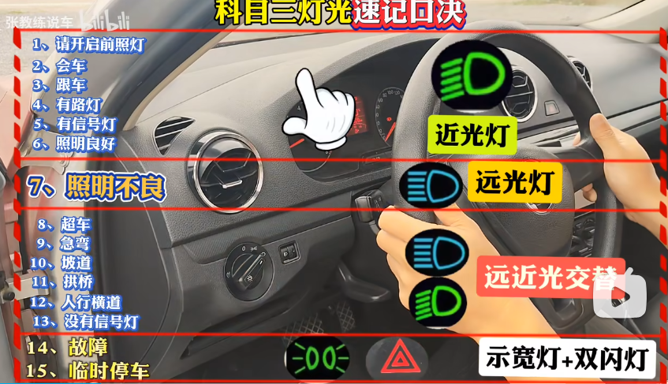

title: 汽车领域
author: PanYuKang
cover: https://mpimg.cn/view.php/065ec218b051add9003f264a1dd1ca99.jpg

tags: [生活技能,汽车知识,驾照考试]

categories: [生活小技能]

date: 2024-12-23 22:45:35

---

现代生活几乎离不开格式格式的交通工具，包括私人小汽车，当然想拥有一辆个人的小汽车，必然要了解一些汽车的基础知识和需要掌握的驾驶技能，还有汽车的发展趋势；随着科学技术水平的不断提高，使得人工智能无人驾驶技术日益成熟，让我们拭目以待吧~

---

# **汽车的发展历史**

1. **萌芽阶段（19世纪初）**
   * 最早的汽车原型是由蒸汽机驱动的交通工具，如卡格诺特的蒸汽马车。
   * 19世纪末，内燃机的发明使现代汽车成为可能。
2. **工业化阶段（20世纪初）**
   * 1908年，福特公司推出了 **T型车** ，实现了流水线生产，大幅降低了汽车成本，汽车开始走进普通家庭。
3. **技术创新阶段（20世纪中后期）**
   * 发动机、底盘、制动系统等技术不断改进，汽车性能提高。
   * 私家车普及，成为主要交通工具。
4. **现代化阶段（21世纪）**
   * 电动车与新能源车迅速发展，代表品牌如特斯拉、小鹏等。
   * 智能化：自动驾驶技术、车联网等功能改善用户体验。

# 燃油车与电动车

## **燃油车的优缺点**

### **优点**

1. **成熟的技术与基础设施**
   * 内燃机技术成熟，制造成本较低，维修方便。
   * 加油站网络密集，加油速度快，长途出行无忧。
2. **续航能力强**
   * 燃油车通常具有更长的续航里程（500-1000公里），适合长途驾驶。
3. **性能稳定**
   * 发动机动力强劲，尤其在高速和越野驾驶时表现优异。

### **缺点**

1. **环境污染**
   * 燃油车尾气排放对空气污染和温室效应贡献较大。
2. **使用成本高**
   * 油价浮动较大，长期来看燃油成本高于电动车的电费。
3. **政策限制**
   * 越来越多国家和城市出台禁售燃油车政策或限行规定。

---

## **电动车的优缺点**

### **优点**

1. **环保节能**
   * 无尾气排放，如果电力来源是清洁能源，碳排放更低。
2. **使用成本低**
   * 电费通常低于燃油费用，且维护成本较低（无需换机油等）。
3. **智能化体验**
   * 配备先进的车联网、辅助驾驶、OTA升级等功能。
4. **政策支持**
   * 多国提供购车补贴、免购置税、免费牌照等优惠政策。

### **缺点**

1. **续航与充电焦虑**
   * 续航能力通常在300-700公里，长途驾驶可能需要频繁充电。
   * 充电设施不如加油站普及，快充时间（30-60分钟）比加油耗时长。
2. **电池老化与更换成本高**
   * 电池随着使用时间性能衰减，约8-10年后可能需要更换，费用较高。
3. **初期购车成本高**
   * 电动车售价一般高于同级别燃油车，尤其是高性能电动车。

---

## **购买选择指南**

### **适合购买燃油车的人**

1. **经常长途驾驶** ：例如跨城出差、自驾游等，对续航里程有较高要求。
2. **偏好稳定性** ：倾向选择技术成熟、故障率低的车型。
3. **基础设施不足** ：居住地充电桩稀少或安装条件有限。
4. **预算有限** ：对购买成本更敏感的消费者。

### **适合购买电动车的人**

1. **城市通勤为主** ：每天行驶里程在100公里以内，充电方便。
2. **环保意识强** ：愿意为减少碳排放贡献力量。
3. **享受智能科技** ：追求先进的驾驶体验和智能化功能。
4. **政策福利吸引** ：所在地区提供电动车牌照、税费优惠等。

# 车上常见功能按键

## **一、方向盘区域**

* **喇叭（通常是方向盘中央的圆形或椭圆形区域）：** 用于发出警告声，提醒其他车辆或行人注意。在紧急情况下或需要引起他人注意时使用。
* **多功能按键（部分车型）：** 包括音量调节（VOL +/ -）、频道切换、蓝牙电话、巡航控制等。根据按键上的图标或文字进行操作。

## **二、中控台区域**

* **双闪警示灯（通常为红色三角形）：** 用于在紧急情况下提醒其他车辆，如车辆发生故障、发生交通事故等。
* **空调控制区域：**
  * **A/C（或雪花❄️图标）：** 空调制冷开关。在需要制冷时开启。
  * **温度调节旋钮/按键：** 调节车内温度。
  * **风量调节旋钮/按键：** 调节出风量大小。
  * **风向调节旋钮/按键：** 调节出风方向。
  * **内外循环按键：** 内循环用于阻止车外空气进入车内，外循环用于车内外空气流通。
* **音响控制区域：**
  * **电源开关：** 控制音响的开启和关闭。
  * **音量调节旋钮/按键：** 调节音量大小。
  * **模式切换按键（MODE）：** 切换音源，如收音机、USB、蓝牙等。
* **中控锁按键：** 用于锁定或解锁所有车门。
* **车窗升降按键：** 控制车窗的升降。通常主驾驶位有控制所有车窗的按键。
* **后视镜调节按键/旋钮：** 调节后视镜的角度。部分车型带有后视镜加热和电动折叠功能。
* **危险报警闪光灯开关：** 用于在紧急情况下提醒其他车辆，例如车辆发生故障或者发生交通事故时使用。

## **三、换挡区域**

* **点火开关/启动按键：** 用于启动或关闭发动机。
* **换挡杆：** 用于切换不同的档位（P、R、N、D等）。
* **手刹/电子手刹：** 用于驻车制动。

### 点火开关

在传统钥匙点火系统的汽车中，点火开关通常分为 **LOCK（锁止）、ACC（附件电源）、ON（通电）、START（启动发动机）** 四个档位。以下是每个档位的具体含义和使用场景：

---

#### **1. LOCK（锁止）**

- **含义**：完全关闭车辆电源并锁止方向盘。钥匙可拔出，车辆进入防盗状态。
- **使用场景**：
  - **停车熄火后**：离开车辆时使用。
  - **紧急情况**：行驶中切勿切换到此档位，否则方向盘会锁死，导致失控风险。
- **注意事项**：
  - 部分车型需挂入P挡（自动挡）或空挡（手动挡）才能拔出钥匙。
  - 方向盘锁止后，需轻微转动方向盘并同时转动钥匙才能解锁。

---

#### **2. ACC（附件电源）**

- **含义**：接通部分车载电器电源（如收音机、点烟器、USB充电口等），但发动机和主要电路未启动。
- **使用场景**：
  - **短暂停车时**：如等人时听音乐、使用充电设备。
  - **临时用电需求**：不需要启动发动机，仅需使用车内电器。
- **注意事项**：
  - **避免长时间使用**：蓄电池可能因持续耗电而亏电，导致无法启动。
  - **不供电设备**：大功率设备（如空调、大灯）通常无法在ACC档使用。

---

#### **3. ON（通电/自检）**

- **含义**：全车电路通电，仪表盘指示灯亮起，车辆进入自检状态（如油泵预工作、安全系统激活）。
- **使用场景**：
  - **启动前的准备**：在点火前切换至此档，等待车辆自检完成（仪表盘指示灯熄灭后再启动）。
  - **短时断电后恢复**：如临时关闭发动机但需保持电子设备运行（如导航）。
- **注意事项**：
  - **避免长时间停留**：可能导致点火线圈过热或蓄电池耗电。
  - **自检重要性**：通过仪表盘指示灯检查车辆状态（如机油压力、ABS故障等）。

---

#### **4. START（启动发动机）**

- **含义**：启动马达工作，带动发动机点火。钥匙需短暂保持在此档位直至发动机启动。
- **使用场景**：
  - **冷启动**：车辆完全熄火后首次启动。
  - **热启动**：临时熄火后重新点火（如等红灯时误熄火）。
- **注意事项**：
  - **勿长时间拧住**：启动马达持续工作可能损坏。
  - **启动失败处理**：若发动机未启动，需先回ON档等待数秒再尝试。
  - **自动回弹**：松开钥匙后会自动弹回ON档，保持发动机运行。

---

#### **操作流程示例**

1. **启动车辆**：LOCK → ACC（短暂停留）→ ON（等待自检完成）→ START（点火后松手回ON）。
2. **熄火停车**：
   ON → ACC → LOCK（拔出钥匙）。

---

#### **特殊情况**

- **一键启动车型**：通常通过按键逻辑模拟档位（如不踩刹车按一次进入ACC，按两次进入ON，踩刹车按启动）。
- **方向盘锁死**：若钥匙无法转动，轻微左右晃动方向盘即可解锁。
- **自动挡保护**：未挂P挡时可能无法拔出钥匙。

## **四、灯光控制区域**

### **灯光控制杆（通常在方向盘左侧）**

#### **旋转部分**

* **关闭（O）：** 所有车外灯光关闭。
* **示廓灯（通常是一个小灯泡的图标）：** 用于在傍晚、黎明、阴天等光线较暗但不需要照明的情况下，提示其他车辆你的位置。示廓灯亮度较低，主要起警示作用。
* **近光灯（通常是一个灯泡向左下方照射的图标）：** 用于夜间在城市道路、有路灯的公路等照明条件较好的情况下行驶。近光灯照射距离较近，不会对对面来车造成眩目。
* **自动大灯（AUTO，部分车型）：** 车辆根据环境光线自动开启或关闭前照灯（通常是近光灯）。

#### **拨动部分**

* **远光灯（将控制杆向前推或向后拉）：** 用于夜间在无路灯的道路、高速公路等需要看清远方的情况下行驶。远光灯照射距离远，亮度高，会对对面来车造成眩目，因此在会车时应及时切换为近光灯。
* **转向灯（向上或向下拨动控制杆）：** 用于在转弯、变道、超车、靠边停车等情况下提示其他车辆你的行驶意图。向上拨动为右转/变道，向下拨动为左转/变道。使用完毕后会自动回位。
* **前雾灯/后雾灯（部分车型，通常在控制杆中间或下方有单独的按键或旋钮）：** 用于在雾天、雨雪天气等能见度较低的情况下提高车辆的可见性。雾灯穿透力强，但亮度较高，在能见度良好的情况下使用会影响其他车辆的视线。

### **其他灯光**

* **日间行车灯（DRL，部分车型）：** 在白天行驶时自动开启的灯光，主要起提示作用，提高车辆在白天的可见性。
* **倒车灯：** 挂入倒车挡时自动开启的灯光，提示后方车辆你正在倒车。
* **刹车灯：** 踩下刹车时自动开启的灯光，提示后方车辆你正在减速或停车。
* **高位刹车灯：** 安装在车辆后部较高位置的刹车灯，进一步提高刹车时的警示效果。
* **牌照灯：** 用于照亮车辆牌照的灯光。

### **灯光的使用场景**

* **傍晚/黎明/阴天：** 使用示廓灯。
* **夜间在城市道路/有路灯的公路：** 使用近光灯。
* **夜间在无路灯的道路/高速公路：** 使用远光灯，但会车时应及时切换为近光灯。
* **雾天/雨雪天气：** 使用雾灯（如果车辆配备）。
* **转弯/变道/超车/靠边停车：** 使用转向灯。
* **倒车：** 倒车灯会自动开启。
* **刹车：** 刹车灯会自动开启。

## **五、其他按键**

* **发动机启停按键（部分车型）：** 用于控制发动机自动启停功能。
* **自动泊车按键（部分车型）：** 辅助驾驶员进行泊车。
* **驾驶模式切换按键（部分车型）：** 切换不同的驾驶模式，如经济模式、运动模式等。
* **油箱盖开启按键/拉杆：** 用于打开油箱盖。
* **后备箱开启按键/拉杆：** 用于打开后备箱。

# 驾照考试科目大纲

## **科目一：道路交通安全法律、法规和相关知识**

科目一主要考察驾驶员对交通法规、交通信号、安全行车、文明驾驶等基本知识的掌握程度。考试形式为上机考试，共100道题，满分100分，90分及格。

### **考试内容**

* 道路交通安全法律、法规：包括《道路交通安全法》、《道路交通安全法实施条例》等法律法规，以及地方性法规。
* 交通信号：包括交通信号灯、交通标志、交通标线、交通警察手势信号等。
* 安全行车、文明驾驶基础知识：包括安全行车基本原则、常见危险情况的判断和处置、恶劣天气和复杂道路条件下的安全驾驶、文明驾驶行为规范等。
* 机动车基本知识：包括机动车构造、性能、常用机件的检查和维护等。
* 紧急情况下的处置：包括发生交通事故后的自救、互救知识，以及简单的急救常识等。

## **科目二：场地驾驶技能**

科目二主要考察驾驶员在场地内的基本驾驶技能，包括倒车入库、侧方停车、坡道定点停车和起步、直角转弯、曲线行驶（S弯）等。考试形式为实车操作，采用电子评判系统。

### **考试内容（以C1驾照为例）**

* 倒车入库：在不碰桩、不压线的前提下，将车辆倒入车库。
* 侧方停车：将车辆驶入道路右侧的停车位。
* 坡道定点停车和起步：在坡道上准确停车，并平稳起步，不溜车、不熄火。
* 直角转弯：在规定的路线内，一次性完成直角转弯。
* 曲线行驶（S弯）：在S形弯道内，控制车辆平稳行驶，不得压线或驶出路外。

## **科目三：道路驾驶技能**

科目三主要考察驾驶员在实际道路上的驾驶技能和安全意识，包括起步、直线行驶、加减挡位操作、变更车道、靠边停车、通过路口、会车、超车、掉头、夜间行驶等常见的16个项目（或考核点），结合新规以及实际考试情况进行了整理。考试形式为实车操作，由安全员进行人工评判和电子监控相结合。

### **考试内容（以C1驾照为例）**

1. **上车准备：** 绕车一周检查车辆外观及周围环境，确认安全后打开车门上车。调整座椅、后视镜，检查仪表盘，系好安全带，确认档位为空挡，检查手刹是否拉起。
2. **起步：** 正确使用转向灯（左转），观察后视镜，确认安全后松开手刹，平稳起步，不熄火、不闯动，起步后及时关闭转向灯。
3. **直线行驶：** 保持车辆直线行驶，方向稳定，不跑偏，根据路况合理控制车速，目视前方，注意观察交通情况。
4. **加减挡位操作：** 根据车速和路况，及时、平稳地进行加减挡操作，换挡时动作迅速、准确，不低头看挡，不越级加挡，不空挡滑行。
5. **变更车道：** 提前开启转向灯，观察后视镜，确认安全后平稳变更车道，不得影响其他车辆正常行驶。变更车道后及时关闭转向灯。
6. **靠边停车：** 提前开启右转向灯，观察后视镜，选择合适的地点和时机靠边停车，车身与道路边缘线保持适当距离（30cm以内），停车后拉紧手刹，关闭转向灯，挂空挡。
7. **通过路口：** 观察路口交通信号灯和交通标志，根据信号灯指示和路况安全通过路口。通过路口前减速慢行，注意避让行人、非机动车和优先通行的车辆。
8. **会车：** 正确判断会车时机和距离，选择合适的会车地点，减速慢行，必要时停车避让。
9. **超车：** 在允许超车的路段，提前开启左转向灯，观察后视镜，确认安全后从被超车辆左侧超越，超越后开启右转向灯，驶回原车道，并及时关闭转向灯。超车过程中不得妨碍被超车辆的正常行驶。
10. **掉头：** 选择允许掉头的地点，观察交通情况，开启左转向灯，安全掉头。掉头时不得妨碍其他车辆和行人正常通行。
11. **夜间行驶：** 正确使用灯光，包括远光灯、近光灯、示宽灯、雾灯等。会车时应将远光灯转换为近光灯。通过路口、人行横道等要交替使用远近光灯提示。
12. **灯光模拟：** 按照语音指令或考官指令，正确使用各种灯光。
13. **人行横道线：** 遇行人通过人行横道线时，应当停车让行。
14. **学校区域和公共汽车站：** 通过学校区域和公共汽车站时，应当减速慢行，注意避让行人。
15. **加减档位与速度配合：** 考试过程中，要根据路况和车速合理选择档位，做到档位与速度相匹配，避免拖挡或高挡低速行驶。
16. **安全意识和文明驾驶：** 考试过程中，要表现出良好的安全意识和文明驾驶习惯，例如：观察交通情况、礼让行人、不争道抢行、不随意变道等。

### 靠边停车步骤

#### **标准操作流程**

##### **观察与准备**

- **观察路况**：
  - 通过后视镜观察后方车辆、行人及非机动车，确认安全后准备停车。
  - 选择允许停车的路段（无禁停标志、标线，避开路口、公交站等）。
- **开启右转向灯**：提前3秒以上打右转向灯，提示后方车辆。

##### **减速与调整方向**

- **减速降档**：
  - 松油门，轻踩刹车减速，车速降至 **20-30公里/小时**。
  - 逐级降档（如从4档→3档→2档），最终挂入 **1档**或保持2档（根据车速灵活选择）。
- **向右微调方向**：
  - 向右轻打方向盘（约30°），使车辆逐渐靠近路边，车身与路沿保持 **30厘米以内**（考试要求通常为30cm）。
  - **调整技巧**：可通过右后视镜观察车轮与路沿距离，或以前挡风玻璃右下角与路沿重合为参考。

##### **精准停车**

- **修正车身**：
  - 接近目标位置时回正方向盘，避免过度靠近或压线。
  - 若距离过远，可向左微调方向后再向右修正（需配合车速控制）。
- **停车操作**：
  - 踩离合到底，轻踩刹车至车辆完全停稳。
  - 拉起手刹，挂空挡，松开离合和刹车踏板。
  - **关闭转向灯**，若夜间需开启示廓灯或双闪（视情况而定）。

##### **停车后检查**

- **确认距离**：观察右后视镜，确保车身与路沿距离符合要求（30cm以内）。
- **安全细节**：熄火（考试时可能不需熄火），解开安全带前观察后方是否安全。

---

#### **关键注意事项**

1. **距离控制**：

   - 考试中距离超过30cm扣10分，压线直接不合格。
   - 日常驾驶中距离过远可能被贴罚单，过近易刮蹭车轮或底盘。
2. **车速与档位匹配**：

   - 低速时避免高档位（如3档以上），防止熄火。
   - 考试中若因换挡失误导致熄火，需迅速重新启动车辆。
3. **方向盘修正技巧**：

   - 遵循“少量多次”原则，每次调整方向幅度不超过15°。
   - 忌猛打方向，否则易压线或车身歪斜。
4. **特殊路况处理**：

   - 坡道停车：需配合手刹和脚刹防止溜车。
   - 湿滑路面：提前减速，避免急刹导致侧滑。

### 灯光模拟速记

#### **一、近光灯场景（开启前照灯后默认近光）**

* **请开启前照灯**
* **会车**
* **跟车行驶**
* **有路灯的道路**
* **有交通信号灯的路口**
* **照明良好的路段**

> ✅ **口诀**：
> **“会跟路灯信号好，近光不变要记牢”**

---

#### **二、远光灯场景（需手动切换）**

* **照明不良的道路**（如无路灯、隧道）

> ✅ **口诀**：
> **“照明不良开远光，其他情况别乱闯”**

---

#### **三、远近光交替场景（闪烁2~3次）**

* **超车**
* **急弯**
* **坡道**
* **拱桥**
* **人行横道**
* **无信号灯的路口**

> ✅ **口诀**：
> **“超车弯道坡拱桥，人行无灯闪两下”**

---

#### **四、示宽灯+双闪灯场景**

13. **车辆故障**
14. **临时停车**

> ✅ **口诀**：
> **“故障停车双闪亮，示宽灯也别忘”**

---

## **科目四：安全文明驾驶常识**

科目四主要考察驾驶员在复杂道路和特殊天气条件下的安全驾驶知识、紧急情况下的处置方法、交通事故后的处理程序等。考试形式为上机考试，共50道题，满分100分，90分及格。

### **考试内容**

* 恶劣气象和复杂道路条件下的安全驾驶知识：包括雨天、雾天、雪天、冰雪路面、山区道路、高速公路等条件下的安全驾驶技巧。
* 紧急情况下的避险常识：包括爆胎、制动失灵、转向失控等紧急情况下的处置方法。
* 交通事故后的处置知识：包括保护现场、报警、急救等程序。
* 文明驾驶行为：包括礼让行人、文明使用灯光、不酒后驾驶、不疲劳驾驶等。

## C1手动档与C2自动档

### 手动挡车辆的档位

手动挡车辆的档位一般是R（倒挡）、1-5档（前进档），每个档位对应不同的传动比，需要驾驶员手动换挡。

* **R档（Reverse）：** 倒车档，倒车考试时需使用**R档**。
* **1-5档：** 前进档，数字越大，传动比越大，车辆行驶速度越快。
* **空档（N档）** ：无动力输出，用于临时停车或启动发动机。
  

### 自动挡车辆的档位

自动挡车辆的档位通常是P、R、N、D、S、L等，车辆会根据行驶速度自动选择合适的档位。

* **P档（Parking）：** 停车档。
* **R档（Reverse）：** 倒车档。
* **N档（Neutral）：** 空档。
* **D档（Drive）：** 行驶档。
* **S档（Sport）：** 运动模式。
* **L档（Low）：** 低速档。
  

### C1手动挡档位介绍

* **R档（Reverse）：** 倒车档。挂入此档，车辆向后行驶。
* **1-5档（1st-5th gear）：** 前进档。数字越大，档位越高，传动比越大，车辆速度越快，但扭矩越小。

#### **档位常见速度区间与场景**

**1档（0-20 km/h）**

* **场景** ：起步、陡坡爬升、极低速挪车（如堵车时蠕动）、需要大扭矩的情况（如拖重物）。
* **说明** ：1档仅用于起步或极低速行驶，长时间使用容易导致高转速低车速，增加磨损。

**2档（15-30 km/h）**

* **场景** ：起步后短距离加速、低速转弯后提速、拥堵路段跟车、缓坡行驶。
* **说明** ：适合需要轻微加速但车速较低的路况，避免长时间用2档高速行驶。

**3档（25-50 km/h）**

* **场景** ：城市道路中速行驶（如30-40 km/h）、平缓加速、超车前的准备档位。
* **说明** ：最常用的日常驾驶档位之一，兼顾动力和燃油经济性。

**4档（40-70 km/h）**

* **场景** ：郊区道路、快速路巡航（如50-60 km/h）、中等坡度路段。
* **说明** ：高速行驶前的过渡档位，适合稳定车速但无需急加速的情况。

**5档（60 km/h及以上）**

* **场景** ：高速公路、长直平路巡航（80-120 km/h）。
* **说明** ：省油档位，适合匀速行驶，但需注意动力响应较慢，超车可能需要降档。

### C2自动挡档位介绍（常见）

1. **P档（Parking）停车档**
   * 用于长时间停车（例如熄火停车时）。
   * 此档位会锁定变速器，防止车辆移动，通常需要踩下刹车才能从P档切换到其他档位。
2. **R档（Reverse）倒车档**
   * 用于倒车时选择。
   * 切换到此档时，车辆的倒车灯会点亮，提醒后方车辆和行人。
3. **N档（Neutral）空档**
   * 相当于手动挡汽车的空挡。
   * 车辆处于待机状态，没有动力输出，常用于短暂停车，例如等红灯。
4. **D档（Drive）前进档**
   * 用于正常的前进驾驶。
   * 自动挡车在D档位下，会根据速度和负载自动调整变速器档位。
5. **S档（Sport）运动模式**
   * 用于需要更高动力输出的情况，例如超车或快速加速。
   * 此档位下，变速器会延迟升挡，提高发动机转速。
6. **L档（Low）低速档**
   * 用于爬坡、下坡或拖重物时，提供更大的扭矩输出。
   * 通常限制在1、2档，防止频繁升降档。

### 两者之间的主要区别

* **操作方式：** 这是C1和C2最本质的区别。C1需要手动操作离合器，而C2则不需要。
* **适用范围：** C1的准驾车型范围更广，可以驾驶手动挡和自动挡汽车，而C2只能驾驶自动挡汽车。
* **驾驶难度：** C1的驾驶难度较高，需要较高的协调性，而C2的驾驶难度较低，更容易上手。

# 驾驶技巧整理

## **C1驾照考试计划清单**

### **理论部分**

1. **制定学习计划**
   - 每天至少1小时学习理论知识。
2. **使用刷题APP**
   - 下载并使用“驾考宝典”、“驾校一点通”等APP进行科目一和科目四的模拟试题练习。
   - 每天完成一定数量的判断题、单选题和多选题。
3. **参加驾校理论课程**
   - 参与驾校组织的理论课程，系统学习道路交通安全法律法规、交通信号、通行规则等知识。
4. **阅读驾考相关书籍**
   - 阅读驾考辅导书籍，加深对知识点的理解和记忆。

#### 驾考宝典科一笔记

* 驾驶人连续驾驶不得超过4小时。疲劳驾驶开4小时需休息不得少于20分钟。
* 初次饮酒驾驶，暂扣6个月驾驶证，罚款1-2千。再次饮酒驾驶，吊销驾驶证，10日拘留，罚款1-2千。
* 醉酒驾驶，吊销执照，五年内不得重考，审判后处拘役，并处罚金。
* 驾驶机动车造成交通事故后逃逸，尚不构成犯罪的，公安机关交通管理部门会处以200-2000元以下罚款。
* 隐瞒情况或提供虚假资料申领驾驶证的，公安机关交通管理部门不予受理或不予办理，处500元以下罚款，一年内不得再次申领。
* 驾驶机动车超员或超速，构成犯罪，被吊销驾驶证的，5年内不得申请机动车驾驶证。
* 机动车驾驶人申请学法减分，参加道路交通安全法律、法规和相关知识学习的，公益1小时扣减1分，网络1小时1分，现场1小时2分。
* 机动车登记分为注册、变更、转移、抵押、注销登记五种。
* 申请增加轻型牵引挂车准驾车型的，应取得驾驶小型汽车、小型自动档汽车准驾车型资格1年以上。
* 停车位标线为白色表示收费停车位、黄色是专属停车位、蓝色是免费停车位。
* 1.申请小型汽车、小型自动挡汽车、残疾人专用小型自动挡载客汽车、轻便摩托车准驾车型的，在18周岁以上;
  2.申请普通三轮摩托车、普通二轮摩托车准驾车型的，在18周岁以上，70周岁以下;
  3.申请轻型牵引挂车准驾车型的，在20周岁以上，70周岁以下;
  4.申请低速载货汽车、三轮汽车、轮式专用机械车准驾车型的，在18周岁以上，63周岁以下;
  5.申请城市公交车、中型客车、大型货车、无轨电车或者有轨电车准驾车型的在20周岁以上，63周岁以下;
  6.申请大型客车、重型牵引挂车准驾车型的，在22周岁以上，63周岁以下;
  7.接受全日制驾驶职业教育的学生，申请大型客车、重型牵引挂车准驾车型的，在19周岁以上，63周岁以下。
* 以隐瞒或欺骗手段补领机动车驾驶证的，会受到处200元以上500元以下的罚款。
* 定速巡航系统英文缩写为CCS，前照灯系统AFS。
* 

#### **交通违法处罚类**

以下是常见的交通违法罚款范围表格清单参考：

### **交通违法罚款范围对照表**

| **违法行为**                         | **罚款范围** |
| ------------------------------------------ | ------------------ |
| **实习期单独上高速**                 | 20~200元           |
| **实习期未贴实习标志**               | 20~200元           |
| **行人乱穿马路、翻越护栏**           | 5~50元             |
| **非机动车闯红灯**                   | 10~50元            |
| **机动车乱停乱放**                   | 100~200元          |
| **斑马线不礼让行人**                 | 50~200元           |
| **车窗抛物、乱鸣喇叭**               | 50~100元           |
| **开车使用手机**                     | 50~200元           |
| **未系安全带**                       | 50~200元           |
| 机动车驾驶人身体条件不适时仍然驾驶机动车。 | 200~500元          |
| **故意遮挡号牌**                     | 200~2000元         |
| **饮酒驾驶（非醉驾）**               | 1000~2000元        |
| **无证驾驶**                         | 200~2000元         |
| **超速50%以上**                      | 200~2000元         |
| **伪造、变造驾驶证/号牌**            | 2000~5000元        |

#### 常见违法行为与记分分值对照表

| 记分分值       | 违法行为示例                                                                                                                                                                                                                                                    | 备注               |
| -------------- | --------------------------------------------------------------------------------------------------------------------------------------------------------------------------------------------------------------------------------------------------------------- | ------------------ |
| **12分** | 酒驾； 肇事逃逸； 使用伪造、变造号牌； 高速逆行； 在高速、城市快速路上超速50%以上；                                                                                                                                                         | 严重违法           |
| **9分**  | 营运客车超速20%以上； 校车/客运车超载； 货车载人； 驾驶与准驾车型不符的机动车； 未悬挂车号牌或者遮挡、污损号牌上路行驶的；                                                                                                                  | 新增档位，注意识别 |
| **6分**  | 闯红灯，不按交通信号灯指示通行的； 超速20%-50%； 高速违停； 违法占用应急车道； 机动车驾驶证被暂扣或扣留期间驾驶机动车的； 驾驶7座以下载客超50%未达100%的；                                                                             | 考试常考重点       |
| **3分**  | 不避让校车； 在道路上车辆发生故障、事故停车后，不按规定使用灯光或设置警告标志的； 占用应急车道； 违反标志标线； 不按导向行驶、遮挡号牌； 不按规定安装机动车号牌的机动车上道路行驶的； 小型汽车超载20%~50%的； 逆行普通道路； | 日常容易忽视       |
| **2分**  | 未系安全带、打手机、变道不打转向灯                                                                                                                                                                                                                              | 细节决定成败       |
| **1分**  | 年检逾期; 车辆喷涂不符; 不按规定使用灯光; 驾驶载货汽车超载未达30%； 违反禁令标志、标线指示的；                                                                                                                                              | 低风险但易被忽略   |

#### 机动车驾驶证申领和使用规定

在驾驶证申请条件中，"假1代3骗3毒3醉5快5无证10"是指因不同违法行为被限制申请驾驶证的具体年限，具体含义如下：

1. **假1**：伪造、变造或使用虚假材料申请驾驶证的，**1年内**不得再次申请。
2. **代3**：代替他人参加机动车驾驶人考试的，**3年内**不得申请驾驶证。
3. **骗3**：以欺骗、贿赂等不正当手段取得驾驶证的，**3年内**不得再次申请。
4. **毒3**：三年内有吸食、注射毒品行为或解除强制隔离戒毒措施未满**3年**的，不得申请驾驶证。
5. **醉5**：

   - 醉酒驾驶机动车被吊销驾驶证的，**5年内**不得重新申请。
   - 醉酒驾驶营运机动车的，**10年内**不得重新申请。
6. **快5**：驾驶机动车超速50%以上构成犯罪被吊销驾驶证的，**5年内**不得重新申请。
7. **无证10**：

   - 未取得驾驶证驾驶机动车，发生重大交通事故构成犯罪的，**10年内**不得申请。
   - 造成交通事故后逃逸构成犯罪的，**终身禁驾**。

### 交通警察手势信号

根据2022年4月1日起实施的《道路交通安全违法行为记分管理办法》（公安部令第163号）以及最新的交通警察手势信号规定，目前我国交通警察手势信号共有 **8种** ，具体定义及动作分解如下：

#### 八种交警手势信号清单

根据《中华人民共和国道路交通安全法》及相关规定，交通警察的8种手势信号 **不仅适用于机动车，同样对行人及非机动车具有法律约束力** 。以下是具体分析：

##### **停止信号**

- **含义**：指示前方车辆和行人停止通行。
- **动作分解**：
  1. 面向目标车辆或行人。
  2. 左臂由前向上直伸，手臂与地面垂直。
  3. 掌心朝向前方，手指并拢，五指伸直。
- **口诀**：左臂高举掌向前，车辆行人要停下。
- **典型适用场景**：
  - 十字路口红灯故障，交警指挥车辆暂停。
  - 突发事故或施工路段，需暂时阻断交通。
  - 行人过马路时，暂停车辆通行。
- **示意图**：
  

##### **直行信号**

- **含义**：准许直行车辆通行，左右方向车辆停止。
- **动作分解**：
  1. 身体面向直行车辆方向。
  2. 双臂水平伸展，左臂向左，右臂向右。
  3. 掌心分别朝向左右两侧车辆，手指并拢。
- **口诀**：双臂平伸像飞机，直行车辆快通过。
- **典型适用场景**：
  - 大型路口优先放行主干道直行车辆。
  - 交通高峰期，疏导直行车流。
  - 信号灯故障时，指挥直行方向通行。
- **示意图**：
  

##### **左转弯信号**

- **含义**：准许交警右侧的车辆左转弯，在不妨碍直行车辆的情况下允许掉头。
- **动作分解**：
  1. 面向右侧车辆。
  2. 右臂向前平伸，掌心向前，手指并拢。
  3. 左臂同时向右前方摆动，掌心向右，摆动幅度约45度。
- **口诀**：右臂前伸左臂摆，右侧车辆左转来。
- **典型适用场景**：
  - 路口右侧车辆需左转进入支路。
  - 允许右侧车辆在路口掉头（如无禁止掉头标志）。
  - 指挥右侧车辆绕过临时障碍。
- **示意图**：
  

##### **左转弯待转信号**

- **含义**：指示左转车辆进入待转区等待。
- **动作分解**：
  1. 面向左转车辆。
  2. 左臂向左平伸，掌心向下，手指并拢。
  3. 右臂向右平伸后向左前方摆动，掌心向左，摆动幅度约30-45度。
- **口诀**：左臂平伸右臂动，左转车辆待转中。
- **典型适用场景**：
  - 大型路口有左转待转区，指挥左转车辆进入待转区。
  - 交通流量大时，分阶段放行左转车辆。
  - 信号灯未设置左转专用时，交警手动指挥。
- **示意图**：
  

##### **右转弯信号**

- **含义**：准许交警左侧的车辆右转弯。
- **动作分解**：
  1. 面向左侧车辆。
  2. 左臂向前平伸，掌心向前，手指并拢。
  3. 右臂向左前方摆动，掌心向左，摆动幅度约45度。
- **口诀**：左臂前伸右臂摆，左侧车辆右转来。
- **典型适用场景**：
  - 左侧车辆需右转进入辅路或支路。
  - 指挥左侧车辆绕行临时交通管制区域。
  - 路口右转车道流量较大时优先放行。
- **示意图**：
  

##### **变道缓行信号**

- **含义**：指示车辆变更车道或缓慢通行。
- **动作分解**：
  1. 面向目标车辆。
  2. 右臂向右前方平伸，掌心向下，手指并拢。
  3. 右臂上下摆动，频率较快，幅度约20-30厘米。
  4. 左臂自然下垂或保持不动。
- **口诀**：右臂平伸上下摇，车辆换道慢慢跑。
- **典型适用场景**：
  - 道路施工或事故，指挥车辆从主道变道至辅道。
  - 多车道路段，引导车辆向指定车道汇入。
  - 拥堵路段，指挥车辆缓慢调整车道。
- **示意图**：
  

##### **减速慢行信号**

- **含义**：指示车辆减速慢行。
- **动作分解**：
  1. 面向目标车辆。
  2. 右臂向右前方平伸，掌心向下，手指并拢。
  3. 右臂缓慢上下摆动，频率较慢，幅度约20-30厘米。
  4. 左臂自然下垂或保持不动。
- **口诀**：右臂平伸慢摇摆，车辆减速别太快。
- **典型适用场景**：
  - 前方有行人横穿马路，需减速避让。
  - 道路前方有障碍物（如坑洼、落石），需慢行。
  - 学校或医院附近，指挥车辆减速通过。
- **示意图**：
  

##### **示意车辆靠边停车信号**

- **含义**：指示指定车辆靠边停车接受检查或处理。
- **动作分解**：
  1. 面向目标车辆。
  2. 左臂向前平伸，掌心向左，手指并拢。
  3. 右臂向右前方摆动，指向路边停车位置，摆动幅度约45度。
- **口诀**：左臂前伸右臂指，车辆靠边快停车。
- **典型适用场景**：
  - 交警检查违章车辆（如超速、闯红灯），要求靠边停车。
  - 指挥故障车辆或阻碍交通的车辆靠边停放。
  - 临时交通管制，指示特定车辆靠边等待。
- **示意图：**
  

### 实践部分

5. **了解考试项目**

* 熟悉科目二（倒车入库、侧方停车、坡道定点停车和起步、直角转弯、曲线行驶）和科目三（上车准备、起步、直线行驶、加减挡位操作、变更车道、靠边停车、通过路口、通过人行横道线、通过学校区域、通过公共汽车站、会车、超车、掉头、夜间行驶）的考试项目和要求。

6. **制定驾驶练习计划**
   - 每周安排2-3次实际驾驶练习，每次练习专注于2-3个考试项目。
7. **掌握实战技巧**
   - **科目二技巧：**
     - 倒车入库：利用后视镜，控制车速，缓慢倒入。
     - 侧方停车：提前判断车位，慢速倒入，调整方向盘。
     - 坡道定点停车和起步：准确停车，平稳起步，掌握半联动。
     - 直角转弯和曲线行驶：减速慢行，适时调整方向盘，保持车辆稳定。
   - **科目三技巧：**
     - 上车准备：调整座椅、后视镜，系好安全带。
     - 起步、直线行驶：观察交通情况，平稳起步，保持直线行驶。
     - 加减挡位操作：根据车速和路况，适时换挡，平稳过渡。
     - 变更车道、靠边停车：提前打转向灯，观察盲区，确保安全。
     - 通过路口、人行横道线、学校区域、公共汽车站：减速慢行，礼让行人和车辆。
     - 会车、超车、掉头：遵守交通规则，确保安全距离。
     - 夜间行驶：正确使用灯光，注意观察路况，减速慢行。
8. **安全驾驶**
   - 练习时严格遵守交通规则，确保自身和他人安全。
9. **请教经验驾驶员**
   - 向有经验的驾驶员请教驾驶技巧和考试心得。
10. **使用模拟器练习**
    - 在驾驶模拟器上进行练习，提前适应考试环境。

### **常见C1驾校车型**

1. **大众系列**

   - **捷达（Jetta）**：作为经典教练车型，捷达因价格亲民、耐用性强、维修成本低，被广泛用于驾校训练，适合手动挡操作。
   - **桑塔纳（Santana）**：与捷达类似，桑塔纳也是国内驾校的常用车型，其离合器反馈清晰，适合新手练习起步和换挡。
2. **雪铁龙爱丽舍（Citroën Elysee）**

   - 该车型在南方地区较常见，底盘调校稳定，方向盘轻重适中，适合科目三的路考训练。
3. **斯柯达昕锐（Skoda Rapid）**

   - 部分驾校可能选择昕锐作为训练车，其操控性与大众系车型接近，适合学员适应考试要求。
4. **其他车型**

   - 部分驾校可能使用 **比亚迪F3** 或 **现代伊兰特** 等经济型轿车，但这类车型在贵阳的普及度可能低于大众系。

---
