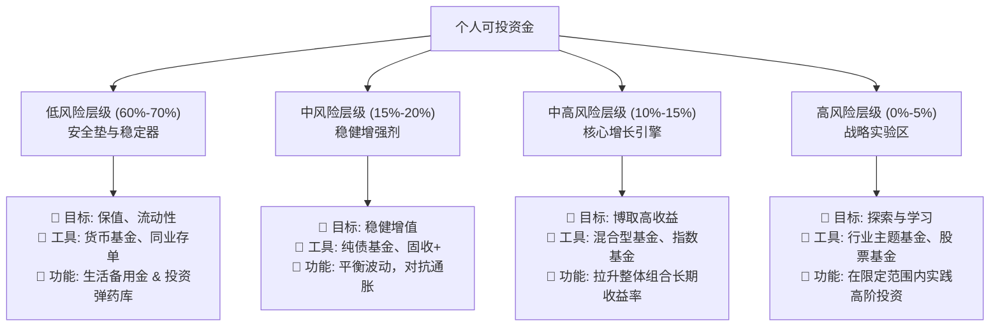

title: 理财投资实战笔记
author: PanYuKang
cover: https://ss2.bdstatic.com/70cFvnSh_Q1YnxGkpoWK1HF6hhy/it/u=1297769102,2929350294&fm=26&gp=0.jpg

tags: [理财知识,生财有道,实践总结]

categories: [生活小技能]

date: 2020-06-25 09:21:00

---

`<b style="color:#00d6a5">`打工是不可能打工了，这辈子不可能一直打工的!`</b>` `<b style="color:#c00040">`做生意又不会做，就是投资这种东西，才可以维持得了生活这样子 `</b>`~`<b style="color:#009ad6">`窃·格瓦拉高仿语录 `</b>`

上班为钱工作，下班让钱为你工作！

## 投资理财渠道分类

目前的理财投资方向大致有以下几大类：

**股票市场投资** ：购买股票是一种常见的投资方式，投资者通过购买公司股票来分享公司的盈利和增长。

**债券市场投资** ：购买政府或企业发行的债券，投资者可以获得固定的利息收入，并在债券到期时收回本金。

**房地产投资** ：购买房地产作为投资，可以通过出租获得租金收入，或者通过房产价值的增长获得资本增值。

**基金投资** ：包括股票基金、债券基金、指数基金等，投资者通过购买基金份额来间接投资于多种资产。

**期货市场投资** ：投资者通过期货合约交易，买入或卖出标的资产，以期在未来的某个时间点按照约定价格交割。

**外汇市场投资** ：购买外汇或外汇衍生品，投资者可以通过汇率波动获取利润。

**互联网金融产品** ：包括P2P网络借贷、互联网理财产品等，通过互联网平台进行投资。

**黄金与其他贵金属投资** ：购买黄金、白银等贵金属，作为一种避险投资或通胀对抗的手段。

**创业投资** ：投资于初创企业或创业项目，以期获得高额回报。

**保险产品投资** ：购买保险产品，既可以保障风险，又可以获得一定的投资收益。

**艺术品和收藏品投资** ：购买艺术品、古董等收藏品，通过价值的增长获取收益。

## 普通人的风险评估

对于普通打工人来说，选择投资渠道和进行风险评估是非常重要的，以下是一些建议：

1. **理清财务状况** ：首先要了解自己的财务状况，包括收入、支出、资产和负债等。理清自己的资产结构和资金流动情况，有助于更好地制定投资计划。
2. **制定投资目标** ：明确自己的投资目标，包括短期、中期和长期目标，例如购房、子女教育、退休规划等。不同的投资目标可能需要采取不同的投资策略。
3. **风险承受能力评估** ：评估自己的风险承受能力，包括财务能力、心理素质和时间承受能力。一般来说，风险承受能力越高的投资者可以承担更多的风险，追求更高的回报。
4. **分散投资** ：避免集中投资于某一种资产或行业，可以通过分散投资降低整体投资组合的风险。例如，可以同时投资于股票、债券、房地产等不同资产类别。
5. **选择适合的投资产品** ：根据自己的投资目标和风险承受能力选择合适的投资产品。对于风险承受能力较低的投资者，可以选择相对稳健的投资产品，如债券、定期存款等；而对于风险承受能力较高的投资者，可以适当配置股票、基金等高风险高收益的投资产品。
6. **定期调整投资组合** ：随着个人情况和市场变化，定期审视投资组合，适时进行调整。可以根据市场走势、投资目标的变化和自身的财务状况来调整投资组合，保持投资策略的灵活性和适应性。
7. **寻求专业建议** ：如果自己对投资理财不够了解，可以寻求专业的理财顾问或金融机构的建议，帮助制定更合理的投资计划和风险管理策略。

## 风险比较和建议

讨论股票、期货、基金和债券这四种投资工具的风险水平时，需要考虑到各自的特点和市场环境。以下是对它们的风险进行简要比较，并提供了投资时的选择建议：

### **股票**

* 风险：股票投资的风险相对较高，因为股票价格波动较大，受市场供需、公司业绩、宏观经济等因素影响较大。股票投资可能面临市场风险、行业风险、公司风险等多种风险。
* 选择建议：对于有一定风险承受能力且追求较高回报的投资者来说，可以适度配置股票。投资时应该选择有良好基本面和发展前景的公司，分散投资，降低单一股票带来的特定风险。

### **期货**

* 风险：期货市场具有较高的杠杆效应，投资者只需支付一小部分保证金即可控制大量资产。因此，期货交易可能带来较大的潜在盈利，但也伴随着较大的潜在亏损。期货市场也存在着流动性风险、市场风险等。
* 选择建议：期货市场适合有较高风险承受能力和丰富市场经验的投资者。投资者在进行期货交易时，应该制定合理的交易策略，严格控制风险，避免过度杠杆和盲目投机。

### **基金**

* 风险：基金的风险相对较低，因为基金是通过资金池集合投资者的资金，由专业的基金经理进行管理和投资，可以实现资产的分散和风险的分担。但是，基金市场也存在市场风险、管理风险等。
* 选择建议：基金适合风险偏好较低的投资者，特别是对于没有足够时间和专业知识研究个股的投资者。选择基金时，应该关注基金的投资策略、基金经理的业绩表现、费用水平等因素。

### **债券**

* 风险：债券投资相对较稳健，因为债券具有固定的利息收益和到期时的本金回收。但是，债券市场也存在利率风险、信用风险、通胀风险等。
* 选择建议：债券适合追求稳定收益、保值增值的投资者，尤其是在经济增长放缓、股票市场波动较大时可以作为避险工具。选择债券时，应该关注债券的信用评级、到期收益率、债券期限等因素。

综合来看，股票和期货的风险相对较高，适合有较高风险承受能力和丰富市场经验的投资者；基金和债券的风险相对较低，适合风险偏好较低的投资者。在选择投资时，投资者应该根据自身的风险偏好、投资目标和市场理解程度来进行选择，并根据市场情况进行适时调整。

## 股票领域知识

一般来说，A股指的是在上海证券交易所（上交所）和深圳证券交易所（深交所）上市的股票，不包括在香港交易所（港交所）上市的股票。

* **上交所**于1990年开业，是**中国**第一个证券交易所。
* **深交所**于1991年开业，是**中国**第二个证券交易所。

沪深两市是**中国**A股市场的主力军，其市值占**中国**A股市场总市值的90%以上。因此，A股通常被用来指代沪深股票。

港股是指在香港交易所上市的股票，包括H股（内地企业在香港发行的股票）和红筹股（控股权在香港的内地企业）。

A股和港股的主要区别：

| 特征       | A股                                    | 港股                                     |
| ---------- | -------------------------------------- | ---------------------------------------- |
| 上市地点   | 上海证券交易所、深圳证券交易所         | 香港交易所                               |
| 代表指数   | 沪深300指数、中证500指数、中证1000指数 | 恒生指数、恒生港股通指数                 |
| 行业构成   | 金融、房地产、周期性行业占比较高       | 科技、金融、地产等行业都具有较强的代表性 |
| 投资者来源 | 以国内投资者为主                       | 以境外投资者为主                         |
| 监管制度   | 由中国证监会监管                       | 由香港证监会监管                         |

## 基金领域知识

常见的余额宝和零钱通都属于货币型基金。

* **余额宝**是由蚂蚁集团旗下的支付宝提供的一项金融服务，用户可以将资金存入余额宝，这些资金会被投资到由天弘基金管理的货币市场基金中，例如天弘余额宝货币市场基金。通过这种方式，用户可以获得比普通储蓄账户更高的收益，并且资金仍然具有较高的流动性和灵活性。
* **零钱通**则是腾讯公司通过其社交应用微信提供的一个类似的服务。零钱通对接了多家基金公司的货币市场基金，如易方达基金、南方基金、嘉实基金和汇添富基金等，用户可以选择不同的货币基金进行投资。

这些基金主要投资于短期货币市场工具，如银行存款、债券、银行承兑汇票等，以稳健的方式获取收益。它们通常以稳定净值形式运作，风险相对较低，适合短期资金存放和流动性管理。

### 支付宝理财

#### 年化收益率

年化收益率是把当前收益率（日收益率、周收益率、月收益率）换算成年收益率来计算的，是一种理论收益率，并不是真正的已取得的收益率。货币基金使用的一般为七日年化，即过去七天每万份基金份额净收益折合成的年收益率。

#### 花呗免息期与余额宝理财收益操作

##### 核心逻辑

利用花呗消费的**免息期**，将本应用于还款的资金（通常是工资）在还款日前存入**余额宝**，赚取短期理财收益。这是一种优化现金管理、提高资金利用效率的方式。

**前提**：必须保证按时**全额还款**，否则高额利息将远超收益。

##### 花呗四种免息期与余额宝理财收益计算

以下计算基于统一假设：

- **本金**：10,000 元
- **余额宝7日年化收益率**：1.263% (约合日万份收益 0.35元/万)
- **利息计算公式**：`利息 = 本金 × 日万份收益 × 免息天数`

| 还款日         | 出账日 | 最佳消费日 ` `(理论最长免息起点) | 理论最长免息期 | 10,000元收益估算 | 50,000元收益估算 | 资金流匹配建议                               |
| :------------- | :----- | :------------------------------------ | :------------- | :--------------- | :--------------- | :------------------------------------------- |
| **10号** | 1号    | **上月2号**                     | **40天** | ≈ 14.0 元       | ≈ 70.0 元       | 适合**月初（1-5号）** 发工资的用户。   |
| **15号** | 5号    | **上月6号**                     | **41天** | ≈ 14.4 元       | ≈ 72.0 元       | 适合**上旬（5-10号）** 发工资的用户。  |
| **20号** | 10号   | **上月11号**                    | **41天** | ≈ 14.4 元       | ≈ 72.0 元       | 适合**中旬（10-15号）** 发工资的用户。 |
| **25号** | 15号   | **上月16号**                    | **41天** | ≈ 14.4 元       | ≈ 72.0 元       | **适合【15号及以后】发工资的用户**。   |

> **注**：表中“免息期”与“收益”均为理论最大值。线上购物以“确认收货”日为准入账，实际免息期可能更长或更短。

##### 操作指南

- **发薪日**：15号
- **推荐设置**：**还款日 25号 / 出账日 15号**

###### 操作流程：

1. **设置调整**：

   - 路径：支付宝 → 我的 → 花呗 → 我的 → 还款日设置。
   - 将还款日调整为 **25号**（出账日会自动变为15号）。
   - **注意**：此操作每年只能进行一次。
2. **月度循环操作**：

   - **每月15日**：工资到账后，立即将预估的花呗账单金额转入**余额宝**。
   - **每月15日-25日**：这笔钱在余额宝中享受约10天的收益。
   - **每月25日**：花呗自动从余额宝（或指定账户）扣款，完成还款。

##### 总结与提醒

1. **本质**：此方法的本质是**利用花呗提供的免息贷款，将自己未来的工资收入进行短期理财**，赚取无风险收益。
2. **收益关键**：收益的提升主要来自于**免息期的拉长**，从而增加了资金在余额宝中的**生息时间**。收益率本身是固定的。
3. **最优选择**：

   - **从收益看**：15号、20号、25号还款的收益差距极小（仅1天差异），**25号还款的方案略优**。
   - **从实操看**：**将还款日设置在与发薪日科学匹配的日期，远比追求多1天的理论免息期更重要**。**25号还款是匹配15号发薪的最佳选择**，它能保证还款资金充足，操作无忧。
4. **重要风险提示**：

   - **理性消费**：切勿因为免息期长而过度消费。这只是管理工具，不是额度奖励。
   - **确认收货**：线上购物的免息期从“确认收货”开始计算，请注意这一点。
   - **自动还款**：务必设置好自动还款，并确保余额宝或绑定银行卡资金充足，避免逾期。

---

**总而言之，对于15号发工资的情况，无需纠结，直接将花呗还款日调整为25号，然后按照上述流程操作，即可最优化资金效率。**

#### 基金业绩走势

1. **沪深300** (代码: 000300 / 399300)： **最常用的大盘基准** 。由上海和深圳两个证券交易所中，规模最大、流动性最好的300只股票组成。它代表了 **中国A股市场的整体大盘走势** 。如果您的基金是偏大盘股的，就应该主要和它比。
2. **中证500** (代码: 000905 / 399905)： **中盘股的代表** 。由剔除沪深300成分股后，总市值排名前500的股票组成。它反映了 **沪深市场中一批中小市值公司的整体状况** 。如果您的基金投资偏向于中小盘、成长性企业，就应该多和它对比。
3. **上证指数** (代码: 000001)：俗称“大盘”。代表 **上海证券交易所全部上市股票的整体表现** 。由于历史最悠久，知名度最高，但因其包含所有股票（包括一些不活跃的大盘股），有时会被认为代表性不如沪深300全面。
4. **上证50** (代码: 000016)： **超级大盘股/龙头股的代表** 。由上海证券交易所市场规模最大、流动性最好的50只股票组成，主要是金融、能源等超大型国企。它是 **大盘中的大盘** ，非常稳健。
5. **深证成指** (代码: 399001)：代表 **深圳证券交易所市场规模大、流动性好的500只股票的整体走势** ，包含较多科技、消费类的创新企业。
6. **国债指数** (代码: 000012)： **债券市场的代表，是“无风险收益”的参考** 。它由交易所上市的固定利率国债组成，走势非常平稳，波动极小。把它放进来是为了让您看看，您选择的这只 **基金相比“无风险投资”多赚了多少（或者多亏了多少）** 。

#### 基金买卖时间参考

##### 📌 买入前检查清单

1. **重仓股和行业**
   * 查看基金的前十大重仓股
   * 是否集中在某个行业？（新能源、半导体、消费、医药等）
   * 最近该行业有没有政策利好或利空消息？
2. **市场整体估值**
   * 沪深300 / 中证500 当前市盈率（PE）、市净率（PB）是否接近历史低位？
   * 估值越低，买入越安全。
3. **市场情绪与资金面**
   * 北向资金：近期是持续流入还是流出？
   * 两融余额：资金是否在加仓？
   * 如果市场整体恐慌下跌，反而可能是低点。
4. **基金自身表现**
   * 最近 1~3 年是否长期跑赢基准指数？
   * 是否比同类平均更优秀？
   * 如果长期落后，说明基金经理可能不行。
5. **买入方式**
   * 不要一次性满仓，建议分 3~5 次买入（定投/分批）。
   * 拉平持仓成本，降低“买就跌”的风险。

---

##### 📌 卖出前检查清单

1. **是否长期跑输基准**
   * 连续 2~3 年都跑不赢沪深300或同类平均 → 考虑换掉。
2. **基金风格是否变化**
   * 基金经理是否换人？
   * 持仓风格是否大幅度偏离原来的投资方向？
3. **是否达到个人目标**
   * 收益率已经达到预期目标（比如 +20%），可以部分止盈。
   * 或者急需用钱，可以合理赎回。

---

##### 📌 特别提醒

* **少看日涨跌，多看长期趋势** （半年~三年）。
* **定投/分批买入** 是小白最稳妥的策略。
* **消息面冲击往往是短期的** ，别被吓得割肉。

### 中高风险基金投资指标及操作时机

#### 资金配置与风险分摊

* **低风险资金（60%-70%）** ：货币基金、同业存单基金 → 稳定收益、托底
* **中风险资金（15%-20%）** ：纯债基金、固收+ → 平衡波动
* **中高风险资金（10%-15%）** ：混合型基金 → 学习、探索、拉升长期收益
* **高风险资金（0%-5%）** ：股票基金、主题基金 → 作为进阶实验

👉 通过低风险产品的稳定收益（如每月几百元），定向投入中高风险基金，既能学习投资节奏，又能分摊潜在亏损。

#### 核心配置策略：四分法

我将资金分为四个风险层级，其比例应根据个人风险偏好动态调整。下图直观地展示了这一“金字塔式”的资产配置结构：

#### 核心操作理念：用“租金”支付“学费”

这是我最为推荐的执行策略，它能彻底改变你的投资心态：

- **资金来源**：严格执行上述配置，**低风险层级（60%-70%）就像一个“核心资产”**，其产生的每月稳定收益（利息），就是这套资产产生的“租金”。
- **资金用途**：将这笔固定的“租金”收入（例如每月500元），**定向、定额地投入中高风险层级**（例如通过定投方式买入看好的混合型基金）。
- **战略优势**：
  1. **心态归零**：由于投入的资金是“利润”，即使全部亏损，本金也毫发无伤。这能让你以极其平和的心态面对市场波动，彻底告别“赌徒心理”。
  2. **强制学习**：这个过程迫使你持续地关注市场、选择基金、实践策略，是成本最低、效果最好的投资课程。
  3. **风险绝对可控**：亏损上限就是你当月的“租金”收入，不会出现无法承受的损失，完美实现了风险分摊。

#### 分层级的投资策略与工具选择

| 风险层级           | 投资工具                 | 投资策略                             | 止盈/止损建议                                                     |
| :----------------- | :----------------------- | :----------------------------------- | :---------------------------------------------------------------- |
| **低风险**   | 货币基金、同业存单       | 一次性投入或作为资金中转站           | 无需止盈止损，持续持有                                            |
| **中风险**   | 纯债基金、固收+          | 一次性投入或逢市场调整时买入         | 目标年化5%-8%止盈；除非基金经理变更或基本面恶化，否则不止损       |
| **中高风险** | 混合型基金、宽基指数基金 | **定期定额定投**为核心         | **目标年化15%-20%止盈**；亏损时采用**金字塔补仓法**； |
| **高风险**   | 行业主题基金、股票基金   | **小额试探**，严格遵循止损纪律 | 亏损**-15%至-20%** 坚决止损；盈利设置**移动止盈**，保住利润 |

#### 如何启动计划

1. **盘点**：梳理你所有的金融资产，计算当前在各个风险层级的实际比例。
2. **调整**：将资金逐步向目标比例（如7:2:1）调整。如果高风险占比过高，暂停新增投入。
3. **开户**：在可靠的平台（如天天基金、且慢等）开设账户，并分别建立“低风险”、“中高风险”等投资组合，便于管理。
4. **执行**：将每月工资等新增收入，先补充低风险资产。然后，将低风险资产产生的利息，自动定投到中高风险基金中。
5. **复盘**：每季度或每半年回顾一次各层的表现和比例，进行动态再平衡。

#### 核心投资原则

1. **风险分摊原则**：用低风险资产（货币基金、同业存单等）的稳定收益，作为投资中高风险基金的“弹药”和“安全垫”，确保整体资产稳健。
2. **学费思维**：将投入中高风险基金的资金视为“学费”，其首要目标是获取投资经验，其次才是盈利。即使亏损，也能从过程中总结规律。
3. **纪律至上**：必须用严格的计划克服人性弱点（贪婪与恐惧），任何操作都应基于预设的规则，而非市场情绪。

#### 基金诊断指标（买入/持有前的体检）

在决定投资或补仓一只基金前，必须对其进行全面诊断，确保其“体质健康”。

* **业绩基准对比**：基金过去1年、3年的业绩是否持续跑赢其自身的**业绩比较基准**（如沪深300指数）。跑不赢基准的基金直接排除。
* **同类排名对比**：基金业绩在同类产品中的排名是否稳定在前1/2。长期排名后1/2的基金，表明其本身质地或经理能力可能存在问题。
* **基金经理评估**：
  * **从业年限**：是否超过7年，经历过完整的牛熊市考验。
  * **在管时长**：现任经理管理该基金的时间是否足够长，确保历史业绩是由他创造。
  * **投资风格**：风格是否清晰且稳定，无风格漂移现象。
* **风险指标**：
  * **最大回撤**：历史最大亏损幅度是多少？当前亏损是否已接近或超过历史极值。此指标衡量基金经理的控制风险能力。
  * **夏普比率**：每承受一单位风险，能获得多少超额回报。比率越高，基金的“风险性价比”越高。

> **操作时机**：只有当基金通过以上所有诊断，确认其本身优质后，才可考虑买入或执行下面的补仓策略。否则，应果断止损换仓。

#### 下跌补仓策略（金字塔式补仓法）

对于优质但买入时机不佳导致亏损的基金，采用“越跌越买”的策略摊薄成本，但需有计划地执行。

* **策略核心**：预设跌幅梯度，跌幅越大，补仓金额越多，形成“金字塔”形状，从而快速拉低平均持仓成本。
* **操作示例**：
  * 以首次买入本金为 `1000元`，成本净值 `1.0`为例。
  * `净值跌至0.95`（跌5%）-> 补仓 `200元` （试探）
  * `净值跌至0.90`（跌10%）-> 补仓 `500元` （加码）
  * `净值跌至0.85`（跌15%）-> 补仓 `1000元` （核心）
  * `净值跌至0.80`（跌20%）-> 补仓 `1500元` （重拳）
* **关键要点**：
  1. 必须提前制定好计划，白纸黑字写清楚，**跌破什么价位、补多少金额**。
  2. 必须确保有充足的后续资金（来自低风险收益或新增收入）作为“弹药”，防止打光子弹。
  3. 补仓后可能继续下跌，需有心理准备。**目的是管理成本，而非抄到最低点**。

> **操作时机**：严格执行预设的补仓计划，市场每跌到一个预设阈值，就机械执行，克服恐惧心理。

#### 止盈退出策略（目标止盈法）

为了避免利润回吐，需预设科学的退出机制，锁定利润。

* **年化目标止盈法**：
  * 设定一个年化收益率目标（如：年化15%或20%）。
  * **计算公式**：`持有收益率 = (当前净值 - 成本净值) / 成本净值`
  * 年化收益率 = (1 + 持有收益率)^(365 / 持有天数) - 1
  * 当计算出的 `年化收益率`达到预设目标时，即可考虑卖出。此法能更合理地衡量资金使用效率。
* **分批止盈法**：
  * 达到目标收益后，不要一次性卖光，可分2-3批卖出。
  * 例如：收益率达15%时卖出一半，剩余部分设置一个更高的止盈目标或趋势线止盈，力求收益最大化的同时规避部分风险。

> **操作时机**：当收益率触发预设的止盈条件时，果断执行卖出纪律，克服贪婪心理。**“会买的是徒弟，会卖的才是师傅”**。

#### 持续投资方式（定期定额法）

对于新增资金或每月结余，采用定投方式平滑风险。

* **标准定投**：每月/每周固定日期投入固定金额。无视市场涨跌，利用长期平均效应降低成本。
* **价值平均定投（进阶）**：每月定投的目标是让账户总市值增加一个固定值（如每月增加1000元）。市值涨则少投，市值跌则多投，比标准定投效率更高。

> **操作时机**：任何时候都是开始定投的时机。定投是长期战略，无需择时，贵在坚持。

---

### 公募基金与私募基金

**一、募集方式**

* **公募基金:** 面向不特定对象公开募集，募集资金规模一般较大，例如：
  * 通过银行、证券公司等金融机构向社会公众发行基金份额
  * 基金招募说明书、产品资料等需报中国证监会备案
* **私募基金:** 面向特定对象非公开募集，募集资金规模一般较小，例如：
  * 向合格投资者（如：机构投资者、高净值投资者等）发行基金份额
  * 基金招募说明书、产品资料等无需报中国证监会备案

**二、投资范围**

* **公募基金:** 投资范围受到严格限制，只能投资符合监管规定的金融产品，例如：
  * 股票型基金：主要投资股票
  * 债券型基金：主要投资债券
  * 混合型基金：股票和债券投资比例混合
  * 指数型基金：跟踪特定指数进行投资
* **私募基金:** 投资范围相对灵活，可投资股权、期权、商品、海外资产等非标资产，例如：
  * 股权投资型私募基金：投资未上市公司股权
  * 债权投资型私募基金：投资企业债权
  * 商品及期货投资型私募基金：投资商品期货
  * 海外投资型私募基金：投资境外资产

**三、收益分配**

* **公募基金:** 基金管理公司收取固定管理费，不参与收益分配，例如：
  * 基金管理费率一般为基金资产净值的0.5%-1.5%
  * 投资者根据基金净值增长情况获得收益
* **私募基金:** 基金管理公司收取管理费和超额收益提成，例如：
  * 基金管理费率一般为基金资产净值的1%-2%
  * 投资者获得基金净值增长收益后，基金管理公司按约定比例提取超额收益提成

**四、风险管控**

* **公募基金:** 受到严格监管，信息披露和风控要求高，例如：
  * 定期向中国证监会报送基金运作情况
  * 严格遵守投资比例、投资范围等监管规定
* **私募基金:** 监管相对宽松，投资者需自行承担投资风险，例如：
  * 基金管理公司信息披露义务相对较少
  * 投资风险需由投资者自行承担

**五、其他区别**

* **流动性:** 公募基金份额可在二级市场交易，流动性较好；私募基金份额通常存在锁定期，流动性较差。
* **透明度:** 公募基金定期披露财务信息，信息透明度较高；私募基金信息披露义务相对较少，信息透明度较低。

**六、投资者选择建议**

* **公募基金:** 适合风险承受能力较低、追求稳健收益的投资者
  * 建议选择历史业绩良好、基金管理公司实力雄厚的基金产品
  * 长期持有，避免频繁交易
* **私募基金:** 适合风险承受能力较高、追求高收益的投资者
  * 建议选择经验丰富、信誉良好的基金管理公司
  * 详细了解基金投资策略、风险特征等，审慎投资
  * 做好风险评估，理性投资

### 公募基金:LOF和ETF

公募基金中的 LOF（上市型开放式基金）和 ETF（交易所交易基金）都是开放式基金，可以在交易所进行交易，但两者之间存在一些关键差异：

**1. 申赎机制**

* **LOF：** LOF 的申赎通过净值（NAV）交易来进行，投资者可以向基金管理公司或其指定的销售代理商申购或赎回 LOF 基金份额。基金的净值是根据基金每天的资产组合价值计算出来的。
* **ETF：** ETF 的申赎通过实物交易来进行，授权参与者（AP）可以向基金管理公司申购或赎回 ETF 基金份额，授权参与者通常是大型机构投资者。AP 可以通过向基金管理公司交付与基金指数相匹配的证券篮子来申购新 ETF 基金份额，也可以通过从基金管理公司接收证券篮子来赎回 ETF 基金份额。

**2. 适用性**

* **LOF：** LOF 是适合那些希望以低成本、多元化的方式投资特定市场或行业的投资者的良好选择。它们也是适合那些希望在交易日内任何时间买卖其份额的投资者的良好选择。
* **ETF：** ETF 是适合那些希望尽可能紧密地跟踪特定指数或基准的投资者的良好选择。它们也是适合那些希望在一级市场交易其份额的投资者的良好选择。

以下表格总结了 LOF 和 ETF 的主要区别：

| 特征     | LOF                    | ETF                        |
| -------- | ---------------------- | -------------------------- |
| 申赎机制 | 净值交易               | 实物交易                   |
| 跟踪误差 | 可能存在一些跟踪误差   | 设计尽可能减少跟踪误差     |
| 交易方式 | 交易所交易             | 交易所交易和一级市场交易   |
| 费用     | 通常费用率较低         | 费用率可能略高             |
| 适用性   | 低成本多元化和全天交易 | 紧密跟踪指数和一级市场交易 |

## 基金类型

### 同业存单基金

同业存单基金主要投资于银行发行的同业存单，而同业存单本质上是一种银行间市场的短期债务工具，可以被视为一种特殊的债券。基金为了分散风险和提高收益，除了同业存单外，还会配置其他类型的债券，例如短期国债、政策性金融债、高信用等级的信用债等。

### 长期纯债基金

* **投资对象** ：主要投资于长期债券，即到期期限较长的债券，这可能包括几年甚至十几年以上的债券。
* **风险与收益** ：长期债券对利率变动较为敏感，因此长期纯债基金通常具有较高的利率风险。相应地，长期债券的收益率通常也更高，这意味着长期纯债基金有可能获得较高的收益。
* **适合投资者** ：适合寻求较高收益并能够承受较大波动的投资者。

### 短期纯债基金

* **投资对象** ：主要投资于短期债券，即到期期限较短的债券，一般期限在1年或更短。
* **风险与收益** ：短期债券对利率变动不太敏感，因此短期纯债基金的风险相对较低，同时预期收益也较低。
* **适合投资者** ：适合寻求稳定收益且偏好较低风险的投资者。

### 混合债券基金（混债基金）

* **投资对象** ：主要投资于债券，但也可能包含一小部分股票或其他资产，以此来增加收益潜力。
* **风险与收益** ：相比于纯债基金，混合债券基金的风险和潜在收益通常都较高。这是因为股票等其他资产类型通常比债券更具波动性。
* **适合投资者** ：适合寻求高于纯债基金的收益水平，但又不愿承受股票型基金那样高风险的投资者。

总结来说：

* **长期纯债基金** ：高收益潜力，但伴随较高利率风险。
* **短期纯债基金** ：较低风险，预期收益也相对较低。
* **混合债券基金** ：在债券的基础上增加了股票等其他资产的投资，提高了收益潜力同时也增加了风险

### 混合型-固收基金

1. **基础资产** ：主要投资于固定收益类资产，如国债、企业债等。
2. **资产配置** ：除了固定收益资产外，还会投资于股票、可转换债券、衍生品等其他资产以增加收益。
3. **风险收益** ：“固收+”基金相对于纯债基金通常具有更高的风险和收益潜力，但相比股票型基金风险较低。

### 债券基金中的利率债、信用债和银行债的区别

债券基金是投资于各种债券的基金。根据债券的发行主体和风险特征，可以将债券基金分为不同的类型，其中利率债、信用债和银行债是常见的几种。

#### 利率债

* **发行主体：** 主要包括国债、地方政府债、政策性金融债、央行票据等。这些债券的发行主体通常是政府或政府机构，信用等级极高。
* **风险特征：** 利率风险是主要风险，即利率变动会影响债券价格。利率上升时，债券价格通常会下降；利率下降时，债券价格通常会上升。信用风险相对较低。
* **收益特点：** 收益相对稳定，但受制于利率水平。

#### 信用债

* **发行主体：** 主要包括企业债、公司债、短期融资券、中期票据等。这些债券的发行主体是企业。
* **风险特征：** 除利率风险外，还面临信用风险，即发行企业违约的风险。信用评级越高的企业，其债券的信用风险越低。
* **收益特点：** 相较于利率债，信用债的收益较高，但波动性也较大。

#### 银行债

* **发行主体：** 由银行发行的债券。
* **风险特征：** 银行债的风险介于利率债和信用债之间。银行的信用等级通常较高，但相较于政府机构，仍存在一定的信用风险。
* **收益特点：** 收益水平一般高于利率债，但低于高风险的信用债。

#### 债券类型表格总结

| 债券类型 | 发行主体       | 主要风险                   | 收益特点           |
| -------- | -------------- | -------------------------- | ------------------ |
| 利率债   | 政府或政府机构 | 利率风险                   | 稳定               |
| 信用债   | 企业           | 利率风险、信用风险         | 相对较高，波动较大 |
| 银行债   | 银行           | 利率风险、信用风险（较低） | 中等               |

## 被动收入

**被动收入** ，即无需持续投入大量精力和时间，就能稳定产生的收入。无论是普通人还是富人，都希望通过被动收入实现财务自由。但由于起步资本、风险承受能力等方面的差异，他们的被动收入来源和规模往往不同。

### 普通人被动收入

#### **投资理财**

* **股票、基金、ETF：** 购买并持有优质的股票、基金或ETF，通过分红或资本增值获得收益。
* **债券：** 购买政府或企业债券，获得固定利息收入。
* **P2P网贷：** 将资金借给个人或小企业，获得高于银行存款的利息。

#### **出租资产**

* **房屋出租：** 将闲置房产出租，获得租金收入。
* **汽车租赁：** 将私家车加入共享汽车平台，获得分润。

#### **知识变现**

* **写作、出版：** 将自己的知识或经验转化为书籍、电子书或在线课程，获得版税或销售收入。
* **博客、视频创作：** 通过运营个人博客或视频频道，获得广告收入、赞助收入或平台分成。

#### **版权收入**

* **音乐、摄影、绘画：** 将自己的作品授权给平台或企业使用，获得版税收入。

#### **分红**

* **投资合伙企业：** 成为合伙人，分享企业利润。

### 富人被动收入

#### **房地产投资**

* **商业地产：** 购买商业地产，出租给商家，获得租金收入。
* **房地产信托基金（REITs）：** 投资于房地产信托基金，分享其产生的租金收入和资本增值。

#### **股权投资**

* **天使投资：** 投资于初创企业，获得股权，分享企业成长带来的收益。
* **私募股权基金：** 投资于私募股权基金，分享其投资组合的收益。

#### **创办企业**

* **建立被动收入型企业：** 创办不需要持续投入大量时间的企业，如软件开发公司、在线教育平台等。

#### **收藏品投资**

* **艺术品、古董：** 收藏具有升值潜力的艺术品或古董，通过转售或拍卖获得收益。

## 赚钱方式的级别划分

赚钱的方式可以根据**资本投入、技能要求、风险程度、回报规模**以及**时间自由度**等维度进行等级划分。以下是结合当前行业领域的突出表现和全球财富玩法趋势进行分析。

---

### 赚钱级别划分

1. **基础级：依赖劳动收入（普通人打工上班）**

   - **特点**：通过出卖时间和体力/脑力劳动换取固定工资，收入稳定但天花板较低，时间自由度低。
   - **代表**：普通上班族、蓝领工人、服务行业从业者。
   - **行业表现**：
     - **科技行业**：程序员、数据分析师等岗位在全球范围内需求旺盛，尤其是在AI和大数据领域。2025年，AI相关岗位的平均年薪在发达国家可达10万美元以上。
     - **医疗行业**：护士、医生等职业因全球老龄化趋势而需求激增，尤其在老年消费市场（如养老护理）中表现突出。
   - **局限**：收入受限于工作时间和岗位级别，难以实现财富积累。
2. **进阶级：小额资本运作与理财（购买基金、投资理财）**

   - **特点**：利用闲置资金进行投资，收入来源从单一劳动转向资本增值，风险和回报并存。
   - **代表**：购买股票、基金、债券，或参与P2P、加密货币投资的个人。
   - **行业表现**：
     - **基金投资**：2025年，全球ETF（交易型开放式指数基金）市场规模预计突破10万亿美元，绿色能源和科技类基金（如AI、碳中和相关）表现突出。
     - **加密货币**：比特币、以太坊等主流加密货币在2024-2025年经历波动后，DeFi（去中心化金融）和NFT相关投资仍吸引大量资金。
   - **前景**：普通人通过低门槛的指数基金（如标普500 ETF）实现长期复利增长，年化收益率可达7%-10%。
3. **中级：技能变现与小规模创业（个人工作室、摆摊、自由个体商业户）**

   - **特点**：依靠个人技能或小额资本创业，收入与能力直接挂钩，时间自由度较高，但需要持续接单或经营。
   - **代表**：自由职业者（设计师、翻译、程序员）、摆摊小贩、个体户（如餐饮摊、零售店）。
   - **行业表现**：
     - **自由职业**：平台如Upwork、Fiverr在2025年持续增长，全球自由职业市场规模预计达1.5万亿美元，特别是在设计、内容创作和编程领域。
     - **摆摊经济**：在中国，低成本的夜市经济和地摊经济因政策支持而蓬勃发展，尤其在二三线城市，摆摊卖小吃、饰品等日收入可达500-1000元。
   - **前景**：随着“超级个体”概念兴起，个人通过技能变现的模式将更普遍，尤其在数字经济领域。
4. **中高级：规模化经营与流量变现（开公司、网红直播带货、联盟连锁店）**

   - **特点**：需要一定的资本、团队或流量基础，收入规模较大，但风险和运营成本也随之增加。
   - **代表**：中小企业老板、直播带货网红、加盟连锁店（如奶茶店、餐饮连锁）。
   - **行业表现**：
     - **直播带货**：2025年，全球直播电商市场规模预计达2.5万亿美元，中国市场尤为突出，头部主播如李佳琦年收入超10亿元人民币。
     - **联盟连锁店**：低风险的加盟模式在餐饮、零售领域表现强劲，例如奶茶品牌“喜茶”在全球的连锁店数量已突破5000家。
     - **中小企业**：科技初创公司在AI、机器人领域表现突出，2025年全球AI初创企业融资总额预计达500亿美元。
   - **前景**：流量经济和品牌连锁仍将是中短期内的财富增长点，但需要持续创新以应对市场饱和。
5. **高级：全球化与资本运作（跨国贸易、个人知识产权、发明专利、学术贡献）**

   - **特点**：需要高资本、高技能或高影响力，收入潜力巨大，但进入门槛高，风险也较大。
   - **代表**：跨国贸易商、专利发明人、学术大牛。
   - **行业表现**：
     - **跨国贸易**：2025年，低空经济（如无人机物流）和跨境电商是亮点，亚马逊、Shopify等平台上的中国卖家年销售额增长20%以上。
     - **知识产权与专利**：在AI和脑机接口领域，专利价值飙升。例如，Neuralink的脑机接口专利估值已超10亿美元。
     - **学术贡献**：学术成果商业化（如生物医药领域的基因编辑技术）带来高额回报，CRISPR技术的发明者年收入超千万美元。
   - **前景**：随着全球化的深入，知识产权和专利将成为财富积累的重要途径，尤其在科技和医疗领域。
6. **顶级：系统性财富创造（全球财富玩法）**

   - **特点**：通过构建生态系统、平台或颠覆性创新实现财富的指数级增长，影响力和资源整合能力极强。
   - **代表**：平台经济巨头（如亚马逊、腾讯）、颠覆性技术创始人（如埃隆·马斯克）。
   - **行业表现**：
     - **平台经济**：搭建交易平台并收取佣金的模式（如淘宝、Uber）在全球持续扩张，2025年平台经济市场规模预计达3万亿美元。
     - **颠覆性创新**：AI、机器人、低空经济、碳中和等领域正在重塑财富格局。例如，SpaceX的星链项目估值已超2000亿美元。
   - **前景**：顶级财富玩法需要极高的资源整合能力和前瞻性，但回报也最为惊人。

---

### 未来有前景的赚钱领域

1. **低空经济**：

   - **概述**：包括无人机配送、空中出租车等，2025年全球低空经济市场规模预计达1万亿美元。
   - **案例**：中国企业如亿航智能在空中出租车领域已实现商业化运营，单次飞行收费约300美元。
   - **前景**：随着城市化进程和交通需求的增加，低空经济将成为新的财富风口。
2. **老年消费市场**：

   - **概述**：全球老龄化加剧，养老服务、健康管理、智能设备需求激增。
   - **案例**：日本的养老机器人市场在2025年预计达5000亿日元，智能护理机器人年销量增长30%。
   - **前景**：针对老年人的定制化服务（如健康监测、陪伴机器人）将持续增长。
3. **虚拟现实/增强现实（VR/AR）**：

   - **概述**：VR/AR在教育、娱乐、医疗领域的应用快速扩展，2025年市场规模预计达800亿美元。
   - **案例**：Meta的VR教育平台已覆盖全球5000所学校，年收入增长50%。
   - **前景**：随着元宇宙概念的深化，VR/AR相关创业将带来巨大回报。
4. **二手经济**：

   - **概述**：循环经济兴起，二手交易平台（如闲鱼、eBay）成为新风口。
   - **案例**：2025年，中国二手电商市场规模预计达1.5万亿元，闲鱼用户数突破5亿。
   - **前景**：环保意识增强推动二手经济持续增长，尤其在奢侈品、电子产品领域。
5. **出海经济**：

   - **概述**：中国企业通过跨境电商、海外建厂等方式拓展全球市场。
   - **案例**：TikTok在2025年全球月活用户突破20亿，广告收入超500亿美元。
   - **前景**：新兴市场（如非洲、东南亚）的消费潜力巨大，出海将成为中小企业的新增长点。

---

### 全球财富玩法分析

1. **平台经济与流量变现**：

   - 全球范围内，搭建平台并通过流量变现是主流财富玩法。例如，亚马逊通过电商平台收取佣金，2025年预计年收入超6000亿美元。
   - **玩法**：创建内容平台（如YouTube、抖音）或交易平台（如Airbnb），通过广告、佣金或会员费盈利。
2. **资本运作与投资**：

   - 顶级富豪通过风险投资（VC）、私募股权（PE）实现财富增长。例如，软银的孙正义通过投资阿里、Uber等公司赚取数百亿美元回报。
   - **玩法**：投资早期科技公司（如AI、生物科技），通过IPO或并购退出获利。
3. **技术创新与专利布局**：

   - 科技领域的专利布局是高回报的财富玩法。例如，苹果通过专利诉讼和授权每年赚取超50亿美元。
   - **玩法**：研发颠覆性技术（如量子计算、基因编辑），通过专利授权或技术转让获利。
4. **绿色经济与碳中和**：

   - 全球对碳中和的重视催生了新能源、碳交易等新玩法。例如，特斯拉通过碳积分交易在2024年赚取20亿美元。
   - **玩法**：投资新能源项目（如光伏、风电），或参与碳交易市场。
5. **全球化与新兴市场**：

   - 发达国家的企业通过进入新兴市场（如印度、非洲）获取高增长。例如，Starlink在非洲的卫星互联网服务已覆盖5000万用户。
   - **玩法**：通过本地化产品和服务，快速占领新兴市场。

---

## 实践经验小结

目前站长关注的理财投资渠道主要为股票、期货、基金和债券等等相关信息。关注理财方面的知识也有段时间了，但一直没有时间做笔记进行记录或总结，先前接触的期货，高风险基金等投资产品也是亏了一些钱，都是瞎投。这次不打无准备之仗，每一次的实战经验都要进行一次深刻总结，开始学习如何使用钱生钱技巧，期望滚雪球，每天进账一点点！
