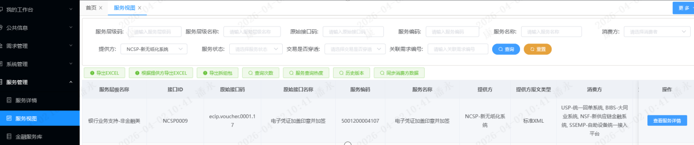

title: 银行业务知识
author: PanYuKang
comments: false
message: 您好，本篇文章需密码访问，请谅解！
password: card0113
tags: [银行系统,业务知识,金融服务]
categories: [项目]
date: 2020-09-22 12:24:00

---

## 业务知识

### 银行卡校验位计算

校验位的计算是在预制卡申请时完成的，预制卡申请阶段就已经生成了卡号。

卡号奇数位之和有两种情况：

1. 当奇数位乘以2大于等于10，则奇数位乘以2与10取余
2. 小于10则乘以2

奇数位总和=以上两种情况分别计算之和

偶数位总和=银行卡号除了最后一位从右到左偶数位之和

例子：GYbank卡号：6215529901000000215

从右到左开始数

奇数位有：1 0 0 0 1 9 2 5 2

偶数位有：2 0 0 0 0 9 5 1 6

奇数位之和=1*2+0*2+0*2+0*2+1*2+9*2%10+2*2+5*2%10+2*2
=2+2+9+4+1+4=22

偶数位之和=2+9+5+1+6=23

所以校验位=（10-（奇数位之和+偶数位之和）%10）%10=5

每个银行校验位算法都不同，此算法只是遵循GYbank卡号校验位的计算规则。

### 卡号组成规则

`<code style="color:#009ad6;">`卡号组成公式为“卡号=6位卡BIN号+2位地区+2位卡号种类+8位顺序号+1位校验位”`</code>`

一般情况下，银行卡号的组成长度为19位，GYbank普通借记卡的组成长度是19位，卡号组成公式为“卡号=6位卡BIN号+2位地区+2位卡号种类+8位顺序号+1位校验位”。开立银行卡之前需要建立客户信息，上级库管员领用给一般柜员或自助柜员，柜员尾箱下存在卡凭证，才允许进行发卡处理。

### 交易背景介绍

银行卡凭证的生命周期主要分为申领、使用和销毁三个阶段，从卡凭证种类的角度来讲，是从空白卡-预制卡-正常卡-待销毁卡-作废卡的一个转变的过程。

申领的发卡方式有预制卡发卡和预约卡发卡。预制卡发卡时，确认当日柜员尾箱下的预制卡数量充足，在客户向柜员申请卡片时，柜员就可以直接将卡片发到客户手中，客户就可以使用该卡片从事相关的金融活动。预约卡发卡时，需要客户先向柜面柜员提交申请，柜员尾箱下拿到预约的卡凭证之后，才能发放给客户，客户完成领卡和激活的动作就可以使用了。

在使用阶段，我们除了使用银行卡进行正常的金融活动之外，还可以进行换卡、挂失、改密、激活和销卡的处理。换卡原因一般有正常换卡、卡片到期换卡、损坏换卡、挂失补卡，虚拟卡补实体卡等。当卡片丢失时，可通过口头挂失和正式挂失等方式进行挂失，挂失之后还能进行解挂处理；对于批量发卡时，需要进行卡片的激活处理。实时发卡时卡片已启用，客户领完卡就可以直接使用。代理16周岁以下的开卡操作，需本人携带户口本或身份证等复印件前往银行亲自确认并激活才能使用，否则卡片是仅锁卡状态，只能存入而不能取出。忘记密码时可以进行改密处理。当卡片不再使用时，可进行正常的销卡处理，但若存在签约贷款账户的卡片，需要进行先销户才能进行销卡处理，否则不允许销卡。

在销毁阶段，可分为待销毁卡上缴和销毁两个步骤。适用于吞没卡、拾遗卡、没收卡等卡片的处理。比如客户在ATM机上面连续输错密码3次或将卡片放在取卡口未及时取卡导致卡片被吞没。在一定时间内（15个工作日）银行会代为保管，客户若到银行领取卡片，则将卡片退回。超过规定的保管日期，客户没有到银行领取卡片，银行会将卡片剪卡作销毁处理。

### 个人卡开卡业务流程

**功能描述**

实时单张发个人卡主卡交易主要是为了建立卡与客户之间的关联关系。当客户向柜员申请卡片时，先检查客户信息、产品信息、卡号等基本信息通过之后，调用负债开户构件生成个人活期结算账户与客户账号进行关联，柜员将预制卡发放给客户，最后付出卡凭证的一个过程。
具体开卡之前的准备工作流程如下：


### 交易处理流程

根据业务逻辑代码，以服务为节点绘制交易处理流程图，如图所示：


### 卡产品介绍

可开立的银行卡有金卡、白金卡、钻石卡、标准金融IC卡、三类账户虚拟卡等卡产品。目前只做借记卡产品，不涉及信用卡产品。借记卡客户最大持卡量一般不超过4张，虚拟卡不超过20张，特殊情况下可授权进行更改。预约卡一般超过15天未领将会被锁卡（金融IC卡和磁条卡除外，且磁条卡已暂停使用）。卡产品的有效期一般为10年，不同的银行有不同的规定。

### 卡产品参数控制

|    参数名称    |                       枚举值                       |                                                                                                                                             控制描述                                                                                                                                             |
| :------------: | :------------------------------------------------: | :----------------------------------------------------------------------------------------------------------------------------------------------------------------------------------------------------------------------------------------------------------------------------------------------: |
|    卡BIN号    |                         无                         |                                                                                                                    卡BIN号是银行通过银联申请得到的号码，一般为6位，不可修改。                                                                                                                    |
|    卡号种类    |                         无                         |                                                                                                                       卡号种类一般为2位，允许修改，不同银行有不同的规定。                                                                                                                       |
|     卡介质     | 0-磁条卡；1-IC卡；2-复合卡；3-虚拟卡；4-纯电子现金 | 磁条卡是指在卡片上印制磁条信息，通过读取和比对实现支付、转账等交易的银行卡；IC卡内含一块集成芯片，可以实现复杂的运算的银行卡；复合卡作为金融IC卡的过渡卡种，同时支持芯片和磁条两种介质；虚拟卡是指用于无卡支付的虚拟账户，没有实体卡；纯电子现金指的是以数字形式存在，可在互联网流通的电子现金。 |
|    卡种性质    |           0-借记卡；1-贷记卡；2-准贷记卡           |                                                                            借记卡指的是储蓄卡，先存款再取出且没有透支功能的银行卡；贷记卡和准贷记卡都是指信用卡，在规定额度范围内先消费后还款，具有透支功能的银行卡。                                                                            |
|     卡对象     |                 0-个人卡；1-单位卡                 |                                                             个人卡是指银行向个人，包括居住在城镇的工人、干部、教师、科技工作者、个体经济户等发行的银行卡；单位卡是指银行向企业、事业单位、学校、机关、团体、部队等单位发行的银行卡。                                                             |
|     卡种类     |                 0-普通卡；1-联名卡                 |                                            两者都能满足用户的存取、消费、转账等需求。主要区别在于联名卡会享有更有特色的权益和卡面。例如：货车帮联名卡，持该卡在货车帮旗下门店进行车辆维修、购置汽车配件、缴纳信息服务费、管理费等可享受一定折扣优惠。                                            |
| 客户最大持卡量 |                         无                         |                                                                                                            借记卡不超过4张，虚拟卡不超过20张；特殊情况下，需授权通过才允许进行更改。                                                                                                            |
| 未领卡锁定天数 |                         无                         |                                                                                                                  事后卡一般超过15天未领卡会被锁定（仅锁卡），不同银行规定不同。                                                                                                                  |

### 负债产品介绍

开个人借记卡默认是开立个人活期账户，一般可选择一类账户、二类账户和三类账户，账户分别对应的产品为个人活期存款、II类活期产品、III类活期产品。开一、二、三类户的目的主要是在一类账户的基础功能上面逐级递减，资产风险依次递减的作用。

一、二、三类账户的差别如下表所示：

| 账户分类 |   对应产品   |   账户余额   |          使用限额          |        账户形式        |           主要功能           |
| :------: | :-----------: | :----------: | :-------------------------: | :--------------------: | :--------------------------: |
| 一类账户 | 个人活期存款 |    不限制    |           不限制           | 储蓄卡、借记卡及存折等 | 可存取款、理财、消费和转账等 |
| 二类账户 | II类活期产品 |    不限制    | 单日限额1万元；年限额20万元 | 电子账户（可配实体卡） | 可存取款、理财、消费、转账等 |
| 三类账户 | III类活期产品 | 不超过1000元 | 单日限额5千元；年限额10万元 |   电子账户，无实体卡   |  消费、缴费等小额高频的交易  |

### 负债产品参数控制

|    字段中文名    |                            枚举值                            |                                                               控制描述                                                               |
| :--------------: | :----------------------------------------------------------: | :----------------------------------------------------------------------------------------------------------------------------------: |
|   产品定活标志   |                   0-活期产品；  1-定期产品                   |                               个人开卡一般开立的是活期产品，但银行卡既可以开活期产品也可以开定期产品。                               |
|   产品所属对象   |       1-对私存款产品； 2-对公存款产品； 3-同业存款产品       |                               个人开卡面向的是对私存款产品，单位开卡面向的是对公存款产品、同业存款产品                               |
|     产品类型     |                   0-传统产品；  1-扩展产品                   |                                            一类账户属于传统产品，二、三类账户属于扩展产品                                            |
|   产品默认币种   |                  156-人民币；  其余略。。。                  |                                                    目前所有产品默认币种都是人民币                                                    |
|     通兑范围     | 2-全行通兑；  0-开户机构通兑；  1-分行通兑；  3-核算机构通兑 | 一、二、三类户的通兑范围为全行通兑；  个人活期产品一般为全行通兑，单位活期产品为开户机构通兑或核算机构通兑；分行通兑目前没有此业务。 |
|     通存范围     | 2-全行通存；  0-开户机构通存；  1-分行通存；  3-核算机构通存 | 一、二、三类户的通存范围为全行通存；  个人活期产品一般为全行通存，单位活期产品为开户机构通兑或核算机构通存；分行通存目前没有此业务。 |
| 是否形态转移定义 |                         0-否；  1-是                         |                                             活期账户允许形态转移，定期账户不允许形态转移                                             |

### 会计分录

概念：会计分录是指根据经济业务的内容，对每项经济业务列出应借、应贷账户名称及其金额的一种记录。

复式记账法的种类有借贷记账法、增减记账法和收付记账法。下面的会计分录用到的是借贷记账法，它有一个平衡公式是“资产=负债+所有者权益”，以“借”和“贷”为记账符号，以“有借必有贷，借贷必相等”为原则进行审查。

1. 现金开卡会计分录：

借： 现金尾箱

贷： 客户账户

2. 转账开卡会计分录：

借： 转出客户账号

贷： 转入客户账号

现金尾箱属于资产类科目，遵循借增贷减原则，客户账户属于负债类科目，遵循借减贷增原则。卡凭证应用的是收付记账法进行记账。

## AFA5笔记

### afa5技术栈和工具

开发工具：AFAIDE、Eclipse、Intellij IDEA、DBeaver、FinalShell、Postman

技术栈：SpringBoot、SpringCloud、SpringMVC、Maven、Mybatis、Eureka、ZooKeeper、docker、 Redis 、Ehcache、Kafka、RocketMQ、Swagger

### 微服务和分布式

“微服务”和“分布式”不是二选一的关系，而是从不同维度描述同一套系统。

* **微服务 (Microservices)** ：是一种**架构风格**和 **设计理念** 。它关注的是如何**拆解**一个大型单体应用。核心思想是 **通过业务边界（如用户、订单、支付）将应用拆分为一组小的、自治的、围绕业务能力构建的服务** 。
* **分布式系统 (Distributed Systems)** ：是一种**系统形态**和 **技术概念** 。它关注的是如何**运行**一个应用。核心思想是 **一组通过网络进行通信、为了共同目标而协同工作的计算机组件** 。

你可以这样理解：

* **说它是“微服务架构”** ，是在强调它的 **设计方式** ——由许多小的、独立的服务组成。
* **说它是“分布式系统架构”** ，是在强调它的 **运行方式** ——这些小的、独立的服务**必然**是分布在不同进程、不同机器上的，它们通过网络调用进行协作。

### 缓存适配器

**缓存适配器**是一个设计模式，它的目的是**让你的应用程序与具体的缓存实现技术解耦**。

* **为什么需要？** 想象一下，你的代码里到处都是 `redisTemplate.opsForValue().set("key", value)` 这样的语句。如果某天要求从 Redis 换成 Memcached 或者其它缓存，你需要修改所有涉及到缓存的代码，这是灾难性的。
* **如何实现？** Spring Framework 提供了优秀的 **`Spring Cache`** 抽象。它通过注解（如 `@Cacheable`, `@CacheEvict`, `@CachePut`）来声明缓存行为，底层通过一个“适配器”接口（`CacheManager` 和 `Cache`）来连接不同的缓存实现。

**你的代码只和 Spring Cache 的注解打交道，而不关心底层是 Redis 还是 Ehcache。** 切换缓存实现通常只需要修改配置即可。

---

#### Redis vs Ehcache：对比与选型

这是一个典型的 **“分布式缓存” vs “进程内缓存”** 的选择。它们不是互相替代的关系，而是**互补**的，用于解决不同场景的问题。

| 特性               | Redis                                       | Ehcache                                            |
| :----------------- | :------------------------------------------ | :------------------------------------------------- |
| **核心定位** | **分布式缓存** (In-Memory Data Store) | **进程内缓存** (In-Process Cache)            |
| **存储位置** | 独立部署的服务，与应用进程分离              | 与应用进程在同一个JVM堆内存中                      |
| **速度**     | **快** (网络IO，毫秒级)               | **极快** (直接内存访问，纳秒/微秒级)         |
| **共享性**   | **所有应用实例共享**一份缓存数据      | **每个应用实例独有**一份缓存数据，数据不一致 |
| **持久化**   | 支持 (RDB, AOF)，重启数据不丢失             | 通常不支持，进程关闭缓存消失                       |
| **容量**     | 很大 (取决于服务器内存)                     | 较小 (受限于单机JVM堆大小)                         |
| **复杂度**   | 需要独立部署、运维和监控                    | 零运维，引入依赖即可用                             |

---

#### 如何选择？(常见架构模式)

在实际项目中，它们常常被**组合使用**，形成**多级缓存（L2 Cache）** 架构，以达到性能和数据一致性的最佳平衡。

##### 场景一：使用 Ehcache (进程内缓存)

* **特点**：**极致性能、数据不共享**。
* **适用场景**：
  1. **只读或极少变更的数据**：如国家地区编码、数据字典、配置信息。
  2. **全局不敏感的热点数据**：如首页的部分热门商品信息，即使每个节点数据略有短暂不一致，业务也能接受。
  3. **抗瞬时超高并发**：在流量洪峰到来时，即使Redis被打垮，本地缓存还能撑一会儿，起到“保护垫”的作用。

##### 场景二：使用 Redis (分布式缓存)

* **特点**：**数据共享、一致性较好**。
* **适用场景**：
  1. **需要共享的会话**：如用户登录后的Session。
  2. **分布式锁**：实现跨JVM的互斥访问。
  3. **高速计数器**：如秒杀库存、点赞数。
  4. **集群环境下需要数据一致性的缓存**：如商品详情，确保所有应用节点看到的都是同一份数据。

##### 场景三：Ehcache + Redis (多级缓存 - **推荐模式**)

这是最经典的架构模式，兼顾了速度和一致性。

1. **读取数据**：

   * 应用首先查看本地Ehcache中是否有数据。
   * **如果有（命中）**，直接返回，速度极快。
   * **如果没有（未命中）**，则去Redis中查询。
     * 如果Redis有，则返回数据，并**顺便写入Ehcache**（方便下次本地命中）。
     * 如果Redis也没有，则查询数据库，将结果写入Redis和Ehcache，再返回。
2. **更新/删除数据**：

   * 这是一个难点，因为要保证所有节点的本地缓存失效。
   * **常见解决方案**：
     * **消息队列**：数据变更时，发一个消息到MQ，所有应用节点消费消息，清除自己本地对应的缓存。**（最常用）**
     * **Redis Pub/Sub**：原理类似，通过Redis的发布订阅功能通知所有节点失效缓存。
     * **设置较短的本地缓存过期时间**：这是一个妥协方案，允许数据有短时间的不一致（比如30秒），用简单性换取最终一致性。

#### 在Spring Boot中的配置示例

配置多级缓存非常方便，这体现了“缓存适配器”的价值。

**1. 依赖：**

```xml
<!-- Spring Cache 抽象 -->
<dependency>
    <groupId>org.springframework.boot</groupId>
    <artifactId>spring-boot-starter-cache</artifactId>
</dependency>
<!-- Ehcache 实现 -->
<dependency>
    <groupId>net.sf.ehcache</groupId>
    <artifactId>ehcache</artifactId>
</dependency>
<!-- Redis 实现 -->
<dependency>
    <groupId>org.springframework.boot</groupId>
    <artifactId>spring-boot-starter-data-redis</artifactId>
</dependency>
```

**2. 代码（完全透明）：**
你的业务代码只关心注解，不关心底层。

```java
@Service
public class ProductService {

    // 这个方法的结果会被缓存，key是`product::` + id
    // Spring会根据配置的CacheManager决定用Redis还是Ehcache来存
    @Cacheable(cacheNames = "product", key = "#id")
    public Product getProductById(Long id) {
        // 模拟从数据库查询
        return productRepository.findById(id);
    }

    @CacheEvict(cacheNames = "product", key = "#id")
    public void updateProduct(Product product) {
        productRepository.update(product);
        // 更新后，自动清除指定key的缓存
    }
}
```

**3. 配置：**
你需要配置两个 `CacheManager`（一个给Redis，一个给Ehcache），并通过 `@Primary` 注解指定默认使用哪一个。更复杂的多级缓存需要自定义配置来串联两者。

#### 结论与建议

* **不要二选一**：理解它们的不同定位，在架构设计上考虑让它们**协同工作**。
* **首选Redis**：在微服务架构下，**Redis几乎是标配**，因为它解决了数据共享和一致性的核心问题。
* **必要时引入Ehcache**：当性能遇到瓶颈，特别是某些**读远大于写**的热点数据，可以考虑引入Ehcache作为二级缓存，并设计好缓存失效策略。

### 注册中心

afa5.0为了与SpringCloud更好的融合，在充分抽象接口的前提下选择Eureka/ZooKeeper作为服务的注册中心，以便于与原生的SpringCloud平滑对接。

#### Eureka/Zookeeper 对比

##### **Eureka**

* **集群类型：** 对等集群，数据 P2P 异步复制
* **连接类型：** 短链接
* **健康探测：** 服务提供方主动心跳续约和 eureka 主动探测 healthcheck
* **集群容错：** 只要保证有一个以上的 eureka 节点即可对外提供注册发现服务
* **网络容错：** 自我保护模式，不再删除过期服务节点，直至网络恢复
* **数据缓存：** 消费方本地缓存服务数据，提高性能及可用性
* **数据时效性：** 消费方定时主动拉取，同时配合调用容错策略过滤无效节点

##### **Zookeeper**

* **集群类型：** master/slaver 集群，数据通过 zab 协议复制
* **连接类型：** 长链接
* **健康探测：** 长连接心跳探测
* **集群容错：** 半数以上节点有效才能对外提供写服务
* **网络容错：** 消费方本地缓存服务数据，同时配合调用容错策略过滤无效节点
* **数据缓存：** 消费方本地缓存服务数据，提高性能及可用性
* **数据时效性：** zk 实时推送

#### 🔍 Eureka 的特点与应用

Eureka 由 Netflix 开发，是 Spring Cloud Netflix 生态的核心组件之一，专注于服务发现与注册。

* **工作模式**：Eureka 采用**客户端心跳机制**进行健康检查。服务提供者（Eureka Client）会定期（例如每30秒）向 Eureka Server 发送心跳来续约，表明自己还“活着”。如果 Eureka Server 在一定时间内（例如90秒）没有收到某个实例的心跳，则会将其从注册列表中剔除。Eureka 还以其**自我保护机制**而知名，当短时间内丢失过多客户端心跳时，Eureka Server 会进入自我保护模式，保护已有的注册信息，避免因网络波动误删大量服务实例。
* **开发体现**：

  * **服务提供方**：在你的 Spring Boot 应用中，引入 `spring-cloud-starter-netflix-eureka-client` 依赖，并在配置文件中指定 Eureka Server 的地址 (`eureka.client.serviceUrl.defaultZone`)。应用启动后，就会自动将自身信息（服务名、IP、端口等）注册到 Eureka Server。
  * **服务消费方**：同样需要配置为 Eureka Client。当你使用 `RestTemplate` 或 `OpenFeign` 去调用其他服务时，**不再直接使用硬编码的IP地址和端口**，而是使用**服务名**。例如，`restTemplate.getForObject("http://user-service/user/1", User.class)`，其中的 `user-service` 会被 Eureka Client 从注册中心获取的实际地址替换，并辅助完成负载均衡。

#### 🐾 ZooKeeper 的特点与应用

ZooKeeper 是一个分布式的、开源的**分布式应用程序协调服务**，它本身的功能比单纯的注册中心更强大，常被用于实现配置管理、分布式锁、领导者选举等，其**一致性**是其核心特点。

* **工作模式**：ZooKeeper 使用 **临时节点 (Ephemeral Nodes)** 来实现服务注册。当服务提供者启动时，会在 ZooKeeper 的特定路径下（例如 `/services/user-service`）创建一个**临时节点**来注册自己。这个临时节点**与创建它的会话（Session）绑定**。如果服务提供者宕机或与 ZooKeeper 失去连接，会话超时后，这个临时节点会被**自动删除**，从而实现服务的自动注销。服务消费者则监听（Watch）这些节点的父节点，一旦子节点有变化（增删），ZooKeeper 会通知消费者，消费者即可更新本地服务列表。
* **开发体现**：

  * 应用中需要引入 ZooKeeper 客户端依赖（如 `spring-cloud-starter-zookeeper-discovery`）。
  * 在配置文件里设置 ZooKeeper 服务器的地址 (`spring.cloud.zookeeper.connect-string`)。
  * 应用启动时，框架会帮你与 ZooKeeper 建立连接并创建临时节点完成注册。
  * 服务调用时，消费方会从 ZooKeeper 获取提供方的地址列表（并监听变化），并通过集成的负载均衡器（如 Spring Cloud 中的 `RestTemplate` 与 `Ribbon`）进行调用。

## AFA4笔记

ABIDE和AFAIDE基于Eclipse封装，基本使用大同小异，快速查看现有快捷键：
按 Ctrl + Shift + L，会弹出一个列出当前所有快捷键的列表

### AFA平台的组成

1.AFAIDE：开发交易
2.AFA服务器：运行交易
3.AFA管理端(AWEB)：配置AFA服务器

### **术语和缩略语定义**

1） AFA：指赞同科技自主研发的银行业务平台产品。

2） AB：Agree Browser，根据银行业务需求定制的金融浏览器；

3） ABIDE：AB Integrated Development Environment，AB交易集成开发环境；

4） ABS：AB Server，交易处理环境，为ABC提供服务；

5） ABC：AB Client，负责交易的输入输出以及交易的逻辑控制参考资料

### 服务与组件的概念

服务是用来被AFA4J平台调起的封装了业务逻辑的jar包。
组件就是封装了功能jar包中的一个方法。

注：交易和服务是同一种概念，在AFA4J的早期版本叫做交易，后期叫做服务。

### 技术组件分为3个级别

#### 平台级组件

平台级技术组件在功能模型->技术组件->平台->组件源码->tc->platform下进行添加，以”P_”开头，
后面的命名规范为文件功能的英文单词简称，其中每个单词的首字母要大写。例如金额处理类组件命名为：P_Amount.java。

#### 银行级组件

银行级技术组件在功能模型->技术组件->银行->组件源码->tc->bank下进行添加，以”B_”开头，
后面的命名规范为文件功能的英文单词简称，其中每个单词的首字母要大写。例如业务检查类，则命名为B_BusiCheck.java。
银行技术组件应为各个应用模块都有可能用到的业务处理类的技术组件，可被各个应用模块共用。

#### 解决方案/项目组件

解决方案/项目技术组件在功能模型->技术组件->项目->工程名->应用名->组件源码->tc->工程简称->应用简称下进行添加，
以”A_应用简称_”开头，后面的命名规范为文件功能的英文单词简称，其中每个单词的首字母要大写。
例如账务处理类应用简称为ACT，则命名为A_ACT_Check.java解决方案/项目技术组件为各应用独有的功能组件，只能被本应用调用

JavaDict是继承了hashMap的key-value类型的对象，JavaList为继承了List的对象。Java版服务的请求容器和返回容器都是JavaDict类型的。

### 数据查询类统一接口

条件数据容器：查询条件的容器，把所有查询条件数据放在__REQ__容器中；
业务操作关键字：T_ARSM_FDATAPROCMAPSQL 中的 busioper 字段。
扩展参数容器：用于分页查询条件
数据操作映射数据容器(业务扩展信息）：传入存放transcode和modulecode信息的条件容器。

查询根据列表字段数据进行去重；DISTINCT  后面跟去重字段。

```sql
select  DISTINCT REMARK,elecdocdate from PL_VOU_VOUSERIAL_LOG
```

**注意：**

编写组件时，注释声明入参个数要与组件实际的入参个数对应上。编译成功，但ftp上传失败时查看资源空间是否已满。

### 数据库表

ABS调用afa无纸化服务需要配置的数据库表：

```sql
select t.*,t.rowid from tp_cip_sysparameters t  系统参数配置表
select t.*,t.rowid from T_ARSM_FDATAPROCMAPSQL t  关键字关系表
select t.*,t.rowid from T_ARSM_DATAPROCSQL t    关键字SQL表
select t.*,t.rowid from TP_CIP_SERVICEADM t   服务信息表(平台服务注册表)
select t.*,t.rowid from TP_CIP_SERVICECHLADM t 服务开放渠道信息表
select t.*,t.rowid from TP_CIP_SERVICERTADM  服务路由信息表
select t.*,t.rowid from TP_CIP_SERVICEMAPPINGADM t  服务码映管理射表
select t.*,t.rowid from TP_CIP_INTERFACECOLMAP t 平台接口字段映射表
```

java.nio.channels.ClosedChannelException报这个错误是没有配置：tp_cip_busirepeatrule  平台业务判重规则表 记录每个服务检查的判重条件

在交易上点击右键找到调试方式，点击调试方式然后在点击调试配置就能看到交易的配置。

AFA提供外发布服务需配置的数据库表有：

```
TP_CIP_SERVICEADM（平台服务注册表）
TP_CIP_SERVICECHLADM（服务开放渠道信息表）
TP_CIP_SERVICERTADM（服务路由信息表）
TP_CIP_INTERFACECOLMAP（平台接口字段映射表）
```

#### afa无纸化服务码



```
-----无纸化
ecip.voucher.0001.17 电子凭证加盖印章并加签 5001200004107  ADDSEALTOPDF
ecip.voucher.0001.02 5001200004102	电子凭证生成  CREATEVOU
ecip.voucher.0002.11 5001200004106	电子印章打印查询凭证信息(柜面)
/bank/business/无纸化和电子印章/ElecSealUtil/QueryVcherHeight.lfc
```

bakFile.sh上线前的脚本备份：

```bash
#/bin/bash

#新无纸化文件备份
today=`date +%Y%m%d`

tarfilename="isp_file_"$today.tar.gz
echo "时间："$today
echo "归档文件："$tarfilename

if [ ! -d "/home/isspp/bakup" ];then
  cd /home/isspp/
  mkdir bakup
fi

echo "开始备份文件："`date`
tar -czvPf $tarfilename /home/isspp/afa/fdir/query /home/isspp/afa/fdir/upload /home/isspp/afa/fdir/elecDelReceiptTmp/
mv $tarfilename /home/isspp/bakup/file/
echo "文件备份完成："`date`
echo "开始删除文件："`date`

rm -rf /home/isspp/afa/fdir/query/*
rm -rf /home/isspp/afa/fdir/upload/*
rm -rf /home/isspp/afa/fdir/elecDelReceiptTmp/*

echo "文件删除完成："`date`

```

### 记录afa4笔记

* `HostInteractiveManage.jar`：像是 **机器能跑的程序**
* `HostInteractiveManage.java`：像是 **开发者写的源码**
* `HostInteractiveManage.src`：像是  **设计图纸/蓝图** ，告诉平台“这些模块怎么拼在一起”，本质上就是低代码平台生成的  **元数据配置文件** （通常是 XML/JSON/YAML 等格式），它描述了组件的结构、依赖、参数、节点 ID 等信息。

没有 `.src` 的话，你可能还能运行 jar，但在低代码界面里就看不到那些可视化节点了（相当于图纸丢了）。

#### 低代码VS纯代码开发

##### 优劣势全景分析

为了更清晰地理解，将从多个维度对比这两种开发模式：

| 维度                          | 低代码开发                                                                                | 纯Java代码开发                                                                               | 分析与总结                                                   |
| :---------------------------- | :---------------------------------------------------------------------------------------- | :------------------------------------------------------------------------------------------- | :----------------------------------------------------------- |
| **开发速度**            | ⭐⭐⭐⭐⭐`<br>`**前期速度极快** `<br>`可视化搭建，拖拽即可用。                 | ⭐⭐⭐`<br>`**速度取决于程序员能力** `<br>`所有代码需手写，速度稳定但慢。          | **低代码在标准化业务场景下速度碾压纯开发。**           |
| **灵活性 & 定制能力**   | ⭐⭐`<br>`**被平台框定** `<br>`能做平台允许做的事，超出范围极其困难。           | ⭐⭐⭐⭐⭐`<br>`**无限可能** `<br>`只要Java能实现的，都能做。                      | **这是最核心的取舍：用灵活性换取效率和控制力。**       |
| **团队协作与统一性**    | ⭐⭐⭐⭐⭐`<br>`**强制统一** `<br>`组件、接口、规范都被平台固化，输出结果一致。 | ⭐⭐`<br>`**依赖约定和审查** `<br>`高度依赖个人技术素养和代码审查，极易出现差异。  | **低代码通过“强制”解决纯代码“约定”的失效问题。**   |
| **人员要求与成本**      | ⭐⭐⭐⭐`<br>`**降低门槛** `<br>`后端也可做前端，新手可快速交付标准功能。       | ⭐⭐`<br>`**成本高昂** `<br>`需要资深、全栈程序员，人力成本高且难寻。              | **低代码能优化人力资源配置，降低对顶尖专家的依赖。**   |
| **可维护性 & 知识沉淀** | ⭐⭐⭐⭐`<br>`**可视化维护** `<br>`逻辑直观，易上手。组件成为企业资产。         | ⭐⭐`<br>`**高度耦合，易成“屎山”**`<br>`逻辑隐藏在代码中，人员离职交接成本巨大。 | **低代码将知识沉淀在平台，而非个人脑子里。**           |
| **性能**                | ⭐⭐⭐`<br>`**通常足够** `<br>`最终也是Java字节码，但经过多层抽象，可能有损耗。 | ⭐⭐⭐⭐⭐`<br>`**极致性能** `<br>`可针对业务进行极致优化，无额外损耗。            | **对金融核心交易系统，纯代码的性能优势可能至关重要。** |
| **长期技术债**          | ⭐⭐`<br>`**平台绑定风险** `<br>`最大的债是“供应商绑定”，迁移成本极高。       | ⭐⭐`<br>`**代码质量风险** `<br>`最大的债是“代码腐败”，最终需重构或重写。        | **两者都有技术债，只是形式不同。**                     |

---

##### **适合使用【低代码开发】的场景：**

- **企业内部管理系统**：OA、CRM、ERP、审批流等。**（当前主流）**
- **标准化程度高的业务**：如银行业务中，不同产品的开户、申购、赎回流程逻辑相似，只是参数不同。
- **需要快速试错或验证的业务**：需要快速推出MVP（最小可行产品）占领市场。
- **开发资源紧张或团队能力参差不齐**时。

##### **必须使用【纯Java代码开发】的场景：**

- **金融核心系统**：高并发交易、清算、账务核心等。需要极致性能、深度控制和严格审计。
- **需要高度定制和复杂算法的业务**：如风险控制模型、量化交易引擎等。
- **需要与特定硬件或底层系统深度交互**的场景。
- **构建企业长期的技术底座和核心框架**时。

##### 最终结论

对于在银行金融行业，**常见的模式是“混合开发”**：

- **“前台”业务应用**（如客户管理、营销活动、运营审核）：使用**低代码**快速搭建，应对频繁的业务变化。
- **“中台”通用能力**（如用户中心、权限中心、消息中心）：使用**纯代码**构建稳定、可靠的公共平台。
- **“后台”核心系统**（交易引擎、账务核心）：使用**纯代码**精心打造，追求极致性能和稳定性。

**低代码是对纯代码开发的一种高级补充和扩展，而不是替代。** 它的价值不在于技术本身多先进，而在于它用技术手段**强制落实了管理规范**，从而在特定领域内大幅提升了整体协作效率和可控性。

### 需求开发案例

#### abc客户端调整默认主题样式

注意：目前客户端一共有三种主题文件，修改时需要在服务器上找到三种主题路径下的adore_gy.css文件均修改后重启abc客户端，本地文件自动拉取服务器资源进行同步生效了。

abs服务器文件路径：/apphome/ctbsabs/abs/update/adoreThemes/Default/adore_gy.css

##### CSS样式

```css
/* ===== 所有text_开头的控件占位符统一灰色 ===== */
/* 单行文本框 */
div[description^="text_"] > input::-webkit-input-placeholder {
    color: #999999;
    line-height: 20px;
    font-size: 0.8em;
}
```

##### 单行文本框HTML

```html
<div class="input-field s12 m6 l4 col offset-s1 offset-m1 offset-l1 rowgrid-top-input-name"
 id="Text1d66gpdjbdhxr" description="text_单位电话">
	<i class="icon_normal"></i>
	<input type="text" ondragstart="return false;" id="Text1d66gpdjbdhxr_input" placeholder="请输入区号+座机号或手机号" style="text-align: left;">

	<b></b>
	<label for="Text1d66gpdjbdhxr_input" class="active" style="display: block;">单位/公司电话</label>
	<span class="span_base"></span>
	<div class="adore-input-block" style="left: 120px; width: calc(100% - 120px); display: none;"></div>
</div>
```

#### 上线投产流程步骤及方案

##### abs/afa资源上线流程

###### # XQ-DS-2024-0341_ST_Main 柜面系统答疑问题和规章制度查询

需求描述：

```
一、规章制度管理、查询
1.柜面左下角工具栏和“银行资料”增加“规章制度查询”入口，所有角色均可查询和查看已上传的规章制度。
2.规章制度查询需支持文件名的模糊搜索。
3.批量上传时，对文件名相同的文件进行覆盖。
4.原则上查询时以文件名升序进行排序，也可自定义部分文件的强制排序优先级。

三、柜面操作手册管理、查询
1.柜面左下角工具栏和“银行资料”增加“柜面操作手册查询”入口，所有角色均可查询和查看已上传的柜面操作手册。
2.柜面操作手册查询需支持交易码、交易名称的模糊搜索。
3.批量上传时，文件名包含交易码并关联，对相同交易码的文件进行覆盖。
```

afa上线资源路径：

```
afa/workspace/projects/AIBS/apps/TE/trade/TE.HelpManager_add.jar
afa/workspace/projects/AIBS/apps/TE/trade/TE.HelpManager_quy.jar
afa/workspace/projects/AIBS/apps/TE/trade/TE.HELPTREEINIT.jar
```

```
afa/workspace/projects/AIBS/apps/TE/trade/TE.FieldQuestion_add.jar
afa/workspace/projects/AIBS/apps/TE/trade/TE.FieldQuestion_quy.jar
```

上线相关SQL：

```sql
--平台服务注册表 登记平台发布的服务信息
select t.*,t.rowid from abcs.TP_CIP_SERVICEADM t where t.p_servicecode in ('TE_HelpManager_dd','TE_HelpManager_quy');
insert into abcs.TP_CIP_SERVICEADM (P_SERVICECODE, P_SERVICENAME, P_SERVICEDESC, SERVICETYPE, SERVICESTATUS, SVREFFECTDATE, SVRINVALIDDATE, ROWID)
values ('TE_HelpManager_dd', '收藏', '收藏', '1', '1', '19990101', '29991231', 'AABVngAAKAAAATlAAZ');

insert into abcs.TP_CIP_SERVICEADM (P_SERVICECODE, P_SERVICENAME, P_SERVICEDESC, SERVICETYPE, SERVICESTATUS, SVREFFECTDATE, SVRINVALIDDATE, ROWID)
values ('TE_HelpManager_quy', '帮助文档关键信息查询', '帮助文档关键信息查询', '1', '1', '19990101', '29991231', 'AABVngAAKAAAAEFABO');


--服务开放渠道信息表 登记服务开放的渠道信息
select t.*,t.rowid from abcs.TP_CIP_SERVICECHLADM t where t.p_servicecode in ('TE_HelpManager_dd','TE_HelpManager_quy')
insert into abcs.TP_CIP_SERVICECHLADM (P_SERVICECODE, CHANNELCODE, SVRCHLSTATUS, SVRINPUTCODE, SVROUTPUTCODE, SERVICESTTIME, SERVICEENDTIME, SINGLELMTAMT, DAYTOTALLMTAMT, AUTORVSCTL, SVRCHLEFFECTDATE, SVRCHLINVALIDDATE, ROWID)
values ('TE_HelpManager_dd', '*', '1', 'UPMS_GV002.req', 'UPMS_GV002.rsp', '000000', '24000000', null, null, '0', '19900101', '29991231', 'AABVn+AAKAAAAHGAAn');

insert into abcs.TP_CIP_SERVICECHLADM (P_SERVICECODE, CHANNELCODE, SVRCHLSTATUS, SVRINPUTCODE, SVROUTPUTCODE, SERVICESTTIME, SERVICEENDTIME, SINGLELMTAMT, DAYTOTALLMTAMT, AUTORVSCTL, SVRCHLEFFECTDATE, SVRCHLINVALIDDATE, ROWID)
values ('TE_HelpManager_quy', '*', '1', 'UPMS_GV002.req', 'UPMS_GV002.rsp', '000000', '24000000', null, null, '0', '19900101', '29991231', 'AABVn+AAKAAAAHGAAl');


--服务路由信息表 登记渠道请求的服务路由到指定交易
select t.*,t.rowid from abcs.TP_CIP_SERVICERTADM t where t.p_servicecode in ('TE_HelpManager_dd','TE_HelpManager_quy')
insert into abcs.TP_CIP_SERVICERTADM (CHANNELCODE, P_SERVICECODE, MODULECODE, TRANSCODE, ROUTERSTATUS, CALLMTH, ROUTESEQNO, MACCHECK, ROWID)
values ('01', 'TE_HelpManager_quy', 'TE', 'HelpManager_quy', '1', '', null, '0', 'AABVnqAAKAAAAE1ABP');

insert into abcs.TP_CIP_SERVICERTADM (CHANNELCODE, P_SERVICECODE, MODULECODE, TRANSCODE, ROUTERSTATUS, CALLMTH, ROUTESEQNO, MACCHECK, ROWID)
values ('01', 'TE_HelpManager_dd', 'TE', 'HelpManager_add', '1', '', null, '0', 'AABVnqAAKAAAAE1ABR');


--服务码映射管理表
select t.*,t.rowid from abcs.tp_cip_servicemappingadm t where t.e_servicecode in ('TE_HelpManager_dd','TE_HelpManager_quy');
insert into abcs.tp_cip_servicemappingadm (CHANNELCODE, E_SERVICECODE, P_SERVICECODE, ROWID)
values ('*', 'TE_HelpManager_quy', 'TE_HelpManager_quy', 'AABVnhAAKAAAAEOABF');

insert into abcs.tp_cip_servicemappingadm (CHANNELCODE, E_SERVICECODE, P_SERVICECODE, ROWID)
values ('*', 'TE_HelpManager_dd', 'TE_HelpManager_dd', 'AABVnhAAKAAAAEOABG');

-- ============================================
-- 交易帮助信息表结构变更
-- 变更目的：将表结构从“内容存储模式”改回“路径存储模式”
-- 变更前：支持文件内容直接存储（CONTENT字段）
-- 变更后：恢复为只存储文件路径，增加优先级、维护机构等字段
-- ============================================

-- 1. 字段重命名：将之前改名的字段恢复为原业务名称
alter table IB_AUX_HELPDOC_INFO rename column TLID to OPERTELLER;
-- 注释：TLID（柜员ID）→ OPERTELLER（维护柜员）

alter table IB_AUX_HELPDOC_INFO rename column OPERTIME to OPERDATE;
-- 注释：OPERTIME（操作时间）→ OPERDATE（维护日期）

alter table IB_AUX_HELPDOC_INFO rename column REMARK1 to WORDPATH;
-- 注释：REMARK1（备注1）→ WORDPATH（文件路径）

-- 2. 新增字段：增加运维管理相关字段
alter table IB_AUX_HELPDOC_INFO add OPERBRANCH VARCHAR2(10);
-- 注释：新增维护机构字段，记录哪个机构维护的文档

alter table IB_AUX_HELPDOC_INFO add PRIORITY VARCHAR2(10) not null;
-- 注释：新增优先级字段，1为最高级，数字越大优先级越低

alter table IB_AUX_HELPDOC_INFO add WORDID VARCHAR2(50) default sys_guid() not null;
-- 注释：新增文件编号字段，作为主键，默认生成GUID

-- 3. 删除字段：移除“内容存储模式”引入的字段
alter table IB_AUX_HELPDOC_INFO drop column CONTENT;
-- 注释：删除文件内容字段（CLOB），不再直接存储文件内容

alter table IB_AUX_HELPDOC_INFO drop column TRANCODE;
-- 注释：删除交易码字段，不再按交易码区分文档

-- 4. 修改字段长度：恢复原来的字段长度
alter table IB_AUX_HELPDOC_INFO modify WORDNAME VARCHAR2(256);
-- 注释：WORDNAME 从 128 改回 256，文档名称支持更长

alter table IB_AUX_HELPDOC_INFO modify WORDPATH VARCHAR2(1024);
-- 注释：WORDPATH 从 128 改回 1024，文件路径支持更长

-- 5. 主键变更：从组合主键改回单字段主键
alter table IB_AUX_HELPDOC_INFO drop constraint IB_AUX_HELPDOC_INFO_PK;
-- 注释：删除原来的组合主键（WORDNAME, WORDTYPE, CORPRATE, TRANCODE）

alter table IB_AUX_HELPDOC_INFO add constraint IB_AUX_HELPDOC_INFO_PK primary key (WORDID);
-- 注释：新增单字段主键，用 WORDID 作为唯一标识

-- 6. 创建索引：提升按文档名称查询的效率
create index IB_AUX_HELPDOC_INFO_IND on IB_AUX_HELPDOC_INFO(WORDNAME);
-- 注释：在 WORDNAME 字段上创建普通索引，加快按名称检索

-- 7. 更新字段注释：补充新增字段的业务含义
comment on column IB_AUX_HELPDOC_INFO.WORDTYPE
  is '文件类型1-操作手册 2-规章制度';
-- 注释：文件类型，原字段注释保持不变

comment on column IB_AUX_HELPDOC_INFO.WORDID
  is '文件编号';
-- 注释：新增字段的注释

comment on column IB_AUX_HELPDOC_INFO.OPERBRANCH
  is '维护机构';
-- 注释：新增字段的注释

comment on column IB_AUX_HELPDOC_INFO.OPERTELLER
  is '维护柜员';
-- 注释：重命名字段的注释（原 TLID 注释需要更新）

comment on column IB_AUX_HELPDOC_INFO.OPERDATE
  is '维护日期';
-- 注释：重命名字段的注释（原 OPERTIME 注释需要更新）

comment on column IB_AUX_HELPDOC_INFO.WORDPATH
  is '文件路径';
-- 注释：重命名字段的注释（原 REMARK1 注释需要更新）

comment on column IB_AUX_HELPDOC_INFO.PRIORITY
  is '文件优先级 1为最高级，数字增加，优先级降低';
-- 注释：新增字段的注释

检查表结构SQL:
select * from user_tab_columns t where t.TABLE_NAME ='IB_AUX_HELPDOC_INFO'
and t.COLUMN_NAME in ('OPERTELLER','OPERDATE','WORDPATH','OPERBRANCH','PRIORITY','WORDID');

回退表结构SQL：
alter table IB_AUX_HELPDOC_INFO rename column OPERTELLER to TLID;
alter table IB_AUX_HELPDOC_INFO rename column OPERDATE to OPERTIME;
alter table IB_AUX_HELPDOC_INFO rename column WORDPATH to REMARK1;

alter table IB_AUX_HELPDOC_INFO drop column OPERBRANCH;
alter table IB_AUX_HELPDOC_INFO drop column PRIORITY;
alter table IB_AUX_HELPDOC_INFO drop column WORDID;

alter table IB_AUX_HELPDOC_INFO add CONTENT CLOB ;
alter table IB_AUX_HELPDOC_INFO add TRANCODE VARCHAR2(18) not null;

alter table IB_AUX_HELPDOC_INFO modify WORDNAME VARCHAR2(128);
alter table IB_AUX_HELPDOC_INFO modify REMARK1 VARCHAR2(128);

alter table IB_AUX_HELPDOC_INFO drop constraint IB_AUX_HELPDOC_INFO_PK;
alter table IB_AUX_HELPDOC_INFO add constraint IB_AUX_HELPDOC_INFO_PK primary key (WORDNAME, WORDTYPE, CORPRATE, TRANCODE);

-- Add comments to the table 
comment on table IB_AUX_HELPDOC_INFO
  is '交易帮助信息';
comment on column IB_AUX_HELPDOC_INFO.TRANCODE
  is '交易码';
```

```
----服务码映射管理表
insert into tp_cip_servicemappingadm (CHANNELCODE, E_SERVICECODE, P_SERVICECODE)
values ('*', 'TE_FieldQuestion_quy', 'TE_FieldQuestion_quy');

insert into tp_cip_servicemappingadm (CHANNELCODE, E_SERVICECODE, P_SERVICECODE)
values ('*', 'TE_FieldQuestion_add', 'TE_FieldQuestion_add');

--平台服务注册表 登记平台发布的服务信息
insert into TP_CIP_SERVICEADM (P_SERVICECODE, P_SERVICENAME, P_SERVICEDESC, SERVICETYPE, SERVICESTATUS, SVREFFECTDATE, SVRINVALIDDATE)
values ('TE_FieldQuestion_quy', '答疑问题信息查询', '答疑问题信息查询', '1', '1', '19990101', '29991231');

insert into TP_CIP_SERVICEADM (P_SERVICECODE, P_SERVICENAME, P_SERVICEDESC, SERVICETYPE, SERVICESTATUS, SVREFFECTDATE, SVRINVALIDDATE)
values ('TE_FieldQuestion_add', '答疑问题信息新增', '答疑问题信息新增', '1', '1', '19990101', '29991231');

----服务开放渠道信息表 登记服务开放的渠道信息
insert into TP_CIP_SERVICECHLADM (P_SERVICECODE, CHANNELCODE, SVRCHLSTATUS, SVRINPUTCODE, SVROUTPUTCODE, SERVICESTTIME, SERVICEENDTIME, SINGLELMTAMT, DAYTOTALLMTAMT, AUTORVSCTL, SVRCHLEFFECTDATE, SVRCHLINVALIDDATE)
values ('TE_FieldQuestion_quy', '*', '1', 'UPMS_GV003.req', 'UPMS_GV003.rsp', '000000', '24000000', null, null, '0', '19900101', '29991231');

insert into TP_CIP_SERVICECHLADM (P_SERVICECODE, CHANNELCODE, SVRCHLSTATUS, SVRINPUTCODE, SVROUTPUTCODE, SERVICESTTIME, SERVICEENDTIME, SINGLELMTAMT, DAYTOTALLMTAMT, AUTORVSCTL, SVRCHLEFFECTDATE, SVRCHLINVALIDDATE)
values ('TE_FieldQuestion_add', '*', '1', 'UPMS_GV003.req', 'UPMS_GV003.rsp', '000000', '24000000', null, null, '0', '19900101', '29991231');

--服务路由信息表 登记渠道请求的服务路由到指定交易
insert into tp_cip_servicertadm (CHANNELCODE, P_SERVICECODE, MODULECODE, TRANSCODE, ROUTERSTATUS, CALLMTH, ROUTESEQNO, MACCHECK)
values ('01', 'TE_FieldQuestion_quy', 'TE', 'FieldQuestion_quy', '1', '', null, '0');

insert into tp_cip_servicertadm (CHANNELCODE, P_SERVICECODE, MODULECODE, TRANSCODE, ROUTERSTATUS, CALLMTH, ROUTESEQNO, MACCHECK)
values ('01', 'TE_FieldQuestion_add', 'TE', 'FieldQuestion_add', '1', '', null, '0');

```

PL/SQL Developer数据库管理工具导出表结构SQL语句步骤：
选择Tools（工具）→Export User Objects（导出用户对象）-取消勾选的包括权限、包括存储、包括所有者，点击导出即可。

```sql
--交易帮助信息表
create table IB_AUX_HELPDOC_INFO
(
  WORDNAME   VARCHAR2(256) not null,
  WORDDESC   VARCHAR2(256),
  WORDTYPE   CHAR(1) not null,
  CORPRATE   VARCHAR2(10) not null,
  OPERTELLER VARCHAR2(12),
  OPERDATE   VARCHAR2(20),
  WORDPATH   VARCHAR2(1024),
  OPERBRANCH VARCHAR2(10),
  PRIORITY   VARCHAR2(10) not null,
  WORDID     VARCHAR2(50) default sys_guid() not null
)
;
comment on table IB_AUX_HELPDOC_INFO
  is '交易帮助信息';
comment on column IB_AUX_HELPDOC_INFO.WORDNAME
  is '文档名称';
comment on column IB_AUX_HELPDOC_INFO.WORDDESC
  is '文档描述';
comment on column IB_AUX_HELPDOC_INFO.WORDTYPE
  is '文件类型1-操作手册 2-规章制度';
comment on column IB_AUX_HELPDOC_INFO.CORPRATE
  is '法人行';
comment on column IB_AUX_HELPDOC_INFO.OPERTELLER
  is '维护柜员';
comment on column IB_AUX_HELPDOC_INFO.OPERDATE
  is '维护日期';
comment on column IB_AUX_HELPDOC_INFO.WORDPATH
  is '文件路径';
comment on column IB_AUX_HELPDOC_INFO.OPERBRANCH
  is '维护机构';
comment on column IB_AUX_HELPDOC_INFO.PRIORITY
  is '文件优先级 1为最高级，数字增加，优先级降低';
comment on column IB_AUX_HELPDOC_INFO.WORDID
  is '文件编号';
alter table IB_AUX_HELPDOC_INFO
  add constraint IB_AUX_HELPDOC_INFO_PK primary key (WORDID);
create index IB_AUX_HELPDOC_INFO_IND on IB_AUX_HELPDOC_INFO (WORDNAME);

--答疑问题信息表
create table IB_AUX_FIELDQUESTIONS_INFO
(
  ID           VARCHAR2(128) default sys_guid() not null,
  TRANCODE     VARCHAR2(18),
  TRANNAME     VARCHAR2(128),
  BUISSTYPE    VARCHAR2(128),
  QUESTIONTYPE VARCHAR2(2),
  QUESTIONDESC VARCHAR2(600),
  SOLITION     VARCHAR2(2000),
  QUESTIONNO   VARCHAR2(8),
  QUESTIONNAM  VARCHAR2(64),
  OPERBRANCH   VARCHAR2(10),
  BRANCHNAM    VARCHAR2(128),
  OPERDATA     VARCHAR2(10),
  REVIEWSTATUS VARCHAR2(2) default '1',
  REVIEWNO     VARCHAR2(8),
  REVIEWNAME   VARCHAR2(64),
  REVIEWDATA   VARCHAR2(10),
  REPLY        VARCHAR2(64),
  NOTE1        VARCHAR2(64),
  NOTE2        VARCHAR2(64),
  NOTE3        VARCHAR2(512),
  NOTE4        VARCHAR2(512)
);

comment on table IB_AUX_FIELDQUESTIONS_INFO
  is '答疑问题信息';

comment on column IB_AUX_FIELDQUESTIONS_INFO.ID
  is '问题ID';
comment on column IB_AUX_FIELDQUESTIONS_INFO.TRANCODE
  is '交易码';
comment on column IB_AUX_FIELDQUESTIONS_INFO.TRANNAME
  is '交易名称';
comment on column IB_AUX_FIELDQUESTIONS_INFO.BUISSTYPE
  is '业务类型';
comment on column IB_AUX_FIELDQUESTIONS_INFO.QUESTIONTYPE
  is '提问类型1业务提问、2优化建议';
comment on column IB_AUX_FIELDQUESTIONS_INFO.QUESTIONDESC
  is '问题描述';
comment on column IB_AUX_FIELDQUESTIONS_INFO.SOLITION
  is '解决方法';
comment on column IB_AUX_FIELDQUESTIONS_INFO.QUESTIONNO
  is '提问人工号';
comment on column IB_AUX_FIELDQUESTIONS_INFO.QUESTIONNAM
  is '提问人姓名';
comment on column IB_AUX_FIELDQUESTIONS_INFO.OPERBRANCH
  is '提问人机构号';
comment on column IB_AUX_FIELDQUESTIONS_INFO.BRANCHNAM
  is '提问人机构名称';
comment on column IB_AUX_FIELDQUESTIONS_INFO.OPERDATA
  is '提问日期';
comment on column IB_AUX_FIELDQUESTIONS_INFO.REVIEWSTATUS
  is '复核状态1待复核，2已复核 默认1待复核';
comment on column IB_AUX_FIELDQUESTIONS_INFO.REVIEWNO
  is '复核人工号';
comment on column IB_AUX_FIELDQUESTIONS_INFO.REVIEWNAME
  is '复核人姓名';
comment on column IB_AUX_FIELDQUESTIONS_INFO.REVIEWDATA
  is '复核日期';
comment on column IB_AUX_FIELDQUESTIONS_INFO.REPLY
  is '回复人';
comment on column IB_AUX_FIELDQUESTIONS_INFO.NOTE1
  is '备注1';
comment on column IB_AUX_FIELDQUESTIONS_INFO.NOTE2
  is '备注2';
comment on column IB_AUX_FIELDQUESTIONS_INFO.NOTE3
  is '备注3';
comment on column IB_AUX_FIELDQUESTIONS_INFO.NOTE4
  is '备注4';
alter table IB_AUX_FIELDQUESTIONS_INFO
  add constraint IB_AUX_FIELDQUESTIONS_INFO_PK primary key (ID);
create index IB_AUX_FIELDQUESTIONS_INFO_INX on IB_AUX_FIELDQUESTIONS_INFO (BUISSTYPE, TRANCODE, TRANNAME, QUESTIONDESC);
create index IB_AUX_FIELDQUESTIONS_INFO_STAINX on IB_AUX_FIELDQUESTIONS_INFO (REVIEWSTATUS, OPERBRANCH);

```

afa服务器生成日志路径：

```
/apphome/ctbsafa/afa/log/app/20260330/TE/HelpManager_quy/G1_TE_HelpManager_quy_1.log
/apphome/ctbsafa/afa/log/app/20260330/PUBLIC/JSONPKG/G1_PUBLIC_JSONPKG_122.log
/apphome/ctbsafa/afa/log/app/20260331/TE/HelpManager_add/G1_TE_HelpManager_add_0.log
/apphome/ctbsafa/afa/log/app/20260331/PUBLIC/JSONPKG/G1_PUBLIC_JSONPKG_28.log

/apphome/ctbsafa/afa/log/app/20260323/TE/FieldQuestion_quy/G1_TE_FieldQuestion_quy_1.log
/apphome/ctbsafa/afa/log/app/20260323/PUBLIC/JSONPKG/G1_PUBLIC_JSONPKG_10.log
/apphome/ctbsafa/afa/log/app/20260325/TE/FieldQuestion_add/G1_TE_FieldQuestion_add_0.log
/apphome/ctbsafa/afa/log/app/20260325/PUBLIC/JSONPKG/G1_PUBLIC_JSONPKG_36.log
```

###### #XQ-DS-2024-0190_ST_Key_02 关于网点反馈常见问题优化的需求（第三期）

afa上线资源：

```
--上线jar包路径
afa/workspace/projects/AIBS/apps/TE/trade/TE.HISPAPERQUERY.jar
--上线SQL语句
--服务开放渠道信息表 登记服务开放的渠道信息
select t.*,t.rowid from TP_CIP_SERVICECHLADM t where t.p_servicecode like '%HISPAPERQUERY%';
insert into tp_cip_servicechladm (P_SERVICECODE, CHANNELCODE, SVRCHLSTATUS, SVRINPUTCODE, SVROUTPUTCODE, SERVICESTTIME, SERVICEENDTIME, SINGLELMTAMT, DAYTOTALLMTAMT, AUTORVSCTL, SVRCHLEFFECTDATE, SVRCHLINVALIDDATE)
values ('HISPAPERQUERY','*','1','HISPAPERQUERY.req','HISPAPERQUERY.rsp','000000','24000000','0','0','0','20230101','29991231'   );

--服务码映管理射表
select t.*,t.rowid from TP_CIP_SERVICERTADM t where t.p_servicecode like '%HISPAPERQUERY%';
insert into TP_CIP_SERVICERTADM (CHANNELCODE, P_SERVICECODE, MODULECODE, TRANSCODE, ROUTERSTATUS, CALLMTH, ROUTESEQNO, MACCHECK)
values ('*', 'HISPAPERQUERY', 'TE', 'HISPAPERQUERY', '1', '1', '1', '0'   );
```

afa改动资源：

```
--提交GitLab分支
develop_code/afa/AIBS/TE/HISQRY/HISPAPERQUERY/flow/compileResult/THISPAPERQUERY.java
AIBS/TE/HISQRY/HISPAPERQUERY/flow/flowConfig.fc
```

上线操作流程：

```
备份步骤:
一、在版本机10.135.3.18/abcs上执行：
1、将备份脚本上传到版本机
   abs_20250722_01.sh
2、执行备份脚本
    sh abs_20250722_01.sh
3、将备份脚本上传到版本机
   afa_20250722_01.sh
4、执行备份脚本
    sh afa_20250722_01.sh
二、生成备份包：
abs_20250722_01_bak.tar.gz
afa_20250722_01_bak.tar.gz

应用部署步骤：
1.上传程序包：abs
 将程序包上传到版本机3.18
 abs_20250722_01.tar.gz

2.解压程序包：abs
 在版本机3.18上解压程序包：
 tar -xvf abs_20250722_01.tar.gz

3.将程序包部署到所有abs服务器：abs
 在版本机3.18上执行部署脚本：
 sh abs_down.sh abs_20250722_01.tar.gz

4.上传程序包：afa
 将程序包上传到版本机3.18
 afa_20250722_01.tar.gz

5.解压程序包：afa
 在版本机3.18上解压程序包：
 tar -xvf afa_20250722_01.tar.gz

6.将程序包部署到所有afa服务器：afa
 在版本机3.18上执行部署脚本：
 sh afa_down.sh afa_20250722_01.tar.gz


回退操作步骤
1.解压备份包到指定目录
 在版本机3.18上解压程序包：
 tar -xvf abs_20250722_01_bak.tar.gz

2.将程序包部署到所有abs服务器
 在版本机3.18上执行部署脚本：
 sh abs_down.sh abs_20250722_01_bak.tar.gz

3.解压备份包到指定目录
 在版本机3.18上解压程序包：
 tar -xvf afa_20250722_01_bak.tar.gz

4.将程序包部署到所有afa服务器
 在版本机3.18上执行部署脚本：
 sh afa_down.sh afa_20250722_01_bak.tar.gz

```

##### 产品工厂上线操作步骤

```
部署包：AUMS.war
应用配置步骤
1、10.128.37.10、10.128.37.11、10.128.37.20、10.128.37.21四台服务器单独执行
 1.1.切换ab5用户:su - ab5 密码:ab5
 1.2.返回上一级目录mg: cd ..
 1.3.进入部署包目录:cd /home/mg/tomcat/apache-tomcat-8.5.69/webapps
 1.4.备份war包:mkdir 20250722; cp AUMS.war 20250722/
 1.5.上传新部署包AUMS.war到应用目录，覆盖原有war包:/home/mg/tomcat/apache-tomcat-8.5.69/webapps
 1.6.打开交易验证是否部署成功

应急回退步骤
1、10.128.37.10、10.128.37.11、10.128.37.20、10.128.37.21四台服务器单独执行。
 1.1.切换ab5用户:su - ab5 密码:ab5
 1.2.返回上一级目录mg: cd ..
 1.3.进入部署包目录:cd /home/mg/tomcat/apache-tomcat-8.5.69/webapps
 1.4.回退版本至备份war包:
 cp /home/mg/tomcat/apache-tomcat-8.5.69/webapps/20250722/AUMS.war /home/mg/tomcat/apache-tomcat-8.5.69/webapps
 1.5.覆盖原有war包: 执行 ll 查看文件执行时间戳 核对是否回退版本成功。
 1.6.打开交易验证是否回退成功。
```

#### XQ-DS-2025-0112_ST_MainK 优化证件信息及关系人维护相关功能业务需求

abs涉及资源：

> --办公地址校验公共方法
> /bank/business/业务内部组件/02负债组交易/CompanyElement/CheckCompanyAddr.lfc
> /bank/business/公共通讯/CommonComm.lfc

afa涉及资源：

> --可视化流程配置文件
> /AIBS/TE/PARA/CHECKADDR/flow/flowConfig.fc
> --注册信息文件
> /develop_code/afa/functionModule/technologyComponent/bank/registerInfo/下拉列表参数类/检查地址.tcpt
> --银行组件源码文件
> /develop_code/afa/functionModule/technologyComponent/bank/componentSourceCode/tc/bank/combo/B_CheckCompanyAddr.java
> --输出文件夹jar包
> /develop_code/afa/functionModule/technologyComponent/output/tc.bank-1.0.jar

获取核心C202154接口关键字（parmval1）地址赋值：

> 报文内容如下：
>
> `<reqBody>`
> `<parmcls>`CI_CHECK `</parmcls>`
> `<parmcode>`ADDR `</parmcode>`
> `</reqBody>`
>
> `<rspBody>`
> `<dp2154o>`
> `<amtparmflt>`0.00 `</amtparmflt>`
> `<bankno>`100 `</bankno>`
> `<parmcls>`CI_CHECK `</parmcls>`
> `<parmcode>`ADDR `</parmcode>`
> `<parmnum>`0 `</parmnum>`
> `<parmval1>`区/县/镇/街/道/路/巷/号/村/组/乡/栋/号 `</parmval1>`
> `<remark>`关键字之间用/分割 `</remark>`
> `</dp2154o>`
> `</rspBody>`

##### 检查地址组件方法代码示例：

```java
package tc.bank.combo;

import galaxy.ide.tech.cpt.Component;
import galaxy.ide.tech.cpt.ComponentGroup;
import galaxy.ide.tech.cpt.InParams;
import galaxy.ide.tech.cpt.OutParams;
import galaxy.ide.tech.cpt.Param;
import galaxy.ide.tech.cpt.Return;
import galaxy.ide.tech.cpt.Returns;
import cn.com.agree.afa.jcomponent.ErrorCode;
import cn.com.agree.afa.svc.javaengine.AppLogger;
import cn.com.agree.afa.svc.javaengine.TCResult;

/**
 * 下拉列表参数文件生成组件
 * 
 * @author xiep
 * 
 */
@ComponentGroup(level = "银行", groupName = "下拉列表参数类")
public class B_CheckCompanyAddr {

	/**
	 * @category 检查地址
	 * @param addr
	 *            入参|详细地址|{@link java.lang.String}
	 * @param province
	 *            入参|省码值|{@link java.lang.String}
	 * @param provinceStr
	 *            入参|省中文|{@link java.lang.String}
	 * @param city
	 *            入参|市码值|{@link java.lang.String}
	 * @param crunty
	 *            入参|县码值|{@link java.lang.String}
	 * @param countyStr
	 *            入参|县中文|{@link java.lang.String}
	 * @param cityStr
	 *            入参|市中文|{@link java.lang.String}
	 * @param showAddr
	 *            入参|提示信息中文|{@link java.lang.String}
	 * @param showErr
	 *            出参|错误提示信息|{@link java.lang.String}
	 * @return 0 失败<br/>
	 *         1 成功<br/>
	 */
	@InParams(param = {
			@Param(name = "addr", comment = "详细地址", type = java.lang.String.class),
			@Param(name = "province", comment = "省码值", type = java.lang.String.class),
			@Param(name = "provinceStr", comment = "省中文", type = java.lang.String.class),
			@Param(name = "city", comment = "市码值", type = java.lang.String.class),
			@Param(name = "county", comment = "县码值", type = java.lang.String.class),
			@Param(name = "countyStr", comment = "县中文", type = java.lang.String.class),
			@Param(name = "cityStr", comment = "市中文", type = java.lang.String.class),
			@Param(name = "showAddr", comment = "提示信息中文", type = java.lang.String.class),
			@Param(name = "localAddrString", comment = "核心关键字", type = java.lang.String.class)})
	@OutParams(param = { @Param(name = "showErr", comment = "错误提示信息", type = java.lang.String.class) })
	@Returns(returns = { @Return(id = "0", desp = "失败"),
			@Return(id = "1", desp = "成功") })
	@Component(label = "检查地址", style = "判断型", type = "同步组件", comment = "检查地址", author = "ztkj-pyk", date = "2025-05-30 02:54:35")
	public static TCResult B_CheckAddr(String addr, String province,
			String provinceStr, String city, String county, String countyStr,
			String cityStr, String showAddr,String localAddrString) {
		String showErr="";
		String extraStr="";
		String startStr="";

		//判断详细地址是否为空
		if(addr==null||"".equals(addr)||"null".equals(addr)){
			showErr= "详细地址为空！";
			return TCResult.newSuccessResult(showErr);

		}


		//判断地址是否是台湾澳门香港
		if("710000".equals(province) || "810000".equals(province) || "820000".equals(province)){
			startStr=provinceStr;

		}else if("310000".equals(province)||"120000".equals(province)||"110000".equals(province)||"500000".equals(province)||
				"419000".equals(city)||"429000".equals(city)||"469000".equals(city)||"659000".equals(city)){//省是否为直辖市或市是否为特殊行政

			startStr=provinceStr+countyStr;
		}else{
			startStr=provinceStr+cityStr+countyStr;
		}

		//判断详细地址是否省市区开头
		if(!addr.startsWith(startStr)){
			showErr=showAddr+"应以"+startStr+"开头！";
			return TCResult.newSuccessResult(showErr);
		}
		//获取省市区外额外地址
		extraStr=addr.substring(startStr.length());

		//判断详细地址是否包含关键字
		if(localAddrString==null||"".equals(localAddrString)||"null".equals(localAddrString)){
			localAddrString="镇/街/道/路/巷/号/村/组/乡/栋/号";
		}


		String[] localAddrData=localAddrString.split("/");
		boolean flag=true;
		for(String str:localAddrData){
			if(extraStr.contains(str)){
				flag=false;
				break;
			}
		}
		AppLogger.error(showErr);

		if(flag){
			showErr=showAddr+"需包含"+localAddrString+"！";
			return TCResult.newSuccessResult(showErr);
		}

		if(extraStr.length()<5){
			showErr=showAddr+"除省市区外不能少于5个汉字长度！";
			return TCResult.newSuccessResult(showErr);
		}
		AppLogger.error(showErr);
		return TCResult.newSuccessResult(showErr);

	}


}

```

## Linux新环境搭建步骤

ABS环境搭建：
一：创建新用户：
1.先用root用户：并执行一下命令：
grep ctbs /etc/group  检查是否有ctbs组
grep ctbs /etc/passwd 检查组是否存在用户
2.如果为查询到结果，则需要添加ctbsabs用户，命令如下:
groupadd ctbs -g 600  创建名为 ctbs 组   600 UID号
useradd -md /home/ctbsabs -g ctbs -G ctbs -u 600 ctbs   创建用户账户：
-u 指定UID号为600
-g 指定用户的主要组为 ctbs
-G 指定用户的附加组为 ctbs,每个用户可以 有多个附加组。
-md  指定用户登录目录
//su 切换用户  /etc/shadow 查看用户密码
chown -R ctbs:ctbs /home/ctbsabs  //chown -R 递归式的改变ctbs目录及其下的所有子目录和文件的拥有者为ctbsabs：
3.修改ctbsabs密码
命令：passwd ctbsctbs
4.赋予ctbsabs目录权限
cd /homec
chmod -R 755 ctbsabs
5.创建abs应用目录
su - ctbsabs 切换到ctbsabs用户：
cd /home /ctbsabs
mkdir abs

二：用户环境参数检查(使用ctbsabs用户)

1. java -version 检查用户的JDK 版本。
   //jdk版本不是1.8版本需要配置1.8版本。jdk配置：
   一。下载JDKtar包。上传到 /usr/java 目录下。
   二。tar -xvf abs_pro_v201XXXXX.tar  解压压缩包在当前目录下.
   三。执行 vi /etc/profile 安装JDK 配置：修改配置需切换到root用户：配置文件
   export JAVA_HOME=/usr/java/jdk1.8.0_161  //JDK绝对路径
   export PATH=$JAVA_HOME/bin:$PATH
   export CLASSPATH=.:$JAVA_HOME/lib/dt.jar:$JAVA_HOME/lib/tools.jar

按 wq 保存
四。source profile 重启配置文件。
五。java -version 查看JDK是否为1.8版本。若是1.8版本则配置JDK成功。
java -version
java version "1.8.0_151"
Java(TM) SE Runtime Environment (build 1.8.0_151-b12)
Java HotSpot(TM) 64-Bit Server VM (build 25.151-b12, mixed mode)
2.使用ABS用户检查，环境变量修改:
vi /home/ctbsabs/abs .bash_profile(参考SVN上柜面系统安装部署手册)

ctbsabs目录下配置环境变量：
vi .bash_profile
tar czvf 20210506.tar.gz abs --exclude=abs/log --exclude=abs/logs --exclude=abs/upload_files  打包命令：-- 不需要的：
tar -xvf abs_pro_v201XXXXX.tar  解压缩包命令
tar czvf 20230331.tar.gz afa --exclude=afa/log --exclude=afa/logs --exclude=afa/upload_files
三。ABS安装
1.上传程序包：
	说明
程序包内容
abs_pro_v201XXXXX.tar	ABS服务端安装包
2。	程序解压安装
?	使用ctbs登录
?	进入abs主目录
cd /home/ctbsabs/abs
?	解压安装包
tar -xvf abs_pro_v201XXXXX.tar
?	修改权限
chmod 755 -R *
?	增加增量发版目录
cd /home/ctbsabs/abs
mkdir backup history file_bak
3.检查应用配置：
①#修改客户端显示名称路径
cd preferenceServer/
vi default.properties

窗口标题

cn.com.agree.cocktail/windowTitle =GYbank-生产环境
②$ vi preference.properties

③#修改实例名
cd configuration/
首先检查lic是否正确且在configuration（AB.lic）
④vi abs.properties
#节点名，即OID
cn.com.agree.ab.a4.pub.communication/name= ABS_xxx  修改环境名。

⑤检查ABS到AFA的地址  注意：柜面不使用F5，采用软负载进行配置
vi ChannelManagement.properties
Channel.rpc.adapter.host=172.20.12.25 修改afa地址
Channel.mobile.adapter.host=172.17.20.70
⑥检查集群，必须是生产所有环境的ABS地址，且前面的ID必须是abs.properties中的OID（参考SVN上柜面系统安装部署手册）
四：ABS服务起停
ABS服务启动:
sh /home/ctbsabs/abs/startup.sh
ABS服务停止:
sh /home/ctbsabs/abs/shutdown.sh

AFA环境搭建：
cat afa4j.conf 查看配置：
执行 java -jar password-encipher.jar zt_root100101 生成数据库登录密文。zt_root100101 ——数据库登录账号
将生成的密文放在配置文件： platform.xml  `<dbConnPools>`

```xml
<dbConnPool id="1" name="afa" type="0" encipherVersion="1"> //encipherVersion 加密方式
 <property name="Password" value="enRfcm9vdDEwMDEwMQ=="/>
```

"jdbc:oracle:thin:@172.20.12.3:1521/orcl"/> 修改数据库地址。
在 /home/ctbsafa/afa/conf/ serverList.conf 检查加密平台配置
{TKMS}
[172.20.8.99]    [3266]
{ESSC}
[172.20.8.100]    [22200] 修改加密配置文件。
afa服务启动
sh /home/ctbsafa /afa/bin/afastart
afa服务停止
sh /home/ctbsafa /afa/bin/afastop

ps -ef|grep afa  查看afa的进程。
kill -9 6330 杀进程
netstat -tnlp I grep  查看所有端口
/home/ctbsafa/afa/log/server 查看 server日志。

telnet 175.20.2.248 8803 （175.20.2.248:8803）冒号替换成空格 //查看某个端口是否可以正常访问

df -h 查看磁盘剩余空间
rm -r 文件名 删除单个文件
rm -r 文件名 文件名1 批量删除文件

JAVA load()方法：用于重本地文件系统中加载名为fn(filename)的给定参数的Java文件。load()方法是静态方法，也可以使用类名进行访问。

tft文件下载 文件名长度过长会导致文件后缀被截取掉。

## 分布式事务场景

### 核心思想

**分布式事务**的本质就是：要保证一系列操作（这些操作分布在不同的网络节点/服务器/系统上），要么全部成功，要么全部全部失败回滚，不允许出现“一半成功一半失败”的中间状态。

### 数据库分布式事务 vs. 代码/业务层分布式事务

分布式事务有两种主流的实现思路，它们适用于不同的场景：

#### 数据库层面的分布式事务 (如 XA 协议、2PC/3PC)

* **是什么**：这是一种**技术强一致性**方案。通常需要一个**事务协调器**（比如数据库自己或中间件），来统一管理所有参与事务的数据库资源。
* **如何工作**（以两阶段提交 2PC 为例）：
  1. **准备阶段**：协调器问所有数据库：“我要执行这个操作，你们准备好了吗？能成功吗？” 各个数据库锁定资源，执行预备操作，然后回复“可以”或“不行”。
  2. **提交阶段**：如果所有数据库都回复“可以”，协调器就发送“正式提交”指令，所有数据库才真正把数据落盘。如果任何一个数据库回复“不行”，协调器就发送“回滚”指令，所有数据库撤销之前的预备操作。
* **适用场景**：
  * 参与者都是**可以受协调器控制的、支持XA协议的关系型数据库**（如 Oracle, MySQL InnoDB）。
  * 对**数据强一致性**要求极高的场景，比如银行内部的核心账务系统记账（借贷必须同时成功）。
* **缺点**：
  * **性能差**：同步阻塞时间长，资源锁定久，吞吐量低。
  * **依赖强**：要求所有参与数据库都支持XA协议，且网络必须高度可靠。
  * **不灵活**：无法协调数据库操作之外的业务操作（比如调用一个外部的理财系统HTTP接口）。

核心系统和理财系统通常是两个独立的、物理隔离的、技术栈可能都不同的系统。它们的数据库不受同一个协调器管理，**因此很难直接使用数据库层面的XA事务**。

#### 代码/业务层面的分布式事务 (最终一致性方案)

* **是什么**：这是一种**业务驱动**的解决方案。它承认在分布式环境下无法做到瞬间的强一致性，而是通过一些业务设计和补偿机制，让系统**最终达到一致状态**。
* **如何工作**：没有统一的标准，常见模式有：
  * **TCC模式**：要求每个系统提供三个业务接口：**Try**（预留资源）、**Confirm**（确认操作）、**Cancel**（取消操作）。由业务代码来协调这三个阶段。*(这需要理财系统高度配合，提供相应接口)*
  * **本地事务表 + 消息队列**：在本地数据库用一个表记录“待完成的任务”，通过消息队列异步触发后续操作，并通过定时任务对账补偿。*(这是对现有系统改造最小的方案)*
  * **Saga模式**：将一个大事务拆分成一系列本地小事务，每个小事务都有一个对应的**补偿操作**。如果某个小事务失败了，就按相反顺序执行前面所有已成功事务的补偿操作。**这非常像您“先销理财，再销核心，失败了就补偿”的思路！**
* **适用场景**：
  * 参与者是**异构系统**（比如核心系统、理财系统、Java, C++, 外部HTTP接口等）。
  * 业务上可以接受**短暂的延迟一致**。
  * 无法改造所有参与者使其支持XA协议。
* **优点**：灵活，适用于复杂业务场景，性能较好。
* **缺点**：业务逻辑变得复杂，需要设计补偿、重试、对账机制。

柜面系统调用核心和理财，这明显属于**代码/业务层面的分布式事务问题**。数据库XA事务方案基本不适用。

### 柜面系统销户场景应属于哪种

**典型的、需要代码/业务层分布式事务方案**的场景。

* **参与者**：柜面系统（发起者）、核心系统（一个参与者）、理财系统（另一个参与者）。它们是独立的服务。
* **目标**：保证“理财注销”和“核心销户”两个操作的事务性。
* **可用方案**：
  1. **TCC (理想但难)**：推动理财系统提供 `tryFreeze`、`confirmCancel`、`cancelFreeze` 接口。核心系统实现类似接口。由柜面或一个协调器来调度。
  2. **Saga (最切合实际)**：这就是您想到的“先做A，再做B，失败了补偿A”的思路。
     * **正向操作**：`注销理财` -> `销核心户`
     * **补偿操作**：如果 `销核心户`失败，则需要一个**补偿操作**来 `撤销理财的注销`。但问题是，**“注销”操作通常是无法补偿的**（就像泼出去的水收不回来）。
  3. **本地消息表 + 对账 (最务实)**：这是对现有架构改造最小、最安全的方案。
     * **核心销户成功后**，在核心库记录一条“待注销理财”的消息状态。
     * **有一个后台作业**，不断扫描这些消息，去调用理财注销接口，并更新调用结果。
     * **对于一直失败的**，生成工单，**人工介入对账处理**。

### 总结

| 特性               | 数据库分布式事务 (XA/2PC) | 代码/业务层分布式事务 (TCC/Saga/最终一致性) |
| :----------------- | :------------------------ | :------------------------------------------ |
| **关注点**   | 技术强一致性              | **业务最终一致性**                    |
| **参与者**   | 数据库                    | **应用程序、微服务、外部系统**        |
| **控制方式** | 事务协调器                | **业务代码、消息队列、定时任务**      |
| **性能**     | 差                        | **较好**                              |
| **您的场景** | **不适用**          | **完全适用**                          |

**结论：** 纠结的问题不属于数据库分布式事务范畴，而是一个标准的**业务系统间的分布式事务问题**。解决方案不应着眼于数据库技术，而应从**业务流程设计、补偿机制、异步任务和对账**这些业务和技术相结合的角度出发。

“让核心系统统一处理”的思路，其实就是希望将分布式事务的协调职责从**柜面（渠道）** 转移到**核心（业务中枢）**，这是绝对正确的架构演进方向。核心系统更适合来做这个“大脑”，因为它更稳定，更有能力处理异常和状态持久化。

## 同时使用内网和外网

1.先以管理员身份运行 `<code style="color:blue;"><a href="#a">`route-GYbank.bat `</a></code>` 的脚本

2.若出现路由添加失败，对象已存在，说明之前添加过路由

3.以管理员身份打开cmd窗口

4.执行route delete 172.0.0.0，将原先的记录清除

5.然后再以管理员身份执行 `<code style="color:blue;">`route-GYbank.bat `</code>` 的脚本

6.提示成功，这时就可以同时使用无线网和虚拟桌面了

<div id="a">route脚本语法命令如下:</div>

```
@echo off
route delete 0.0.0.0
route add -p  172.0.0.0 mask 255.0.0.0 174.16.28.254
route add -p  10.0.0.0 mask 255.0.0.0 174.16.28.254
pause
```

其中：echo on的意思是显示命令回显；echo off的意思就是关闭命令回显；@的意思就是不让同行的命令显示；@ECHO OFF的意思就是不显示ECHO OFF和它后面的命令回显。
